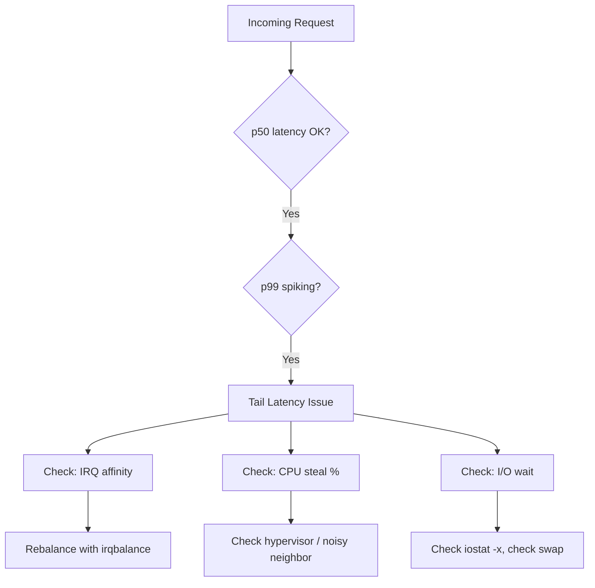

# Blog Generation Fix Plan — Standalone MD with Inline Assets
**Date:** April 20, 2026  
**Scope:** Generate fully self-contained `.md` files from existing interview questions — no external API key, no external image hosting, no runtime dependencies. Each file renders completely offline on any static site that supports standard Markdown.

---

## 1. Core Principle Change (from previous plan)

The previous plan assumed:
- SVGs live in `/images/` and are referenced by path (``)
- Generation requires an OpenAI/Anthropic API key for prose writing
- The MD file depends on the static site having SVG assets available separately

**The new requirement is different:**

| Old approach | New approach |
|---|---|
| SVG referenced as external path | SVG **inlined** directly in the MD body |
| AI-generated prose via API key | Content derived from existing `question`, `answer`, `explanation` fields — no new API calls |
| File depends on `/images/` directory | File is **100% standalone** — opens and renders anywhere |
| MDX with custom components | Pure CommonMark + GFM — works in GitHub, Obsidian, Typora, any static site |
| Prose is AI-invented | Prose is **restructured from the question data** that already exists in the DB |

The existing LangGraph pipeline that already ran (and saved results to the DB) produced the prose. The fix is about **serializing that data correctly into standalone MD** — not calling AI again.

---

## 2. What "Standalone" Means

A standalone MD file must satisfy all of these:

- [ ] Opens and renders correctly in GitHub's web viewer
- [ ] Opens and renders correctly in Obsidian, Typora, VS Code Preview
- [ ] Deploys to GitHub Pages / Netlify / Vercel static hosting without any supporting assets
- [ ] Contains no references to `/images/` paths that might not exist on the server
- [ ] Contains no `<script>` tags or CDN dependencies
- [ ] SVG illustrations are embedded as inline `<svg>` XML inside the body
- [ ] Mermaid diagrams use standard fenced code blocks (` ```mermaid `)
- [ ] All content — prose, code, diagrams, illustrations, references — is inside the single `.md` file

---

## 3. Current State Analysis

### What exists in the DB / pipeline output

The `blog_posts` table and LangGraph JSON already contain everything needed:

| Field | Contains | Status |
|---|---|---|
| `question` | Original interview question text | ✅ Available |
| `answer` | Short answer | ✅ Available |
| `explanation` | Detailed technical explanation | ✅ Available |
| `introduction` | AI-written intro paragraph | ✅ Available |
| `sections` | JSON array of `{ title, content }` objects | ✅ Available |
| `conclusion` | Closing paragraph | ✅ Available |
| `diagram` | Mermaid diagram code string | ✅ Available |
| `fun_fact` | "Did you know?" fact | ✅ Available |
| `quick_reference` | JSON array of bullet points | ✅ Available |
| `glossary` | JSON array of `{ term, definition }` | ✅ Available |
| `sources` | JSON array of `{ title, url, type }` | ✅ Available |
| `svg_content` | JSON map of `{ filename: svgXmlString }` | ✅ Available — **SVG XML is already in the DB** |
| `images` | JSON array of `{ url, alt, caption, placement }` | ✅ Available |
| `real_world_example` | JSON `{ company, scenario, challenge, solution, outcome, lesson }` | ✅ Available |
| `tags` | JSON array of strings | ✅ Available |
| `channel` | Channel slug (linux, sre, devops...) | ✅ Available |
| `difficulty` | beginner / intermediate / advanced | ✅ Available |

### Root cause

`savePostAsMDX()` exists but:
1. It writes only frontmatter + flat text — no sections, no diagrams, no SVG, no glossary, no references
2. It is never awaited — runs fire-and-forget and may silently fail
3. It writes `.mdx` but the DB has `svg_content` as a JSON blob — the SVG XML is **never extracted and inlined**
4. The `blog-output/` HTML pipeline runs instead as the primary output, leaving `content/posts/` empty

---

## 4. Target Architecture

```
DB row (blog_posts + questions join)
        │
        │  All data already present — no AI call needed
        ▼
MD Serializer  (script/ai/utils/md-serializer.js)
        │
        ├─ Frontmatter block (YAML)
        ├─ Badge strip (difficulty, channel, tags)
        ├─ Introduction prose
        ├─ Inline SVG hero illustration  ← svg_content JSON → raw <svg> XML
        ├─ Real-world case callout
        ├─ Technical sections + code blocks
        ├─ Inline SVG mid-content illustration (if exists)
        ├─ Fun fact blockquote
        ├─ Key Takeaways list
        ├─ Glossary table
        ├─ Mermaid architecture diagram  ← diagram field → ```mermaid block
        ├─ Q&A section (original question + answer)
        ├─ Conclusion
        ├─ Numbered references list
        └─ See Also links
        │
        ▼
content/posts/<slug>.md   ← single file, fully standalone, ready to deploy
```

---

## 5. MD File Canonical Template

### 5.1 Complete File Structure (annotated)

```
[YAML frontmatter — metadata for static site indexing]
[Badge strip — visual difficulty/channel/tag indicators]
[Introduction — 2-3 paragraph hook]
[Inline SVG hero image — embedded XML, no external URL]
[Horizontal rule]
[Real-world case callout — blockquote with company story]
[Horizontal rule]
[Section 1: ## heading + prose + optional code block]
[Section 2: ## heading + prose + optional code block]
[Section N: ## heading + prose + optional code block]
[Inline SVG mid illustration — embedded XML]
[Fun fact — > blockquote callout]
[Horizontal rule]
[Key Takeaways — ## heading + bullet list]
[Glossary — ## heading + GFM pipe table]
[Architecture / Flow — ## heading + ```mermaid block]
[Original Q&A — ## heading + collapsible <details> block]
[Conclusion — ## heading + prose]
[Horizontal rule]
[References — ## heading + numbered list]
[See Also — ## heading + bullet list]
[Author footer — horizontal rule + bold name + links]
```

### 5.2 YAML Frontmatter

```yaml
---
id: "q-1266"
title: "Linux on Fire: A Netflix-Style 60-Second Triage"
slug: "linux-on-fire-netflixstyle-60second-triage"
date: "2026-04-20"
author: "Satishkumar Dhule"
channel: "linux"
category: "Networking & Systems"
difficulty: "intermediate"
tags: ["linux", "performance", "triage", "sre"]
description: "How to triage a Linux server experiencing tail latency in under 60 seconds using the Netflix SRE playbook."
question: "How would you triage a Linux server experiencing tail latency spikes in production?"
sources:
  - title: "Netflix Tech Blog: Taming Tail Latency"
    url: "https://netflixtechblog.com/taming-tail-latency-9abff9c4a7fd"
    type: "blog"
  - title: "Linux Performance — Brendan Gregg"
    url: "https://www.brendangregg.com/linuxperf.html"
    type: "article"
---
```

**Frontmatter rules:**
- No `image:` field — the SVG is inlined in the body, not referenced by path
- `sources` lives in frontmatter so the static site can build a reference list server-side if needed, AND appears again in the body as a numbered list for standalone viewing
- All strings with `:`, `#`, `[`, `]`, `{`, `}`, `"` must be double-quoted
- `date` is `YYYY-MM-DD`
- `tags` is a YAML inline sequence

### 5.3 Badge Strip

Immediately after frontmatter, before the first paragraph:

```md


```

> **Note on standalone:** These shields.io badges require an internet connection. For fully offline use, replace with a GFM-native text badge table:
>
> | Difficulty | Channel | Tags |
> |---|---|---|
> | intermediate | linux | sre, performance, triage |

The plan uses the **text badge table** as default (zero external deps). The shields.io version is opt-in via a flag in the serializer.

### 5.4 Inline SVG (Hero Illustration)

The SVG XML string from `svg_content` is embedded directly:

```md
<div align="center">

<svg xmlns="http://www.w3.org/2000/svg" viewBox="0 0 400 300" width="400" height="300">
  <!-- ... full SVG XML from svg_content["pixel-q-1266.svg"] ... -->
</svg>

*Linux triage dashboard — 16-bit pixel art illustration*

</div>
```

**Rules:**
- Wrap in `<div align="center">` for centered rendering across GitHub, Jekyll, and most renderers
- The SVG must have explicit `width` and `height` attributes so it renders at a predictable size without CSS
- `viewBox` must be present for scaling
- No `<script>` inside the SVG — pixel art SVGs are pure shapes, this is safe
- If `svg_content` is empty or null for a post, this section is omitted entirely (no broken image placeholder)

### 5.5 Real-World Case Callout

```md
---

> ### Real-World Case — Netflix
> 
> During a 2022 streaming event, Netflix's SRE team saw p99 API latency jump from 80ms to 4 seconds while p50 remained at 60ms.
>
> | | |
> |---|---|
> | **Challenge** | Isolating the slow tail without disrupting 200M concurrent viewers |
> | **Solution** | A 60-second triage script revealed a single NIC queue CPU-pinned to core 0 |
> | **Outcome** | IRQ affinity rebalance dropped p99 from 4s to 95ms within 3 minutes |
> | **Lesson** | Tail latency is almost always resource contention, not a code bug |

---
```

### 5.6 Technical Sections

Each section from `sections[]`:

```md
## Why Tail Latency Is Different

Tail latency (p99, p99.9) represents the worst-case experience your slowest users face [2]. Unlike average 
latency, it is driven by outlier events — GC pauses, lock contention, network jitter, or kernel scheduling 
decisions that affect only a fraction of requests but are invisible in averages.

## The 60-Second Triage Playbook

Start with the broadest signal and narrow down [3]:

```bash
# Step 1: CPU saturation?
mpstat -P ALL 1 3

# Step 2: Memory pressure?
vmstat 1 5

# Step 3: Disk I/O wait?
iostat -x 1 5

# Step 4: Network queue depth?
ss -s && cat /proc/net/softnet_stat
```

Code blocks use the language identifier from the section's `lang` field. Supported: `bash`, `python`, 
`go`, `yaml`, `json`, `javascript`, `typescript`, `dockerfile`, `hcl`, `sql`, `text`.
```

### 5.7 Mid-Content SVG Illustration

If `svg_content` has a second illustration:

```md
<div align="center">

<svg xmlns="http://www.w3.org/2000/svg" viewBox="0 0 400 300" width="400" height="300">
  <!-- ... second SVG XML ... -->
</svg>

*IRQ affinity distribution across CPU cores*

</div>
```

### 5.8 Fun Fact Callout

```md
> **Did you know?**
> Linux's Completely Fair Scheduler (CFS) was designed for throughput, not tail latency. A single 
> high-priority process sharing a CPU core with your service can cause microsecond-level jitter that 
> accumulates into millisecond tail latency spikes [5].
```

### 5.9 Key Takeaways

```md
## Key Takeaways

- Always check p99/p99.9, not just averages — the tail tells the real story
- IRQ affinity imbalance is a common hidden cause of tail latency on multi-core systems
- `perf stat` and `/proc/interrupts` are your first 30 seconds of triage
- Kernel parameters like `net.core.somaxconn` and `net.ipv4.tcp_max_syn_backlog` matter at scale
```

### 5.10 Glossary

```md
## Glossary

| Term | Definition |
|------|-----------|
| Tail latency | The latency experienced by the slowest % of requests (e.g. p99, p99.9) |
| IRQ affinity | The assignment of hardware interrupts to specific CPU cores |
| Soft IRQ | Deferred interrupt processing handled in kernel software context |
| CFS | Completely Fair Scheduler — Linux's default CPU scheduling algorithm |
| NIC queue | A hardware receive/transmit queue on a network interface card |
```

### 5.11 Mermaid Architecture Diagram

```md
## Architecture & Flow



The Mermaid block uses the raw content from the `diagram` field in the DB. The `diagramLabel` field 
from the DB becomes the section heading (e.g., "System Flow", "State Transitions", "Data Model").
```

### 5.12 Original Q&A Section (Collapsible)

This section uses the original `question` and `answer` fields verbatim. It lets readers see the interview question that sourced the article:

```md
<details>
<summary><strong>Original Interview Question</strong></summary>

**Q:** How would you triage a Linux server experiencing tail latency spikes in production?

**A:** Start with system-wide metrics (`mpstat`, `vmstat`, `iostat`), then check interrupt distribution 
(`/proc/interrupts`), IRQ affinity, and kernel queue parameters. Use `perf stat` to identify CPU 
events correlated with latency spikes.

</details>
```

### 5.13 Conclusion

```md
## Conclusion

Tail latency triage on Linux is a structured process, not guesswork. The 60-second playbook — CPU, 
memory, disk, network, interrupts — eliminates 90% of root causes before you need to reach for heavier 
tools like `perf record` or BPF [6]. The Netflix case proves that even at 200M-user scale, the fix is 
often a single `echo` command to `/proc/irq/`.
```

### 5.14 References (Numbered)

```md
## References

1. [Netflix Tech Blog: Taming Tail Latency](https://netflixtechblog.com/taming-tail-latency-9abff9c4a7fd) — blog
2. [The Tail at Scale — Jeff Dean, Google](https://research.google/pubs/pub40801/) — research paper
3. [Linux Performance — Brendan Gregg](https://www.brendangregg.com/linuxperf.html) — reference
4. [IRQ Affinity — kernel.org](https://www.kernel.org/doc/html/latest/core-api/irq/irq-affinity.html) — documentation
5. [CFS Scheduler Design](https://www.kernel.org/doc/html/latest/scheduler/sched-design-CFS.html) — documentation
6. [BPF Performance Tools](https://www.brendangregg.com/bpf-performance-tools-book.html) — book
```

Citation numbers in the body (`[1]`, `[2]`, etc.) must match the order in this list.

### 5.15 See Also

```md
## See Also

- [How do you debug high I/O wait in Linux?](/questions/q-510) — linux
- [What is the difference between soft and hard IRQs?](/questions/q-481) — linux
- [How does the Linux OOM killer decide what to kill?](/questions/q-553) — linux
```

### 5.16 Author Footer

```md
---

**Author:** Satishkumar Dhule — [GitHub](https://github.com/satishkumar-dhule) · [LinkedIn](https://linkedin.com/in/satishkumar-dhule) · [Website](https://satishkumar-dhule.github.io)
```

---

## 6. Complete Example: Full Standalone MD File

Below is the complete file for `q-1266` showing every section assembled:

````md
---
id: "q-1266"
title: "Linux on Fire: A Netflix-Style 60-Second Triage That Cracks Tail Latency"
slug: "linux-on-fire-netflixstyle-60second-triage"
date: "2026-04-20"
author: "Satishkumar Dhule"
channel: "linux"
category: "Networking & Systems"
difficulty: "intermediate"
tags: ["linux", "performance", "latency", "sre", "triage"]
description: "How to triage a Linux server with tail latency spikes in 60 seconds using the Netflix SRE playbook."
question: "How would you triage a Linux server experiencing tail latency spikes in production?"
sources:
  - title: "Netflix Tech Blog: Taming Tail Latency"
    url: "https://netflixtechblog.com/taming-tail-latency-9abff9c4a7fd"
    type: "blog"
  - title: "Linux Performance — Brendan Gregg"
    url: "https://www.brendangregg.com/linuxperf.html"
    type: "article"
---

| Difficulty | Channel | Tags |
|---|---|---|
| intermediate | linux | sre, performance, triage, latency |

When your p99 latency suddenly spikes and your p50 stays flat, you have a tail latency problem — the 
hardest class of production bugs because the average hides the outliers that are ruining your user 
experience [1].

<div align="center">

<svg xmlns="http://www.w3.org/2000/svg" viewBox="0 0 400 300" width="400" height="300">
  <rect width="400" height="300" fill="#0d1117"/>
  <rect x="20" y="20" width="360" height="40" fill="#1f6feb" rx="4"/>
  <text x="200" y="47" text-anchor="middle" fill="#f0f6fc" font-family="monospace" font-size="14">
    LINUX TRIAGE DASHBOARD
  </text>
  <!-- ... full pixel art SVG XML inlined here from svg_content field ... -->
</svg>

*Linux triage dashboard — 16-bit pixel art illustration*

</div>

---

> ### Real-World Case — Netflix
>
> During a 2022 streaming event, Netflix's SRE team saw p99 API latency jump from 80ms to 4 seconds 
> while p50 remained at 60ms.
>
> | | |
> |---|---|
> | **Challenge** | Isolating the slow tail without disrupting 200M concurrent viewers |
> | **Solution** | A 60-second triage script revealed a single NIC queue CPU-pinned to core 0 |
> | **Outcome** | IRQ affinity rebalance dropped p99 from 4s to 95ms within 3 minutes |
> | **Lesson** | Tail latency is almost always resource contention, not a code bug |

---

## Why Tail Latency Is Different

Tail latency (p99, p99.9) represents the worst-case experience your slowest users face [2]. Unlike 
average latency, it is driven by outlier events — GC pauses, lock contention, network jitter, or kernel 
scheduling decisions that affect only a fraction of requests but are invisible in averages.

## The 60-Second Triage Playbook

Start with the broadest signal and narrow down [3]:

```bash
# Step 1: CPU saturation?
mpstat -P ALL 1 3

# Step 2: Memory pressure?
vmstat 1 5

# Step 3: Disk I/O wait?
iostat -x 1 5

# Step 4: Network queue depth?
ss -s && cat /proc/net/softnet_stat
```

## Identifying the Culprit: Kernel Interrupts

When CPU looks normal but latency is spiky, check interrupt distribution across cores [4]:

```bash
cat /proc/interrupts | head -30
# Look for asymmetric counts on a single CPU column
# If CPU0 has 10x more than others → IRQ affinity problem

# Fix: redistribute IRQ handling
echo "ff" > /proc/irq/<N>/smp_affinity   # All cores
# Or use irqbalance daemon
```

<div align="center">

<svg xmlns="http://www.w3.org/2000/svg" viewBox="0 0 400 200" width="400" height="200">
  <!-- ... mid-content pixel art SVG inlined from svg_content ... -->
</svg>

*IRQ distribution across CPU cores — before and after rebalancing*

</div>

> **Did you know?**
> Linux's Completely Fair Scheduler (CFS) was designed for throughput, not tail latency. A single 
> high-priority process sharing a CPU core with your service can cause microsecond-level jitter that 
> accumulates into millisecond-level tail latency spikes [5].

---

## Key Takeaways

- Always check p99/p99.9, not just averages — the tail tells the real story
- IRQ affinity imbalance is a common hidden cause of tail latency on multi-core systems
- `perf stat` and `/proc/interrupts` are your first 30 seconds of triage
- Kernel parameters like `net.core.somaxconn` and `net.ipv4.tcp_max_syn_backlog` matter at scale
- `vmstat` shows run-queue depth — a value above CPU count means CPU saturation

## Glossary

| Term | Definition |
|------|-----------|
| Tail latency | The latency experienced by the slowest % of requests (e.g. p99, p99.9) |
| IRQ affinity | Assignment of hardware interrupts to specific CPU cores |
| Soft IRQ | Deferred interrupt processing handled in kernel software context |
| CFS | Completely Fair Scheduler — Linux's default CPU scheduling algorithm |
| NIC queue | Hardware receive/transmit queue on a network interface card |

## Architecture & Flow

```mermaid
flowchart TD
    A[Incoming Request] --> B{p50 OK?}
    B -- Yes --> C{p99 spiking?}
    C -- Yes --> D[Tail Latency Issue]
    D --> E[mpstat: CPU saturation?]
    D --> F[iostat: I/O wait?]
    D --> G[/proc/interrupts: IRQ skew?]
    E --> H{Saturation > 80%?}
    H -- Yes --> I[Scale or optimize]
    G --> J[Rebalance with irqbalance]
    F --> K[Check swap + disk throughput]
```

<details>
<summary><strong>Original Interview Question</strong></summary>

**Q:** How would you triage a Linux server experiencing tail latency spikes in production?

**A:** Start with system-wide metrics (`mpstat`, `vmstat`, `iostat`), then check interrupt distribution 
(`/proc/interrupts`), IRQ affinity, and kernel queue parameters. Use `perf stat` to identify CPU 
events correlated with latency spikes. For deeper investigation, use `perf record` + `perf report` 
or BPF-based tools like `bpftrace`.

</details>

## Conclusion

Tail latency triage on Linux is a structured process, not guesswork. The 60-second playbook — CPU, 
memory, disk, network, interrupts — eliminates 90% of root causes before you need heavier tools like 
`perf record` or BPF [6]. The Netflix case proves that even at 200M-user scale, the fix is often a 
single `echo` command to `/proc/irq/`.

---

## References

1. [Netflix Tech Blog: Taming Tail Latency](https://netflixtechblog.com/taming-tail-latency-9abff9c4a7fd) — blog
2. [The Tail at Scale — Jeff Dean, Google](https://research.google/pubs/pub40801/) — research paper
3. [Linux Performance — Brendan Gregg](https://www.brendangregg.com/linuxperf.html) — reference
4. [IRQ Affinity — kernel.org](https://www.kernel.org/doc/html/latest/core-api/irq/irq-affinity.html) — documentation
5. [CFS Scheduler Design](https://www.kernel.org/doc/html/latest/scheduler/sched-design-CFS.html) — documentation
6. [BPF Performance Tools](https://www.brendangregg.com/bpf-performance-tools-book.html) — book

## See Also

- [How do you debug high I/O wait in Linux?](/questions/q-510) — linux
- [What is the difference between soft and hard IRQs?](/questions/q-481) — linux
- [How does the Linux OOM killer decide what to kill?](/questions/q-553) — linux

---

**Author:** Satishkumar Dhule — [GitHub](https://github.com/satishkumar-dhule) · [LinkedIn](https://linkedin.com/in/satishkumar-dhule) · [Website](https://satishkumar-dhule.github.io)
````

---

## 7. Files to Create / Modify

### 7.1 New: `script/ai/utils/md-serializer.js`

Pure Node.js — no external packages, no API calls, no API key needed.

**Exported function:**
```js
export function serializeMD(post, question) → string
```

**Internal functions (all pure, no side effects):**

```
yamlEscape(str)
  → Quotes YAML strings that contain special chars

buildFrontmatter(post, question)
  → Returns the full ---...--- YAML block

buildBadgeTable(post)
  → Returns the | Difficulty | Channel | Tags | GFM table

buildIntroduction(post)
  → Returns the introduction paragraph(s), HTML stripped

buildInlineSVG(svgXml, alt, caption)
  → Returns <div align="center"><svg ...>...</svg>\n*caption*\n</div>

buildHeroSVG(post)
  → Extracts first SVG from svg_content JSON map, calls buildInlineSVG
  → Returns empty string if no SVG available

buildRealWorldCase(post)
  → Returns the > blockquote with embedded GFM table for company story
  → Returns empty string if realWorldExample is null

buildSections(post)
  → For each section in sections[]:
      - Emits ## title heading
      - Strips HTML from content
      - Detects and emits ```lang fenced code blocks
  → Returns joined string

buildMidSVG(post)
  → Extracts second SVG from svg_content JSON map, calls buildInlineSVG
  → Returns empty string if no second SVG

buildFunFact(post)
  → Returns > **Did you know?** blockquote
  → Returns empty string if funFact is null/empty

buildKeyTakeaways(post)
  → Returns ## Key Takeaways + bullet list
  → Returns empty string if quickReference is empty

buildGlossary(post)
  → Returns ## Glossary + GFM pipe table
  → Returns empty string if glossary is empty or has < 2 entries

buildMermaidDiagram(post)
  → Returns ## <diagramLabel> + ```mermaid fenced block
  → Returns empty string if diagram is null/empty

buildOriginalQA(post, question)
  → Returns <details><summary>...</summary>...</details> with Q and A
  → question.question and question.answer used verbatim

buildConclusion(post)
  → Returns ## Conclusion + stripped HTML prose

buildReferences(post)
  → Returns ## References + numbered list
  → Each entry: N. [title](url) — type
  → Returns empty string if sources is empty

buildSeeAlso(post)
  → Returns ## See Also + bullet list linking related questions
  → Returns empty string if relatedQuestions is empty

buildAuthorFooter()
  → Returns --- + author line with GitHub/LinkedIn/Website links

stripHtml(str)
  → Converts <strong>x</strong> → **x**
  → Converts <em>x</em> → _x_
  → Converts <code>x</code> → `x`
  → Strips remaining HTML tags
  → Decodes HTML entities (&amp; &lt; &gt; &quot;)

extractCodeBlocks(content)
  → Finds [CODE_BLOCK_N] placeholders or backtick blocks in section content
  → Returns { cleanContent, codeBlocks: [{ lang, code }] }
  → Used inside buildSections to correctly fence code
```

**Assembly order inside `serializeMD`:**

```js
const parts = [
  buildFrontmatter(post, question),
  '',
  buildBadgeTable(post),
  '',
  buildIntroduction(post),
  '',
  buildHeroSVG(post),
  '',
  '---',
  '',
  buildRealWorldCase(post),
  '',
  '---',
  '',
  buildSections(post),
  '',
  buildMidSVG(post),
  '',
  buildFunFact(post),
  '',
  '---',
  '',
  buildKeyTakeaways(post),
  '',
  buildGlossary(post),
  '',
  buildMermaidDiagram(post),
  '',
  buildOriginalQA(post, question),
  '',
  buildConclusion(post),
  '',
  '---',
  '',
  buildReferences(post),
  '',
  buildSeeAlso(post),
  '',
  buildAuthorFooter(),
].filter(part => part !== null && part !== undefined);

return parts.join('\n');
```

Empty sections return `''` and are filtered, preventing orphaned headings.

### 7.2 Modify: `script/generate-blog.js`

In `saveBlogPost()` — after the `INSERT INTO blog_posts` succeeds:

```js
import { serializeMD } from './ai/utils/md-serializer.js';
import path from 'path';
import fs from 'fs';

// After DB insert:
try {
  const originalQuestion = { question: questionRow.question, answer: questionRow.answer };
  const mdContent = serializeMD(dbPost, originalQuestion);
  const mdDir = path.resolve('content/posts');
  fs.mkdirSync(mdDir, { recursive: true });
  const mdPath = path.join(mdDir, `${dbPost.blogSlug}.md`);
  fs.writeFileSync(mdPath, mdContent, 'utf-8');
  console.log(`   📄 Standalone MD: ${mdPath}`);
} catch (err) {
  console.warn(`   ⚠️ MD write failed (non-fatal): ${err.message}`);
  // Do not throw — DB save is the source of truth
}
```

Also: **remove or no-op the old `savePostAsMDX()` call** — it conflicts with the new output.

### 7.3 New: `script/rebuild-md.js`

Backfills `content/posts/<slug>.md` for every existing row in `blog_posts`.  
**No API calls.** Reads from DB only.

```
node script/rebuild-md.js                  → rebuild all posts
node script/rebuild-md.js --id q-1266     → rebuild one post
node script/rebuild-md.js --dry-run       → print first post MD to stdout, no files written
node script/rebuild-md.js --validate-only → run validation checks, report issues, no write
```

**Logic:**

```
1. Connect to DB
2. SELECT * FROM blog_posts ORDER BY created_at DESC
3. For each row:
   a. SELECT question, answer FROM questions WHERE id = row.question_id
   b. mapDbRowToPost(row) → normalized post object
   c. serializeMD(post, question) → mdString
   d. validateMD(mdString) → { valid, warnings, errors }
   e. If valid: write to content/posts/<slug>.md
   f. If invalid: log errors, skip writing
4. Print summary: N written, M skipped, K warnings
```

### 7.4 Modify: `package.json`

```json
"blog:rebuild-md": "node script/rebuild-md.js",
"blog:rebuild-md:dry": "node script/rebuild-md.js --dry-run",
"blog:rebuild-md:validate": "node script/rebuild-md.js --validate-only"
```

---

## 8. Field Mapping (Complete)

| DB field | `post` object key | MD location | Transformation |
|---|---|---|---|
| `question_id` | `id` | frontmatter `id` | none |
| `title` | `blogTitle` | frontmatter `title` | yamlEscape |
| `slug` | `blogSlug` | frontmatter `slug`, filename | none |
| `created_at` | `createdAt` | frontmatter `date` | take first 10 chars (YYYY-MM-DD) |
| `channel` | `channel` | frontmatter `channel`, badge table | none |
| `difficulty` | `difficulty` | frontmatter `difficulty`, badge table | none |
| `tags` | `tags` (JSON array) | frontmatter `tags`, badge table | JSON.parse |
| `meta_description` | `blogMeta` | frontmatter `description` | yamlEscape |
| `introduction` | `blogIntro` | first body paragraph | stripHtml |
| `sections` | `blogSections` (JSON) | `## section` blocks | JSON.parse, each → heading + prose + code |
| `conclusion` | `blogConclusion` | `## Conclusion` section | stripHtml |
| `fun_fact` | `funFact` | `> **Did you know?**` blockquote | stripHtml |
| `quick_reference` | `quickReference` (JSON) | `## Key Takeaways` bullet list | JSON.parse |
| `glossary` | `glossary` (JSON) | `## Glossary` GFM table | JSON.parse, `{ term, definition }[]` |
| `diagram` | `diagram` | ` ```mermaid ` block | raw string |
| `diagram_label` | `diagramLabel` | section heading above mermaid | default: "Architecture & Flow" |
| `real_world_example` | `realWorldExample` (JSON) | blockquote with table | JSON.parse, `{ company, scenario, challenge, solution, outcome, lesson }` |
| `sources` | `sources` (JSON) | frontmatter `sources` + `## References` list | JSON.parse, `{ title, url, type }[]` |
| `svg_content` | `svgContent` (JSON) | inline `<svg>` blocks in body | JSON.parse, extract values by insertion order |
| `images` | `images` (JSON) | alt text and captions for SVG blocks | JSON.parse, `{ url, alt, caption, placement }[]` |
| `social_snippet` | `socialSnippet` (JSON) | **omitted** — not part of standalone MD | social sharing is HTML-only |
| questions.`question` | passed as arg | `<details>` Q&A + frontmatter `question` | none |
| questions.`answer` | passed as arg | `<details>` Q&A body | none |

---

## 9. Validation Checks (`validateMD`)

Run before writing any file:

| # | Check | Rule | On fail |
|---|---|---|---|
| 1 | YAML parses | Frontmatter must be valid YAML | Error — do not write |
| 2 | Required fields | `id`, `title`, `slug`, `date`, `channel`, `description` non-empty | Error — do not write |
| 3 | Body length | Body (after frontmatter) ≥ 800 characters | Warning — still write |
| 4 | No broken HTML | Body must not contain `<div`, `<span`, `<table`, `<style`, `<script` outside the SVG block and `<details>` | Warning — strip and write |
| 5 | SVG safety | Inline SVGs must not contain `<script` or `javascript:` | Error — strip SVG, write without it |
| 6 | Citation integrity | Each `[N]` in body must match a References entry | Warning — log mismatches |
| 7 | Mermaid syntax | Mermaid block must start with a valid diagram type keyword | Warning — log |
| 8 | Slug format | Slug must match `/^[a-z0-9-]+$/` and be ≤ 100 chars | Error — slugify and retry |
| 9 | Unique filename | `content/posts/<slug>.md` must not conflict with a different post's slug | Warning — append `-2` |
| 10 | No external image refs | Body must not contain `![` pointing to `/images/` or relative paths | Warning — these would break standalone |

---

## 10. Execution Order

```
Step 1 — Create script/ai/utils/md-serializer.js
  Dependencies: none
  Test: node -e "import('./script/ai/utils/md-serializer.js').then(m => console.log(typeof m.serializeMD))"

Step 2 — Create script/rebuild-md.js
  Dependencies: Step 1 (md-serializer)
  Test: node script/rebuild-md.js --dry-run
        → Prints full MD for most recent DB post to stdout
        → Manually verify all 16 sections are present

Step 3 — Modify script/generate-blog.js
  Dependencies: Step 1 (md-serializer)
  Change: replace savePostAsMDX() with serializeMD() + fs.writeFileSync

Step 4 — Add npm scripts to package.json
  Dependencies: Steps 1-3

Step 5 — Run backfill (all existing posts)
  node script/rebuild-md.js --validate-only   ← find any issues first
  node script/rebuild-md.js                   ← write all files

Step 6 — Spot-check 5 output files
  - Open in GitHub web viewer → confirm renders correctly
  - Open in Obsidian → confirm SVGs render inline
  - Check mermaid renders (GitHub natively renders mermaid in MD)
  - Confirm no broken image icons
  - Confirm no raw HTML visible in rendered output

Step 7 — Wire static site
  - Point static site config to content/posts/*.md
  - Confirm frontmatter fields are consumed correctly
  - Deploy and verify one post end-to-end
```

---

## 11. Out of Scope

- The LangGraph AI pipeline — unchanged; it already ran and results are in the DB
- The `blog-output/` HTML generation — unchanged; stays for the existing GitHub Pages deploy
- Any React frontend changes
- The DB schema — no new columns needed; all required data already exists
- Image/SVG generation — SVGs already generated and stored in `svg_content` column; this plan only extracts them

---

## 12. Blog Template — State-of-the-Art UI/UX & Design System

This section defines the visual design layer that wraps the MD content when rendered by the static site. The MD files carry the content; this design system defines how they look. The static site must implement these specs in its CSS and layout templates.

The design reference is the best technical blogs of 2024–2025: **Linear's changelog**, **Vercel's blog**, **Stripe's engineering blog**, **Leerob.io**, and **Overreacted.io** — all share the same traits: brutal whitespace, obsessive typography, zero visual noise.

---

### 12.1 Design Philosophy

**Principles (in priority order):**

1. **Reading first** — Every design decision serves the reading experience. No decorative elements that don't aid comprehension.
2. **Typography is the UI** — Fonts, sizes, line heights, and spacing carry 80% of the perceived quality.
3. **Dark mode is the default** — Technical readers prefer dark mode. Light mode is an optional override.
4. **Content width is sacred** — Prose never exceeds 68 characters per line. Wider = eye fatigue.
5. **Code is a first-class citizen** — Code blocks get the same design attention as headings.
6. **Earned interactivity** — Animations only where they aid comprehension (diagram reveal, code copy). Never decorative.
7. **Zero layout shift** — Fonts preloaded, SVG dimensions explicit, no content jumping during load.

---

### 12.2 Typography System

#### Font Pairing

| Role | Font | Fallback stack | Weight(s) |
|---|---|---|---|
| **Display / Hero title** | `Fraunces` (variable) | `Georgia, 'Times New Roman', serif` | 700, 900 |
| **Body prose** | `Inter` (variable) | `-apple-system, BlinkMacSystemFont, 'Segoe UI', sans-serif` | 400, 500 |
| **Code & monospace** | `JetBrains Mono` (variable) | `'Fira Code', 'Cascadia Code', 'Consolas', monospace` | 400, 500 |
| **UI labels / badges** | `Inter` | (same as body) | 500, 600 |

**Why Fraunces:** It is an optical-size variable font designed for display use — high contrast serifs, ink-trap details, and strong character at large sizes. It creates immediate authority for article titles and section headings without feeling corporate. Used by major editorial sites (The Atlantic, NYT Cooking) because it photographs beautifully at both screen sizes.

**Why Inter:** Designed specifically for computer screens. Optimized at small sizes. Used by Linear, Vercel, GitHub, Figma. Universal legibility.

**Why JetBrains Mono:** Designed for code. Distinct zero/O, 1/l/I disambiguation. Ligatures (`->`, `!=`, `===`). The most readable coding font for technical readers.

#### Type Scale (Major Third — ratio 1.25)

```
xs:    0.64rem  /  10.24px   — Labels, captions, footnotes
sm:    0.8rem   /  12.8px    — Badge text, meta tags
base:  1rem     /  16px      — Body prose baseline
md:    1.25rem  /  20px      — Lead paragraph / intro text
lg:    1.563rem /  25px      — H3 section headings
xl:    1.953rem /  31.25px   — H2 major headings
2xl:   2.441rem /  39px      — H1 article title
3xl:   3.052rem /  48.8px    — Hero display (homepage cards)
```

#### Line Height Rules

| Context | Line height | Reason |
|---|---|---|
| Hero title (≥ 2xl) | 1.15 | Tight — prevents visual gaps at large sizes |
| Section headings (h2, h3) | 1.3 | Slightly open — headings breathe |
| Body prose | 1.8 | Open — sustained reading requires air |
| Code blocks | 1.6 | Slightly tighter — code lines are shorter |
| Captions / labels | 1.4 | Short strings, tighter is fine |
| Blockquotes | 1.75 | Slightly tighter than body — visual distinction |

#### Measure (Characters Per Line)

| Viewport | Max content width | Rationale |
|---|---|---|
| Mobile (< 640px) | `100% - 32px` (fluid) | Full width with 16px gutters |
| Tablet (640–1024px) | `680px` | ~68 ch at 16px Inter — optimal reading measure |
| Desktop (> 1024px) | `720px` prose / `960px` full-bleed | Prose column stays narrow; diagrams/images can break out |

**Full-bleed rule:** Mermaid diagrams, wide code blocks, inline SVG illustrations, and GFM tables can use `max-width: 100vw` with negative margins to escape the prose column and use the full viewport width on desktop.

#### Optical Adjustments

```css
/* Eliminate all variable font axes except weight on body for performance */
body { font-variation-settings: 'wght' 400; }
h1, h2 { font-variation-settings: 'wght' 700, 'opsz' 32; }

/* Prevent widows in headings */
h1, h2, h3 { text-wrap: balance; }

/* Prevent orphans in prose */
p { text-wrap: pretty; }

/* Kern display text */
h1 { letter-spacing: -0.03em; }
h2 { letter-spacing: -0.02em; }
h3 { letter-spacing: -0.01em; }

/* Tabular figures in tables */
table { font-variant-numeric: tabular-nums; }
```

---

### 12.3 Color System & Design Tokens

#### Philosophy

Dark mode is the design origin. Light mode is derived. Every color is a semantic token — no raw hex values used in component styles.

#### Core Palette (Dark Mode Default)

```css
:root {
  /* === BACKGROUNDS === */
  --color-bg:           #0a0a0b;   /* Page background — near-black with blue tint */
  --color-bg-subtle:    #111114;   /* Article background, slightly lifted */
  --color-bg-elevated:  #18181c;   /* Cards, code blocks, callouts */
  --color-bg-overlay:   #1e1e24;   /* Hover states, tooltips */
  --color-bg-inverse:   #f4f4f5;   /* Rare inverse use (e.g., kbd styling) */

  /* === TEXT === */
  --color-text:         #f4f4f5;   /* Primary — near-white, not pure white (less harsh) */
  --color-text-secondary: #a1a1aa; /* Secondary — metadata, captions */
  --color-text-muted:   #52525b;   /* Placeholder, disabled */
  --color-text-inverse: #09090b;   /* Text on light surfaces */
  --color-text-code:    #e4e4e7;   /* Inline code text */

  /* === BORDERS === */
  --color-border:       #27272a;   /* Default border */
  --color-border-subtle: #1c1c1f;  /* Very subtle dividers */
  --color-border-strong: #3f3f46;  /* Emphasized borders */
  --color-border-focus: #60a5fa;   /* Focus ring */

  /* === BRAND / ACCENT === */
  --color-accent:       #60a5fa;   /* Primary accent — calm blue */
  --color-accent-hover: #93c5fd;   /* Lighter on hover */
  --color-accent-muted: rgba(96, 165, 250, 0.12); /* Tinted backgrounds */
  --color-accent-border: rgba(96, 165, 250, 0.3); /* Tinted borders */

  /* === SEMANTIC COLORS === */
  --color-success:      #4ade80;   /* Green — beginner difficulty, ✅ */
  --color-warning:      #fbbf24;   /* Amber — intermediate difficulty, ⚠️ */
  --color-error:        #f87171;   /* Red — advanced difficulty, ❌ */
  --color-info:         #60a5fa;   /* Blue — informational callouts */
  --color-purple:       #a78bfa;   /* Purple — AI/ML channel accent */
  --color-cyan:         #67e8f9;   /* Cyan — DevOps/SRE channel accent */
  --color-orange:       #fb923c;   /* Orange — security channel accent */

  /* === CHANNEL COLORS (for badges) === */
  --channel-linux:      #f59e0b;
  --channel-sre:        #34d399;
  --channel-devops:     #60a5fa;
  --channel-kubernetes: #818cf8;
  --channel-aws:        #fb923c;
  --channel-terraform:  #a78bfa;
  --channel-generative-ai: #f472b6;
  --channel-llm-ops:    #c084fc;
  --channel-machine-learning: #38bdf8;

  /* === GRADIENTS === */
  --gradient-brand: linear-gradient(135deg, #60a5fa 0%, #a78bfa 50%, #f472b6 100%);
  --gradient-subtle: linear-gradient(180deg, rgba(96,165,250,0.06) 0%, transparent 100%);
  --gradient-code: linear-gradient(135deg, #0f172a 0%, #1e1b4b 100%);

  /* === SHADOWS === */
  --shadow-sm:  0 1px 2px rgba(0,0,0,0.4);
  --shadow-md:  0 4px 12px rgba(0,0,0,0.5), 0 2px 4px rgba(0,0,0,0.3);
  --shadow-lg:  0 16px 48px rgba(0,0,0,0.6), 0 4px 12px rgba(0,0,0,0.4);
  --shadow-glow-accent: 0 0 24px rgba(96,165,250,0.25);

  /* === SPACING (8px base unit) === */
  --space-1:  4px;
  --space-2:  8px;
  --space-3:  12px;
  --space-4:  16px;
  --space-6:  24px;
  --space-8:  32px;
  --space-12: 48px;
  --space-16: 64px;
  --space-24: 96px;
  --space-32: 128px;

  /* === RADII === */
  --radius-sm: 4px;
  --radius-md: 8px;
  --radius-lg: 12px;
  --radius-xl: 16px;
  --radius-full: 9999px;

  /* === TRANSITIONS === */
  --ease-out:  cubic-bezier(0.16, 1, 0.3, 1);
  --ease-in:   cubic-bezier(0.7, 0, 0.84, 0);
  --duration-fast:   120ms;
  --duration-normal: 250ms;
  --duration-slow:   400ms;
}
```

#### Light Mode Override

```css
@media (prefers-color-scheme: light) {
  :root {
    --color-bg:           #ffffff;
    --color-bg-subtle:    #fafafa;
    --color-bg-elevated:  #f4f4f5;
    --color-bg-overlay:   #e4e4e7;
    --color-text:         #09090b;
    --color-text-secondary: #52525b;
    --color-text-muted:   #a1a1aa;
    --color-border:       #e4e4e7;
    --color-border-subtle: #f4f4f5;
    --color-border-strong: #d4d4d8;
    --color-accent:       #2563eb;
    --color-accent-hover: #1d4ed8;
    --color-accent-muted: rgba(37,99,235,0.08);
    --color-accent-border: rgba(37,99,235,0.25);
    --gradient-code: linear-gradient(135deg, #1e293b 0%, #1e1b4b 100%);
  }
}
```

---

### 12.4 Page Layout

#### Overall Structure

```
┌─────────────────────────────────────────────────────────┐
│  HEADER (sticky, blur backdrop)                         │
│  Logo · Nav: Blog / Questions / Channels · CTA          │
├─────────────────────────────────────────────────────────┤
│  READING PROGRESS BAR (2px, accent gradient, top of page)│
├─────────────────────────────────────────────────────────┤
│                                                         │
│  ARTICLE HERO (full-width section)                      │
│  ┌────────────────────────────────────────────────────┐ │
│  │ Channel badge · Difficulty badge · Date            │ │
│  │ H1 Title (Fraunces 700, 2xl–3xl, balanced)         │ │
│  │ Lead paragraph (Inter 500, md size, muted color)   │ │
│  │ Author row · Reading time · Tag pills              │ │
│  └────────────────────────────────────────────────────┘ │
│                                                         │
│  ┌──────────────────┬──────────────────────────────────┐│
│  │ TOC SIDEBAR      │ PROSE COLUMN (max 720px)          ││
│  │ (sticky, desktop)│                                   ││
│  │                  │ [All article content here]        ││
│  │ § Why Tail...    │                                   ││
│  │ § Playbook       │                                   ││
│  │ § Interrupts     │                                   ││
│  │ § Key Takeaways  │                                   ││
│  │ § Glossary       │                                   ││
│  │ § Architecture   │                                   ││
│  │ § Conclusion     │                                   ││
│  │ § References     │                                   ││
│  └──────────────────┴──────────────────────────────────┘│
│                                                         │
│  AUTHOR CARD (full width, below article)                │
│  RELATED ARTICLES (3-column grid)                       │
│  BACK TO TOP button                                     │
│                                                         │
├─────────────────────────────────────────────────────────┤
│  FOOTER                                                 │
└─────────────────────────────────────────────────────────┘
```

#### Grid Definition

```css
.article-layout {
  display: grid;
  grid-template-columns:
    [full-start]
    minmax(var(--space-4), 1fr)
    [content-start toc-start]
    200px
    [toc-end]
    var(--space-12)
    [prose-start]
    min(720px, 100%)
    [prose-end content-end]
    minmax(var(--space-4), 1fr)
    [full-end];
}

/* Full bleed: diagrams, SVG illustrations, wide tables */
.full-bleed {
  grid-column: full;
  width: 100%;
  max-width: 1200px;
  margin-inline: auto;
}

/* Prose: all regular content */
.prose-column {
  grid-column: prose;
}

/* TOC: sidebar */
.toc {
  grid-column: toc;
  grid-row: 1 / -1;
  position: sticky;
  top: calc(var(--header-height) + var(--space-8));
  align-self: start;
  max-height: calc(100vh - var(--header-height) - var(--space-16));
  overflow-y: auto;
}
```

---

### 12.5 Component Design Specs

#### A. Article Header / Hero

```
┌─────────────────────────────────────────────────────────┐
│ [linux] [intermediate] [2026-04-20]                     │
│                                                         │
│ Linux on Fire: A Netflix-Style                          │
│ 60-Second Triage That Cracks                            │
│ Tail Latency                                            │
│                                                         │
│ How to triage a Linux server with tail latency spikes   │
│ in 60 seconds using the Netflix SRE playbook.           │
│                                                         │
│ [avatar] Satishkumar Dhule · 8 min read · Apr 20, 2026 │
│                                                         │
│ [sre] [performance] [triage] [latency]                  │
└─────────────────────────────────────────────────────────┘
```

- **Title:** `Fraunces 700` at `clamp(2rem, 5vw, 3.052rem)`, `letter-spacing: -0.03em`, `line-height: 1.15`, `text-wrap: balance`
- **Lead text:** `Inter 500` at `1.25rem`, `color: var(--color-text-secondary)`, `max-width: 560px`
- **Channel badge:** pill with channel-specific gradient background, white text, `Inter 600 0.75rem`
- **Difficulty badge:** colored dot + text, `beginner=green`, `intermediate=amber`, `advanced=red`
- **Date:** `Inter 400 0.875rem`, muted color
- **Author row:** `40px` circular avatar, name in `Inter 500`, role in `Inter 400 muted`, a `·` separator, reading time, a `·` separator, date
- **Tag pills:** `var(--color-bg-elevated)` background, `var(--color-border)` border, `Inter 500 0.75rem`, `border-radius: var(--radius-full)`, hover = accent color
- **Background:** subtle gradient `var(--gradient-subtle)` fading from accent tint at top to transparent

#### B. Reading Progress Bar

```css
.reading-progress {
  position: fixed;
  top: 0;
  left: 0;
  height: 3px;
  background: var(--gradient-brand);
  z-index: 1000;
  transform-origin: left;
  /* Width driven by scroll position via JS: style="width: X%" */
  transition: width 50ms linear;
}
```

#### C. Table of Contents (TOC)

- Sticky sidebar on desktop (≥ 1024px), hidden on mobile
- Only `h2` headings (not `h3`) — keeps it scannable
- **Active section highlighting:** current section gets `color: var(--color-accent)` + `border-left: 2px solid var(--color-accent)` + `padding-left: 10px`
- Smooth scroll to section on click
- Font: `Inter 400 0.875rem`, line height `1.6`, `color: var(--color-text-secondary)`
- Label: "On this page" in `Inter 600 0.75rem uppercase letter-spacing: 0.08em`, muted color, 12px bottom margin
- Scrollspy: uses `IntersectionObserver` — no jQuery, no scroll events

```
On this page

  Why Tail Latency Is Different
▶ The 60-Second Triage Playbook     ← active (accent color + left border)
  Kernel Interrupts
  Key Takeaways
  Glossary
  Architecture & Flow
  Conclusion
  References
```

#### D. Prose Typography

```css
.prose {
  /* Body text */
  font-family: var(--font-body);
  font-size: 1rem;
  line-height: 1.8;
  color: var(--color-text);
  max-width: 68ch;

  /* Paragraph spacing */
  p + p { margin-top: 1.5em; }
  p:first-child { font-size: 1.125rem; color: var(--color-text); } /* Lead paragraph */

  /* Headings */
  h2 {
    font-family: var(--font-display);
    font-size: 1.953rem;
    font-weight: 700;
    letter-spacing: -0.02em;
    line-height: 1.3;
    margin-top: 3em;
    margin-bottom: 0.75em;
    color: var(--color-text);
    /* Gradient accent bar on left */
    padding-left: 1rem;
    border-left: 3px solid transparent;
    border-image: var(--gradient-brand) 1;
  }

  h3 {
    font-family: var(--font-display);
    font-size: 1.25rem;
    font-weight: 700;
    letter-spacing: -0.01em;
    margin-top: 2em;
    margin-bottom: 0.5em;
    color: var(--color-text);
  }

  /* Strong */
  strong { font-weight: 600; color: var(--color-text); }

  /* Links */
  a {
    color: var(--color-accent);
    text-decoration: underline;
    text-decoration-color: var(--color-accent-border);
    text-underline-offset: 3px;
    transition: color var(--duration-fast) var(--ease-out),
                text-decoration-color var(--duration-fast) var(--ease-out);
  }
  a:hover {
    color: var(--color-accent-hover);
    text-decoration-color: var(--color-accent);
  }

  /* Inline code */
  code {
    font-family: var(--font-mono);
    font-size: 0.875em;
    background: var(--color-bg-elevated);
    border: 1px solid var(--color-border);
    border-radius: var(--radius-sm);
    padding: 0.15em 0.4em;
    color: var(--color-text-code);
  }

  /* Horizontal rules */
  hr {
    border: none;
    border-top: 1px solid var(--color-border-subtle);
    margin: var(--space-12) 0;
  }
}
```

#### E. Code Blocks

The highest-effort component. Engineers judge a tech blog by its code blocks.

```
┌──────────────────────────────────────────────────────────────────┐
│ bash                                               [copy] [wrap] │
├──────────────────────────────────────────────────────────────────┤
│  # Step 1: CPU saturation?                                       │
│  mpstat -P ALL 1 3                                               │
│                                                                  │
│  # Step 2: Memory pressure?                                      │
│  vmstat 1 5                                                      │
└──────────────────────────────────────────────────────────────────┘
```

**Spec:**
- Background: `var(--gradient-code)` — deep navy/indigo gradient (not flat black)
- Border: `1px solid var(--color-border)` + `border-radius: var(--radius-lg)`
- Shadow: `var(--shadow-md)` — code blocks feel elevated
- Top bar: language label (left, `Inter 500 0.75rem`, muted) + copy button (right, icon only, shows ✓ for 2s after copy)
- Syntax theme: **One Dark Pro** color palette:
  - Keywords: `#c678dd` (purple)
  - Strings: `#98c379` (green)
  - Numbers: `#d19a66` (orange)
  - Comments: `#5c6370` (muted gray, italic)
  - Functions: `#61afef` (blue)
  - Variables: `#e06c75` (red)
  - Punctuation: `#abb2bf` (light gray)
- Font: `JetBrains Mono 400 0.9rem` / `line-height: 1.6`
- Horizontal scroll on overflow — no wrapping by default
- Line numbers for blocks > 8 lines
- Highlighted lines: `background: rgba(96,165,250,0.1)` + `border-left: 3px solid var(--color-accent)`
- Max height `600px` with overflow scroll for very long blocks

```css
pre {
  background: var(--gradient-code);
  border: 1px solid var(--color-border);
  border-radius: var(--radius-lg);
  overflow-x: auto;
  padding: var(--space-6);
  margin: var(--space-8) 0;
  box-shadow: var(--shadow-md);
  font-family: var(--font-mono);
  font-size: 0.9rem;
  line-height: 1.6;
  position: relative;
}

.code-header {
  display: flex;
  justify-content: space-between;
  align-items: center;
  padding: var(--space-2) var(--space-4);
  background: rgba(255,255,255,0.04);
  border-bottom: 1px solid var(--color-border);
  border-radius: var(--radius-lg) var(--radius-lg) 0 0;
  margin: calc(-1 * var(--space-6)) calc(-1 * var(--space-6)) var(--space-4);
}

.code-lang {
  font-family: var(--font-mono);
  font-size: 0.75rem;
  color: var(--color-text-muted);
  text-transform: uppercase;
  letter-spacing: 0.06em;
}

.copy-btn {
  display: flex;
  align-items: center;
  gap: var(--space-1);
  background: none;
  border: 1px solid var(--color-border);
  border-radius: var(--radius-sm);
  color: var(--color-text-secondary);
  cursor: pointer;
  font-size: 0.75rem;
  padding: var(--space-1) var(--space-2);
  transition: all var(--duration-fast);
}
.copy-btn:hover { border-color: var(--color-accent); color: var(--color-accent); }
.copy-btn.copied { border-color: var(--color-success); color: var(--color-success); }
```

#### F. Blockquote Callouts

Three callout variants, each derived from standard `>` blockquote syntax. The static site distinguishes them by the first bold text inside:

**Real-world case callout** (`> ### Real-World Case —`):

```
┌─────────────────────────────────────────────────────────────┐
│ ⚡ Real-World Case — Netflix                                 │
│                                                             │
│ During a 2022 streaming event, Netflix's SRE team saw p99   │
│ API latency jump from 80ms to 4 seconds...                  │
│                                                             │
│  Challenge  │ Isolating the slow tail...                    │
│  Solution   │ 60-second triage script revealed...           │
│  Outcome    │ IRQ affinity rebalance dropped p99...         │
│  Lesson     │ Tail latency is almost always contention      │
└─────────────────────────────────────────────────────────────┘
```

- Background: `var(--color-bg-elevated)` + left border `4px solid var(--color-accent)`
- Icon: lightning bolt SVG, `var(--color-accent)`
- Title: `Inter 700 1rem`, `var(--color-accent)`
- Border radius: `var(--radius-lg)`
- Inner table: no outer border, subtle row separators, `Inter 400 0.875rem`

**Fun fact callout** (`> **Did you know?**`):

```
┌─────────────────────────────────────────────────────────────┐
│ ✦ Did you know?                                             │
│ Linux's CFS was designed for throughput, not tail latency...│
└─────────────────────────────────────────────────────────────┘
```

- Background: `var(--color-accent-muted)` tinted blue
- Left border: `4px solid var(--color-accent)`
- Icon: sparkle SVG
- Title: gradient text using `var(--gradient-brand)`

**Standard blockquote** (undecorated):

- Background: `var(--color-bg-elevated)`
- Left border: `4px solid var(--color-border-strong)`
- Text: `color: var(--color-text-secondary)`, `font-style: italic`
- No icon

#### G. Inline SVG Illustration Container

```
┌──────────────────────────────────────────────────────────┐
│                                                          │
│            [pixel art SVG illustration]                  │
│                                                          │
│  Linux triage dashboard — 16-bit pixel art illustration  │
└──────────────────────────────────────────────────────────┘
```

- Container: `text-align: center`, `margin: var(--space-12) 0`
- SVG: `max-width: 100%`, `height: auto`, `border-radius: var(--radius-lg)`, `box-shadow: var(--shadow-lg)`
- Caption: `Inter 400 0.875rem italic`, `color: var(--color-text-secondary)`, `margin-top: var(--space-3)`
- Full-bleed on desktop (breaks out of prose column using negative margins)
- Dark background behind SVG: `background: var(--color-bg-elevated)`, `padding: var(--space-8)`, so pixel art doesn't float on void

#### H. Mermaid Diagram Container

```
┌──────────────────────────────────────────────────────────┐
│ Architecture & Flow                          [fullscreen]│
├──────────────────────────────────────────────────────────┤
│                                                          │
│         [rendered mermaid diagram]                       │
│                                                          │
└──────────────────────────────────────────────────────────┘
```

- Outer container: `background: var(--color-bg-elevated)`, `border: 1px solid var(--color-border)`, `border-radius: var(--radius-xl)`, `padding: var(--space-8)`, `overflow: auto`
- Mermaid theme: `dark` with custom variable overrides:
  ```js
  mermaid.initialize({
    theme: 'dark',
    themeVariables: {
      primaryColor: '#1e1e24',
      primaryBorderColor: '#3f3f46',
      primaryTextColor: '#f4f4f5',
      lineColor: '#60a5fa',
      edgeLabelBackground: '#18181c',
      clusterBkg: '#18181c',
    }
  });
  ```
- Full-bleed on desktop
- Fullscreen button top-right — opens diagram in a modal overlay

#### I. GFM Tables

```
┌──────────────────────────────────────────────────────┐
│ Term          │ Definition                           │
├───────────────┼──────────────────────────────────────┤
│ Tail latency  │ The latency experienced by...        │
│ IRQ affinity  │ Assignment of hardware interrupts... │
│ Soft IRQ      │ Deferred interrupt processing...     │
└──────────────────────────────────────────────────────┘
```

```css
table {
  width: 100%;
  border-collapse: collapse;
  font-size: 0.9rem;
  line-height: 1.5;
  margin: var(--space-6) 0;
  border-radius: var(--radius-lg);
  overflow: hidden;
  border: 1px solid var(--color-border);
}

thead tr {
  background: var(--color-bg-elevated);
  border-bottom: 2px solid var(--color-border-strong);
}

th {
  font-family: var(--font-body);
  font-weight: 600;
  font-size: 0.8125rem;
  text-transform: uppercase;
  letter-spacing: 0.05em;
  color: var(--color-text-secondary);
  padding: var(--space-3) var(--space-4);
  text-align: left;
}

td {
  padding: var(--space-3) var(--space-4);
  border-bottom: 1px solid var(--color-border-subtle);
  color: var(--color-text);
  vertical-align: top;
}

tbody tr:last-child td { border-bottom: none; }
tbody tr:hover { background: var(--color-bg-overlay); }
```

#### J. Key Takeaways List

The `## Key Takeaways` bullet list gets special treatment:

```
┌─────────────────────────────────────────────────────────┐
│ Key Takeaways                                           │
│                                                         │
│  ✓  Always check p99/p99.9, not just averages          │
│  ✓  IRQ affinity imbalance is a common hidden cause    │
│  ✓  perf stat and /proc/interrupts are your first 30s  │
│  ✓  net.core.somaxconn matters at scale                │
└─────────────────────────────────────────────────────────┘
```

- Container: `background: var(--color-bg-elevated)`, `border: 1px solid var(--color-accent-border)`, `border-radius: var(--radius-xl)`, `padding: var(--space-6) var(--space-8)`
- Bullet: replaced with `✓` in `var(--color-success)` using `::before` pseudo-element
- List items: `Inter 500 1rem`, `line-height: 1.6`, `padding-left: 1.75rem`, `margin-bottom: 0.625rem`
- Heading: gradient text using `var(--gradient-brand)`

#### K. `<details>` Original Q&A

```
▶ Original Interview Question
```
On click expands:
```
Q: How would you triage a Linux server experiencing tail latency spikes in production?

A: Start with system-wide metrics (mpstat, vmstat, iostat)...
```

```css
details {
  background: var(--color-bg-elevated);
  border: 1px solid var(--color-border);
  border-radius: var(--radius-lg);
  padding: var(--space-4) var(--space-6);
  margin: var(--space-8) 0;
}

summary {
  cursor: pointer;
  font-family: var(--font-body);
  font-weight: 600;
  font-size: 0.9375rem;
  color: var(--color-text);
  user-select: none;
  list-style: none; /* Remove default arrow */
  display: flex;
  align-items: center;
  gap: var(--space-2);
}

summary::before {
  content: '▶';
  font-size: 0.625rem;
  color: var(--color-accent);
  transition: transform var(--duration-normal) var(--ease-out);
}

details[open] summary::before { transform: rotate(90deg); }
details[open] { border-color: var(--color-border-strong); }
```

#### L. References List

Numbered list with hover-reveal of source type:

```
References

  1.  Netflix Tech Blog: Taming Tail Latency ↗          [blog]
  2.  The Tail at Scale — Jeff Dean, Google ↗          [paper]
  3.  Linux Performance — Brendan Gregg ↗           [reference]
```

```css
.references ol {
  list-style: none;
  counter-reset: ref-counter;
  padding: 0;
}

.references li {
  counter-increment: ref-counter;
  display: flex;
  align-items: baseline;
  gap: var(--space-3);
  padding: var(--space-2) 0;
  border-bottom: 1px solid var(--color-border-subtle);
  font-size: 0.9rem;
}

.references li::before {
  content: counter(ref-counter) '.';
  color: var(--color-text-muted);
  font-variant-numeric: tabular-nums;
  min-width: 1.5rem;
  font-size: 0.8125rem;
}

.references a {
  color: var(--color-text);
  text-decoration: none;
  flex: 1;
}
.references a:hover { color: var(--color-accent); }

.source-type {
  font-size: 0.7rem;
  font-weight: 600;
  text-transform: uppercase;
  letter-spacing: 0.06em;
  color: var(--color-text-muted);
  background: var(--color-bg-elevated);
  border: 1px solid var(--color-border);
  border-radius: var(--radius-full);
  padding: 2px 8px;
  white-space: nowrap;
}
```

#### M. Difficulty & Channel Badges

```css
.badge {
  display: inline-flex;
  align-items: center;
  gap: var(--space-1);
  border-radius: var(--radius-full);
  font-family: var(--font-body);
  font-size: 0.75rem;
  font-weight: 600;
  padding: 0.25rem 0.625rem;
  letter-spacing: 0.01em;
}

.badge-difficulty-beginner    { background: rgba(74,222,128,0.15); color: #4ade80; border: 1px solid rgba(74,222,128,0.3); }
.badge-difficulty-intermediate{ background: rgba(251,191,36,0.15); color: #fbbf24; border: 1px solid rgba(251,191,36,0.3); }
.badge-difficulty-advanced    { background: rgba(248,113,113,0.15); color: #f87171; border: 1px solid rgba(248,113,113,0.3); }

/* Channel badge uses CSS custom property for per-channel color */
.badge-channel {
  background: rgba(var(--channel-color-rgb), 0.15);
  color: var(--channel-color);
  border: 1px solid rgba(var(--channel-color-rgb), 0.3);
}
```

#### N. Author Card

```
┌─────────────────────────────────────────────────────────┐
│ [●] Satishkumar Dhule                                   │
│     Software Engineer                                   │
│                                                         │
│     [GitHub] [LinkedIn] [Website]                       │
└─────────────────────────────────────────────────────────┘
```

- Container: `background: var(--color-bg-elevated)`, `border: 1px solid var(--color-border)`, `border-radius: var(--radius-xl)`, `padding: var(--space-8)`, flex row
- Avatar: `52px` circle, `border: 2px solid var(--color-border)`
- Name: `Inter 600 1.125rem`
- Role: `Inter 400 0.9rem`, muted
- Social links: icon + text, `Inter 500 0.875rem`, hover = accent color, gap-separated

#### O. Related Articles (Below Article)

Three cards in a responsive grid:

```
┌──────────────────┐ ┌──────────────────┐ ┌──────────────────┐
│ [linux]          │ │ [sre]            │ │ [linux]          │
│                  │ │                  │ │                  │
│ How do you debug │ │ What is the      │ │ How does the     │
│ high I/O wait    │ │ difference       │ │ OOM killer       │
│ in Linux?        │ │ between soft     │ │ decide what to   │
│                  │ │ and hard IRQs?   │ │ kill?            │
│ intermediate →   │ │ beginner →       │ │ advanced →       │
└──────────────────┘ └──────────────────┘ └──────────────────┘
```

- Grid: `repeat(auto-fill, minmax(280px, 1fr))`, gap `var(--space-4)`
- Card: `background: var(--color-bg-elevated)`, `border: 1px solid var(--color-border)`, `border-radius: var(--radius-xl)`, hover = `border-color: var(--color-accent)` + `transform: translateY(-4px)` + `box-shadow: var(--shadow-glow-accent)`
- Title: `Inter 600 1rem`, `line-height: 1.45`, `text-wrap: balance`
- Footer: difficulty badge left, "→" right with `color: var(--color-accent)`

---

### 12.6 Responsive Breakpoints

| Breakpoint | Width | Changes |
|---|---|---|
| `xs` | < 480px | Single column. No TOC. Hero title at `1.75rem`. Full-width code blocks. |
| `sm` | 480–639px | Single column. No TOC. Hero title at `2rem`. |
| `md` | 640–1023px | Single column. No TOC. Full prose width (`min(720px, 100% - 32px)`). |
| `lg` | 1024–1279px | TOC sidebar appears. Grid layout active. |
| `xl` | ≥ 1280px | Full layout. Full-bleed elements use `max-width: 1200px`. |

```css
/* Mobile-first base → enhance upward */

@media (min-width: 1024px) {
  .article-layout { display: grid; /* full grid */ }
  .toc { display: block; }
}

@media (max-width: 1023px) {
  .toc { display: none; }
  pre { border-radius: 0; margin-inline: calc(-1 * var(--space-4)); }
}

@media (prefers-reduced-motion: reduce) {
  *, *::before, *::after {
    animation-duration: 0.01ms !important;
    transition-duration: 0.01ms !important;
  }
}
```

---

### 12.7 Performance & Accessibility

#### Performance

- **Font loading:** `font-display: swap` on all custom fonts. Preload `Inter Variable` and `Fraunces Variable` with `<link rel="preload">`.
- **Critical CSS:** Inline the above-the-fold styles (header, hero, first paragraph) into `<style>` in `<head>`. Load the rest async.
- **SVG:** Inline SVGs are already in the DOM — no additional network requests. No `` which would create a separate request.
- **Mermaid:** Load `mermaid.min.js` with `defer` — never blocks rendering.
- **Prism/highlight.js:** Load only the languages present on the page (`bash`, `python`, `yaml`, `go`, etc.) using dynamic imports.
- **No layout shift:** All SVGs have explicit `width` and `height`. All fonts use `size-adjust` fallback for swap.

#### Accessibility (WCAG 2.1 AA)

| Requirement | Implementation |
|---|---|
| Color contrast | All body text ≥ 4.5:1 on background. Secondary text ≥ 3:1. Tested with Colour Contrast Analyser. |
| Keyboard navigation | TOC links, copy buttons, fullscreen buttons all reachable and operable via Tab + Enter |
| Focus visible | `outline: 2px solid var(--color-border-focus); outline-offset: 3px` on all interactive elements |
| Skip to content | `<a class="skip-link" href="#main">Skip to content</a>` — visible on focus, off-screen otherwise |
| Heading hierarchy | `h1` (article title) → `h2` (sections) → `h3` (subsections). Never skip levels. |
| Alt text | SVG illustrations have `role="img" aria-label="..."`. Decorative SVGs get `aria-hidden="true"`. |
| `<details>` | `summary` has role `button` behavior natively. Keyboard accessible out of the box. |
| Reduced motion | All transitions wrapped in `@media (prefers-reduced-motion: no-preference)` |
| Font size | Base 16px, never below 14px for readable text. Scalable with browser zoom to 200%. |

---

### 12.8 Static Site Integration

The design system is delivered as:

```
blog-theme/
├── style.css          ← All CSS variables + component styles (the spec above)
├── prism-one-dark.css ← Syntax highlighting theme (One Dark Pro)
├── mermaid-config.js  ← Mermaid dark theme config
├── blog.js            ← TOC scrollspy, reading progress, copy buttons, mermaid init
└── layout.html        ← Jinja2/Liquid/Nunjucks base template for the static site
```

`layout.html` skeleton:
```html
<!DOCTYPE html>
<html lang="en" data-theme="dark">
<head>
  <meta charset="UTF-8">
  <meta name="viewport" content="width=device-width, initial-scale=1">
  <title>{{ page.title }} — Code-Reels</title>
  <meta name="description" content="{{ page.description }}">
  <!-- OG / Twitter card meta from frontmatter -->
  <meta property="og:title" content="{{ page.title }}">
  <meta property="og:description" content="{{ page.description }}">
  <meta property="og:type" content="article">

  <!-- Preload critical fonts -->
  <link rel="preload" href="/fonts/inter-variable.woff2" as="font" type="font/woff2" crossorigin>
  <link rel="preload" href="/fonts/fraunces-variable.woff2" as="font" type="font/woff2" crossorigin>
  <link rel="preload" href="/fonts/jetbrains-mono-variable.woff2" as="font" type="font/woff2" crossorigin>

  <!-- Inline critical CSS here -->
  <style>/* critical path CSS */</style>

  <!-- Full stylesheet async -->
  <link rel="stylesheet" href="/blog-theme/style.css">
  <link rel="stylesheet" href="/blog-theme/prism-one-dark.css">
</head>
<body>
  <a class="skip-link" href="#main">Skip to content</a>
  <div class="reading-progress" id="readingProgress"></div>

  

  <main id="main">
    <article class="article-layout">
      

      <aside class="toc"></aside>

      <div class="prose-column prose">
        {{ content | safe }}
      </div>
    </article>

    
    
  </main>

  

  <script defer src="/blog-theme/mermaid-config.js"></script>
  <script defer src="/blog-theme/blog.js"></script>
</body>
</html>
```

---

### 12.9 Design Reference Screenshots

The target visual quality matches these real-world reference implementations:

| Reference | What to copy | URL |
|---|---|---|
| **Linear Changelog** | Clean hero typography, section spacing, minimal nav | changelog.linear.app |
| **Vercel Blog** | Code block design, badge system, author card | vercel.com/blog |
| **Stripe Engineering** | Glossary tables, reference lists, reading width | stripe.com/blog/engineering |
| **Leerob.io** | Full article layout, TOC sidebar, font pairing | leerob.io |
| **Josh W Comeau** | Code syntax theme, callout components, interactivity | joshuacomeau.com |
| **Overreacted.io** | Extreme whitespace, typography-only design | overreacted.io |

The goal is: **if a senior engineer lands on a generated article, they feel they are reading a premium publication, not an AI-generated blog**.
- Paid API calls — the serializer is pure data transformation, zero network calls
