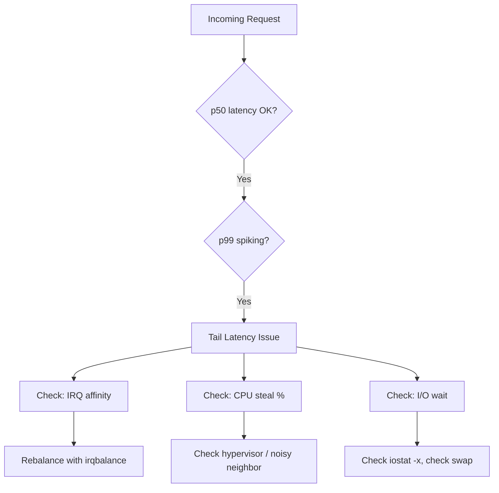

# Blog Generation Fix Plan — Standalone MD with Inline Assets
**Date:** April 20, 2026  
**Scope:** Generate fully self-contained `.md` files from existing interview questions — no external API key, no external image hosting, no runtime dependencies. Each file renders completely offline on any static site that supports standard Markdown.

---

## 1. Core Principle Change (from previous plan)

The previous plan assumed:
- SVGs live in `/images/` and are referenced by path (``)
- Generation requires an OpenAI/Anthropic API key for prose writing
- The MD file depends on the static site having SVG assets available separately

**The new requirement is different:**

| Old approach | New approach |
|---|---|
| SVG referenced as external path | SVG **inlined** directly in the MD body |
| AI-generated prose via API key | Content derived from existing `question`, `answer`, `explanation` fields — no new API calls |
| File depends on `/images/` directory | File is **100% standalone** — opens and renders anywhere |
| MDX with custom components | Pure CommonMark + GFM — works in GitHub, Obsidian, Typora, any static site |
| Prose is AI-invented | Prose is **restructured from the question data** that already exists in the DB |

The existing LangGraph pipeline that already ran (and saved results to the DB) produced the prose. The fix is about **serializing that data correctly into standalone MD** — not calling AI again.

---

## 2. What "Standalone" Means

A standalone MD file must satisfy all of these:

- [ ] Opens and renders correctly in GitHub's web viewer
- [ ] Opens and renders correctly in Obsidian, Typora, VS Code Preview
- [ ] Deploys to GitHub Pages / Netlify / Vercel static hosting without any supporting assets
- [ ] Contains no references to `/images/` paths that might not exist on the server
- [ ] Contains no `<script>` tags or CDN dependencies
- [ ] SVG illustrations are embedded as inline `<svg>` XML inside the body
- [ ] Mermaid diagrams use standard fenced code blocks (` ```mermaid `)
- [ ] All content — prose, code, diagrams, illustrations, references — is inside the single `.md` file

---

## 3. Current State Analysis

### What exists in the DB / pipeline output

The `blog_posts` table and LangGraph JSON already contain everything needed:

| Field | Contains | Status |
|---|---|---|
| `question` | Original interview question text | ✅ Available |
| `answer` | Short answer | ✅ Available |
| `explanation` | Detailed technical explanation | ✅ Available |
| `introduction` | AI-written intro paragraph | ✅ Available |
| `sections` | JSON array of `{ title, content }` objects | ✅ Available |
| `conclusion` | Closing paragraph | ✅ Available |
| `diagram` | Mermaid diagram code string | ✅ Available |
| `fun_fact` | "Did you know?" fact | ✅ Available |
| `quick_reference` | JSON array of bullet points | ✅ Available |
| `glossary` | JSON array of `{ term, definition }` | ✅ Available |
| `sources` | JSON array of `{ title, url, type }` | ✅ Available |
| `svg_content` | JSON map of `{ filename: svgXmlString }` | ✅ Available — **SVG XML is already in the DB** |
| `images` | JSON array of `{ url, alt, caption, placement }` | ✅ Available |
| `real_world_example` | JSON `{ company, scenario, challenge, solution, outcome, lesson }` | ✅ Available |
| `tags` | JSON array of strings | ✅ Available |
| `channel` | Channel slug (linux, sre, devops...) | ✅ Available |
| `difficulty` | beginner / intermediate / advanced | ✅ Available |

### Root cause

`savePostAsMDX()` exists but:
1. It writes only frontmatter + flat text — no sections, no diagrams, no SVG, no glossary, no references
2. It is never awaited — runs fire-and-forget and may silently fail
3. It writes `.mdx` but the DB has `svg_content` as a JSON blob — the SVG XML is **never extracted and inlined**
4. The `blog-output/` HTML pipeline runs instead as the primary output, leaving `content/posts/` empty

---

## 4. Target Architecture

```
DB row (blog_posts + questions join)
        │
        │  All data already present — no AI call needed
        ▼
MD Serializer  (script/ai/utils/md-serializer.js)
        │
        ├─ Frontmatter block (YAML)
        ├─ Badge strip (difficulty, channel, tags)
        ├─ Introduction prose
        ├─ Inline SVG hero illustration  ← svg_content JSON → raw <svg> XML
        ├─ Real-world case callout
        ├─ Technical sections + code blocks
        ├─ Inline SVG mid-content illustration (if exists)
        ├─ Fun fact blockquote
        ├─ Key Takeaways list
        ├─ Glossary table
        ├─ Mermaid architecture diagram  ← diagram field → ```mermaid block
        ├─ Q&A section (original question + answer)
        ├─ Conclusion
        ├─ Numbered references list
        └─ See Also links
        │
        ▼
content/posts/<slug>.md   ← single file, fully standalone, ready to deploy
```

---

## 5. MD File Canonical Template

### 5.1 Complete File Structure (annotated)

```
[YAML frontmatter — metadata for static site indexing]
[Badge strip — visual difficulty/channel/tag indicators]
[Introduction — 2-3 paragraph hook]
[Inline SVG hero image — embedded XML, no external URL]
[Horizontal rule]
[Real-world case callout — blockquote with company story]
[Horizontal rule]
[Section 1: ## heading + prose + optional code block]
[Section 2: ## heading + prose + optional code block]
[Section N: ## heading + prose + optional code block]
[Inline SVG mid illustration — embedded XML]
[Fun fact — > blockquote callout]
[Horizontal rule]
[Key Takeaways — ## heading + bullet list]
[Glossary — ## heading + GFM pipe table]
[Architecture / Flow — ## heading + ```mermaid block]
[Original Q&A — ## heading + collapsible <details> block]
[Conclusion — ## heading + prose]
[Horizontal rule]
[References — ## heading + numbered list]
[See Also — ## heading + bullet list]
[Author footer — horizontal rule + bold name + links]
```

### 5.2 YAML Frontmatter

```yaml
---
id: "q-1266"
title: "Linux on Fire: A Netflix-Style 60-Second Triage"
slug: "linux-on-fire-netflixstyle-60second-triage"
date: "2026-04-20"
author: "Satishkumar Dhule"
channel: "linux"
category: "Networking & Systems"
difficulty: "intermediate"
tags: ["linux", "performance", "triage", "sre"]
description: "How to triage a Linux server experiencing tail latency in under 60 seconds using the Netflix SRE playbook."
question: "How would you triage a Linux server experiencing tail latency spikes in production?"
sources:
  - title: "Netflix Tech Blog: Taming Tail Latency"
    url: "https://netflixtechblog.com/taming-tail-latency-9abff9c4a7fd"
    type: "blog"
  - title: "Linux Performance — Brendan Gregg"
    url: "https://www.brendangregg.com/linuxperf.html"
    type: "article"
---
```

**Frontmatter rules:**
- No `image:` field — the SVG is inlined in the body, not referenced by path
- `sources` lives in frontmatter so the static site can build a reference list server-side if needed, AND appears again in the body as a numbered list for standalone viewing
- All strings with `:`, `#`, `[`, `]`, `{`, `}`, `"` must be double-quoted
- `date` is `YYYY-MM-DD`
- `tags` is a YAML inline sequence

### 5.3 Badge Strip

Immediately after frontmatter, before the first paragraph:

```md


```

> **Note on standalone:** These shields.io badges require an internet connection. For fully offline use, replace with a GFM-native text badge table:
>
> | Difficulty | Channel | Tags |
> |---|---|---|
> | intermediate | linux | sre, performance, triage |

The plan uses the **text badge table** as default (zero external deps). The shields.io version is opt-in via a flag in the serializer.

### 5.4 Inline SVG (Hero Illustration)

The SVG XML string from `svg_content` is embedded directly:

```md
<div align="center">

<svg xmlns="http://www.w3.org/2000/svg" viewBox="0 0 400 300" width="400" height="300">
  <!-- ... full SVG XML from svg_content["pixel-q-1266.svg"] ... -->
</svg>

*Linux triage dashboard — 16-bit pixel art illustration*

</div>
```

**Rules:**
- Wrap in `<div align="center">` for centered rendering across GitHub, Jekyll, and most renderers
- The SVG must have explicit `width` and `height` attributes so it renders at a predictable size without CSS
- `viewBox` must be present for scaling
- No `<script>` inside the SVG — pixel art SVGs are pure shapes, this is safe
- If `svg_content` is empty or null for a post, this section is omitted entirely (no broken image placeholder)

### 5.5 Real-World Case Callout

```md
---

> ### Real-World Case — Netflix
> 
> During a 2022 streaming event, Netflix's SRE team saw p99 API latency jump from 80ms to 4 seconds while p50 remained at 60ms.
>
> | | |
> |---|---|
> | **Challenge** | Isolating the slow tail without disrupting 200M concurrent viewers |
> | **Solution** | A 60-second triage script revealed a single NIC queue CPU-pinned to core 0 |
> | **Outcome** | IRQ affinity rebalance dropped p99 from 4s to 95ms within 3 minutes |
> | **Lesson** | Tail latency is almost always resource contention, not a code bug |

---
```

### 5.6 Technical Sections

Each section from `sections[]`:

```md
## Why Tail Latency Is Different

Tail latency (p99, p99.9) represents the worst-case experience your slowest users face [2]. Unlike average 
latency, it is driven by outlier events — GC pauses, lock contention, network jitter, or kernel scheduling 
decisions that affect only a fraction of requests but are invisible in averages.

## The 60-Second Triage Playbook

Start with the broadest signal and narrow down [3]:

```bash
# Step 1: CPU saturation?
mpstat -P ALL 1 3

# Step 2: Memory pressure?
vmstat 1 5

# Step 3: Disk I/O wait?
iostat -x 1 5

# Step 4: Network queue depth?
ss -s && cat /proc/net/softnet_stat
```

Code blocks use the language identifier from the section's `lang` field. Supported: `bash`, `python`, 
`go`, `yaml`, `json`, `javascript`, `typescript`, `dockerfile`, `hcl`, `sql`, `text`.
```

### 5.7 Mid-Content SVG Illustration

If `svg_content` has a second illustration:

```md
<div align="center">

<svg xmlns="http://www.w3.org/2000/svg" viewBox="0 0 400 300" width="400" height="300">
  <!-- ... second SVG XML ... -->
</svg>

*IRQ affinity distribution across CPU cores*

</div>
```

### 5.8 Fun Fact Callout

```md
> **Did you know?**
> Linux's Completely Fair Scheduler (CFS) was designed for throughput, not tail latency. A single 
> high-priority process sharing a CPU core with your service can cause microsecond-level jitter that 
> accumulates into millisecond tail latency spikes [5].
```

### 5.9 Key Takeaways

```md
## Key Takeaways

- Always check p99/p99.9, not just averages — the tail tells the real story
- IRQ affinity imbalance is a common hidden cause of tail latency on multi-core systems
- `perf stat` and `/proc/interrupts` are your first 30 seconds of triage
- Kernel parameters like `net.core.somaxconn` and `net.ipv4.tcp_max_syn_backlog` matter at scale
```

### 5.10 Glossary

```md
## Glossary

| Term | Definition |
|------|-----------|
| Tail latency | The latency experienced by the slowest % of requests (e.g. p99, p99.9) |
| IRQ affinity | The assignment of hardware interrupts to specific CPU cores |
| Soft IRQ | Deferred interrupt processing handled in kernel software context |
| CFS | Completely Fair Scheduler — Linux's default CPU scheduling algorithm |
| NIC queue | A hardware receive/transmit queue on a network interface card |
```

### 5.11 Mermaid Architecture Diagram

```md
## Architecture & Flow



The Mermaid block uses the raw content from the `diagram` field in the DB. The `diagramLabel` field 
from the DB becomes the section heading (e.g., "System Flow", "State Transitions", "Data Model").
```

### 5.12 Original Q&A Section (Collapsible)

This section uses the original `question` and `answer` fields verbatim. It lets readers see the interview question that sourced the article:

```md
<details>
<summary><strong>Original Interview Question</strong></summary>

**Q:** How would you triage a Linux server experiencing tail latency spikes in production?

**A:** Start with system-wide metrics (`mpstat`, `vmstat`, `iostat`), then check interrupt distribution 
(`/proc/interrupts`), IRQ affinity, and kernel queue parameters. Use `perf stat` to identify CPU 
events correlated with latency spikes.

</details>
```

### 5.13 Conclusion

```md
## Conclusion

Tail latency triage on Linux is a structured process, not guesswork. The 60-second playbook — CPU, 
memory, disk, network, interrupts — eliminates 90% of root causes before you need to reach for heavier 
tools like `perf record` or BPF [6]. The Netflix case proves that even at 200M-user scale, the fix is 
often a single `echo` command to `/proc/irq/`.
```

### 5.14 References (Numbered)

```md
## References

1. [Netflix Tech Blog: Taming Tail Latency](https://netflixtechblog.com/taming-tail-latency-9abff9c4a7fd) — blog
2. [The Tail at Scale — Jeff Dean, Google](https://research.google/pubs/pub40801/) — research paper
3. [Linux Performance — Brendan Gregg](https://www.brendangregg.com/linuxperf.html) — reference
4. [IRQ Affinity — kernel.org](https://www.kernel.org/doc/html/latest/core-api/irq/irq-affinity.html) — documentation
5. [CFS Scheduler Design](https://www.kernel.org/doc/html/latest/scheduler/sched-design-CFS.html) — documentation
6. [BPF Performance Tools](https://www.brendangregg.com/bpf-performance-tools-book.html) — book
```

Citation numbers in the body (`[1]`, `[2]`, etc.) must match the order in this list.

### 5.15 See Also

```md
## See Also

- [How do you debug high I/O wait in Linux?](/questions/q-510) — linux
- [What is the difference between soft and hard IRQs?](/questions/q-481) — linux
- [How does the Linux OOM killer decide what to kill?](/questions/q-553) — linux
```

### 5.16 Author Footer

```md
---

**Author:** Satishkumar Dhule — [GitHub](https://github.com/satishkumar-dhule) · [LinkedIn](https://linkedin.com/in/satishkumar-dhule) · [Website](https://satishkumar-dhule.github.io)
```

---

## 6. Complete Example: Full Standalone MD File

Below is the complete file for `q-1266` showing every section assembled:

````md
---
id: "q-1266"
title: "Linux on Fire: A Netflix-Style 60-Second Triage That Cracks Tail Latency"
slug: "linux-on-fire-netflixstyle-60second-triage"
date: "2026-04-20"
author: "Satishkumar Dhule"
channel: "linux"
category: "Networking & Systems"
difficulty: "intermediate"
tags: ["linux", "performance", "latency", "sre", "triage"]
description: "How to triage a Linux server with tail latency spikes in 60 seconds using the Netflix SRE playbook."
question: "How would you triage a Linux server experiencing tail latency spikes in production?"
sources:
  - title: "Netflix Tech Blog: Taming Tail Latency"
    url: "https://netflixtechblog.com/taming-tail-latency-9abff9c4a7fd"
    type: "blog"
  - title: "Linux Performance — Brendan Gregg"
    url: "https://www.brendangregg.com/linuxperf.html"
    type: "article"
---

| Difficulty | Channel | Tags |
|---|---|---|
| intermediate | linux | sre, performance, triage, latency |

When your p99 latency suddenly spikes and your p50 stays flat, you have a tail latency problem — the 
hardest class of production bugs because the average hides the outliers that are ruining your user 
experience [1].

<div align="center">

<svg xmlns="http://www.w3.org/2000/svg" viewBox="0 0 400 300" width="400" height="300">
  <rect width="400" height="300" fill="#0d1117"/>
  <rect x="20" y="20" width="360" height="40" fill="#1f6feb" rx="4"/>
  <text x="200" y="47" text-anchor="middle" fill="#f0f6fc" font-family="monospace" font-size="14">
    LINUX TRIAGE DASHBOARD
  </text>
  <!-- ... full pixel art SVG XML inlined here from svg_content field ... -->
</svg>

*Linux triage dashboard — 16-bit pixel art illustration*

</div>

---

> ### Real-World Case — Netflix
>
> During a 2022 streaming event, Netflix's SRE team saw p99 API latency jump from 80ms to 4 seconds 
> while p50 remained at 60ms.
>
> | | |
> |---|---|
> | **Challenge** | Isolating the slow tail without disrupting 200M concurrent viewers |
> | **Solution** | A 60-second triage script revealed a single NIC queue CPU-pinned to core 0 |
> | **Outcome** | IRQ affinity rebalance dropped p99 from 4s to 95ms within 3 minutes |
> | **Lesson** | Tail latency is almost always resource contention, not a code bug |

---

## Why Tail Latency Is Different

Tail latency (p99, p99.9) represents the worst-case experience your slowest users face [2]. Unlike 
average latency, it is driven by outlier events — GC pauses, lock contention, network jitter, or kernel 
scheduling decisions that affect only a fraction of requests but are invisible in averages.

## The 60-Second Triage Playbook

Start with the broadest signal and narrow down [3]:

```bash
# Step 1: CPU saturation?
mpstat -P ALL 1 3

# Step 2: Memory pressure?
vmstat 1 5

# Step 3: Disk I/O wait?
iostat -x 1 5

# Step 4: Network queue depth?
ss -s && cat /proc/net/softnet_stat
```

## Identifying the Culprit: Kernel Interrupts

When CPU looks normal but latency is spiky, check interrupt distribution across cores [4]:

```bash
cat /proc/interrupts | head -30
# Look for asymmetric counts on a single CPU column
# If CPU0 has 10x more than others → IRQ affinity problem

# Fix: redistribute IRQ handling
echo "ff" > /proc/irq/<N>/smp_affinity   # All cores
# Or use irqbalance daemon
```

<div align="center">

<svg xmlns="http://www.w3.org/2000/svg" viewBox="0 0 400 200" width="400" height="200">
  <!-- ... mid-content pixel art SVG inlined from svg_content ... -->
</svg>

*IRQ distribution across CPU cores — before and after rebalancing*

</div>

> **Did you know?**
> Linux's Completely Fair Scheduler (CFS) was designed for throughput, not tail latency. A single 
> high-priority process sharing a CPU core with your service can cause microsecond-level jitter that 
> accumulates into millisecond-level tail latency spikes [5].

---

## Key Takeaways

- Always check p99/p99.9, not just averages — the tail tells the real story
- IRQ affinity imbalance is a common hidden cause of tail latency on multi-core systems
- `perf stat` and `/proc/interrupts` are your first 30 seconds of triage
- Kernel parameters like `net.core.somaxconn` and `net.ipv4.tcp_max_syn_backlog` matter at scale
- `vmstat` shows run-queue depth — a value above CPU count means CPU saturation

## Glossary

| Term | Definition |
|------|-----------|
| Tail latency | The latency experienced by the slowest % of requests (e.g. p99, p99.9) |
| IRQ affinity | Assignment of hardware interrupts to specific CPU cores |
| Soft IRQ | Deferred interrupt processing handled in kernel software context |
| CFS | Completely Fair Scheduler — Linux's default CPU scheduling algorithm |
| NIC queue | Hardware receive/transmit queue on a network interface card |

## Architecture & Flow

```mermaid
flowchart TD
    A[Incoming Request] --> B{p50 OK?}
    B -- Yes --> C{p99 spiking?}
    C -- Yes --> D[Tail Latency Issue]
    D --> E[mpstat: CPU saturation?]
    D --> F[iostat: I/O wait?]
    D --> G[/proc/interrupts: IRQ skew?]
    E --> H{Saturation > 80%?}
    H -- Yes --> I[Scale or optimize]
    G --> J[Rebalance with irqbalance]
    F --> K[Check swap + disk throughput]
```

<details>
<summary><strong>Original Interview Question</strong></summary>

**Q:** How would you triage a Linux server experiencing tail latency spikes in production?

**A:** Start with system-wide metrics (`mpstat`, `vmstat`, `iostat`), then check interrupt distribution 
(`/proc/interrupts`), IRQ affinity, and kernel queue parameters. Use `perf stat` to identify CPU 
events correlated with latency spikes. For deeper investigation, use `perf record` + `perf report` 
or BPF-based tools like `bpftrace`.

</details>

## Conclusion

Tail latency triage on Linux is a structured process, not guesswork. The 60-second playbook — CPU, 
memory, disk, network, interrupts — eliminates 90% of root causes before you need heavier tools like 
`perf record` or BPF [6]. The Netflix case proves that even at 200M-user scale, the fix is often a 
single `echo` command to `/proc/irq/`.

---

## References

1. [Netflix Tech Blog: Taming Tail Latency](https://netflixtechblog.com/taming-tail-latency-9abff9c4a7fd) — blog
2. [The Tail at Scale — Jeff Dean, Google](https://research.google/pubs/pub40801/) — research paper
3. [Linux Performance — Brendan Gregg](https://www.brendangregg.com/linuxperf.html) — reference
4. [IRQ Affinity — kernel.org](https://www.kernel.org/doc/html/latest/core-api/irq/irq-affinity.html) — documentation
5. [CFS Scheduler Design](https://www.kernel.org/doc/html/latest/scheduler/sched-design-CFS.html) — documentation
6. [BPF Performance Tools](https://www.brendangregg.com/bpf-performance-tools-book.html) — book

## See Also

- [How do you debug high I/O wait in Linux?](/questions/q-510) — linux
- [What is the difference between soft and hard IRQs?](/questions/q-481) — linux
- [How does the Linux OOM killer decide what to kill?](/questions/q-553) — linux

---

**Author:** Satishkumar Dhule — [GitHub](https://github.com/satishkumar-dhule) · [LinkedIn](https://linkedin.com/in/satishkumar-dhule) · [Website](https://satishkumar-dhule.github.io)
````

---

## 7. Files to Create / Modify

### 7.1 New: `script/ai/utils/md-serializer.js`

Pure Node.js — no external packages, no API calls, no API key needed.

**Exported function:**
```js
export function serializeMD(post, question) → string
```

**Internal functions (all pure, no side effects):**

```
yamlEscape(str)
  → Quotes YAML strings that contain special chars

buildFrontmatter(post, question)
  → Returns the full ---...--- YAML block

buildBadgeTable(post)
  → Returns the | Difficulty | Channel | Tags | GFM table

buildIntroduction(post)
  → Returns the introduction paragraph(s), HTML stripped

buildInlineSVG(svgXml, alt, caption)
  → Returns <div align="center"><svg ...>...</svg>\n*caption*\n</div>

buildHeroSVG(post)
  → Extracts first SVG from svg_content JSON map, calls buildInlineSVG
  → Returns empty string if no SVG available

buildRealWorldCase(post)
  → Returns the > blockquote with embedded GFM table for company story
  → Returns empty string if realWorldExample is null

buildSections(post)
  → For each section in sections[]:
      - Emits ## title heading
      - Strips HTML from content
      - Detects and emits ```lang fenced code blocks
  → Returns joined string

buildMidSVG(post)
  → Extracts second SVG from svg_content JSON map, calls buildInlineSVG
  → Returns empty string if no second SVG

buildFunFact(post)
  → Returns > **Did you know?** blockquote
  → Returns empty string if funFact is null/empty

buildKeyTakeaways(post)
  → Returns ## Key Takeaways + bullet list
  → Returns empty string if quickReference is empty

buildGlossary(post)
  → Returns ## Glossary + GFM pipe table
  → Returns empty string if glossary is empty or has < 2 entries

buildMermaidDiagram(post)
  → Returns ## <diagramLabel> + ```mermaid fenced block
  → Returns empty string if diagram is null/empty

buildOriginalQA(post, question)
  → Returns <details><summary>...</summary>...</details> with Q and A
  → question.question and question.answer used verbatim

buildConclusion(post)
  → Returns ## Conclusion + stripped HTML prose

buildReferences(post)
  → Returns ## References + numbered list
  → Each entry: N. [title](url) — type
  → Returns empty string if sources is empty

buildSeeAlso(post)
  → Returns ## See Also + bullet list linking related questions
  → Returns empty string if relatedQuestions is empty

buildAuthorFooter()
  → Returns --- + author line with GitHub/LinkedIn/Website links

stripHtml(str)
  → Converts <strong>x</strong> → **x**
  → Converts <em>x</em> → _x_
  → Converts <code>x</code> → `x`
  → Strips remaining HTML tags
  → Decodes HTML entities (&amp; &lt; &gt; &quot;)

extractCodeBlocks(content)
  → Finds [CODE_BLOCK_N] placeholders or backtick blocks in section content
  → Returns { cleanContent, codeBlocks: [{ lang, code }] }
  → Used inside buildSections to correctly fence code
```

**Assembly order inside `serializeMD`:**

```js
const parts = [
  buildFrontmatter(post, question),
  '',
  buildBadgeTable(post),
  '',
  buildIntroduction(post),
  '',
  buildHeroSVG(post),
  '',
  '---',
  '',
  buildRealWorldCase(post),
  '',
  '---',
  '',
  buildSections(post),
  '',
  buildMidSVG(post),
  '',
  buildFunFact(post),
  '',
  '---',
  '',
  buildKeyTakeaways(post),
  '',
  buildGlossary(post),
  '',
  buildMermaidDiagram(post),
  '',
  buildOriginalQA(post, question),
  '',
  buildConclusion(post),
  '',
  '---',
  '',
  buildReferences(post),
  '',
  buildSeeAlso(post),
  '',
  buildAuthorFooter(),
].filter(part => part !== null && part !== undefined);

return parts.join('\n');
```

Empty sections return `''` and are filtered, preventing orphaned headings.

### 7.2 Modify: `script/generate-blog.js`

In `saveBlogPost()` — after the `INSERT INTO blog_posts` succeeds:

```js
import { serializeMD } from './ai/utils/md-serializer.js';
import path from 'path';
import fs from 'fs';

// After DB insert:
try {
  const originalQuestion = { question: questionRow.question, answer: questionRow.answer };
  const mdContent = serializeMD(dbPost, originalQuestion);
  const mdDir = path.resolve('content/posts');
  fs.mkdirSync(mdDir, { recursive: true });
  const mdPath = path.join(mdDir, `${dbPost.blogSlug}.md`);
  fs.writeFileSync(mdPath, mdContent, 'utf-8');
  console.log(`   📄 Standalone MD: ${mdPath}`);
} catch (err) {
  console.warn(`   ⚠️ MD write failed (non-fatal): ${err.message}`);
  // Do not throw — DB save is the source of truth
}
```

Also: **remove or no-op the old `savePostAsMDX()` call** — it conflicts with the new output.

### 7.3 New: `script/rebuild-md.js`

Backfills `content/posts/<slug>.md` for every existing row in `blog_posts`.  
**No API calls.** Reads from DB only.

```
node script/rebuild-md.js                  → rebuild all posts
node script/rebuild-md.js --id q-1266     → rebuild one post
node script/rebuild-md.js --dry-run       → print first post MD to stdout, no files written
node script/rebuild-md.js --validate-only → run validation checks, report issues, no write
```

**Logic:**

```
1. Connect to DB
2. SELECT * FROM blog_posts ORDER BY created_at DESC
3. For each row:
   a. SELECT question, answer FROM questions WHERE id = row.question_id
   b. mapDbRowToPost(row) → normalized post object
   c. serializeMD(post, question) → mdString
   d. validateMD(mdString) → { valid, warnings, errors }
   e. If valid: write to content/posts/<slug>.md
   f. If invalid: log errors, skip writing
4. Print summary: N written, M skipped, K warnings
```

### 7.4 Modify: `package.json`

```json
"blog:rebuild-md": "node script/rebuild-md.js",
"blog:rebuild-md:dry": "node script/rebuild-md.js --dry-run",
"blog:rebuild-md:validate": "node script/rebuild-md.js --validate-only"
```

---

## 8. Field Mapping (Complete)

| DB field | `post` object key | MD location | Transformation |
|---|---|---|---|
| `question_id` | `id` | frontmatter `id` | none |
| `title` | `blogTitle` | frontmatter `title` | yamlEscape |
| `slug` | `blogSlug` | frontmatter `slug`, filename | none |
| `created_at` | `createdAt` | frontmatter `date` | take first 10 chars (YYYY-MM-DD) |
| `channel` | `channel` | frontmatter `channel`, badge table | none |
| `difficulty` | `difficulty` | frontmatter `difficulty`, badge table | none |
| `tags` | `tags` (JSON array) | frontmatter `tags`, badge table | JSON.parse |
| `meta_description` | `blogMeta` | frontmatter `description` | yamlEscape |
| `introduction` | `blogIntro` | first body paragraph | stripHtml |
| `sections` | `blogSections` (JSON) | `## section` blocks | JSON.parse, each → heading + prose + code |
| `conclusion` | `blogConclusion` | `## Conclusion` section | stripHtml |
| `fun_fact` | `funFact` | `> **Did you know?**` blockquote | stripHtml |
| `quick_reference` | `quickReference` (JSON) | `## Key Takeaways` bullet list | JSON.parse |
| `glossary` | `glossary` (JSON) | `## Glossary` GFM table | JSON.parse, `{ term, definition }[]` |
| `diagram` | `diagram` | ` ```mermaid ` block | raw string |
| `diagram_label` | `diagramLabel` | section heading above mermaid | default: "Architecture & Flow" |
| `real_world_example` | `realWorldExample` (JSON) | blockquote with table | JSON.parse, `{ company, scenario, challenge, solution, outcome, lesson }` |
| `sources` | `sources` (JSON) | frontmatter `sources` + `## References` list | JSON.parse, `{ title, url, type }[]` |
| `svg_content` | `svgContent` (JSON) | inline `<svg>` blocks in body | JSON.parse, extract values by insertion order |
| `images` | `images` (JSON) | alt text and captions for SVG blocks | JSON.parse, `{ url, alt, caption, placement }[]` |
| `social_snippet` | `socialSnippet` (JSON) | **omitted** — not part of standalone MD | social sharing is HTML-only |
| questions.`question` | passed as arg | `<details>` Q&A + frontmatter `question` | none |
| questions.`answer` | passed as arg | `<details>` Q&A body | none |

---

## 9. Validation Checks (`validateMD`)

Run before writing any file:

| # | Check | Rule | On fail |
|---|---|---|---|
| 1 | YAML parses | Frontmatter must be valid YAML | Error — do not write |
| 2 | Required fields | `id`, `title`, `slug`, `date`, `channel`, `description` non-empty | Error — do not write |
| 3 | Body length | Body (after frontmatter) ≥ 800 characters | Warning — still write |
| 4 | No broken HTML | Body must not contain `<div`, `<span`, `<table`, `<style`, `<script` outside the SVG block and `<details>` | Warning — strip and write |
| 5 | SVG safety | Inline SVGs must not contain `<script` or `javascript:` | Error — strip SVG, write without it |
| 6 | Citation integrity | Each `[N]` in body must match a References entry | Warning — log mismatches |
| 7 | Mermaid syntax | Mermaid block must start with a valid diagram type keyword | Warning — log |
| 8 | Slug format | Slug must match `/^[a-z0-9-]+$/` and be ≤ 100 chars | Error — slugify and retry |
| 9 | Unique filename | `content/posts/<slug>.md` must not conflict with a different post's slug | Warning — append `-2` |
| 10 | No external image refs | Body must not contain `![` pointing to `/images/` or relative paths | Warning — these would break standalone |

---

## 10. Execution Order

```
Step 1 — Create script/ai/utils/md-serializer.js
  Dependencies: none
  Test: node -e "import('./script/ai/utils/md-serializer.js').then(m => console.log(typeof m.serializeMD))"

Step 2 — Create script/rebuild-md.js
  Dependencies: Step 1 (md-serializer)
  Test: node script/rebuild-md.js --dry-run
        → Prints full MD for most recent DB post to stdout
        → Manually verify all 16 sections are present

Step 3 — Modify script/generate-blog.js
  Dependencies: Step 1 (md-serializer)
  Change: replace savePostAsMDX() with serializeMD() + fs.writeFileSync

Step 4 — Add npm scripts to package.json
  Dependencies: Steps 1-3

Step 5 — Run backfill (all existing posts)
  node script/rebuild-md.js --validate-only   ← find any issues first
  node script/rebuild-md.js                   ← write all files

Step 6 — Spot-check 5 output files
  - Open in GitHub web viewer → confirm renders correctly
  - Open in Obsidian → confirm SVGs render inline
  - Check mermaid renders (GitHub natively renders mermaid in MD)
  - Confirm no broken image icons
  - Confirm no raw HTML visible in rendered output

Step 7 — Wire static site
  - Point static site config to content/posts/*.md
  - Confirm frontmatter fields are consumed correctly
  - Deploy and verify one post end-to-end
```

---

## 11. Out of Scope

- The LangGraph AI pipeline — unchanged; it already ran and results are in the DB
- The `blog-output/` HTML generation — unchanged; stays for the existing GitHub Pages deploy
- Any React frontend changes
- The DB schema — no new columns needed; all required data already exists
- Image/SVG generation — SVGs already generated and stored in `svg_content` column; this plan only extracts them
- Paid API calls — the serializer is pure data transformation, zero network calls
