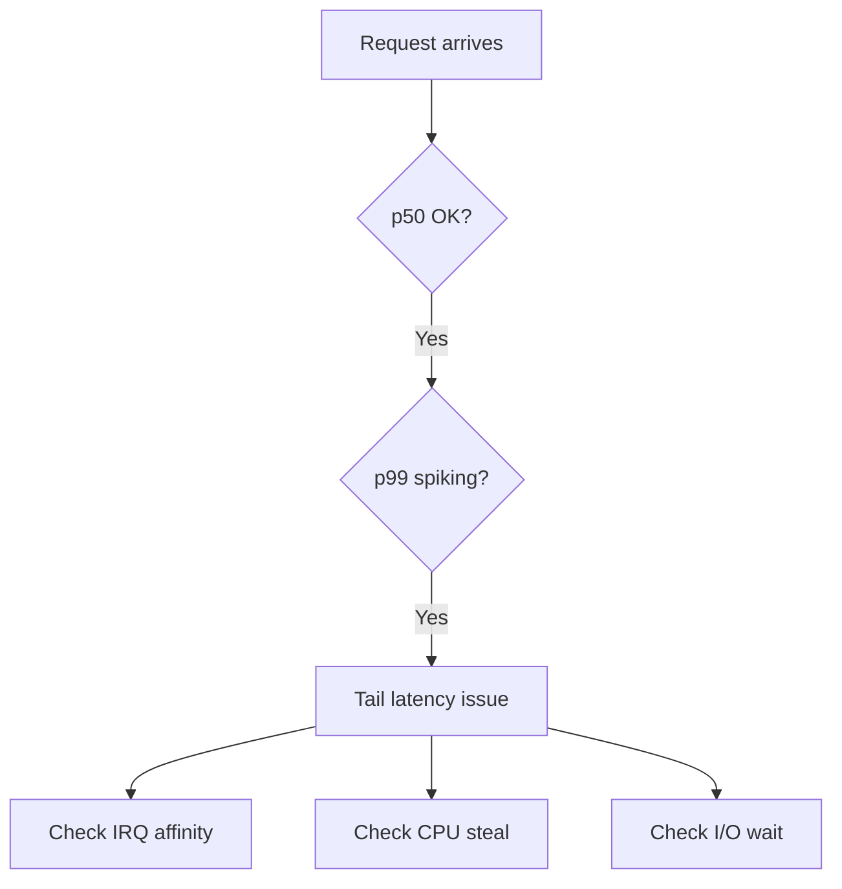

# Blog Generation Fix Plan
**Date:** April 20, 2026  
**Scope:** Fix blog generation to output deployable `.md` files using a consistent template, sourced from existing interview questions.

---

## 1. Current State Analysis

### What exists today

| Layer | Current behaviour | Problem |
|---|---|---|
| **Source** | Interview questions pulled from `blog_posts` table via `getNextQuestionForBlog()` | Works correctly — channels, difficulty, question/answer/explanation all available |
| **AI pipeline** | LangGraph graph (`script/ai/graphs/blog-graph.js`) produces structured JSON: `{ title, introduction, sections[], conclusion, sources[], funFact, quickReference, glossary, realWorldExample, socialSnippet, images[], diagram }` | Output is JSON in DB, not yet serialized to clean MD |
| **MDX writer** | `savePostAsMDX()` in `script/generate-blog.js` (line ~435) writes to `content/posts/` | Exists but **incomplete** — only serializes a subset of fields; complex nested fields (sections, sources, glossary, images) are left out or collapsed to strings |
| **Static output** | `blog-output/` directory holds **pre-rendered HTML** pages (`generateArticlePage()`) | Static site gets HTML, not MD — the renderer cannot re-process it |
| **content/posts/** | Directory exists but **zero `.mdx` files** were found | Nothing is actually landing here from recent runs |

### Root cause of the breakage

`savePostAsMDX()` is called but:
1. It is never awaited in the generation main loop — it runs fire-and-forget or is skipped when the `blog-output/` HTML path runs instead.
2. The YAML frontmatter it writes is minimal (title, slug, channel, tags, createdAt, diagram) — it omits `introduction`, `sections`, `conclusion`, `sources`, `quickReference`, `glossary`, `funFact`, `realWorldExample`, `socialSnippet`.
3. The body serialization converts `sections` back to flat text without headings, callout syntax, code fences, or citation links — producing MD that does not match the static site renderer's expected structure.
4. Images are stored as `[{ url, alt, caption, placement }]` JSON but never written into the MD body.
5. The static website rendering pipeline reads from `blog-output/index.html` (HTML), so even if MD files existed, they would be ignored.

---

## 2. Target Architecture

```
Interview Question (DB)
        │
        ▼
LangGraph pipeline (unchanged)
        │  produces JSON blogContent
        ▼
MD Serializer (new/fixed module)
  script/ai/utils/md-serializer.js
        │  produces .md string
        ▼
content/posts/<slug>.md   ← deployable MD files
        │
        ▼
Static site renderer
  (reads .md, renders via frontmatter + body)
```

The `blog-output/` HTML generation can remain as-is for the existing GitHub Pages deployment, but the canonical source of truth becomes the `.md` files in `content/posts/`.

---

## 3. MD File Template (Canonical)

Every generated blog post must conform to this exact template. The static site renderer (Jekyll, Hugo, Astro, etc.) depends on this structure.

### 3.1 Frontmatter (YAML block)

```yaml
---
id: "q-1266"
title: "Linux on Fire: A Netflix-Style 60-Second Triage"
slug: "linux-on-fire-netflixstyle-60second-triage"
date: "2026-04-20"
author: "Satishkumar Dhule"
channel: "linux"
category: "Networking & Systems"
difficulty: "intermediate"
tags: ["linux", "performance", "triage", "sre"]
description: "One-line meta description for SEO, max 160 chars."
image: "/images/pixel-q-1266.svg"
question: "How do you triage a Linux server experiencing tail latency?"
sources:
  - title: "Netflix Tech Blog: Taming Tail Latency"
    url: "https://netflixtechblog.com/..."
    type: "blog"
  - title: "Linux man-pages: perf-stat"
    url: "https://man7.org/linux/man-pages/..."
    type: "documentation"
---
```

**Rules:**
- All string values that contain `:`, `#`, `[`, `]`, `{`, `}` or quotes must be double-quoted.
- `date` is ISO-8601 (`YYYY-MM-DD`).
- `tags` is a YAML inline sequence.
- `sources` is a YAML block sequence — each item has `title`, `url`, `type`.
- `image` points to the pre-generated SVG path; omit if no image available.
- `question` preserves the original question verbatim for cross-linking.

### 3.2 Body Structure

The body follows a strict section order. Each section is separated by a blank line.

```md
<!-- Introduction -->
<introduction paragraph — plain prose, no heading>

<!-- Hero image (if available) -->

*Caption text*

<!-- Real-world hook callout -->
> **Real-world case — <Company>**
> <Scenario description>
> 
> **Challenge:** <challenge>
> **Solution:** <solution>
> **Outcome:** <outcome>
> **Lesson:** <lesson>

<!-- Main content sections (repeat for each section) -->
## <Section Title>

<Section prose content>

[code block if present]
```<lang>
<code>
```

<!-- Mid-content image (if placement === 'mid-content') -->

*Caption text*

<!-- Fun fact callout -->
> **Did you know?**
> <funFact text>

<!-- Quick reference / key takeaways -->
## Key Takeaways

- <item 1>
- <item 2>
- <item 3>

<!-- Glossary (if present) -->
## Glossary

| Term | Definition |
|------|-----------|
| <term> | <definition> |

<!-- Diagram (if present) -->
## <diagramLabel>

```mermaid
<diagram code>
```

<!-- Conclusion -->
## Conclusion

<conclusion prose>

<!-- References -->
## References

1. [<source title>](<source url>) — <source type>
2. ...

<!-- See also (related questions) -->
## See Also

- [<related question text>](/questions/<id>) — <channel>
```

---

## 4. Files to Create / Modify

### 4.1 New file: `script/ai/utils/md-serializer.js`

This is the core new module. Its job: take the structured `blogContent` JSON from the LangGraph pipeline (plus the source `question` record) and output a complete, valid `.md` string.

**Functions to implement:**

```
serializeFrontmatter(post, question)
  → Builds the YAML frontmatter block per §3.1

serializeBody(post)
  → Calls sub-serializers in order:
      serializeIntroduction(post)
      serializeHeroImage(post)
      serializeRealWorldCase(post)
      serializeSections(post)
      serializeFunFact(post)
      serializeQuickReference(post)
      serializeGlossary(post)
      serializeDiagram(post)
      serializeConclusion(post)
      serializeReferences(post)
      serializeSeeAlso(post)

serializeMD(post, question) → string
  → serializeFrontmatter + '\n\n' + serializeBody
```

**Key implementation rules:**
- All prose content must pass through a `stripHtml()` helper — the current pipeline occasionally embeds raw HTML tags (`<strong>`, `<em>`, `<code>`) in section content; these must be converted to MD equivalents (`**`, `_`, `` ` ``).
- Citation references like `[1]`, `[2]` in prose must be kept as-is — they map to the numbered References section at the bottom.
- Code blocks in section content are stored with a `lang` field; these must be rendered as fenced code blocks with the correct language hint.
- Mermaid diagrams use ` ```mermaid ` fences (not a custom tag).
- YAML special characters in frontmatter values must be escaped properly (reuse/extract the existing `yamlStr()` helper from `savePostAsMDX`).
- Empty/null/undefined fields must be silently omitted — no empty headings or empty list items.

### 4.2 Modify: `script/generate-blog.js` — `saveBlogPost()` function

Currently `saveBlogPost()` writes to the DB and then calls `savePostAsMDX()`. Fix:

1. **Replace** the call to `savePostAsMDX()` with a call to `serializeMD()` from the new module.
2. **Write** the output to `content/posts/<slug>.md` (not `.mdx`) so static site renderers pick it up without requiring MDX processing.
3. **Await** the write — it is currently fire-and-forget.
4. **Log** the output path on success.

```js
// After saving to DB:
const mdContent = serializeMD(blogContent, question);
const mdPath = path.join('content/posts', `${blogContent.slug}.md`);
fs.mkdirSync(path.dirname(mdPath), { recursive: true });
fs.writeFileSync(mdPath, mdContent, 'utf-8');
console.log(`   📄 MD written: ${mdPath}`);
```

### 4.3 New script: `script/rebuild-md.js`

A one-time backfill script that reads all rows from `blog_posts`, runs `serializeMD()` on each, and writes the `.md` files. This handles the existing posts already in the DB that never got proper MD output.

**CLI usage:**
```
node script/rebuild-md.js            # Rebuild all posts
node script/rebuild-md.js --slug q-1266   # Rebuild a single post
node script/rebuild-md.js --dry-run  # Print without writing
```

### 4.4 Modify: `package.json` scripts section

Add two new scripts:

```json
"blog:rebuild-md": "node script/rebuild-md.js",
"blog:rebuild-md:dry": "node script/rebuild-md.js --dry-run"
```

---

## 5. Template Field Mapping

The table below maps every field from the DB / LangGraph output to its MD location.

| Source field | MD location | Notes |
|---|---|---|
| `title` | frontmatter `title` + `<h1>` (from static renderer) | |
| `slug` | frontmatter `slug` + filename | |
| `channel` | frontmatter `channel` | |
| `difficulty` | frontmatter `difficulty` | |
| `tags` | frontmatter `tags` (YAML array) | |
| `meta_description` | frontmatter `description` | |
| `question` | frontmatter `question` | verbatim |
| `introduction` | First body paragraph (no heading) | strip HTML |
| `images[placement=after-intro]` | After intro paragraph | `\n*caption*` |
| `realWorldExample` | Blockquote after intro image | company, scenario, challenge, solution, outcome, lesson |
| `sections[].title` | `## heading` | |
| `sections[].content` | paragraph(s) below heading | strip HTML, preserve code blocks |
| `sections[].codeBlock` | fenced code block | with lang hint |
| `images[placement=mid-content]` | After middle section | |
| `funFact` | `> **Did you know?**` blockquote | |
| `quickReference[]` | `## Key Takeaways` → bullet list | |
| `glossary[]` | `## Glossary` → markdown table | term + definition columns |
| `diagram` | `## <diagramLabel>` → ` ```mermaid ` block | |
| `conclusion` | `## Conclusion` → paragraph | strip HTML |
| `sources[]` | `## References` → numbered list with links | title, url, type |
| `relatedQuestions[]` | `## See Also` → bullet list | question text + channel |
| `created_at` | frontmatter `date` | ISO-8601 |
| `images[0].url` | frontmatter `image` | hero image for OG tags |

---

## 6. Static Site Compatibility Requirements

The `.md` files must be renderable by the most common static site generators without modification.

### 6.1 Jekyll (GitHub Pages default)
- Frontmatter fields used: `title`, `date`, `description`, `tags`, `author`, `image`.
- The `layout` field is optional; omit it to use the site default.
- No JSX or custom components — pure CommonMark + GFM.
- Mermaid diagrams require a client-side JS loader (already present in many Jekyll themes).

### 6.2 Hugo
- Frontmatter fields align with Hugo's built-in taxonomy: `title`, `date`, `tags`, `description`, `draft` (omit = false).
- Hugo renders fenced code blocks with syntax highlighting natively.
- Mermaid requires shortcode or script include.

### 6.3 Astro / Next.js MDX
- The `.md` extension (not `.mdx`) means no JSX — all content must be standard Markdown.
- Frontmatter is consumed by the page's `getStaticProps` / `getCollection`.

### 6.4 Common rules for all renderers
- No raw `<style>` or `<script>` blocks in the body.
- No inline HTML for layout (no `<div class="...">` wrappers).
- Tables must use GFM pipe syntax.
- Images must use standard `` syntax with relative or absolute URLs.
- Blockquotes use `>` prefix only.

---

## 7. Validation & Quality Checks

After `serializeMD()` produces output, run these checks before writing the file:

| Check | Rule | Action on failure |
|---|---|---|
| Frontmatter parse | YAML must be valid (no syntax errors) | Throw, do not write |
| Required fields | `id`, `title`, `slug`, `date`, `channel`, `description` must be non-empty | Throw with field name |
| Body length | Body content must be ≥ 500 characters | Log warning, still write |
| No raw HTML | Body must not contain `<div`, `<span`, `<style`, `<script` | Strip and log warning |
| Citation integrity | Every `[N]` reference in body must have a matching entry in the References section | Log warning |
| Image paths | All `image` references must start with `/images/` or `https://` | Log warning |
| Slug uniqueness | Slug must not already exist as another file in `content/posts/` | Append `-2`, log warning |

---

## 8. Example: Generated MD Output

Below is a representative example of what a generated `.md` file should look like for question `q-1266`.

```md
---
id: "q-1266"
title: "Linux on Fire: A Netflix-Style 60-Second Triage That Cracks Tail Latency"
slug: "linux-on-fire-netflixstyle-60second-triage"
date: "2026-04-20"
author: "Satishkumar Dhule"
channel: "linux"
category: "Networking & Systems"
difficulty: "intermediate"
tags: ["linux", "performance", "latency", "sre", "triage"]
description: "How do you debug tail latency on a Linux server in under 60 seconds? This post walks through the exact triage playbook Netflix SREs use."
image: "/images/pixel-q-1266.svg"
question: "How would you triage a Linux server experiencing tail latency spikes in production?"
sources:
  - title: "Netflix Tech Blog: Taming Tail Latency"
    url: "https://netflixtechblog.com/taming-tail-latency-9abff9c4a7fd"
    type: "blog"
  - title: "Brendan Gregg: Linux Performance"
    url: "https://www.brendangregg.com/linuxperf.html"
    type: "article"
---

When your p99 latency suddenly spikes and your p50 stays flat, you have a tail latency problem — the hardest class of production bugs because the average hides the outliers that are ruining your user experience [1].


*A 16-bit triage dashboard in the middle of a production incident*

> **Real-world case — Netflix**
> During a 2022 streaming event, Netflix's SRE team saw p99 API latency jump from 80ms to 4 seconds while p50 remained at 60ms.
>
> **Challenge:** Isolating the slow tail without disrupting 200M concurrent viewers.
> **Solution:** A 60-second triage script combining `perf stat`, `ss -s`, and `cat /proc/interrupts` revealed a single NIC queue was CPU-pinned to core 0.
> **Outcome:** IRQ affinity rebalance dropped p99 from 4s to 95ms within 3 minutes.
> **Lesson:** Tail latency is almost always a resource contention problem, not a code bug.

## Why Tail Latency Is Different

Tail latency (p99, p99.9) represents the worst-case experience your slowest users face [2]. Unlike average latency, it is driven by...

## The 60-Second Triage Playbook

Start with the broadest signal and narrow down [3]:

```bash
# Step 1: CPU saturation?
mpstat -P ALL 1 3

# Step 2: Memory pressure?
vmstat 1 5

# Step 3: Disk I/O wait?
iostat -x 1 5

# Step 4: Network queue depth?
ss -s && cat /proc/net/softnet_stat
```

## Identifying the Culprit: Kernel Interrupts

When CPU looks normal but latency is spiky, check interrupt distribution [4]...

> **Did you know?**
> Linux's Completely Fair Scheduler (CFS) was designed for throughput, not tail latency. A single high-priority process sharing a CPU core with your service can cause microsecond-level jitter that accumulates into millisecond tail latency spikes [5].

## Key Takeaways

- Always check p99/p99.9, not just averages — the tail tells the real story
- IRQ affinity imbalance is a common hidden cause of tail latency on multi-core systems
- `perf stat` and `/proc/interrupts` are your first 30 seconds of triage
- Kernel parameters like `net.core.somaxconn` and `net.ipv4.tcp_max_syn_backlog` matter at scale

## Glossary

| Term | Definition |
|------|-----------|
| Tail latency | The latency experienced by the slowest percentage of requests (e.g. p99) |
| IRQ affinity | The assignment of hardware interrupts to specific CPU cores |
| Soft IRQ | Deferred interrupt processing handled in kernel software context |
| CFS | Completely Fair Scheduler — Linux's default CPU scheduling algorithm |

## Architecture



## Conclusion

Tail latency triage on Linux is a structured process, not guesswork. The 60-second playbook — CPU, memory, disk, network, interrupts — eliminates 90% of root causes before you need to reach for heavier tools like `perf record` or BPF [6]. The Netflix case proves that even at 200M-user scale, the fix is often a single `echo` command to `/proc/irq/`.

## References

1. [Netflix Tech Blog: Taming Tail Latency](https://netflixtechblog.com/taming-tail-latency-9abff9c4a7fd) — blog
2. [The Tail at Scale — Jeff Dean, Google](https://research.google/pubs/pub40801/) — paper
3. [Linux Performance — Brendan Gregg](https://www.brendangregg.com/linuxperf.html) — article
4. [IRQ Affinity — kernel.org](https://www.kernel.org/doc/html/latest/core-api/irq/irq-affinity.html) — documentation
5. [CFS Scheduler Design](https://www.kernel.org/doc/html/latest/scheduler/sched-design-CFS.html) — documentation
6. [BPF Performance Tools — Brendan Gregg](https://www.brendangregg.com/bpf-performance-tools-book.html) — book

## See Also

- [How do you debug high I/O wait in Linux?](/questions/q-510) — linux
- [What is the difference between soft and hard IRQs?](/questions/q-481) — linux
- [How does the Linux OOM killer decide what to kill?](/questions/q-553) — linux
```

---

## 9. Execution Order

The steps below are ordered by dependency. Do not begin a step until the previous one is complete.

```
Step 1 — Create script/ai/utils/md-serializer.js
   - Implement all serialize* functions
   - Implement stripHtml() helper
   - Implement yamlEscape() helper (extracted from existing savePostAsMDX)
   - Add validation checks from §7
   - Unit-test with a real DB row (manual spot-check)

Step 2 — Modify script/generate-blog.js
   - Import serializeMD from md-serializer.js
   - Replace savePostAsMDX() call in saveBlogPost() with serializeMD() + fs.writeFileSync
   - Ensure the write is awaited
   - Remove or keep savePostAsMDX for backward compat (keep, but no longer called from main loop)

Step 3 — Create script/rebuild-md.js
   - Load all blog_posts rows from DB
   - For each, fetch the original question row (for the question text)
   - Call serializeMD(post, question) and write to content/posts/<slug>.md
   - Log progress, errors, and final count
   - Support --slug and --dry-run flags

Step 4 — Add npm scripts to package.json
   - blog:rebuild-md
   - blog:rebuild-md:dry

Step 5 — Run backfill
   - node script/rebuild-md.js --dry-run   (review output)
   - node script/rebuild-md.js             (write all files)
   - Verify content/posts/ has .md files

Step 6 — Validate output
   - Run the validation checks from §7 manually on 5 sample posts
   - Confirm frontmatter parses correctly
   - Confirm no raw HTML in body
   - Confirm citation numbers match reference list
   - Confirm mermaid blocks are well-formed

Step 7 — Wire into static site
   - Update any static site config (Jekyll _config.yml / Hugo config.toml / Astro config)
   - Point the content source to content/posts/
   - Verify a sample post renders correctly
```

---

## 10. Out of Scope (this plan)

- Changing the LangGraph AI pipeline — it already produces correct structured JSON.
- Modifying the existing `blog-output/` HTML generation — it stays as-is.
- Any frontend React changes.
- Changing the DB schema.
- Image/SVG generation — SVGs are already generated and stored; the MD file just references the path.
