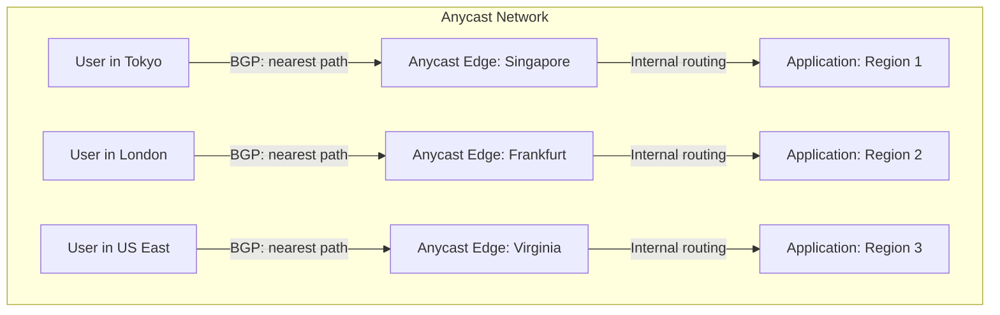

> "A user in Tokyo shouldn't wait for responses from a server in Virginia when you have a perfectly good server in Singapore."

Every millisecond counts when your application serves users across multiple continents. A 100ms delay can mean the difference between a completed transaction and an abandoned cart, between a responsive real-time feature and a frustrated user. Designing a load balancing strategy for globally distributed applications requires navigating complex trade-offs between latency-based routing, geoDNS, and anycast—each with distinct strengths and limitations.

This post breaks down these three primary approaches, provides implementation patterns, and helps you choose the right architecture for your specific requirements.

## Understanding the Three Routing Paradigms

Before diving into implementation, let's establish clear definitions of each approach:

### GeoDNS (Geolocation Routing)

GeoDNS routes users to the nearest server based on their geographic location, as determined by their IP address. DNS queries from users in Europe receive IP addresses pointing to European data centers; queries from North America receive US-based addresses.

**How it works:** Route 53's geolocation routing compares the client's IP against a geographic database and returns the appropriate record.

```bash
# Creating a geolocation record set using AWS CLI
aws route53 change-resource-record-sets \
  --hosted-zone-id Z1234567890ABC \
  --change-batch '{
    "Changes": [{
      "Action": "CREATE",
      "ResourceRecordSet": {
        "Name": "api.example.com",
        "Type": "A",
        "SetIdentifier": "Europe",
        "GeoLocation": {
          "ContinentCode": "EU"
        },
        "TTL": 60,
        "ResourceRecords": [{"Value": "52.1.2.3"}]
      }
    }]
  }'
```

**Strengths:** Precise control over regional routing, supports data sovereignty requirements, simple to understand and audit.

**Weaknesses:** Geographic databases are only as accurate as your MaxMind/DB-IP subscription allows; doesn't account for real-time network conditions; "nearest" geographically isn't always "fastest" network-wise.

### Latency-Based Routing

Latency-based routing (such as Amazon Route 53 Latency Routing) measures actual network latency from each DNS resolver to each region and routes to the lowest-latency endpoint. Instead of geographic proximity, it uses empirical performance data.

```typescript
// Example: Route 53 latency-based routing policy configuration
interface LatencyRoutingPolicy {
  type: 'latency';
  recordSets: {
    region: 'us-east-1';
    endpoint: 'alb-us-east-1.example.com';
  } | {
    region: 'eu-west-1';
    endpoint: 'alb-eu-west-1.example.com';
  } | {
    region: 'ap-southeast-1';
    endpoint: 'alb-ap-southeast-1.example.com';
  };
  healthCheckIntegration: {
    enabled: true;
    failureThreshold: 3;
    requestInterval: 10; // seconds
  };
}
```

**Strengths:** Accounts for actual network conditions; automatically adapts to congestion orlink degradation; provides measurable performance improvement over pure GeoDNS.

**Weaknesses:** Adds DNS resolution latency (though minimal); relies on Route 53's ongoing measurements; health checks add cost at scale.

### Anycast

Anycast announces the same IP address from multiple geographic locations. Network routers automatically deliver packets to the topologically nearest instance—without the client or application knowing about multiple deployments.



**Strengths:** Sub-100ms failover with no DNS propagation delay; automatic geographic distribution at the network layer; handles link failures within seconds via BGP convergence.

**Weaknesses:** Requires network-level configuration (BGP peering); less granular control over traffic shifting; doesn't support weighted distribution.

## Implementing a Production Architecture

For most production systems, the optimal approach combines multiple strategies. Here's a reference architecture:

```typescript
// Multi-layer global load balancing architecture
interface GlobalLoadBalancingConfig {
  // Layer 1: CDN Edge with Anycast
  edgeLayer: {
    service: 'Cloudflare' | 'CloudFront' | 'Fastly';
    anycastEnabled: true;
    geoRestrictions?: {
      // Data sovereignty requirements
      eu: { allowedRegions: ['eu-west-1', 'eu-central-1'] };
      us: { allowedRegions: ['us-east-1', 'us-west-2'] };
    };
  };

  // Layer 2: DNS-based latency routing with health checks
  dnsLayer: {
    service: 'Route53' | 'Cloudflare' | 'NS1';
    routingPolicy: 'latency';
    healthCheckRegions: ['us-east-1', 'eu-west-1', 'ap-southeast-1'];
    healthCheckConfig: {
      protocol: 'HTTPS';
      path: '/health';
      interval: 10;
      timeout: 5;
      failureThreshold: 3;
    };
  };

  // Layer 3: Regional load balancers
  regionalLayer: {
    service: 'ALB' | 'NGINX' | 'HAProxy';
    crossZoneEnabled: true;
    connectionDraining: 30;
  };
}
```

### Route 53 Implementation Example

Here's a practical implementation combining latency routing with weighted failover:

```bash
# Create health checks for each region
aws route53 create-health-check --cli-input-json '{
  "CallerReference": "health-check-us-east-1",
  "HealthCheckConfig": {
    "Type": "HTTPS",
    "FullyQualifiedDomainName": "api.example.com",
    "Port": 443,
    "ResourcePath": "/health",
    "RequestInterval": 10,
    "FailureThreshold": 3,
    "Regions": ["us-east-1", "eu-west-1", "ap-southeast-1"]
  }
}'

# Create latency-based record with failover
aws route53 change-resource-record-sets --cli-input-json '{
  "Changes": [
    {
      "Action": "CREATE",
      "ResourceRecordSet": {
        "Name": "api.example.com",
        "Type": "A",
        "SetIdentifier": "Primary-US",
        "HealthCheckId": "abc123-us-east-1",
        "Region": "us-east-1",
        "TTL": 60,
        "ResourceRecords": [{"Value": "alb-us-east-1.elb.amazonaws.com"}]
      }
    },
    {
      "Action": "CREATE", 
      "ResourceRecordSet": {
        "Name": "api.example.com",
        "Type": "A",
        "SetIdentifier": "Primary-EU",
        "HealthCheckId": "abc123-eu-west-1",
        "Region": "eu-west-1",
        "TTL": 60,
        "ResourceRecords": [{"Value": "alb-eu-west-1.elb.amazonaws.com"}]
      }
    }
  ]
}'
```

## Real-World Comparison

Consider a global SaaS application serving 500K daily active users across three regions (US, EU, APAC). Based on production implementations from companies running multi-region architectures:

| Metric | GeoDNS | Latency Routing | Anycast |
|--------|--------|-----------------|----------|
| DNS propagation delay | ~60s TTL | ~30s TTL | Instant (network layer) |
| Failover time | 60-180s | 10-30s | 1-5s |
| Latency optimization | ~15% improvement | ~30% improvement | ~25-40% improvement |
| Data sovereignty support | Excellent | Moderate | Limited |
| Cost at scale | Low | Medium | High (BGP peering) |
| Operational complexity | Low | Medium | High |

A streaming platform we worked with originally used Route 53 geolocation routing exclusively. At 50M+ users, latency spikes appeared in regions without nearby edge locations. Adding AWS Global Accelerator with anycast reduced average latency by approximately 30% and eliminated regional hot spots during traffic spikes.

## Trade-offs and Decision Framework

Choose your primary strategy based on these decision drivers:

**Use latency-based routing when:**
- You have resources in 2-4 AWS regions and need measured, not assumed, optimal routing
- Health check-driven failover is required (active-passive or multi-value)
- You need weighted traffic shifting (canary deployments, capacity balancing)

**Use GeoDNS when:**
- Data sovereignty or compliance requires specific regional routing
- Simplicity is paramount and geographic proximity correlates well with network latency
- You need predictable, auditable routing rules for regulatory purposes

**Use anycast when:**
- Sub-second failover is critical (real-time applications, gaming, trading)
- You have high traffic volumes where DNS overhead becomes measurable
- Your infrastructure supports BGP configuration

## Recommended Architecture for Most Teams

For teams running production multi-region workloads, we recommend layering these approaches:

1. **Anycast CDN at the edge** (Cloudflare, CloudFront) for static assets and TLS termination
2. **Latency-based DNS routing** (Route 53 with health checks) for API traffic
3. **Regional L7 load balancers** for application-layer load distribution
4. **Weighted failover** for controlled traffic shifting during incidents

This composition provides the latency optimization of latency-based routing, the fast failover of anycast through edge caching, and the operational control needed for incident response.

## Actionable Conclusion

Designing global load balancing isn't about choosing the "best" approach—it's about understanding the trade-offs and composing the right layers for your requirements:

1. **Start with latency-based routing + health checks** for most applications; Route 53 latency routing provides substantial improvement over GeoDNS with manageable complexity
2. **Add anycast edge acceleration** if sub-100ms failover is required or if you're seeing DNS-layer latency impact your metrics
3. **Implement weighted failover** for controlled incident response—you'll need it when (not if) a region has issues
4. **Monitor actual latency**, not just routing decisions; let data inform whether your architecture delivers the experience your users expect

The right load balancing strategy is an operational decision as much as a technical one. Start simple, measure, and layer in complexity as your scale and requirements demand.