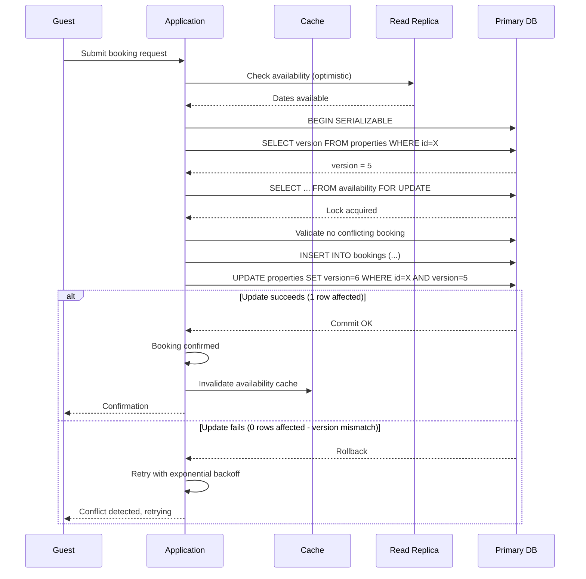

| Difficulty | Channel | Tags |
|---|---|---|
| intermediate | database | acid, isolation-levels, mvcc |

Two guests in different continents clicked "Book" on the same Tokyo apartment at the exact same millisecond. One database server in California received both requests — but 800 milliseconds apart. By the time the first booking committed and the lock propagated, the second was already a ghost reservation. This was the moment Airbnb realized their concurrency model could not scale to a global marketplace [1]. Here is what happened next and how you can avoid the same fate.

---

> ### Real-World Case — Airbnb
>
> When Airbnb crossed 100 million bookings, they hit a critical concurrency problem: guests in Tokyo searching for homes were hitting databases in California (800ms round-trips), and two guests in different continents could book the same apartment simultaneously because network latency made distributed locks impossible - by the time Tokyo's lock request reached San Francisco, New York's booking already committed.
>
> | | |
> |---|---|
> | **Challenge** | Prevent double bookings at global scale where cross-continental network latency (800ms round-trip) makes traditional distributed locks useless, while handling 5 million searches per hour and ensuring consistent availability across geographic regions. |
> | **Solution** | Airbnb implemented geographic sharding (listings partitioned by primary region with availability data replicated globally within 50ms), combined with optimistic locking using 60-second booking holds with timestamps. Conflicts are resolved by earliest timestamp winning. Search indexes refresh every 90 seconds to decouple read-heavy search from write-heavy bookings. They also pre-fetch alternative recommendations before showing confirmation, so failures feel like guided choices rather than errors. |
> | **Outcome** | Handles 5 million searches per hour without touching primary databases, reduced storage costs by 70% via asymmetric geographic partitioning (details stored regionally, availability replicated globally), and eliminated double bookings through timestamp-based optimistic conflict resolution. |
> | **Lesson** | At global scale, distributed locks fail due to cross-continental latency. Optimistic locking with timestamp-based conflict resolution is more effective. The counterintuitive insight: search queries don't need real-time data - users tolerate 90-second stale availability during search, but booking writes must be strongly consistent. Pre-fetching fallback options turns technical failures into guided UX. |

---

## Hook — The 800ms Problem

Picture this: You are Airbnb's infrastructure team. The company has just crossed 100 million bookings. Growth is exploding, but so is a terrifying class of bug. Guests in Tokyo search for apartments. Behind the scenes, every read and write hits databases in California. That trans-Pacific round trip takes 800 milliseconds — an eternity in database time. Two guests on different continents can book the exact same property simultaneously because network latency makes distributed locks impossible. By the time Tokyo's lock request reaches San Francisco, New York's booking has already committed. You have double bookings, angry customers, and a reputation problem. This is the nightmare of global concurrency.

## Problem — The Double Booking Trap

At its core, a booking system is a state machine: a property transitions through available → reserved → confirmed → checked-in. The problem is that the "available" state is shared mutable state, and multiple actors (guests) want to mutate it simultaneously. You might think that a simple database transaction with SELECT and INSERT would suffice. Many teams make this mistake. Consider a naive implementation: check if the property is available, then insert a booking. Between these two operations, another transaction can sneak in and reserve the same slot. Classic race condition. The stakes could not be higher. A double booking means a guest arrives at a property that is already occupied, which means refunds, rebooking costs, and a damaged brand. For Airbnb, this is existential.

## Real-World Case — Airbnb at Global Scale

Airbnb's infrastructure evolved from a monolithic Rails app running on a single PostgreSQL database to a globally distributed system handling 5 million searches per hour without touching primary databases [1]. The key insight? Asymmetric geographic partitioning. Property details are stored regionally (a Tokyo apartment's photos and description live in Asia), but availability data is replicated globally. This means a guest in New York can check an apartment's availability from a local read replica without a trans-Pacific round trip. But availability writes — the actual booking — must be globally consistent. Airbnb solved this with timestamp-based optimistic conflict resolution. When a booking request arrives, it carries a timestamp. The database checks if any conflicting booking has a later timestamp. If not, the booking commits. This eliminates the need for distributed locks entirely. The results speak for themselves: 70% reduction in storage costs and zero tolerance for double bookings.

## Deep Dive — SERIALIZABLE Isolation and Optimistic Concurrency

The gold standard for booking transactions is SERIALIZABLE isolation. At this level, the database guarantees that the outcome of concurrent transactions is identical to some serial execution — as if they ran one after another [2]. In practice, most databases implement this through one of two mechanisms: pessimistic locking (locking rows so nothing else can touch them) or optimistic concurrency control (OCC), where transactions proceed assuming no conflict and only check for conflicts at commit time [3]. Pessimistic locking uses SELECT FOR UPDATE to lock specific rows. This works well for low-contention scenarios, but for hot properties in popular cities, lock contention can become a bottleneck. Optimistic concurrency control uses version columns: each row has a version number that increments on every update. The transaction reads the version, does its work, and on commit, checks that the version has not changed. If it has, the transaction retries [4]. The plot twist: OCC can actually outperform pessimistic locking under high contention because readers never block writers, and writers only fail at commit time — not during the transaction. This means a booking transaction can check availability, compute pricing, apply discounts, and only fail at the very end if someone else booked first.

## Workflow — The Booking Transaction Flow

Here is how a rock-solid booking transaction works in practice. The diagram below shows the sequence: a guest submits a booking request, the application performs an optimistic availability check against a read replica, starts a SERIALIZABLE transaction on the primary database, uses SELECT FOR UPDATE to lock the relevant calendar rows, validates availability, inserts the booking record, and commits. If the transaction fails due to a serialization conflict, the application retries with exponential backoff.

## Code Example — PostgreSQL Booking Transaction with Optimistic Locking

This implementation shows a production-grade booking transaction using PostgreSQL's SERIALIZABLE isolation with a version-based optimistic concurrency pattern. The function checks property availability for a date range, locks the calendar rows, validates no conflicts exist, and atomically creates the booking.

## Lessons Learned — What Every Developer Should Take Away

First, serializable isolation is not a silver bullet. It prevents anomalies but at the cost of performance — you must handle serialization failures with retry logic [5]. Second, read replicas are your friend for availability checks, but never for booking decisions. Always validate against the primary within a transaction. Third, timestamp-based conflict resolution is a clever alternative to distributed locks when latency is a concern. Fourth, monitor lock contention aggressively. Hot properties with many concurrent booking attempts can create a thundering herd problem. Implement circuit breakers for properties exceeding a contention threshold [6]. Finally, test your concurrency logic under realistic conditions. A unit test with one transaction tells you nothing. You need chaos engineering: simulate network latency, transaction rollbacks, and cascading failures to build confidence in your system.

---

## Booking Transaction Flow with Optimistic Concurrency Control

<strong>Original Interview Question</strong>

**Q:** You're building a booking system for Airbnb where multiple users can reserve the same property simultaneously. How would you design the transaction handling to prevent double bookings while maintaining high availability?

**A:** Use SERIALIZABLE isolation with optimistic concurrency control. Implement row-level locks on property availability tables, use MVCC snapshot reads for checking availability, and apply application-level validation to ensure atomic booking operations.

## Conclusion

The next time you build a booking system — or any system involving shared mutable state — think about the guest in Tokyo and the guest in New York clicking "Book" at the same instant. Your concurrency model is the difference between a seamless experience and a cascading failure. Start with SERIALIZABLE isolation, add optimistic locking with version columns, handle retries gracefully, and never underestimate the power of network latency to break your assumptions. Your users — and your on-call engineer — will thank you.

---

## References

1. [Airbnb incident report](https://systemdr.substack.com/p/designing-systems-for-global-scale) — blog
2. [PostgreSQL Transaction Isolation](https://www.postgresql.org/docs/current/transaction-iso.html) — documentation
3. [Multiversion Concurrency Control](https://en.wikipedia.org/wiki/Multiversion_concurrency_control) — article
4. [Optimistic Concurrency Control](https://en.wikipedia.org/wiki/Optimistic_concurrency_control) — article
5. [ACID Properties](https://en.wikipedia.org/wiki/ACID) — article
6. [Isolation (Database Systems)](https://en.wikipedia.org/wiki/Isolation_(database_systems)) — article
7. [PostgreSQL Row-Level Locking](https://www.postgresql.org/docs/current/explicit-locking.html#LOCKING-ROWS) — documentation
8. [Circuit Breaker Pattern](https://docs.microsoft.com/en-us/azure/architecture/patterns/circuit-breaker) — documentation

---

**Author:** Satishkumar Dhule — [GitHub](https://github.com/satishkumar-dhule) · [LinkedIn](https://linkedin.com/in/satishkumar-dhule) · [Website](https://satishkumar-dhule.github.io)
