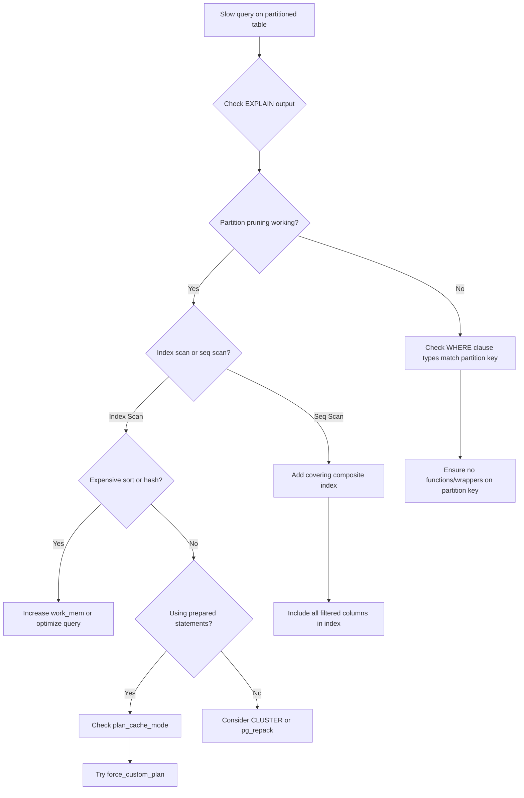

| Difficulty | Channel | Tags |
|---|---|---|
| intermediate | database | explain, query-plan, partitioning |

It was the second time that week. Prefect Cloud's database crashed with an out-of-memory error, taking their API down with it. Their fastest-growing Postgres table had ballooned to 400 million rows — projected to hit a billion — and the partitioning strategy they had carefully implemented was supposed to fix everything. Instead, it nearly broke them [1]. This is the story of why partitioning alone is never enough, and how a single overlooked Postgres setting secretly ruins query performance at scale.

---

> ### Real-World Case — Prefect
>
> Prefect Cloud was doubling traffic every ~2 months. Their fastest-growing Postgres table had 400M rows (projected to hit 1B). They introduced table partitioning to handle scale, but instead of improving, the database started crashing with out-of-memory (OOM) events at 90%+ memory utilization — twice in one week.
>
> | | |
> |---|---|
> | **Challenge** | Why did partitioning a 400M-row table cause two OOM database restarts in a week, when partitioning was supposed to reduce memory pressure? The team couldn't explain why memory correlated with connection count, and standard tuning (shared_buffers, work_mem, connection reduction) barely helped. |
> | **Solution** | They discovered that the asyncpg driver prepares every SQL statement. After seeing the same prepared statement 5 times, Postgres creates a 'generic plan' that caches for future reuse. Generic plans for partitioned tables cannot do partition pruning (no parameter values at plan time), so they lock ALL partitions — consuming enormous memory. Accidentally, enabling SQLAlchemy tracing (which adds a unique comment like /*traceparent=...*/ to every query) acted as a cache-buster, preventing generic plans. The real fix was setting `plan_cache_mode=force_custom_plan`, forcing Postgres to always create custom plans that prune partitions properly. |
> | **Outcome** | Memory utilization dropped dramatically from near-OOM levels to a healthy baseline. API latency improved significantly. The database stabilized immediately after setting `plan_cache_mode=force_custom_plan`. The single-line config change freed ~100GB of memory and eliminated the OOM crashes. |
> | **Lesson** | Generic plans in Postgres are disastrous for queries over partitioned tables — they skip partition pruning entirely and lock every partition. When using prepared statements (common with asyncpg/SQLAlchemy) on partitioned tables, `plan_cache_mode=force_custom_plan` is essential. Also, observability tools aren't passive participants — they can accidentally mask or fix production issues by altering query patterns. |

---

## Hook — When Your Database is Doubling Every Two Months

Every engineer knows the feeling: your service is growing fast, and that is a good problem to have — until your database disagrees. Prefect Cloud was doubling traffic every ~2 months. Their usage table hit 400M rows and kept accelerating. The engineering team did what the textbooks recommend: they introduced table partitioning. But here is where the story takes an unexpected turn. Instead of stabilizing, the database started crashing with OOM (out-of-memory) events at 90%+ memory utilization. Twice in one week. Sound familiar? You have probably been told that partitioning is the answer to large-table performance. And it is — but only if you understand the hidden assumptions behind how Postgres handles query plans. Because partitioning without careful query planning is like adding more lanes to a highway without fixing the off-ramps. The traffic has to go somewhere.

## Problem — The 100M Row Query That Should Be Fast But Isn't

So you have a partitioned table with 100 million rows. You filter by a specific date range. The query should scan only the relevant partitions and return quickly. Yet somehow, you are sitting there watching `EXPLAIN ANALYZE` output that makes no sense. Why is Postgres scanning every partition? Why is it doing a sequential scan on a 50GB table? Why did that sort operation eat 16GB of memory? These questions are hauntingly common. Many developers assume that partitioning is a performance silver bullet. In reality, it introduces a whole new class of problems. The most common culprit: the partition planner does not always prune partitions the way you expect. If your query uses functions, type casts, or even slightly different column types, Postgres may decide to scan every single partition anyway. Another stealthy problem: cached generic plans. When you use prepared statements — and you should, for safety and performance — Postgres optimizes the query plan once and reuses it. But a generic plan that works for a broad query can be terrible for a specific date-range query. This is exactly what bit Prefect.

## Real-World Case — Prefect Cloud's 400M Row Nightmare

Back to Prefect. Their usage_events table was their fastest-growing table — 400M rows and climbing toward 1B. They added partitioning. The database got worse. Here is what happened: Partitioning itself was working. But Prefect used prepared statements for their queries, and Postgres was caching a generic plan that did not prune partitions effectively. Every query planned as though it might scan everything, and that plan — with its enormous sort and hash operations — was cached and reused. The result? Each query consumed far more memory than necessary, and at their traffic volume, memory utilization spiraled past 90%. The fix? A single configuration change: `plan_cache_mode = force_custom_plan`. This tells Postgres to generate a fresh plan for each execution, tailored to the specific parameter values. The impact was staggering. Memory utilization dropped dramatically from near-OOM levels to a healthy baseline. API latency improved significantly. That one-line config change freed roughly 100GB of memory and eliminated the OOM crashes entirely [1]. If you are storing these details away for the future, you are not alone — this pattern is far more common than most teams realize.

## Deep Dive — EXPLAIN Plans, Partition Pruning, and the Generic Plan Trap

To understand what went wrong, you need to understand how Postgres actually executes a query on a partitioned table. When you write: `SELECT * FROM events WHERE event_date BETWEEN '2024-01-01' AND '2024-01-31' AND status = 'completed'`, Postgres should ideally:

1. Prune partitions that do not contain January 2024 data
2. Scan only the relevant partition(s) using an index on (event_date, status)
3. Return the filtered rows

But here is where things break down. Partition pruning happens at planning time, not execution time. If the planner cannot determine the partition key value at plan time — because it is a parameter in a prepared statement — it falls back to scanning all partitions [2]. This is the generic plan trap: Postgres creates a plan that works for any parameter value, but is optimal for none.

Moreover, even when pruning works, you need to check for these red flags in your EXPLAIN output:

- **Seq Scan on multiple partitions**: Partition pruning is not working — check your WHERE clause types
- **Sort Method: external merge**: The sort spilled to disk, meaning work_mem is too small
- **HashAggregate using a large number of batches**: Memory pressure during aggregation
- **Lossy bitmap scans**: The bitmap is overflowing, suggesting poor index selectivity [3]

The solution is multi-layered. First, verify partition pruning is happening by checking that the EXPLAIN output only shows a subset of partitions. Second, use composite indexes that match your filter pattern — for example, `CREATE INDEX ON events (event_date, status)` instead of separate indexes. Third, and this is the part most people miss: consider `plan_cache_mode` when using prepared statements on partitioned tables [4].

## Workflow — Diagnosing and Fixing Slow Partitioned Queries

When a partitioned query is slow, follow this diagnostic workflow:



This leads to a systematic approach. Start by running `EXPLAIN (ANALYZE, BUFFERS)` — the BUFFERS option shows how much data was read from disk vs cache, which is critical for diagnosing I/O-bound queries. Then check the "Loops" count: if a partitioned scan shows multiple loops, you know pruning is not working [5]. If pruning looks correct but the query is still slow, the next question is whether the query planner has chosen a suboptimal access method. Sequential scans on a filtered subset often mean you are missing an index. But here is the counterintuitive part: sometimes adding an index can make things worse by confusing the planner, especially on partitioned tables where each partition maintains its own index.

## Code Example — An Expert-Level EXPLAIN Analysis

Let us walk through a real diagnostic session. You have a partitioned table and a query that should be fast but is not. Here is exactly how to investigate:

```sql
-- Step 1: Run EXPLAIN with ANALYZE and BUFFERS
-- BUFFERS shows cache hit ratio and I/O cost
EXPLAIN (ANALYZE, BUFFERS) 
SELECT * FROM events 
WHERE event_date BETWEEN '2024-01-01' AND '2024-01-31'
  AND status = 'completed';

-- If you see ALL partitions in the output, pruning is broken.
-- Check for type mismatches:
-- '2024-01-01' is a string literal, but event_date might be timestamptz.
-- Use explicit casts: event_date >= '2024-01-01'::timestamptz

-- Step 2: Add a composite index matching the filter pattern
-- This covers both the partition key and the additional filter
CREATE INDEX CONCURRENTLY idx_events_date_status 
ON events (event_date, status);

-- Step 3: If using prepared statements, check plan caching
-- SHOW plan_cache_mode; -- default is 'auto'
-- For partitioned tables with prepared statements:
SET plan_cache_mode = force_custom_plan;

-- Step 4: Consider clustering to physically order rows
-- This makes range scans much more efficient
CLUSTER events USING idx_events_date_status;

-- Verify: Run EXPLAIN again and compare
-- Look for: reduced loops, index-only scans, lower total costs
```

The key insight here is the order of operations. Notice that you first diagnose, then index, then fix the plan cache, then optimize physical layout. This order matters because each step informs the next. The composite index on (event_date, status) is critical because it can serve both the range filter and the equality check, allowing Postgres to do an index-only scan if all needed columns are in the index. The CLUSTER command physically reorders the table to match the index, which can dramatically reduce the number of pages read for range queries — sometimes by 10x or more [6]. But be careful: CLUSTER is an expensive operation that locks the table, so schedule it during maintenance windows or use pg_repack instead.

## Lessons Learned — What 400M Rows Taught Prefect (and the Rest of Us)

The Prefect incident teaches several hard-won lessons that apply to any team operating Postgres at scale:

**1. Partitioning is not a performance feature — it is a manageability feature.** The primary benefit of partitioning is being able to drop old data quickly (partition drop instead of DELETE) and parallelize scans. Do not expect it to automatically make queries faster. In fact, it can make them slower if you do not handle plan caching [1].

**2. Always verify partition pruning in EXPLAIN output.** Many developers add partitioning and never check that the planner is actually using it. Run EXPLAIN with a representative query and look for "Subplans Removed" or check that only relevant partitions appear. If you see all partitions, you have a problem [7].

**3. Composite indexes matter more on partitioned tables.** Because each partition has its own index, you want indexes that are narrow and targeted. A composite index on (partition_key, filter_column) allows each partition to be efficiently queried. Query planning also benefits because the planner sees fewer index options and makes better choices [8].

**4. `plan_cache_mode = force_custom_plan` is your friend for OLTP queries on partitioned tables.** Generic plans assume worst-case selectivity, which means they allocate memory for the largest possible sort or hash. Custom plans use actual parameter values, producing much more efficient execution. The CPU cost of replanning is negligible compared to the memory savings [4].

**5. Test with production-sized data.** A query plan that works on 1M rows can be catastrophic on 400M rows. Always validate EXPLAIN plans on data volumes that match your production workload.

**The bottom line:** Prefect saved ~100GB of memory with a single-line config change. That is the kind of win that does not require a rewrite, a migration, or a new database — just a deeper understanding of how Postgres actually works.

---

## Partitioned Query Diagnostic Flow


<details>
<summary><strong>Original Interview Question</strong></summary>

**Q:** You have a PostgreSQL table with 100M rows partitioned by date. A query filtering on a specific date range is still slow. What would you check in the EXPLAIN plan and how would you optimize it?

**A:** Check partition pruning effectiveness, index utilization patterns, and expensive sort operations. Create composite indexes on (date, filtered_columns) and evaluate clustering strategies for optimal data access.

</details>

## Conclusion

Next time you stare at an EXPLAIN plan wondering why your partitioned table query is scanning every partition, ask yourself two questions: Is partition pruning actually working? And am I being bitten by a cached generic plan? The answers will save you more than just memory — they will save you from the 3am pager call. Go check your plan_cache_mode today. It might be the easiest performance win you will get all year.

---

## References

1. [Prefect incident report](https://medium.com/the-prefect-blog/more-memory-more-problems-b182d7807e3c) — blog
2. [PostgreSQL Partition Pruning Documentation](https://www.postgresql.org/docs/current/ddl-partitioning.html#DDL-PARTITION-PRUNING) — documentation
3. [PostgreSQL Using EXPLAIN](https://www.postgresql.org/docs/current/using-explain.html) — documentation
4. [PostgreSQL Plan Cache Mode](https://www.postgresql.org/docs/current/runtime-config-query.html#GUC-PLAN-CACHE-MODE) — documentation
5. [PostgreSQL Performance Tips](https://wiki.postgresql.org/wiki/Performance_Optimization) — documentation
6. [PostgreSQL CLUSTER Command](https://www.postgresql.org/docs/current/sql-cluster.html) — documentation
7. [Table partitioning in PostgreSQL](https://www.digitalocean.com/community/tutorials/how-to-partition-tables-in-postgresql) — blog
8. [PostgreSQL Indexing Strategies](https://www.postgresql.org/docs/current/indexes-strategies.html) — documentation

---

**Author:** Satishkumar Dhule — [GitHub](https://github.com/satishkumar-dhule) · [LinkedIn](https://linkedin.com/in/satishkumar-dhule) · [Website](https://satishkumar-dhule.github.io)
