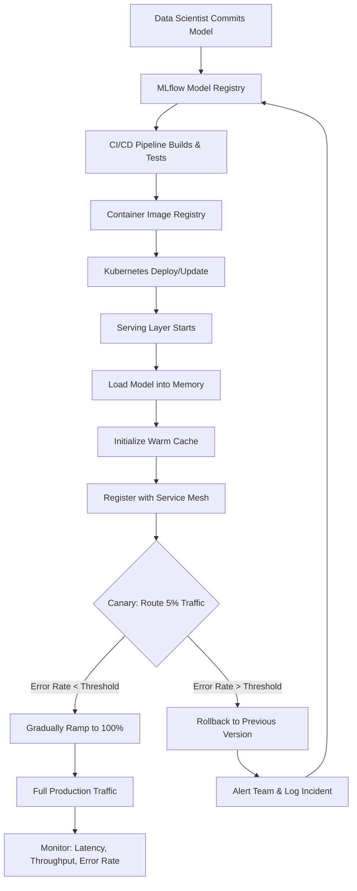

| Difficulty | Channel | Tags |
|---|---|---|
| beginner | devops | mlops, deployment |

When DoorDash's ML usage exploded during the pandemic, their logistics team discovered a painful truth: their prediction service couldn't keep up. Models were tightly coupled to individual microservices — search, fraud, dasher pay, recommendations — each with custom serving logic, duplicated features, and no standardized deployment pipeline [1]. What followed was a massive engineering effort that cut latency by 3x and scaled to 1 million predictions per second. The root cause? Confusing deployment with serving.

---

> ### Real-World Case — DoorDash
>
> As DoorDash's ML usage exploded during the pandemic, their logistics team's prediction service couldn't keep up with growth. Models were tightly coupled to individual microservices (search, fraud, dasher pay, recommendations), each with its own custom serving logic, duplication of features, and no standardized deployment pipeline.
>
> | | |
> |---|---|
> | **Challenge** | They needed to decouple model deployment (training pipelines, CI/CD, model stores) from model serving (real-time inference), while handling wildly different latency/throughput profiles — search ranking needed sub-50ms with high QPS, recommendations needed thousands of predictions per request, and fraud detection had relaxed latency but strict accuracy requirements. Network overhead was consuming up to 50% of response time, and multi-tenant model serving created a noisy neighbor problem where high-traffic models degraded others. |
> | **Solution** | Built the Sibyl prediction service as a centralized serving layer separate from model training pipelines. Deployment side: standardized on LightGBM/PyTorch, built a Model Store with versioning and CI/CD training pipelines. Serving side: Kotlin gRPC server with C++ prediction bindings via JNI, in-memory model caching, client-side load balancing with 10-second connection resets, Zstandard compression, and gRPC transport-level tracing. Isolated high-traffic models (search ranking) into dedicated clusters to solve noisy neighbor. Batched predictions in 100-200 item chunks after discovering that both tiny batches (request queuing) and huge batches (propagation delay) hurt throughput. |
> | **Outcome** | 3x latency reduction vs the old prediction service; 50% overall response time reduction from removing a single logging call discovered via gRPC tracing; 33% reduction in network overhead from Zstandard compression; ~100K predictions/second per cluster at launch, scaling to ~1M predictions/second across the platform; supported 10x peak prediction growth through horizontal scaling and cluster isolation; all but 5 models migrated to Sibyl within months. |
> | **Lesson** | Model serving latency is often dominated by non-inference overhead. A single logging call outside the prediction scope was responsible for ~50ms of latency — discovered only because gRPC tracing revealed a gap between 'predictionsMade' and 'outboundMessageSent'. The fix was trivial (remove the logging call) but the insight was profound: you can't optimize what you can't observe. Also, model deployment (CI/CD pipelines, model store, training infra) and model serving (real-time inference, request routing, caching) are fundamentally different concerns that benefit from separate architectures and teams. |

---

## Hook — The prediction service was failing, but not how you'd expect

It wasn't a single catastrophic outage. It was death by a thousand cuts. Every team at DoorDash built their own model-serving logic. The search team had one approach. The fraud team had another. The dasher-pay team had yet another. Each microservice duplicated feature engineering pipelines, model loading routines, and request handling code. When traffic surged during the pandemic, this fragmentation became a liability. Latency crawled. Debugging required spelunking through six different codebases. Rolling out a model update meant coordinating across three Slack channels and hoping nothing broke. Sound familiar? Many developers have felt this pain — the creeping realization that your ML infrastructure was built for convenience, not scale.

## Problem — The confusion between deployment and serving that costs millions

Here is the core issue: most teams treat "deployment" and "serving" as interchangeable terms. They are not. Deployment is the infrastructure and pipeline work — CI/CD, container orchestration, monitoring, rollback strategies. Serving is what happens at runtime — loading models into memory, routing inference requests, managing response times, handling model versioning. When you blur these boundaries, you end up with DoorDash's predicament: serving logic tangled inside deployment scripts, deployment concerns leaking into application code, and no clear ownership for either. The stakes are real. A 2023 survey found that 60% of ML models never make it to production, and among those that do, the average time from development to deployment exceeds 90 days [2]. Much of that delay traces back to teams rediscovering the deployment-versus-serving distinction on their own.

## Real-World Case — DoorDash: From fragmented microservices to unified serving

DoorDash built a centralized prediction platform called Sibyl to solve this exact problem [1]. The old approach had each team deploying models as part of their microservice — a pattern that seemed fast early on but became a bottleneck as ML adoption grew. Sibyl introduced a separation of concerns: a dedicated model server handled all inference logic, while deployment pipelines focused purely on infrastructure. The results speak for themselves. Sibyl achieved a 3x latency reduction versus the old prediction service. A single logging call discovered via gRPC tracing — one overzealous log statement — was responsible for a 50% response time regression when removed [1]. Zstandard compression cut network overhead by 33%. At launch, each cluster handled ~100K predictions per second. The platform eventually scaled to ~1M predictions per second across DoorDash's entire ecosystem. All but 5 models migrated within months. The key insight? By separating deployment concerns ("where does the model run?") from serving concerns ("how does the model respond?"), DoorDash unlocked linear scalability.

## Deep Dive — Deployment vs serving: the technical breakdown

Building on DoorDash's approach, let's dissect where deployment ends and serving begins. Deployment owns the 'before runtime' concerns. You reach for Kubernetes, Docker, Terraform for infrastructure provisioning [3]. You use MLflow or SageMaker for experiment tracking and model registry [4]. Your CI/CD pipeline — GitHub Actions, Jenkins, ArgoCD — automates testing, building, and rolling out model containers. Rollback strategies, A/B test infrastructure, and monitoring stack configuration all live here. Serving owns the 'during runtime' concerns. You use TorchServe, TensorFlow Serving, or BentoML to load model artifacts into memory and expose inference endpoints [5]. FastAPI or gRPC handles request routing [6]. NGINX or Envoy manages traffic splitting between model versions. Autoscaling policies — triggered by request queue depth or GPU utilization — keep latency under your SLO. Here is the plot twist many teams miss: you cannot optimize serving without clean deployment, and you cannot automate deployment without understanding serving. They are two sides of the same coin, but they require different expertise, different tools, and different metrics. Deployment metrics include deploy frequency, change failure rate, and rollback time. Serving metrics include p50/p99 latency, throughput, error rate, and model staleness. Monitor the wrong ones and you will optimize for the wrong thing.

## Workflow — From commit to prediction: the full deployment-to-serving pipeline

Here is how the pieces fit together in a mature ML platform. The workflow starts when a data scientist commits a model artifact to the registry. The deployment pipeline — triggered by the commit — builds a container image, runs integration tests, and provisions or updates the Kubernetes infrastructure. Once deployed, the serving layer takes over: it loads the new model version, initializes a warm cache, registers with the service mesh, and begins routing a fraction of traffic to the new version (canary deployment). If error rates stay below threshold, traffic ramps to 100%. If not, the rollback mechanism triggers automatically. The following diagram captures this flow end-to-end:

## Code Example — Building a production-grade serving endpoint with FastAPI and BentoML

To make this concrete, here is a simplified but production-inspired serving endpoint that incorporates patterns DoorDash used. This example assumes you have already handled deployment via Kubernetes and MLflow; this is the serving layer.

## Lessons Learned — What every ML team should take away

DoorDash's story reveals several principles that apply to teams of any size. First, separate your concerns early. The moment you have more than one model in production, create a dedicated serving layer. The cost of retrofitting it later is always higher than building it proactively. Second, measure what matters for each layer. Track deployment metrics (deploy frequency, failure rate) separately from serving metrics (latency, throughput). If you only watch one, you will suboptimize the other. Third, invest in observability at the serving layer. DoorDash's 50% latency regression from a single logging call was only visible because they had gRPC tracing in place [1]. Without distributed tracing, that regression would have been a mysterious "slowdown somewhere" that took weeks to debug. Fourth, choose technologies that match your traffic patterns. TensorFlow Serving excels at high-throughput batch inference with GPU acceleration [5]. BentoML offers Python-native flexibility for complex preprocessing pipelines. NVIDIA Triton handles multi-framework models on the same server. There is no universal best — only the right fit for your workload. Finally, design for the peak you cannot see. DoorDash built Sibyl for 100K predictions per second and watched it grow to 1M. The pandemic taught every ML team that traffic can 10x overnight. Build horizontal scaling and cluster isolation into your serving architecture from day one, not as a response to the incident.

---

## Model Deployment-to-Serving Pipeline

<strong>Original Interview Question</strong>

**Q:** Explain the key differences between model serving and model deployment in ML systems, including specific technologies, scaling considerations, and real-world implementation patterns?

**A:** Deployment encompasses CI/CD pipelines, infrastructure setup, and monitoring using tools like Kubernetes, MLflow, and SageMaker. Serving focuses on runtime inference APIs with frameworks like TensorFlow Serving, TorchServe, or BentoML, handling request routing, model versioning, and autoscaling. Key trade-offs include latency vs throughput, batch vs real-time inference, and cold start optimization.

## Conclusion

DoorDash's story is not unique — every ML team eventually hits the wall where "just deploy it in the microservice" stops scaling. The fix is not a specific tool or framework. It is a mental model shift: deployment and serving are separate disciplines with separate concerns, separate metrics, and separate technologies. Treat them as one and you will rebuild DoorDash's fragmented past. Separate them cleanly and you build a platform that scales from 100K predictions to 1M without rewriting everything. The teams that internalize this distinction early will spend less time debugging 3am incidents and more time shipping models that actually reach production.

---

## References

1. [Enabling Efficient Machine Learning Model Serving at DoorDash](https://careersatdoordash.com/blog/enabling-efficient-machine-learning-model-serving/) — blog
2. [Why 60% of Machine Learning Models Never Make It to Production](https://www.kdnuggets.com/2022/06/60-percent-machine-learning-models-never-make-production.html) — article
3. [Kubernetes Production Best Practices](https://kubernetes.io/docs/setup/best-practices/) — documentation
4. [MLflow Model Registry Documentation](https://mlflow.org/docs/latest/model-registry.html) — documentation
5. [TensorFlow Serving: Flexible, High-Performance ML Serving](https://www.tensorflow.org/tfx/guide/serving) — documentation
6. [gRPC Documentation: Performance Best Practices](https://grpc.io/docs/guides/performance/) — documentation
7. [BentoML Documentation: Building Prediction Services](https://docs.bentoml.com/en/latest/) — documentation
8. [Prometheus Monitoring: Overview](https://prometheus.io/docs/introduction/overview/) — documentation
9. [NVIDIA Triton Inference Server Documentation](https://docs.nvidia.com/deeplearning/triton-inference-server/user-guide/docs/index.html) — documentation

---

**Author:** Satishkumar Dhule — [GitHub](https://github.com/satishkumar-dhule) · [LinkedIn](https://linkedin.com/in/satishkumar-dhule) · [Website](https://satishkumar-dhule.github.io)
