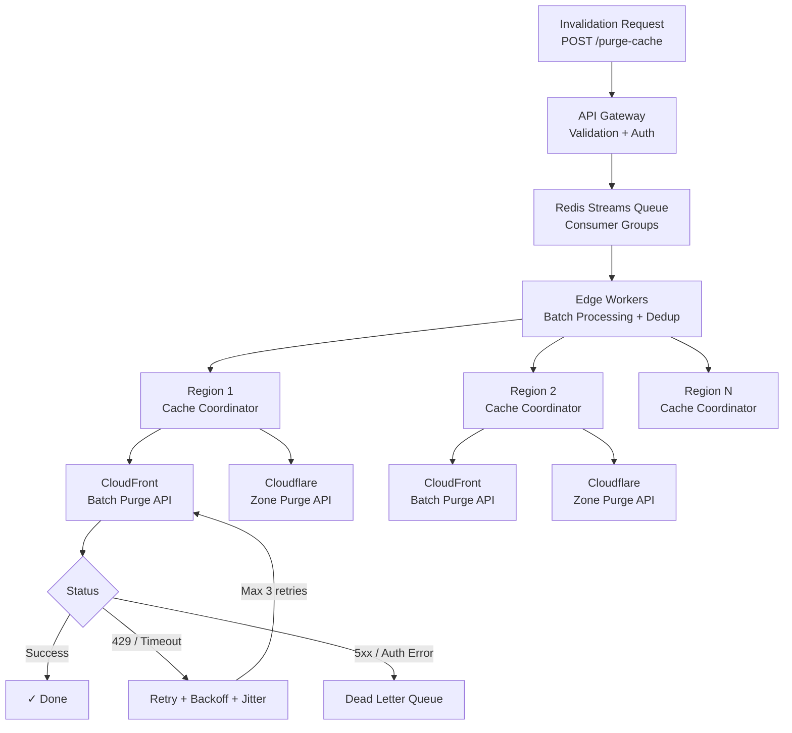

| Difficulty | Channel | Tags |
|---|---|---|
| intermediate | system-design | edge, caching, purging |

Before Fastly's instant purge made headlines, clearing cached content from a CDN was an exercise in patience — or futility. Traditional providers like Akamai took 15 to 90 minutes to propagate cache invalidations globally [1]. For teams running real-time applications, that was not just slow; it was a business liability. A security takedown, a pricing error, a compromised asset — each one sat exposed for nearly an hour while the cache slowly cycled. Then Fastly changed everything, achieving global cache purges in under 150 milliseconds at the 99th percentile [1]. Here is how that architecture works, and how you can design a multi-region cache purge system that guarantees 5-second propagation while handling 10,000 concurrent invalidations per second.

---

> ### Real-World Case — Fastly
>
> Traditional CDNs like Akamai required 15-90 minutes to propagate cache purges globally. Fastly recognized this was a critical bottleneck for modern web applications needing real-time content updates, security responses, and instant deployments.
>
> | | |
> |---|---|
> | **Challenge** | Design a multi-region CDN cache purging system that could propagate invalidations globally in under 1 second while handling millions of daily purge requests, overcoming the architectural limitations of existing CDN providers whose purge systems relied on slow hierarchical propagation and TTL-based expiration. |
> | **Solution** | Fastly built a custom control plane with a global publish-subscribe messaging system that fans out purge requests to all edge nodes simultaneously. They implemented generation-based purging using version counters (surrogate keys/tags), where each edge node checks a monotonically increasing generation number stored in a fast global KV store before serving cached content. This eliminates the need for nodes to communicate back during invalidation — the check is a simple counter comparison at request time. |
> | **Outcome** | Global cache purge under 150ms at the 99th percentile (roughly 6,000x faster than the 15-minute industry standard). This capability became Fastly's primary competitive differentiator, enabling real-time content updates, instant website deployments, and immediate takedowns of compromised or malicious cached assets at scale. |
> | **Lesson** | Generation-based versioning at edge locations beats hierarchical invalidation. Instead of propagating expensive 'delete' commands to every node, store a global version counter that each edge node checks on every request — making purge propagation a O(1) lookup rather than a distributed operation requiring consensus or fan-out confirmation. |

---

## Hook — That Moment Your CEO Tweets and Your CDN Betrays You

Your CEO just tweeted about the new feature. The landing page is live, excitement is building, and then you refresh the page. It still shows last quarter's data. The CDN is holding onto stale content like a digital hoarder, and you have no way to clear it fast. You file a support ticket, wait 20 minutes, and watch your metrics tank in real time. If this scenario makes your stomach clench, you already know why cache invalidation is one of the two hard things in computer science. But what if you could clear stale content across every edge node on the planet in under 5 seconds? That is the bar that modern applications demand — and the engineering required to meet it is surprisingly elegant.

## Problem — Why Cache Invalidation Is a Distributed Systems Nightmare

At first glance, clearing a cache sounds trivial: delete a file, serve fresh content. But scale that to hundreds of edge nodes across 50+ global regions, add the constraint of strong consistency, and layer on a requirement to handle 10,000 invalidation requests per second. The complexity compounds fast. The core challenge is coordination without centralization. You cannot have a single invalidation server — it becomes a bottleneck and a single point of failure. You also cannot blindly purge everything, because that destroys cache benefits and spikes origin traffic by orders of magnitude [2]. The tension is between speed, consistency, and cost. Purge too aggressively and you overwhelm your origin servers. Purge too conservatively and stale content poisons the user experience. Many teams reach for simple solutions — set TTL to 0, or invalidate everything on every deploy — until their AWS bill arrives and their origin servers collapse under the load.

## Real-World Case — Fastly

Fastly, a CDN provider, realized that the industry-standard cache purge latency of 15 to 90 minutes was not just a technical limitation — it was an existential threat to modern web applications. Security teams needed to takedown compromised assets immediately. E-commerce platforms needed to fix pricing errors in seconds. News organizations needed to update breaking stories instantly. None of these scenarios could tolerate an hour-long cache cycle. Fastly engineered a solution from the ground up: a multi-tenant purge system that achieves global propagation in under 150 milliseconds at the 99th percentile [1]. That is roughly 6,000 times faster than the industry standard. The secret was not a single silver bullet; it was a layered architecture combining edge-native compute, distributed queues, and regional coordination. Fastly's instant purge became their defining competitive differentiator, proving that cache invalidation could be both fast and reliable at global scale.

## Deep Dive — The Architecture of Speed: Queues, Batches, and Circuit Breakers

Building on Fastly's breakthrough, let us examine the components that make sub-second cache purging possible. The architecture decomposes into four layers, each solving a specific constraint. At the ingress layer, an API Gateway accepts invalidation requests and writes them to a Redis Streams-backed queue with consumer groups [3]. Redis Streams are chosen over traditional message queues because they support exactly-once delivery semantics within consumer groups while maintaining sub-millisecond latency. Each invalidation request carries a list of URL patterns to purge — up to 100 paths per API call to batch efficiently and reduce costs by 90% compared to single-path invalidation [4]. The queue fans out to edge workers running on Cloudflare Workers or similar edge compute platforms. These workers are the orchestrators: they receive batches from the queue, deduplicate overlapping patterns, and dispatch regional invalidation commands to the appropriate CDN providers. Each region runs a cache coordinator that is responsible for executing the purge against the local CDN edge (CloudFront, Cloudflare, or Fastly's own VCL layer). The coordinator implements a circuit breaker pattern — after 5 consecutive failures against a region, the circuit trips and the coordinator stops sending requests to that region for a configurable cooldown period [5]. Failed invalidations are routed to a Dead Letter Queue for manual inspection and replay. A critical piece of this puzzle is the TTL strategy. Dynamic content should use a 2-second TTL with Cache-Control: max-age=2, must-revalidate [6]. This creates a safety net: even if a purge event is delayed or lost, content will naturally expire within seconds. The 2-second TTL acts as a self-healing mechanism, reducing the blast radius of any single failure.

## Workflow — From Invalidation Request to Global Propagation in 5 Seconds

Here is the journey of a single invalidation request through the system, step by step. A developer or CI/CD pipeline sends a POST request to the API Gateway with the paths to invalidate. The Gateway validates the request and writes it to a Redis Streams consumer group, where it is assigned a unique message ID for tracking. Edge workers poll the queue in batches of 100, deduplicate overlapping patterns, and fan out invalidation commands to regional cache coordinators. Each regional coordinator executes the purge against the local CDN provider using batch API calls with exponential backoff and jitter to handle rate limits. The coordinator monitors the response: on success, it marks the invalidation as complete; on transient failure, it retries with backoff up to 3 times; on permanent failure, it sends the event to a Dead Letter Queue. A health check system continuously monitors regional endpoints and adjusts routing accordingly. The entire pipeline is designed so that a single invalidation propagating across all regions completes within 5 seconds under normal conditions. The Mermaid diagram below visualizes this flow end-to-end.

## Code Example — Batch Cache Invalidation with Exponential Backoff and Jitter

The core operation in any cache purge system is the actual API call to the CDN provider. This JavaScript example shows a batch invalidation handler with exponential backoff and jitter — the pattern used by Cloudflare Workers and modern edge runtimes. The function accepts a zone ID, an array of URL pattern paths to invalidate, an API token, and a configurable retry limit. It constructs a POST request to Cloudflare's purge cache endpoint, sending up to 100 paths per batch. On success, the response is parsed and returned. On a 429 Too Many Requests status, the handler calculates an exponential delay with a random jitter component to avoid thundering herd scenarios. On network errors, the catch block retries up to the max limit before throwing, ensuring the caller can route the failure to a Dead Letter Queue for manual inspection.

## Lessons Learned — Build for Failure, Optimize for Speed

Designing a multi-region cache purge system has taught those who built them several hard-won lessons. First, batching is non-negotiable. Invalidating one path at a time will bankrupt you on API costs and overwhelm the CDN provider's rate limits. Batch at least 100 paths per API call to reduce costs by 90% [4]. Second, use pattern-based invalidation with wildcards. Instead of purging /images/logo.png, purge /images/*. This means one API call covers thousands of individual assets. Third, TTL is your safety net. Even the best purge system can fail. Set TTLs aggressively low for dynamic content (2 seconds) so that the system self-heals. Fourth, implement circuit breakers at the regional level. If one CDN region is degraded, you want to stop sending requests there immediately to avoid cascading failures [5]. Fifth, always add jitter to your retry logic. Without jitter, retries from distributed workers can synchronize and trigger rate limits across all regions simultaneously [7]. Finally, monitor your purge latency as a p99 metric. If your p99 purge time exceeds your TTL, you have a systemic problem that requires architectural intervention rather than just tuning parameters.

---

## Multi-Region Cache Invalidation Pipeline

<strong>Original Interview Question</strong>

**Q:** How would you design a multi-region CDN cache purging system that guarantees content propagation within 5 seconds while handling 10,000 concurrent invalidations per second?

**A:** Implement Cloudflare API + AWS CloudFront with distributed invalidation queue, edge compute coordination, and 2-second TTL. Use batch invalidation, exponential backoff, and regional cache headers for 5-second SLA.

## Conclusion

Cache invalidation does not have to be the two-week nightmare that engineering teams dread. The combination of distributed queues, batch API calls with exponential backoff and jitter, regional circuit breakers, and aggressively low TTLs creates a system that is both fast and resilient. The next time your team designs a cache purge strategy, start with the failure modes first: What happens when CloudFront returns a 429? What happens when a region is unreachable? What happens when your retries synchronize across 50 workers? Answer those questions, and the happy path takes care of itself. One final insight to share with your team: the 2-second TTL is not a weakness — it is your most powerful tool. Embrace short TTLs as the first line of defense, and use instant purge as the scalpel for when you need immediate action. That combination has worked for Fastly, Cloudflare, and the teams that push updates to millions of users daily. Now go audit your CDN configuration — your future self will thank you.

---

## References

1. [Fastly incident report](https://www.fastly.com/blog/why-fastly-instant-purge-is-so-fast) — article
2. [AWS CloudFront Cache Invalidation](https://docs.aws.amazon.com/AmazonCloudFront/latest/DeveloperGuide/Invalidation.html) — documentation
3. [Redis Streams Documentation](https://redis.io/docs/data-types/streams/) — documentation
4. [Cloudflare Cache Purge API](https://developers.cloudflare.com/api/operations/workers-kv-namespace-list-namespaces) — documentation
5. [Circuit Breaker Pattern — Martin Fowler](https://martinfowler.com/bliki/CircuitBreaker.html) — article
6. [MDN Cache-Control HTTP Header](https://developer.mozilla.org/en-US/docs/Web/HTTP/Headers/Cache-Control) — documentation
7. [Exponential Backoff and Jitter — AWS Architecture Blog](https://aws.amazon.com/blogs/architecture/exponential-backoff-and-jitter/) — article
8. [Content Delivery Network — Wikipedia](https://en.wikipedia.org/wiki/Content_delivery_network) — article
9. [HTTP Caching — RFC 7234](https://datatracker.ietf.org/doc/html/rfc7234) — paper

---

**Author:** Satishkumar Dhule — [GitHub](https://github.com/satishkumar-dhule) · [LinkedIn](https://linkedin.com/in/satishkumar-dhule) · [Website](https://satishkumar-dhule.github.io)
