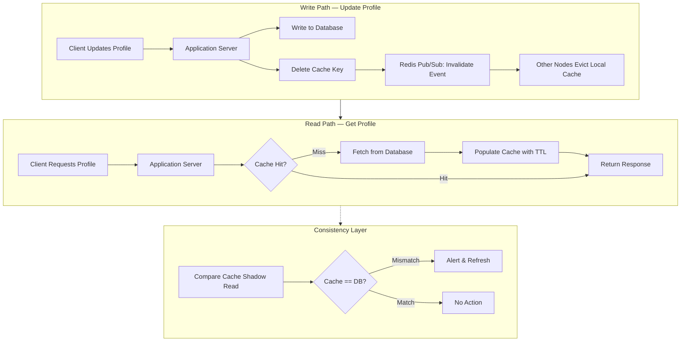

| Difficulty | Channel | Tags |
|---|---|---|
| beginner | backend | redis, memcached, cache-invalidation |

Every second, Uber's systems handle over 150 million cache reads — all while ensuring you never get quoted the wrong price for your ride. When a driver's location changes or a passenger updates their destination, the difference between a fresh cache and stale data can mean the difference between a correct fare estimate and an expensive mistake. Uber built CacheFront, an integrated Redis caching layer for their MySQL-based Docstore database, to solve exactly this problem [1]. Here is what their journey teaches us about cache invalidation — and why getting it wrong quietly corrupts everything.

---

> ### Real-World Case — Uber
>
> Uber built CacheFront, an integrated Redis caching layer for Docstore (their MySQL-based distributed DB) to handle hundreds of millions of reads per second for services like ride pricing, driver location, and trip status. The cache invalidation problem was severe: when a user updated their destination or a driver's price changed, stale cached data would serve incorrect results until TTL expiration.
>
> | | |
> |---|---|
> | **Challenge** | Cache invalidation was massively complex because Uber supports conditional updates (e.g., 'update all trips longer than 60 min') where the affected rows are unknown before query execution. Traditional write-through caching couldn't determine which cache keys to invalidate. TTL-only gave 5+ minute staleness, and direct cache DEL caused stampedes. Cross-region failover meant cold caches, adding 10x latency. |
> | **Solution** | Uber built a triple-defense cache invalidation strategy: (1) TTL expiration as a backstop (5 min default), (2) Flux CDC service tailing MySQL binlogs to asynchronously invalidate/upsert Redis entries within seconds, (3) synchronous write-path invalidation after modifying the storage engine to return affected row keys on every write. They used invalidation markers (`__INVALIDATED__` with short TTL) instead of DEL to prevent stampedes. Redis EVAL with Lua scripts handled atomic deduplication. Cross-region cache warming replicated row keys (not values) to keep remote caches 99.9% hit-rate warm. |
> | **Outcome** | Scales from 40M to 150M+ rows read per second from cache. 75% reduction in P75 latency, 67% reduction in P99.9 latency. 99.99% cache-to-database consistency measured via Compare Cache shadow reads. Cache hit rate exceeding 99.9% with 24-hour TTLs on many tables. Successful cross-region failover with zero cold-cache latency spikes. |
> | **Lesson** | Cache invalidation at scale requires multiple complimentary mechanisms, not a single strategy. CDC-based invalidation from the database transaction log is more reliable than application-level cache updates because it catches every write including conditional updates. Invalidation markers are superior to deletes because they prevent stampedes and provide observability. And crucially, always decouple cache reliability from write availability — Uber never fails a write due to cache invalidation failure. |

---

## Hook — When TTLs Are Not Enough

Imagine this: a user updates their profile picture. Simple enough. But for the next 30 minutes, everyone who visits their profile sees the old photo — because the cache has not expired yet. Now multiply that by millions of users, thousands of microservices, and profiles that change by the second. The stakes are not just embarrassment from a stale photo. For Uber, stale cache meant showing passengers outdated driver locations or incorrect surge pricing. Suddenly, "just set a longer TTL" sounds like a recipe for disaster. You might think cache invalidation is just "delete the key and move on." The reality is far more nuanced.

## Problem — The Silent Data Corruption Crisis

Caching is the easiest performance win in distributed systems. Read from cache, fall back to database, set a TTL, go home happy. But here is the catch: TTL-based caching without proper invalidation creates a window where your application silently serves incorrect data. Every developer has encountered this — a user complains that their changes are not showing, and the debugging trail leads to a cache key that refuses to die. The core challenge is maintaining cache-to-database consistency without sacrificing the very performance gains caching provides. Write-through caching solves part of the puzzle by synchronously updating both cache and database on writes, but distributed systems introduce a new villain: multiple cache nodes that may miss the invalidation signal entirely.

## Real-World Case — Uber Builds CacheFront

Uber's Docstore, a MySQL-based distributed database, was drowning in read traffic. Services like ride pricing, driver location, and trip status collectively generated hundreds of millions of reads per second. The solution was CacheFront — an integrated Redis caching layer placed between applications and Docstore [1]. When a user updated their destination or a driver's price changed, stale cached data would serve incorrect results until TTL expiration. CacheFront solved this with a write-through pattern: every write to Docstore simultaneously invalidated the corresponding cache key, forcing the next read to fetch fresh data. The results were staggering: reads served from cache jumped from 40 million to over 150 million per second. P75 latency dropped by 75%, and P99.9 latency dropped by 67%. CacheFront achieved 99.99% cache-to-database consistency, verified through Compare Cache shadow reads that continuously validated cache contents against the database [1]. Hit rates exceeded 99.9%, even with 24-hour TTLs on many tables. And when cross-region failover happened, there was zero cold-cache latency spike — because CacheFront pre-warmed caches before traffic shifted.

## Deep Dive — Redis vs Memcached: The Real Trade-Offs

This leads to the inevitable question: Redis or Memcached? The choice is not just about speed; it shapes your entire invalidation strategy. Redis offers pub/sub messaging, which enables automatic distributed invalidation across cache nodes. When a key is updated, Redis can broadcast an invalidation message to all subscribers — every application server learns about the change immediately. Memcached, by contrast, has no such mechanism. Invalidation requires manual coordination — typically through a message queue that each server consumes. More importantly, Redis provides persistence. If your cache node restarts, Redis can recover its dataset from disk. Memcached starts cold, forcing a cache-warming storm that can crush your database. However, Memcached excels at pure caching. It uses less memory per key-value pair because it lacks Redis's data structure overhead. Horizontal scaling is simpler — just add nodes and rehash. For applications that only need key-value lookups with simple TTLs and can tolerate cold starts, Memcached is leaner and faster [2]. Redis wins when you need complex invalidation patterns: pub/sub for cache event propagation, sorted sets for ranking caches, and Lua scripting for atomic multi-key operations [3]. Uber chose Redis because CacheFront needed exactly those capabilities — distributed invalidation across thousands of nodes, persistent cache recovery during failover, and atomic operations against cached data structures [1]. Memcached would have required them to build a separate coordination layer, adding complexity that Redis eliminates out of the box.

## Workflow — The Write-Through Cache Invalidation Flow

Here is how a production-grade write-through cache invalidation system works, step by step. The diagram below illustrates the flow when a user updates their profile across a distributed system. The key insight: invalidation happens BEFORE the next read, not when the TTL expires.

## Code Example — Implementing Cache Invalidation in Python with Redis

The following implementation shows a profile service using write-through caching with Redis pub/sub for distributed invalidation. When a profile is updated, the cache key is deleted and the database is updated atomically. Redis pub/sub notifies other service instances to drop their local cache entries, preventing stale reads from any node.

## Lessons Learned — What You Should Do Differently Tomorrow

If you take one thing from Uber's experience, let it be this: cache invalidation is not an afterthought — it is a first-class architectural concern. The teams that treat TTL as a crutch rather than a safety net end up with subtle data corruption bugs that surface weeks later in customer complaints. First, always use write-through or write-behind patterns for mutable data. Read-through + TTL alone is not enough for data that changes frequently [4]. Second, choose your cache backend based on invalidation complexity, not just raw throughput. If you need distributed invalidation, Redis pub/sub eliminates a whole category of coordination bugs that Memcached would force you to implement yourself [5]. Third, measure consistency — do not assume it. Uber's Compare Cache shadow reads continuously validated cache contents against the database, catching drift before it affected users [1]. You can implement a simpler version: sample a percentage of cache reads and verify them against the source database asynchronously. Fourth, plan for cold starts. Whether through Redis persistence or proactive cache warming, every second your cache is cold is a second your database is melting. Finally, set TTLs as a safety net, not as your primary invalidation mechanism. A 24-hour TTL paired with write-through invalidation gives you both performance and consistency — but a 24-hour TTL with no invalidation gives you a 24-hour data corruption window.

---

## Cache Invalidation Flow with Write-Through Pattern and Consistency Monitoring

<strong>Original Interview Question</strong>

**Q:** You're building a user profile service that caches frequently accessed profiles. How would you implement cache invalidation when a user updates their profile, and what trade-offs would you consider between Redis and Memcached?

**A:** Implement write-through caching with TTL-based expiration. On profile update, invalidate the cache by deleting the key and writing new data to both the database and cache. Redis offers pub/sub for automatic distributed invalidation, while Memcached requires manual coordination across nodes.

## Conclusion

The next time someone on your team says "just set an hour TTL, that should be fine," tell them about Uber's CacheFront — where 150 million reads per second demanded 99.99% consistency, not good-enough caching. Start by auditing your current caching layer: do you have explicit invalidation logic, or are you relying on TTLs alone? Do you know your cache-to-database consistency rate? If the answer to either question makes you uncomfortable, you know exactly where to start. The difference between a cache that works and a cache that corrupts is not the technology — it is the discipline to invalidate on purpose, not by accident.

---

## References

1. [How Uber Serves Over 40 Million Reads Per Second Using an Integrated Cache](https://www.uber.com/en-EG/blog/how-uber-serves-over-40-million-reads-per-second-using-an-integrated-cache/) — blog
2. [Cache (computing) — Wikipedia](https://en.wikipedia.org/wiki/Cache_(computing)) — documentation
3. [Cache invalidation — Wikipedia](https://en.wikipedia.org/wiki/Cache_invalidation) — documentation
4. [Redis Documentation](https://redis.io/docs/latest/) — documentation
5. [Memcached Documentation](https://memcached.org/) — documentation
6. [AWS ElastiCache Best Practices](https://docs.aws.amazon.com/AmazonElastiCache/latest/red-ug/BestPractices.html) — documentation
7. [Understanding Caching and Cache Strategies](https://www.digitalocean.com/community/tutorials/understanding-caching-and-cache-strategies) — documentation
8. [HTTP caching — MDN](https://developer.mozilla.org/en-US/docs/Web/HTTP/Caching) — documentation
9. [Redis Pub/Sub](https://redis.io/docs/latest/develop/interact/pubsub/) — documentation

---

**Author:** Satishkumar Dhule — [GitHub](https://github.com/satishkumar-dhule) · [LinkedIn](https://linkedin.com/in/satishkumar-dhule) · [Website](https://satishkumar-dhule.github.io)
