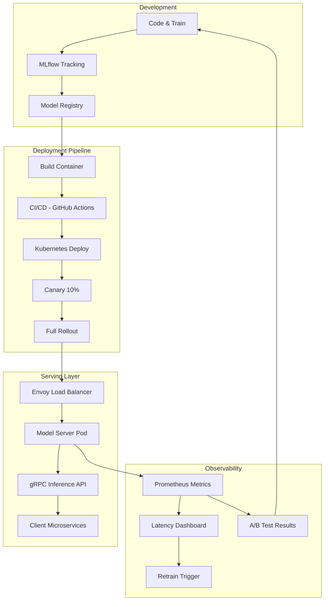

| Difficulty | Channel | Tags |
|---|---|---|
| beginner | devops | mlops, deployment |

What if you trained the perfect model, deployed it to production, and then watched it fail — not because the predictions were wrong, but because the infrastructure couldn't route traffic fast enough? That is the reality Netflix faced at hyperscale. With 250M+ users and hundreds of ML models handling everything from recommendations to artwork personalization, Netflix discovered that traditional API gateways simply could not keep up with ML-specific routing demands [1]. Their experience reveals a crucial distinction that many teams overlook: deploying a model and serving a model are two fundamentally different challenges.

---

> ### Real-World Case — Netflix
>
> Netflix runs hundreds of ML models (recommendations, search, fraud, artwork personalization) for 250M+ users, with their centralized serving platform handling 1M+ requests per second as of 2025. They found that off-the-shelf infrastructure like Envoy and AWS API Gateway couldn't handle ML-specific routing needs such as context-aware model selection, A/B testing across 10+ concurrent experiments per user, and canary deployments.
>
> | | |
> |---|---|
> | **Challenge** | The platform needed to route each request to the right model instance, on the right cluster shard, for the right user and use case, while keeping client services completely agnostic to model versioning and deployment topology. Generic HTTP routing tools lacked the ability to make per-request model selection decisions or enrich request bodies with A/B test parameters. |
> | **Solution** | Netflix built Switchboard, a custom model-aware routing proxy acting as a centralized entry point. When Switchboard's 10-20ms tail latency and single-point-of-failure risk became unacceptable, they evolved to a more sophisticated architecture: Lightbulb (a decoupled control-plane service that resolves routing metadata) + Envoy (which performs the actual data-plane routing using a routingKey header), cleanly separating deployment-config resolution from serving-path routing. |
> | **Outcome** | The system handles 1M+ requests/sec across hundreds of model types and versions with high availability. The separation of concerns lets researchers deploy and A/B test new model versions independently of serving infrastructure, while multiple client microservices get inference without knowing which model version or cluster shard they're hitting. The Lightbulb+Envoy architecture eliminated Switchboard's tail-latency bottleneck and single-point-of-failure risk. |
> | **Lesson** | Model serving and model deployment require fundamentally different abstractions — deployment is about version management, A/B configs, and lifecycle; serving is about low-latency request routing. Generic service mesh tools can't handle ML-specific routing needs, and a centralized proxy approach adds unacceptable latency at scale. The winning pattern is a lightweight control-plane that resolves deployment metadata, with routing pushed to the network proxy layer. |

---

## Hook — What Happens When the Training Pipeline Works But Production Falls Apart?

After months of data wrangling, feature engineering, and hyperparameter tuning, you finally have a model that crushes your offline metrics. You containerize it, push it to Kubernetes, and exhale. But then the latency SLAs start bleeding red. Requests time out. A/B test traffic bleeds into the wrong model versions. Your monitoring dashboard looks like a Jackson Pollock painting. You just discovered the hard truth: deployment gets your model into the cluster, but serving determines whether it survives contact with real users. Many teams conflate the two, and the result is a brittle system that works at 100 QPS but collapses at 10,000.

## Problem — The Great Conflation: Why Teams Confuse Deployment and Serving

Here is where things get tricky. Deployment and serving are deeply related, but they solve fundamentally different problems — and treating them as the same thing is where most production ML failures begin. Deployment encompasses everything needed to get a model artifact into a production environment: CI/CD pipelines that build and test container images, infrastructure-as-code tools like Terraform that provision clusters, model registries like MLflow that version artifacts, and rollback strategies when things go sideways. It is the "ship it" phase. Serving, on the other hand, is what happens in the milliseconds after a request arrives. It is about runtime inference APIs, request routing, model loading and unloading, response optimization, and handling the thundering herd of concurrent users. You can have the most sophisticated deployment pipeline in the world, but if your serving layer cannot route a request to the right model version in under 50ms, your users will feel every millisecond. The real problem? Most teams design these as a monolith, making it impossible to scale or debug independently.

## Real-World Case — Netflix's Routing Awakening

Netflix ran into this wall head-first. Their centralized ML serving platform processes over 1 million requests per second across hundreds of model types — recommendations, search ranking, fraud detection, artwork personalization [1]. Initially, they relied on a system called Switchboard, which handled routing but introduced a critical single point of failure and a tail-latency bottleneck that could cascade failures across the entire platform. Off-the-shelf solutions like Envoy and AWS API Gateway looked promising, but Netflix quickly discovered they could not handle ML-specific routing needs: context-aware model selection (picking the right model based on user attributes), A/B testing across 10 or more concurrent experiments per user, and canary deployments with fine-grained traffic splitting. Their solution was a two-layer architecture combining a custom Java service called Lightbulb with Envoy proxies. Lightbulb handles the ML-aware routing decisions — which model version, which experiment variant, which cluster shard — while Envoy handles the high-performance traffic forwarding. The result? Tail latency dropped. The single point of failure vanished. Researchers can now deploy and A/B test new model versions independently of the serving infrastructure, and client microservices get inference results without knowing which model version or cluster shard handled their request [1]. The separation of concerns eliminated Switchboard's bottleneck entirely.

## Deep Dive — Deployment vs. Serving: Two Worlds, One Pipeline

Building on Netflix's experience, let us examine the technical anatomy of each layer. Deployment is your "day 0" and "day 1" operations — the infrastructure setup, CI/CD, monitoring, and rollback strategies. It owns the lifecycle of the model artifact from your training script to the production cluster. The toolchain includes Kubernetes and Terraform for infrastructure [2], MLflow and SageMaker for experiment tracking and model registries [4][5], and GitHub Actions or Jenkins for CI/CD. Serving is your "day 2" operations — the runtime behavior when users hit your API. It owns request routing, model loading into memory, batching, response serialization, and autoscaling under load. The tech stack shifts to frameworks like TensorFlow Serving [3], TorchServe [6], BentoML [7], and FastAPI, with gRPC for efficient communication [8] and Envoy or NGINX for load balancing [9]. Here is the critical trade-off table that every team should internalize:

## Workflow — The End-to-End ML Serving Architecture

Understanding the theory is one thing. Seeing how these pieces fit together in a real architecture is where the transformation happens. The diagram below maps the full journey from model training to production inference, showing how deployment infrastructure feeds into the serving layer, and how observability loops back to inform both. Development starts with code and training, pushing artifacts to MLflow's model registry. The deployment pipeline picks up that registered model, builds a container, runs it through CI/CD, and deploys to Kubernetes with a canary rollout strategy (typically 10% traffic initially). Once the canary passes health checks, the serving layer takes over. Envoy load balancers route production traffic to model server pods, which expose gRPC inference APIs consumed by client microservices. Throughout this flow, Prometheus collects latency metrics, A/B test results, and error rates — feeding dashboards that tell you whether that new model version actually improved things or just added another alert to your pager. The beauty of this architecture is that each piece can be scaled, debugged, and deployed independently — exactly what Netflix learned the hard way.

## Code Example — Bridging Deployment and Serving with BentoML

Let us make this concrete with a Python example using MLflow for deployment and BentoML for serving — two tools that explicitly separate these concerns. The code shows the deployment side (model registration, containerization) and the serving side (model loading, inference API, request batching) in one unified workflow.

## Lessons Learned — What Every Team Should Take Away

Netflix's journey from Switchboard to Lightbulb+Envoy is not just a Netflix story — it is a pattern that applies at any scale. The moment your team starts running more than a handful of models in production, the separation of deployment and serving infrastructure becomes a necessity, not a luxury. First, design for independent scaling. Your deployment pipeline should be able to roll out a new model version without touching the serving infrastructure, and vice versa. Netflix achieved this with Lightbulb's routing layer decoupled from Envoy's forwarding layer. Second, plan for canary deployments and A/B testing from day one. Retrofitting experiment routing after your system is live is exponentially harder than building it in from the start. Third, monitor the right metrics — not just model accuracy (your business metric), but serving latency (your user experience metric), cold start frequency (your operational metric), and throughput (your capacity metric). Ignore any of these, and you are flying blind. Fourth, batch wisely but default to streaming. Batch inference is seductive because it maximizes GPU utilization, but every batch adds latency that compounds under load. The teams that get this right use adaptive batching — small batches for real-time recommendations, larger batches for offline scoring jobs. Finally, expect cold starts, and design for them. Models loaded at startup vs. models loaded on first request have wildly different latency profiles. Pre-warm your model servers, use model version pinning to avoid surprise downloads, and budget for the memory overhead of hosting multiple model versions for A/B comparisons.

---

## End-to-End ML Serving Architecture

<strong>Original Interview Question</strong>

**Q:** Explain the key differences between model serving and model deployment in ML systems, including specific technologies, scaling considerations, and real-world implementation patterns?

**A:** Deployment encompasses CI/CD pipelines, infrastructure setup, and monitoring using tools like Kubernetes, MLflow, and SageMaker. Serving focuses on runtime inference APIs with frameworks like TensorFlow Serving, TorchServe, or BentoML, handling request routing, model versioning, and autoscaling. Key trade-offs include latency vs throughput, batch vs real-time inference, and cold start optimization.

## Conclusion

Next time your team debates whether to pour more engineering hours into deployment infrastructure or serving optimization, remember Netflix's lesson: these are not competing priorities — they are complementary disciplines. Deployment without serving is a model sitting in a container doing nothing. Serving without deployment is a fragile script running on a laptop. The magic happens when you treat both with the same rigor, design your architecture so each layer can evolve independently, and build the observability to know which layer is actually causing that 3am pager storm. Start small: separate your model artifact pipeline from your inference server code. Add canary traffic splits before you need them. Measure cold starts before they become a crisis. The difference between a team that fumbles at 10K QPS and one that scales past 1M requests per second is not better models — it is better separation between deployment and serving.

---

## References

1. [Netflix Tech Blog — State of Routing in Model Serving](https://netflixtechblog.com/state-of-routing-in-model-serving-16e22fe18741) — blog
2. [Kubernetes Documentation — Concepts](https://kubernetes.io/docs/concepts/) — documentation
3. [TensorFlow Serving Documentation](https://www.tensorflow.org/tfx/guide/serving) — documentation
4. [MLflow Documentation — Model Registry](https://mlflow.org/docs/latest/model-registry.html) — documentation
5. [AWS SageMaker Documentation](https://docs.aws.amazon.com/sagemaker/) — documentation
6. [TorchServe — PyTorch Model Serving](https://pytorch.org/serve/) — documentation
7. [BentoML Documentation](https://docs.bentoml.com/) — documentation
8. [gRPC Documentation](https://grpc.io/docs/) — documentation
9. [Envoy Proxy Documentation](https://www.envoyproxy.io/docs) — documentation
10. [FastAPI Documentation](https://fastapi.tiangolo.com/) — documentation

---

**Author:** Satishkumar Dhule — [GitHub](https://github.com/satishkumar-dhule) · [LinkedIn](https://linkedin.com/in/satishkumar-dhule) · [Website](https://satishkumar-dhule.github.io)
