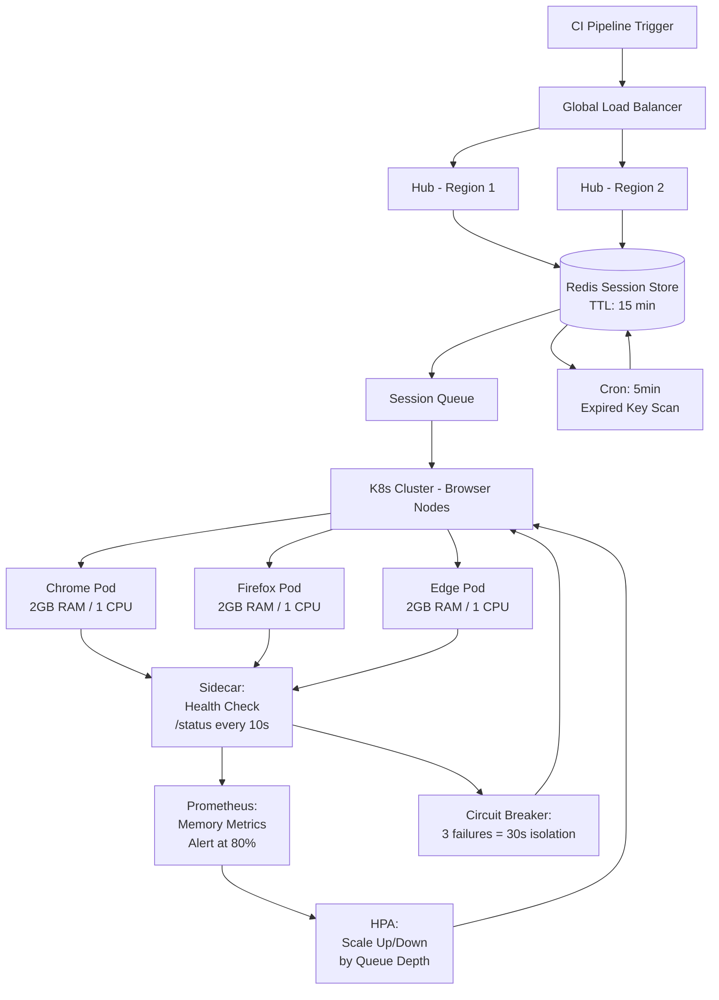

| Difficulty | Channel | Tags |
|---|---|---|
| advanced | system-design | selenium, webdriver, grid |

What if you could run 140,000 tests daily for what most companies spend on a single engineer's salary? That is not a hypothetical — it is exactly what Expedia Group achieved after overhauling their Selenium Grid architecture [1]. For most engineering teams, scaling browser automation beyond a handful of parallel sessions feels like trying to hold water in your hands: the more you add, the more leaks you find. Memory leaks from orphaned sessions, nodes that refuse to die, flaky tests that kill deployment velocity — the list goes on. But what if you could design a grid that handled 10,000 concurrent sessions with 99.9% uptime, zero memory leaks, and automatic failure recovery? This article walks through exactly that architecture, using Expedia's real-world journey as your guide.

---

> ### Real-World Case — Expedia Group
>
> Expedia Group's microservice architecture meant 100+ teams needed to run UI automation tests in their CI/CD pipelines. They were spending heavily on cross-browser testing services and managing hundreds of EC2 instances manually, with 2-4 minute node spin-up times slowing feedback loops.
>
> | | |
> |---|---|
> | **Challenge** | How to scale Selenium Grid across 100+ microservice teams running 140,000+ tests daily while minimizing cloud costs and keeping test feedback time under 5 minutes. |
> | **Solution** | Built DA-Kube: a Kubernetes-based Selenium Grid on EKS using Docker, Helm, and Traefik. Each microservice team gets on-demand, per-branch Selenium Grids that auto-scale via the Selenium Grid session queue. Used c5.xlarge instances running 15 browser sessions per node for optimal density, spot instances for cost savings, and Helm charts for instant grid creation/destruction per pre-merge pipeline. |
> | **Outcome** | Reduced testing costs from an estimated $2.41M/year (third-party vendor for 1000 parallel connections) to ~$80K/year — a 30x cost reduction. Achieved sub-5-minute test execution for 1000+ tests. Elimination of manual EC2 provisioning. 100+ hubs running 140,000+ tests daily with instant per-branch grid creation. |
> | **Lesson** | Running 15 browser sessions per instance (not 1 per instance) and using Kubernetes with event-driven scaling can reduce Selenium Grid costs by 30x while simultaneously improving test velocity. The counterintuitive insight: paying for larger instances with higher density is dramatically cheaper than scaling out with tiny instances. |

---

## Hook — The Test Infrastructure Tax Nobody Talks About

You have probably felt it: that sinking feeling when your CI pipeline takes 45 minutes because browser tests are queued behind hundreds of other sessions. Or the moment your team lead announces a $50,000 monthly bill for a cross-browser testing service and asks "any alternatives?" The truth is, testing at scale is a distributed systems problem pretending to be a QA problem. Every parallel browser session consumes CPU, RAM, and network resources. Every orphaned session leaks memory that accumulates until your nodes crash. And when you scale to 100+ microservice teams — each running their own test suites — the infrastructure demands snowball into a full-time operations role.

Many developers assume Selenium Grid "just works" out of the box. You spin up a hub, register a few nodes, and off you go. Then you hit 50 concurrent sessions. Then 200. Then suddenly you are debugging thread dumps at 2 AM while your deployment pipeline is burning. The problem is not Selenium — it is that traditional grid architectures treat nodes as pets, not cattle. When a node fails, you SSH in, restart it, and hope. When memory leaks accumulate over days, you schedule weekly maintenance windows. When you need more capacity, you file a ticket and wait.

## Problem — The Hidden Complexity of 10,000 Concurrent Sessions

Here is the ugly truth that most teams discover the hard way: scaling Selenium Grid is easy on paper and brutal in production. The moment you push past a few hundred concurrent sessions, three things go wrong simultaneously.

First, **memory leaks accumulate like technical debt**. Each Selenium session creates a browser process, and when a session terminates abnormally — test timeout, network blip, JVM crash — that browser process sometimes lingers. Over hours and days, zombie processes accumulate until your node runs out of memory and keels over. You restart it, and the clock starts ticking again.

Second, **node failures cascade**. When one node goes down, its queued sessions get redistributed to remaining nodes, increasing their load. Those nodes run hotter, crash sooner, and shift even more sessions onto the survivors. Within minutes, a single failure can domino into a full grid outage.

Third, **provisioning latency kills developer velocity**. Waiting 2-4 minutes for a fresh EC2 instance to boot every time a new test branch spins up does not sound terrible — until you multiply it by 100 teams running 10 builds a day. That is 500 minutes of collective wait time daily, just in infrastructure.

These are not theoretical problems. They are the exact challenges that drove Expedia Group to rethink their entire approach to browser automation [1].

## Real-World Case — Expedia Group's $2.41M Wake-Up Call

Expedia Group's engineering organization spans 100+ microservice teams, each shipping features that need thorough UI testing before hitting production [1]. Their original setup was not unusual: a third-party cross-browser testing vendor handling ~1000 parallel connections, supplemented by manually managed EC2 instances. The costs were staggering — an estimated $2.41 million per year for the vendor alone.

But money was only part of the story. Every time a developer pushed a new branch, they waited 2-4 minutes for EC2 nodes to spin up before tests could even start. Feedback loops stretched to hours. Teams started skipping tests to meet deployment deadlines — a dangerous tradeoff that eroded confidence in the pipeline.

Expedia's engineering team responded by building **Da Kube**: a Kubernetes-native Selenium Grid running on Docker containers, orchestrated with Helm, and load-balanced through Traefik [1]. The results were remarkable:

- **30x cost reduction**: From ~$2.41M/year to ~$80K/year
- **Sub-5-minute test execution**: For test suites of 1000+ tests
- **Instant provisioning**: Per-branch grids created in seconds, not minutes
- **Massive scale**: 100+ hubs running 140,000+ tests daily
- **Zero manual EC2 management**: Kubernetes auto-scaling handled everything

The key insight? They stopped treating Selenium nodes as persistent servers and started treating them as ephemeral containers — cattle, not pets. This shift unlocked a radically different architecture for managing test infrastructure at scale.

## Deep Dive — Anatomy of a Bulletproof Selenium Grid

Building on Expedia's success, let's break down the architectural decisions that make 10,000 concurrent sessions with 99.9% uptime achievable.

**The Hub-Node Pattern, Kubernetes-Style**

At its core, Selenium Grid follows a hub-and-spoke model: a central hub receives test requests and distributes them to registered browser nodes. The classic approach runs these as long-lived servers. The Kubernetes approach runs them as StatefulSets with auto-scaling across multiple availability zones [2].

```text
200 nodes × 50 sessions/node = 10,000 concurrent sessions
```

Each pod gets 2GB RAM and 1 CPU core — enough for a browser and test runner without wasteful over-provisioning. Horizontal Pod Autoscaling adjusts the node count based on queue depth, adding capacity when demand spikes and scaling down when things quiet down [6].

**Redis: The Session Lifecycle Backbone**

Memory leaks kill grid reliability. The solution is treating sessions as ephemeral resources with hard deadlines. A Redis cluster stores every session with a TTL (time-to-live) — typically 15 minutes [4]. If a session does not send a heartbeat within that window, Redis automatically expires it. A background worker scans for expired keys every 5 minutes and forcibly kills any orphaned browser processes.

This combination — TTL-based expiration plus periodic garbage collection — prevents the zombie process accumulation that plagues traditional grids.

**Circuit Breakers and Health Checks**

A single failing node should never take down your grid. Every node exposes an HTTP `/status` endpoint that the hub checks every 10 seconds [5]. If a node fails three consecutive checks, it enters a 30-second recovery window. During that time, the circuit breaker isolates it — no new sessions are routed to it, allowing it to recover without dragging down other nodes [7].

**Memory Pressure Monitoring**

Running out of memory is the #1 cause of Selenium node crashes. Prometheus scrapes memory metrics from every node every 15 seconds [3]. Alerting thresholds fire at 80% usage, and at 90% the node gracefully drains its sessions before terminating itself. Weekly rolling restarts ensure no single node accumulates more than seven days of memory fragmentation.

**The 30% Buffer Rule**

When calculating cluster capacity, always add a 30% overhead buffer. If your baseline is 400GB across 200 nodes, provision 520GB total. That extra capacity absorbs deployment spikes, node failures, and the inevitable memory fragmentation that accumulates between restarts. Trying to run at 95% utilization is how production outages happen.

## Workflow — Tracing a Test Request Through the Grid

Here is exactly what happens when a developer pushes code and triggers a test suite. Follow along with the diagram below:

**Step 1: Ingress** — The CI pipeline sends a test request to the global load balancer, which routes it to the nearest regional hub based on latency and capacity. Weighted round-robin distribution ensures no single hub gets overwhelmed.

**Step 2: Session Registration** — The hub hashes the request and stores session metadata in Redis with a 15-minute TTL. This includes the browser type, test identifier, and target node once assigned.

**Step 3: Node Selection** — The hub queries Prometheus for current resource utilization across all eligible nodes. It picks the node with the lowest load that matches the requested browser type (Chrome, Firefox, Edge).

**Step 4: Container Orchestration** — If no suitable node exists (e.g., all Chrome nodes are saturated), Kubernetes triggers an HPA scale-up event [6]. A new browser pod spins up in ~10-15 seconds and registers with the hub.

**Step 5: Test Execution** — The test runs inside the browser container. Every 60 seconds, the test runner sends a heartbeat to Redis, extending the session TTL. The sidecar container monitors memory usage and logs health metrics.

**Step 6: Cleanup** — When the test completes (or the TTL expires), the session is marked complete. The sidecar container kills the browser process, clears temporary files, and reports final metrics to Prometheus. Redis deletes the session key.

**Step 7: Auto-scale Down** — As queue depth drops below the threshold, Kubernetes scales down excess nodes immediately. Pod Disruption Budgets [8] ensure at least 85% of the minimum required capacity remains available during scale-down events — preventing the exact cascading failure scenario described earlier.

This entire flow, from test submission to result, completes in under 2 seconds at P99 for session initiation, thanks to regional load balancing and in-memory session state.

## Code Example — Session Lifecycle Manager with Redis TTL

The heart of memory leak prevention is disciplined session lifecycle management. Here is a production-grade Python implementation that handles session creation, heartbeats, and cleanup using Redis-backed TTL patterns:

## Lessons Learned — The Real Insight Is Infrastructure Philosophy

After walking through this architecture, a few truths emerge that apply far beyond Selenium Grid.

**1. Treat everything as ephemeral.** The single biggest shift in Expedia's approach was moving from persistent VMs to ephemeral containers. When a node can die and be replaced in 15 seconds without anyone noticing, reliability becomes a solved problem. Every piece of infrastructure should be designed with the assumption it will fail — and the system should shrug when it does.

**2. TTLs are your best friend.** Orphaned sessions are the leading cause of memory leaks in test infrastructure. A hard TTL with automatic cleanup — combined with periodic garbage collection — prevents the slow accumulation of zombie processes that bring down production grids.

**3. Monitor, then alert, then act.** Prometheus metrics are useless without automated responses. Set hard thresholds: warn at 80%, drain at 90%, restart at 95%. Do not rely on humans to notice memory creeping up — by the time someone looks at a dashboard, the damage is done [3].

**4. Circuit breakers prevent cascading failures.** One bad node should never take down the grid. Isolate it, give it a recovery window, and distribute its load to healthy nodes. This pattern — borrowed from microservices architecture — translates directly to test infrastructure [7].

**5. The math matters.** Before you build anything, do the capacity math. 10,000 sessions / 50 per node = 200 nodes minimum. 200 nodes × 2GB RAM = 400GB baseline. Add 30% buffer = 520GB. These numbers should drive your cluster sizing, not guesses. A 20% under-provision will cause outages; a 50% over-provision will waste budget.

**6. Start with your bottleneck.** For most teams, the bottleneck is not test execution — it is node provisioning time. If it takes 4 minutes to boot a node, your grid will always feel slow regardless of how many concurrent sessions you support. Fix provisioning first, then optimize execution.

---

## Selenium Grid Architecture Flow on Kubernetes



<details>
<summary><strong>Original Interview Question</strong></summary>

**Q:** Design a scalable Selenium Grid architecture to handle 10,000 concurrent test sessions with 99.9% uptime, ensuring zero memory leaks through automatic session lifecycle management, real-time monitoring, and graceful node failure recovery across multiple data centers?

**A:** Deploy Kubernetes cluster with auto-scaling node pools, Redis session store with TTL policies, Prometheus metrics for memory monitoring, circuit breakers for node isolation, and sidecar containers for session cleanup. Implement health checks, resource quotas, and rolling updates.

</details>

## Conclusion

The next time your team debates test infrastructure, remember Expedia's story. The goal is not just running tests faster — it is running them cheaper, more reliably, and with less operational overhead. Start by calculating your current bottleneck: is it provisioning time, memory leaks, or node failure recovery? Fix that first. Then apply the patterns from this article — Kubernetes orchestration, TTL-based session management, circuit breakers, and real-time monitoring — to build a grid that handles 10,000 concurrent sessions without keeping you up at night. Your developers will thank you. Your budget will too. And the next time someone asks "how many parallel tests can we run?" you will have an answer backed by math, not hope.

---

## References

1. [Expedia Group — Da Kube: Selenium Grid Using Kubernetes, Docker, Helm, and Traefik](https://medium.com/expedia-group-tech/da-kube-selenium-grid-using-kubernetes-docker-helm-and-traefik-856b802d1d08) — blog
2. [Kubernetes StatefulSets Documentation](https://kubernetes.io/docs/concepts/workloads/controllers/statefulset/) — documentation
3. [Prometheus Monitoring Overview](https://prometheus.io/docs/introduction/overview/) — documentation
4. [Redis EXPIRE Command Documentation](https://redis.io/commands/expire/) — documentation
5. [Selenium Grid Documentation](https://www.selenium.dev/documentation/grid/) — documentation
6. [Kubernetes Horizontal Pod Autoscaling](https://kubernetes.io/docs/tasks/run-application/horizontal-pod-autoscale/) — documentation
7. [Circuit Breaker Design Pattern — Wikipedia](https://en.wikipedia.org/wiki/Circuit_breaker_design_pattern) — paper
8. [Kubernetes Pod Disruption Budgets](https://kubernetes.io/docs/concepts/workloads/pods/disruptions/) — documentation

---

**Author:** Satishkumar Dhule — [GitHub](https://github.com/satishkumar-dhule) · [LinkedIn](https://linkedin.com/in/satishkumar-dhule) · [Website](https://satishkumar-dhule.github.io)
