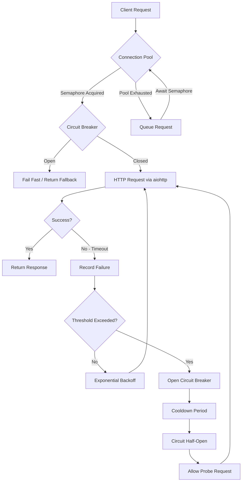

| Difficulty | Channel | Tags |
|---|---|---|
| advanced | backend | asyncio, aiohttp, concurrency |

It was 2011, and Netflix's API team was staring down a nightmare. A single slow microservice — say, recommendations or ratings — would silently exhaust the entire thread pool, blocking every other dependency. One hiccup would domino into a full-site outage, leaving millions of subscribers staring at buffering spinners instead of their favorite shows [1]. This crisis sparked an industry-wide revolution in resilience engineering — and the patterns that emerged from it are more relevant today than ever.

---

> ### Real-World Case — Netflix
>
> By 2011, Netflix's API team was drowning in cascading failures. A single slow microservice — say, recommendations — would exhaust the API's thread pool, blocking every other dependency. One service's hiccup would domino into a full-site outage, affecting millions of streaming members with buffering spinners or failed title loads.
>
> | | |
> |---|---|
> | **Challenge** | In Netflix's rapidly growing microservice architecture, any slow or failing dependency would consume all available threads in the connection pool. This caused cascading failures: threads queued up waiting for the slow service, the thread pool exhausted, new requests were rejected, and the entire API became unresponsive — even for services that were perfectly healthy. |
> | **Solution** | Netflix built Hystrix, a library implementing thread-pool and semaphore isolation (equivalent to a connection pool manager), circuit breakers, and fallback mechanisms. Each dependency got its own dedicated thread pool (bulkhead pattern) with a semaphore limiting concurrent calls. When failures exceeded thresholds (20 requests, 50% failure rate in a 10-second window), the circuit breaker tripped — immediately failing fast instead of holding threads. Exponential backoff allowed recovery, and fallbacks served degraded but functional responses. |
> | **Outcome** | Hystrix now executes tens of billions of thread-isolated and hundreds of billions of semaphore-isolated calls daily at Netflix. The result was a dramatic improvement in uptime and resilience — a single failing service no longer takes down the entire platform. This pattern became the industry standard, inspiring resilience4j, Spring Cloud Circuit Breaker, and similar implementations across the industry. |
> | **Lesson** | Connection pool management without isolation is a single point of failure. The key insight: protecting your service from a slow dependency requires two mechanisms — limiting how many concurrent calls you make (semaphore/thread isolation) and knowing when to stop trying entirely (circuit breaker). Timeouts alone are not enough; you must also shed load to let failing services recover. |

---

## Hook — The 3 AM Pager That Changed Everything

Picture this: You are the on-call engineer for a platform serving tens of millions of users. Your pager goes off at 3 AM. A single backend service — the one nobody worries about because it is usually rock-solid — has started responding slowly. Within minutes, your entire API surface is returning 503s. Users cannot browse titles, cannot resume playback, cannot even log in. The worst part? The slow service was not even critical to most of your features. It just shared the same connection pool. This was exactly the reality Netflix faced in 2011, and it is a scenario that plays out in companies of every size every single day.

## Problem — When One Slow Service Takes Down Your Entire Platform

The root cause is deceptively simple: shared resources without isolation. In most architectures, services communicate over HTTP using connection pools — reusable sets of TCP connections that avoid the overhead of establishing new connections for every request. Here is the catch: connection pools are finite. When one downstream service starts responding slowly, every connection in the pool gets tied up waiting for that service. New requests pile up behind the slow ones, and before you know it, the entire pool is exhausted. This is called cascading failure, and it is the silent killer of distributed systems [6]. The problem is compounded by the fact that most connection pool implementations lack circuit breakers, health checks, and proper timeout propagation. They assume everything downstream will behave — an assumption that production environments ruthlessly punish. When you build for the happy path, you are one slow dependency away from a site-wide outage.

## Real-World Case — Netflix's Cascade Failure Wake-Up Call

By 2011, Netflix's API team had grown accustomed to a troubling pattern: every time a single microservice degraded, the entire API would follow. The recommendations service, the ratings engine, the search index — any of them could trigger a domino effect that took down the platform [1]. The root cause was always the same: a thread pool shared across all dependencies. One slow caller would block all threads, leaving no capacity for any other request. The team realized they needed a fundamentally different approach to inter-service communication. The result was Hystrix — a latency and fault tolerance library designed to isolate points of access between services. Hystrix introduced three game-changing concepts: thread isolation so one slow service cannot steal capacity from others, circuit breakers that stop cascading failures, and fallback responses so users still get a degraded experience instead of an error page. Today, Hystrix executes tens of billions of thread-isolated and hundreds of billions of semaphore-isolated calls daily at Netflix [1]. This single architectural decision turned a fragile monolith into one of the most resilient platforms on the internet.

## Deep Dive — Anatomy of a Resilient Connection Pool

Building on what Netflix learned, let us examine the four pillars of a production-grade connection pool manager. **First: semaphore-based concurrency limiting.** A semaphore acts as a gatekeeper, ensuring you never exceed your maximum concurrent connections [7]. When the semaphore is exhausted, requests queue up rather than overwhelming the downstream service. **Second: the circuit breaker pattern.** A circuit breaker monitors for failures and trips when a threshold is exceeded [2]. Once tripped, it returns instantly without making the request — fail fast instead of fail slow. This prevents a sick service from dragging down the entire system. After a cooldown period, the circuit transitions to half-open, allowing a single probe request to test if the service has recovered [6]. **Third: exponential backoff.** When a request fails, retrying immediately is rarely helpful — it just adds more load to an already struggling service [4]. Exponential backoff doubles the wait time between each retry attempt, giving the downstream service time to recover. **Fourth: health checks and connection pruning.** Not all connections in your pool remain healthy. Stale connections, SSL negotiation errors, and silently dropped TCP connections can accumulate over time. Regular health checks identify and remove dead connections before they are handed to a caller.

## Workflow — From Request to Resilient Response

Here is how these pieces fit together in a real request lifecycle. The diagram below traces a single HTTP request through the entire resilience pipeline — from the moment it hits the connection pool to the final response or fallback. Every decision point represents a potential failure that must be handled gracefully.

The workflow reveals an important insight: resilience is not about preventing failures — it is about containing them. Each component in the pipeline acts as a firebreak, ensuring that when something breaks, the damage stays local.

## Code Example — Building Your Own Connection Pool Manager

Here is a production-inspired implementation that brings together everything discussed so far. This connection pool manager uses semaphores for concurrency limiting, a full circuit breaker with half-open probing, and exponential backoff for retries.

## Lessons Learned — What Every Developer Should Take Away

If there is one thing Netflix's story teaches you, it is this: assume every downstream dependency will fail, and design for that reality from day one. Here are specific takeaways you can apply tomorrow. **Fail fast, not slow.** A request that is going to fail should fail in milliseconds, not minutes. Circuit breakers are the mechanism; the principle is protecting system throughput at the expense of individual requests [6]. **Isolate your dependencies.** Whether through semaphore-based or thread-based isolation, ensure one slow service cannot consume resources needed by others. Netflix's Hystrix proved that isolation is the single highest-leverage resilience investment you can make [1]. **Bake resilience into your client libraries.** Connection pool managers are not infrastructure concerns — they are application concerns. Every HTTP client in your codebase should include circuit breakers, timeouts, and backoff by default. **Monitor the right metrics.** Track pool utilization, circuit breaker state transitions, and request latency distributions. These metrics will tell you when a service is degrading before it fails entirely. The patterns pioneered by Netflix have become the industry standard, inspiring libraries like Resilience4j, Spring Cloud Circuit Breaker, and countless internal implementations across the industry [8]. But you do not need Netflix-scale traffic to benefit from them. A connection pool manager with circuit breakers and exponential backoff will serve you well whether you are handling ten requests per second or ten million.

---

## Connection Pool Resilience Flow

<strong>Original Interview Question</strong>

**Q:** How would you implement a connection pool manager for aiohttp that handles graceful degradation under high load and connection timeouts?

**A:** Implement a connection pool manager for aiohttp using a semaphore to limit concurrent connections, exponential backoff for retrying failed requests, and circuit breaker pattern to gracefully degrade under high load and connection timeouts.

## Conclusion

Netflix's near-meltdown in 2011 taught the industry a lesson that is still playing out today: in distributed systems, your weakest dependency determines your reliability. The connection pool manager you just built is not just about managing connections — it is about containing failure, preserving throughput, and ensuring that when something breaks, only that something breaks. Start small: add a circuit breaker to your most critical HTTP client. Add exponential backoff to your retry logic. Monitor pool utilization in production. The patterns are simple. The impact is transformative. As Netflix proved, the difference between a fragile system and a resilient one is not the scale of your infrastructure — it is how gracefully you handle failure.

---

## References

1. [Introducing Hystrix for Resilience Engineering](https://netflixtechblog.com/introducing-hystrix-for-resilience-engineering-13531c1ab362) — blog
2. [Circuit Breaker Design Pattern](https://en.wikipedia.org/wiki/Circuit_breaker_design_pattern) — documentation
3. [asyncio — Asynchronous I/O](https://docs.python.org/3/library/asyncio.html) — documentation
4. [Exponential Backoff](https://en.wikipedia.org/wiki/Exponential_backoff) — documentation
5. [aiohttp Client Documentation](https://docs.aiohttp.org/en/stable/) — documentation
6. [Circuit Breaker Pattern — Microsoft Azure Architecture](https://learn.microsoft.com/en-us/azure/architecture/patterns/circuit-breaker) — documentation
7. [asyncio Synchronization Primitives — Semaphore](https://docs.python.org/3/library/asyncio-sync.html) — documentation
8. [Resilience4j — Fault Tolerance Library](https://github.com/resilience4j/resilience4j) — documentation

---

**Author:** Satishkumar Dhule — [GitHub](https://github.com/satishkumar-dhule) · [LinkedIn](https://linkedin.com/in/satishkumar-dhule) · [Website](https://satishkumar-dhule.github.io)
