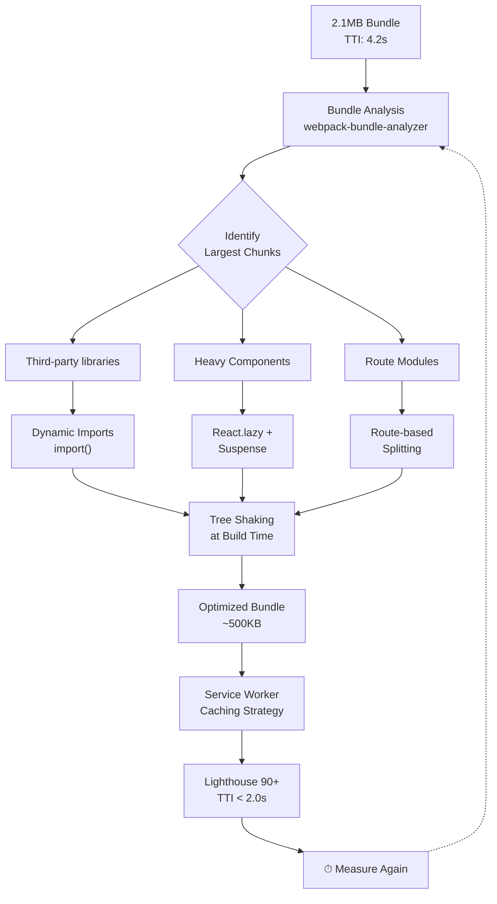

| Difficulty | Channel | Tags |
|---|---|---|
| intermediate | frontend | lighthouse, bundle, lazy-loading |

Here is a question every team should ask: could fixing frontend performance do more for user growth than any feature you ship this quarter? In 2017, Twitter faced a brutal reality: their web app was hemorrhaging users in emerging markets where 2G and 3G connections were the norm. Their solution did not involve a single new feature. It was a relentless performance overhaul that slashed their app from 23.5MB to 600KB [1]. The result? A 75% increase in Tweets sent and a 20% drop in bounce rates. This is the story of how performance became a growth strategy — and how you can apply the same playbook to your React app today.

---

> ### Real-World Case — Twitter (X)
>
> In 2015-2017, Twitter faced a critical challenge: their web app was bloated and slow on mobile devices, especially in emerging markets where users had 2G/3G connections and limited data plans. The native Android app required 23.5MB of downloads, pricing out users in markets where mobile data could cost $41/GB.
>
> | | |
> |---|---|
> | **Challenge** | Twitter needed to build a fast, lightweight React PWA that worked reliably on low-end devices and slow networks. The initial bundle was too large for 3G networks, causing poor Core Web Vitals, high bounce rates, and low engagement from the 80% of users accessing Twitter via mobile. |
> | **Solution** | Twitter's engineering team built Twitter Lite as a React + Redux PWA with aggressive code splitting, granular bundle chunking, service worker caching, and intelligent lazy loading. They broke resources into granular pieces so the initial load only required code for the visible screen. Components were loaded on-demand using route-based splitting, images were optimized with data-saver mode (replacing images with blurred previews), and the app relied heavily on flexbox and a component-based responsive design system. The entire PWA was under 600KB over the wire — less than 3% of the native Android app's size. |
> | **Outcome** | 65% increase in pages per session, 75% increase in Tweets sent, 20% decrease in bounce rate, first loads under 5 seconds on 3G, 70% reduction in data consumption through image optimization, and 250,000+ unique daily users launching from the homescreen. The 600KB PWA replaced a 23.5MB native app download requirement. |
> | **Lesson** | Aggressive code splitting at every level (route, component, resource) combined with service worker caching can make a complex React app load faster than native on slow networks. The counterintuitive insight: a web app smaller than 3% of the native app size can rival or exceed native performance while reaching users native apps can't. |

---

## Hook — The Hidden Tax Nobody Talks About

Every millisecond your app takes to load is a silent conversion killer. Amazon calculated that every 100ms of latency cost them 1% in revenue. Google found that 53% of mobile users abandon sites that take longer than 3 seconds to load. Yet most teams treat performance as a 'phase two' concern — something to address after shipping features. The truth is brutal: your beautifully architected React app with 2.1MB of bundle weight is actively driving users away. And the worst part? You probably do not even know which chunks are bloating your payload.

## Problem — The Monolith That Sneaks Up On You

It starts innocently enough. You import a utility library here, a charting library there. A date picker. A drag-and-drop module. Before you know it, your JavaScript bundle has ballooned to 2.1MB and your Time to Interactive (TTI) stretches past 4 seconds. The developer experience still feels snappy on your MacBook Pro with gigabit WiFi. But on a Moto G4 with 3G in Lagos or Jakarta? Your app is unusable. This is the performance asymmetry problem: what feels fast in the office feels broken in the real world. The stakes are enormous. In markets where mobile data costs $41 per GB [1], a 2.1MB download is not just slow — it is prohibitively expensive for users. You are effectively pricing out entire demographics with a bloated bundle.

## Real-World Case — Twitter (X)

Twitter faced this exact crisis in 2015-2017. Their native Android app required a 23.5MB download — a non-starter in emerging markets where users had limited storage and expensive data plans. The team made a radical bet: build a Progressive Web App (PWA) that could deliver a near-native experience at a fraction of the size. The results were staggering. The PWA shipped at just 600KB — a 97% reduction. First loads completed under 5 seconds on 3G networks. Data consumption dropped 70% through aggressive image optimization. And the business metrics told the real story: a 65% increase in pages per session, a 75% increase in Tweets sent, and a 20% decrease in bounce rate [1]. Over 250,000 unique daily users launched Twitter from their homescreen via the PWA. The takeaway is unmistakable: performance is not just an engineering metric. It is a lever for growth.

## Deep Dive — Code Splitting, Tree Shaking, and the Art of Deferred Loading

Twitter's transformation was impressive, but how do you apply those lessons to a modern React app? The toolkit revolves around three interconnected concepts: code splitting, tree shaking, and lazy loading. Code splitting is the practice of breaking your monolithic bundle into smaller chunks that load on demand. Think of it as the difference between packing for a year-long trip versus buying what you need at each destination. Tree shaking is the Dead Code Elimination that happens at build time — when you configure webpack or Rollup with ES modules, the bundler can statically analyze which exports are actually used and discard the rest [5]. Lazy loading defers the loading of non-critical resources until they are actually needed, using patterns like intersection observers for images and dynamic imports for JavaScript modules [3]. The interplay is where the magic happens. Tree shaking strips unused code at build time — a one-time optimization. Code splitting defers loading at runtime — a continuous optimization. Together, they can shrink your initial payload by 60-80% without removing a single feature.

## Workflow — The 7-Step Performance Pipeline

The following diagram illustrates the optimization workflow that teams can follow to transform a bloated React app into a high-performance experience. The process starts with measurement, progresses through analysis and strategic splitting, and ends with caching and verification:

## Code Example — Implementing Route-Based and Component-Based Splitting

Here is a production-ready pattern for implementing code splitting with React.lazy, Suspense, and error boundaries. This approach covers route-level splitting (for pages) and component-level splitting (for heavy features like charts or editors):

## Lessons Learned — What Twitter Taught Us About Performance-Driven Development

The Twitter case study [1] reveals a pattern that applies to any React application. First, start with measurement — run Lighthouse, analyze your bundle with webpack-bundle-analyzer, and identify the top offenders before touching any code. Second, adopt progressive enhancement, not binary optimization. You do not need your entire app to load instantly. You need the critical path to load fast; everything else can wait. Third, treat performance as a user experience metric, not a technical one. Twitter did not optimize for bundle size — they optimized for user engagement. The bundle size reduction was a means, not the end. Concretely, start your next sprint by running Lighthouse on your landing page. If your performance score is below 90, do not add a single feature until it is. Run webpack-bundle-analyzer and identify the single largest chunk. Apply route-based splitting to your heaviest page. Apply component-based splitting to your weightiest third-party dependency. Measure again. The results will speak for themselves.

---

## Performance Optimization Pipeline

<strong>Original Interview Question</strong>

**Q:** You're tasked with improving a React app's Lighthouse performance score from 65 to 90+. The bundle size is 2.1MB and Time to Interactive is 4.2s. What specific steps would you take to optimize the bundle and implement lazy loading?

**A:** Implement code splitting with React.lazy() and Suspense, analyze bundle composition with webpack-bundle-analyzer to identify largest chunks, remove unused dependencies and optimize imports, add dynamic imports for heavy components and third-party libraries, implement route-based splitting for better initial load times, and utilize tree shaking with proper ES module configuration.

## Conclusion

Twitter proved that performance is not a trade-off — it is a multiplier. By treating their bundle size as a product constraint rather than a technical footnote, they unlocked growth in markets their competitors could not reach. The same playbook applies to your React app today: measure first, split strategically, and treat every kilobyte as a user you might be excluding. Your Lighthouse score is not just a number. It is a proxy for how many people can actually use what you build.

---

## References

1. [Twitter (X) PWA Case Study](https://web.dev/case-studies/twitter) — blog
2. [React.lazy — React Documentation](https://react.dev/reference/react/lazy) — documentation
3. [Suspense — React Documentation](https://react.dev/reference/react/Suspense) — documentation
4. [Webpack Code Splitting Guide](https://webpack.js.org/guides/code-splitting/) — documentation
5. [Tree Shaking — MDN Web Docs](https://developer.mozilla.org/en-US/docs/Glossary/Tree_shaking) — documentation
6. [Dynamic Import Operator — MDN Web Docs](https://developer.mozilla.org/en-US/docs/Web/JavaScript/Reference/Operators/import) — documentation
7. [Lighthouse Performance Scoring — web.dev](https://web.dev/performance-scoring/) — documentation
8. [Progressive Web Apps — MDN Web Docs](https://developer.mozilla.org/en-US/docs/Web/Progressive_web_apps) — documentation
9. [Service Worker API — MDN Web Docs](https://developer.mozilla.org/en-US/docs/Web/API/Service_Worker_API) — documentation

---

**Author:** Satishkumar Dhule — [GitHub](https://github.com/satishkumar-dhule) · [LinkedIn](https://linkedin.com/in/satishkumar-dhule) · [Website](https://satishkumar-dhule.github.io)
