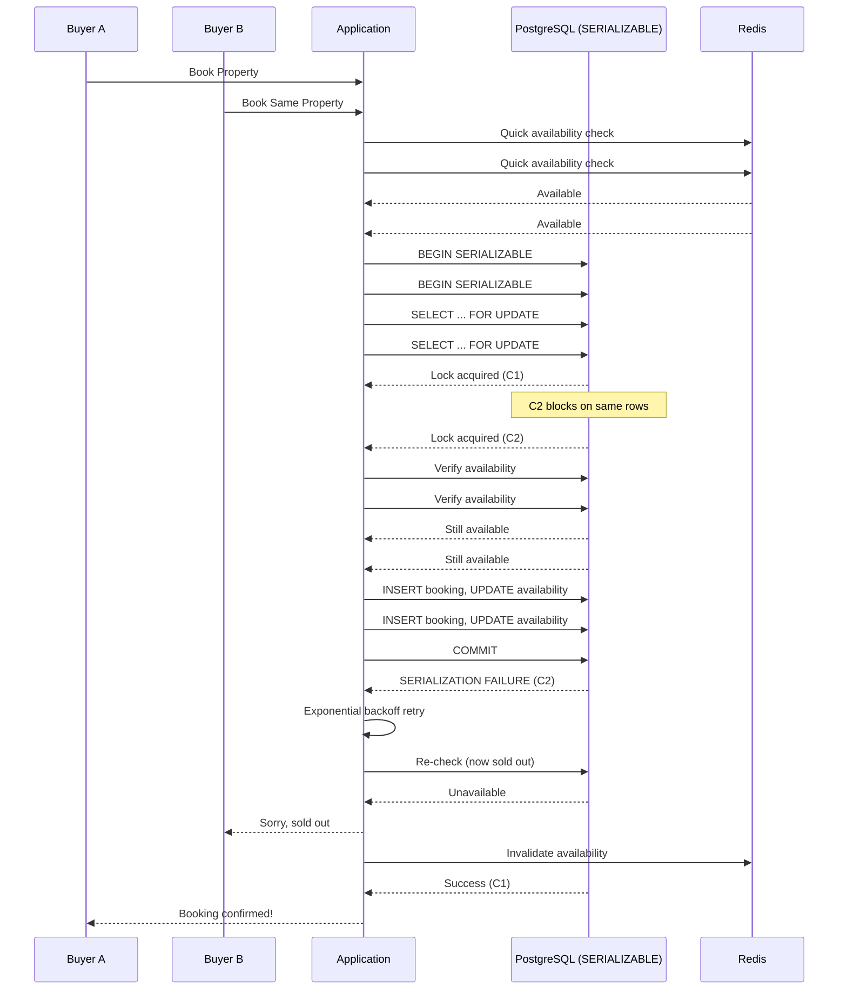

| Difficulty | Channel | Tags |
|---|---|---|
| intermediate | database | acid, isolation-levels, mvcc |

In 2025, Shopify's checkout infrastructure faced a nightmare scenario: two buyers clicking "Buy Now" on the same last unit of inventory at almost the exact same millisecond. One transaction had to succeed. The other had to gracefully fail. The wrong answer meant either an angry customer or a lost sale — and at $5.1 million per minute in Black Friday throughput [1], the margin for error was zero. This is the story of how database isolation levels became the unsung hero of modern e-commerce.

---

> ### Real-World Case — Shopify
>
> Shopify's checkout system needed to guarantee that when two buyers simultaneously purchase the same last unit of inventory, exactly one succeeds. Getting this wrong meant overselling (merchant cancels an order, sends apology, eats support cost) or underselling (lost revenue). At Black Friday 2025 peak, merchants hit $5.1M/min in sales with an 11% increase over prior year.
>
> | | |
> |---|---|
> | **Challenge** | Their Redis-based inventory reservation system had fundamental consistency problems: reservations and the inventory ledger lived in separate systems, so they couldn't be wrapped in an atomic transaction. Payment could succeed without inventory being claimed, or inventory could be deducted without payment completing. Redis also lacked multi-location awareness and required maintaining a separate cluster. |
> | **Solution** | Migrated from Redis to MySQL using SELECT...FOR UPDATE SKIP LOCKED with one-row-per-unit design (instead of one-row-per-item with a quantity column). Used composite primary keys to reduce row locks from 2 to 1 per reservation, READ COMMITTED isolation to avoid gap locks, and consistent lock ordering to prevent deadlocks. Ran both systems in shadow mode for months before cutover. |
> | **Outcome** | Met high-throughput targets during Black Friday 2025 peak. After discovery that the real bottleneck was connection exhaustion (not CPU or query speed), cleanup removed 50% of reads and 33% of transactions on the primary database. Writer CPU stayed under 50%, reader CPU under 16% during flash sales. Zero oversells. |
> | **Lesson** | The bottleneck wasn't where expected: they optimized queries and locks for weeks, but the real limit was connection usage in unrelated checkout code. Also, database features once assumed insufficient (MySQL for high-throughput mutual exclusion) can now handle those workloads with modern features like SKIP LOCKED. |

---

## Hook — It Should Be Simple. It Is Not.

A customer finds the perfect listing. They click Book. A second customer clicks the same button a heartbeat later. Two transactions race through your system, and both believe the property is available. By the time you realize what happened, you have already double-booked. Now you are calling one guest with an apology, scrambling for an alternative, and eating the support cost. Sound familiar? This is the concurrency nightmare hiding inside every booking system — and it is far harder to solve than a first glance suggests.

## Problem — The Race That Nobody Wins

At its core, the double-booking problem is a textbook race condition. Two concurrent transactions read the same row, see "available = true", proceed to insert bookings, and the second writer clobbers the first's assumption. The database might accept both writes before either transaction commits, leaving your application to clean up the mess. Traditional approaches — wrapping everything in a big lock, or using READ COMMITTED and hoping for the best — either destroy throughput or leak bookings. You need a strategy that guarantees correctness without turning your database into a single-lane toll booth. This tension between safety and speed is what makes booking systems a fascinating systems-design challenge. Many teams start with the simplest approach — a mutex or a distributed lock — and discover too late that locks fail, timeouts expire, and users get furious.

## Real-World Case — Shopify's $5.1M/min Checkout Counter

Shopify faced exactly this problem at e-commerce scale. Their checkout system needed to guarantee that when two buyers simultaneously purchase the last unit of inventory, exactly one succeeds. Getting it wrong meant overselling — forcing merchants to cancel orders, apologize, and eat chargeback fees — or underselling, which left money on the table. During Black Friday 2025, Shopify merchants hit $5.1 million in sales per minute, an 11% increase over the prior year [1]. Their engineering team discovered that the real bottleneck was not CPU or query speed — it was connection exhaustion on the primary database. After auditing their transaction patterns, they cut 50% of reads and 33% of transactions from the primary, pushing them to replicas. Writer CPU stayed under 50%. Reader CPU stayed under 16% during flash sales. And critically: zero oversells [1]. The takeaway? Concurrency control is not just about locks — it is about knowing exactly which operations demand serial access and ruthlessly moving everything else out of the critical path.

## Deep Dive — SERIALIZABLE, MVCC, and the Art of the Retry

PostgreSQL's SERIALIZABLE isolation level is the closest the SQL standard comes to magic: it guarantees that concurrent transactions execute as if they ran one at a time, even though they actually run in parallel [2]. Under the hood, PostgreSQL uses Serializable Snapshot Isolation (SSI), which tracks read-write conflicts between transactions. When SSI detects a conflict pattern that could produce a serialization anomaly, it aborts one of the transactions with a 40001 error code — your signal to retry. This is fundamentally different from REPEATABLE READ, which prevents some anomalies but allows serialization failures like write skew [8]. Here is the counterintuitive insight: SERIALIZABLE does not mean serial. Transactions still execute concurrently. PostgreSQL uses predicate locks — lightweight markers on data ranges — to detect when two transactions touched overlapping data in ways that could break serial consistency [7]. If the predicate lock manager detects a dangerous pattern, it chooses a victim transaction and kills it. The application receives a SerializationFailure and retries. This is optimistic concurrency control in practice: assume conflicts are rare, detect them when they happen, and retry. The trick is making retries cheap and fast. Combine SERIALIZABLE with SELECT FOR UPDATE on specific date ranges to narrow the lock window [4]. Use read replicas for non-critical availability checks so the primary stays focused on writes [6]. Cache availability data aggressively — but invalidate on every successful booking to avoid stale reads. This layered approach kept Shopify's primary database breathing even at peak load.

## Workflow — A Transaction's Journey From Click to Confirmation

The booking workflow follows a careful sequence designed to minimize lock contention while guaranteeing correctness. Here is the step-by-step journey: First, the application begins a SERIALIZABLE transaction. It reads availability from cache for fast pre-validation — this is a non-critical check and can use replicas. Next, it acquires row-level locks on the specific date range using SELECT FOR UPDATE, which blocks other writers on those exact rows [4]. After locking, it rechecks availability (the lock guarantees no one else changed these rows under you), then inserts the booking record and updates the availability rows. On commit, PostgreSQL's SSI machinery checks for serialization conflicts. If one transaction wins and the other conflicts, the loser gets SerializationFailure. The application catches it, rolls back, waits with exponential backoff (100ms, 200ms, 400ms...), and retries from the beginning [9]. If retries exhaust, the system returns a polite "unavailable" to the user. Meanwhile, a successful commit triggers cache invalidation so subsequent availability reads see the freshest state.

## Code Example — Building a Bulletproof Booking Transaction

Below is a production-style Python implementation of the booking logic using psycopg2 with SERIALIZABLE isolation, row-level locking, and exponential-backoff retries. Each section maps directly to the workflow described above.

## Lessons Learned — What Every Team Should Take Away

First, SERIALIZABLE isolation is not a performance disaster if you keep transactions short and narrow. PostgreSQL's SSI is remarkably efficient for point queries on indexed columns — the predicate lock manager scales with the number of conflicting transactions, not total throughput [2]. Second, move everything non-essential off the primary. Shopify cut 50% of reads from the primary by routing availability lookups to replicas — a pattern every booking system should adopt [1]. Third, exponential backoff with jitter is non-negotiable. Without it, retries from multiple clients synchronize and create thundering-herd failures that overwhelm the database [9]. Fourth, monitor SerializationFailure rates as a health metric. A sudden spike signals hot-spot contention — you may need application-level sharding or a staging queue for your most popular properties. Finally, remember that the database is the last line of defense, not the only one. Cache aggressively, pre-check at the application layer, and design your schema so that conflicting transactions touch minimal overlapping rows.

---

## Concurrent Booking Transaction Flow

<strong>Original Interview Question</strong>

**Q:** You're building a booking system for Airbnb where multiple users can reserve the same property simultaneously. How would you design the transaction handling to prevent double bookings while maintaining high availability?

**A:** Use SERIALIZABLE isolation with optimistic concurrency control. Implement row-level locks on property availability tables, use MVCC snapshot reads for checking availability, and apply application-level validation to ensure atomic booking operations.

## Conclusion

The next time you design a booking system, resist the temptation to reach for a heavyweight distributed lock or a simple mutex. PostgreSQL's SERIALIZABLE isolation, combined with row-level locking and disciplined retry logic, gives you provable correctness at the throughput your business demands. Shopify proved that with the right architecture — moving reads off the primary, keeping transactions narrow, and letting the database's SSI engine do what it does best — you can handle millions of dollars in transactions per minute with zero oversells. The takeaway is simple: trust the database, measure everything, and always have a retry strategy.

---

## References

1. [Scaling Inventory Reservations at Shopify](https://shopify.engineering/scaling-inventory-reservations) — blog
2. [PostgreSQL Documentation: Transaction Isolation](https://www.postgresql.org/docs/current/transaction-iso.html) — documentation
3. [Multiversion Concurrency Control (MVCC)](https://en.wikipedia.org/wiki/Multiversion_concurrency_control) — article
4. [PostgreSQL SELECT FOR UPDATE Documentation](https://www.postgresql.org/docs/current/sql-select.html#SQL-FOR-UPDATE-SHARE) — documentation
5. [ACID Properties in Database Systems](https://en.wikipedia.org/wiki/ACID) — article
6. [Optimistic Concurrency Control](https://en.wikipedia.org/wiki/Optimistic_concurrency_control) — article
7. [PostgreSQL Explicit Locking Documentation](https://www.postgresql.org/docs/current/explicit-locking.html) — documentation
8. [Isolation (Database Systems)](https://en.wikipedia.org/wiki/Isolation_(database_systems)) — article
9. [RFC 7231 — HTTP/1.1 Semantics (Retry Guidance)](https://datatracker.ietf.org/doc/html/rfc7231) — documentation

---

**Author:** Satishkumar Dhule — [GitHub](https://github.com/satishkumar-dhule) · [LinkedIn](https://linkedin.com/in/satishkumar-dhule) · [Website](https://satishkumar-dhule.github.io)
