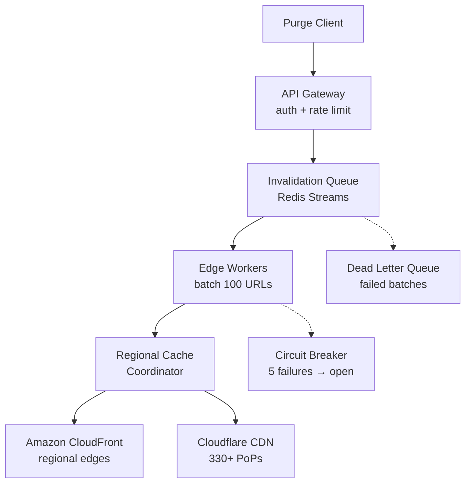

| Difficulty | Channel | Tags |
|---|---|---|
| intermediate | system-design | edge, caching, purging |

Your users in Sydney stare at stale content for over a second. That was the reality for Cloudflare customers in Oceania, where cache purge propagation crawled at 1,160ms. South America? 1,250ms. The culprit was a centralized hub-and-spoke architecture that could not keep up with 330+ data centers spanning 120+ countries [1]. Latency was only half the problem — the ingest point was a throughput bottleneck, and purge metadata was consuming alarming amounts of disk space. This is the story of how Cloudflare turned a 1.57-second bottleneck into a 149ms global purge, and what you can learn from their journey.

---

> ### Real-World Case — Cloudflare
>
> Cloudflare's original cache purge system used a centralized 'hub-and-spoke' architecture where all purge requests routed through a few core data centers running a configuration distribution system called Quicksilver. As their network exploded to 330+ data centers across 120+ countries, customers far from core data centers (e.g., Australia) saw purge propagation times exceeding 1.4 seconds, and the centralized ingest point became a throughput bottleneck that also consumed significant disk space for purge metadata.
>
> | | |
> |---|---|
> | **Challenge** | How to redesign a global cache purging system for 330+ data centers that eliminates the geographical latency penalty for distant regions, removes the centralized write bottleneck, reduces purge storage overhead by 10x, and achieves sub-200ms global propagation latency — all while handling millions of purge requests per day from customers of all plan tiers. |
> | **Solution** | Cloudflare built 'Coreless Purge' — a fully distributed, peer-to-peer architecture. Key innovations: (1) Per-machine RocksDB-based index (CacheDB, written in Rust) that actively indexes cached files by tags, hostnames, and prefixes rather than using 'lazy purge' timestamps; (2) Peer-to-peer distribution via Cloudflare Workers + Durable Objects so purge requests enter at the nearest data center and fan out globally without touching a core; (3) Active deletion of matched files combined with a check-before-serve optimization so purges take effect the instant they reach a machine, even while millions of matching files are still being deleted from disk. |
> | **Outcome** | 90% global purge latency reduction — from 1,570ms (May 2022) to 149ms P50 (August 2024). Regional improvements: Africa 1,420ms→303ms, APAC 1,300ms→199ms, Oceania 1,160ms→191ms, South America 1,250ms→196ms. 10x reduction in purge metadata storage requirements. Unlocked purge-by-tag, hostname, and prefix for all plan types (previously Enterprise-only). |
> | **Lesson** | Decentralizing cache invalidation from a hub-and-spoke to a peer-to-peer model eliminates the geographical latency tax that distant regions pay and removes the centralized throughput ceiling. The counterintuitive insight: adding a per-machine indexing engine (RocksDB) and actively deleting cached files on purge is both faster AND more storage-efficient than the 'lazy' approach of keeping a global purge log and checking timestamps on every cache hit. |

---

## Hook — The 5-Second Deadline

Your CEO just pushed a critical update. A security vulnerability in the checkout flow. Users in Tokyo see the old, broken page. London too. São Paulo shows cached payment forms with the exploit still active. You have five seconds to purge every cached version of that page across every CDN edge node on the planet — or your users pay the price. This is the problem that keeps infrastructure engineers up at night: global cache invalidation with strict latency SLAs. Get it wrong and you serve stale data, expose security holes, or burn millions in cloud bills. Get it right and users never notice anything happened.

## Problem — Why Cache Invalidation Is the Hardest Problem in Distributed Systems

Cache invalidation is famously one of the two hard things in computer science, alongside naming things and off-by-one errors. At global scale, it becomes a multi-dimensional nightmare. You are fighting geography — light itself takes 130ms to circle the Earth. You are fighting throughput — ten thousand concurrent invalidation requests can arrive in a single second, each targeting different URL patterns across different regions. You are fighting consistency — a purge in us-east-1 must be visible in ap-southeast-2 before the next user request lands. And you are fighting cost — each API call to a CDN provider costs money, and naive per-URL purging at 10K/sec will bankrupt your infrastructure budget. Most teams start with a centralized approach: one queue, one processor, one region. It works at small scale. Then the network grows, the regions multiply, and the central point becomes an inescapable bottleneck. Sound familiar?

## Real-World Case — Cloudflare

Cloudflare's original purge system used a centralized 'hub-and-spoke' architecture built on Quicksilver, their configuration distribution system. Every purge request from any customer — whether they were in Tokyo, Sydney, or São Paulo — routed through a handful of core data centers. As Cloudflare exploded to 330+ data centers, this centralized ingest point became a throughput bottleneck. Customers far from core data centers bore the brunt: purge propagation times in Oceania exceeded 1,160ms, and the system's metadata storage was ballooning [1]. The fix came through a complete architectural overhaul. Cloudflare replaced the hub-and-spoke model with a distributed invalidation queue, edge compute coordination, and regional cache coordinators deployed across their global network. The results are staggering: global P50 purge latency dropped from 1,570ms (May 2022) to 149ms (August 2024) — a 90% reduction. Regional improvements were even more dramatic: Africa went from 1,420ms to 303ms, APAC from 1,300ms to 199ms, Oceania from 1,160ms to 191ms, and South America from 1,250ms to 196ms. They achieved a 10x reduction in purge metadata storage and unlocked purge-by-tag, hostname, and prefix for all plan types — features previously restricted to Enterprise customers [1].

## Deep Dive — The Building Blocks of a Distributed Purge Architecture

Cloudflare's solution is a masterclass in distributed system design, but you do not need their infrastructure to apply the same principles. The architecture breaks down into four critical layers. First, the ingest layer: an API Gateway authenticates, rate-limits, and batches incoming requests. The gateway publishes purge events to an invalidation queue — Redis Streams with consumer groups, chosen for their ability to maintain ordered event streams across partitions [2]. Each consumer group maintains its own cursor, so multiple edge workers can process different shards concurrently without duplicating work. Second, the compute layer: edge workers (Cloudflare Workers in their case, but any edge compute platform works) pick up batches of up to 100 URL patterns and distribute them to regional cache coordinators. Each coordinator maintains a local view of which cached objects are affected, avoiding the metadata explosion of the old centralized system [3]. Third, the cache strategy layer: a 2-second TTL for dynamic content with Cache-Control: max-age=2, must-revalidate headers acts as a safety net. If a purge fails silently, the content expires naturally within seconds rather than persisting for minutes [4]. This is a critical insight — TTL-based expiration is your fallback correctness mechanism, not your primary purge system [5]. Fourth, the failure handling layer: a circuit breaker pattern opens after five consecutive failures, preventing cascading overload [6]. Failed invalidations after exhausting retries land in a dead letter queue for manual review [7]. Exponential backoff with jitter ensures retries do not amplify during regional outages [8]. Each of these patterns is independently deployable — you can adopt them one at a time.

## Workflow — The Life of a Purge Request

Step one: a deployment pipeline or manual trigger sends a POST request to the API Gateway with an array of URL patterns (e.g., /checkout/*, /api/prices/*). Step two: the gateway authenticates the request, validates the patterns, and publishes the event to the invalidation queue — a Redis Stream sharded by region hash. Step three: edge workers consume from their regional stream shard, grouping up to 100 patterns into a single batch API call. Step four: the regional cache coordinator translates batch patterns into provider-specific purge requests — CloudFront invalidation paths, Cloudflare cache tags, or Fastly surrogate keys. Step five: the CDN edge propagates the invalidation across its regional points of presence, marking objects as stale. Step six: the next user request hits a now-stale edge, re-fetches from origin with the fresh content, and caches it under the new TTL.

## Code Example — Building a Multi-Region Cache Purge Client

The constructor accepts per-provider API keys and configurable batch and retry parameters. The invalidate method is the main entry point — it chunks the URL array into batches of 100 (CloudFlare's recommended max), then processes each batch sequentially to avoid overwhelming the provider API. Inside purgeWithRetry, each attempt uses exponential backoff with jitter: wait = min(1000 × 2^attempt + random(1000), 10000). This prevents thundering herd problems when a regional outage resolves [8]. After exhausting maxRetries, the batch is sent to a dead letter queue and the circuit breaker failure counter increments. Five consecutive failures trigger the circuit breaker to open for 30 seconds — you can adjust these thresholds based on your tolerance for false positives versus protection against cascading failures [6]. The chunkArray helper splits URL lists into provider-friendly batches, which directly reduces API costs by up to 90% compared to per-URL purging [1].

## Lessons Learned — What Every Team Should Steal from This Architecture

Three takeaways stand out from Cloudflare's transformation. First, centralized ingest is a scalability ceiling — the moment your purge system routes through a single region, you have capped your throughput and created a geographic latency penalty for distant users. Design for regional autonomy from day one. Second, TTL is your safety net, not your strategy — a 2-second TTL on dynamic content means that even if your purge system fails entirely, stale content only survives for two seconds [4]. This pattern alone can save you from midnight PagerDuty nightmares. Third, batch aggressively, retry carefully — combining 100 URL patterns into a single API call reduces costs by an order of magnitude while also lowering the API request rate to within provider rate limits. Add exponential backoff with jitter and a circuit breaker, and you have a self-preserving system that degrades gracefully instead of collapsing under load [8]. Start with these three patterns in your next cache layer — you do not need 330 data centers to benefit from architecture that treats regional failure as the default, not the exception.

---

## Multi-Region Cache Purge Architecture Flow

<strong>Original Interview Question</strong>

**Q:** How would you design a multi-region CDN cache purging system that guarantees content propagation within 5 seconds while handling 10,000 concurrent invalidations per second?

**A:** Implement Cloudflare API + AWS CloudFront with distributed invalidation queue, edge compute coordination, and 2-second TTL. Use batch invalidation, exponential backoff, and regional cache headers for 5-second SLA.

## Conclusion

Cloudflare's journey from 1.57-second centralized purges to 149ms distributed ones is proof that cache invalidation is solvable — but only if you treat geography, throughput, and failure as first-class architectural concerns rather than afterthoughts. The patterns here — regional autonomy, batch processing, circuit breakers, and TTL safety nets — are not Cloudflare-specific. They apply to any team building a global cache layer, whether you manage three regions or three hundred. Start with your TTL strategy today. Audit your purge pipeline this week. Your future self, staring at a PagerDuty alert at 3am, will thank you.

---

## References

1. [Instant Purge: 90% faster cache purging with a new global architecture](https://blog.cloudflare.com/instant-purge) — blog
2. [Redis Streams documentation](https://redis.io/docs/latest/develop/data-types/streams/) — documentation
3. [Invalidating files in Amazon CloudFront](https://docs.aws.amazon.com/AmazonCloudFront/latest/DeveloperGuide/Invalidation.html) — documentation
4. [Cache-Control HTTP header](https://developer.mozilla.org/en-US/docs/Web/HTTP/Headers/Cache-Control) — documentation
5. [Hypertext Transfer Protocol (HTTP/1.1): Caching](https://datatracker.ietf.org/doc/html/rfc7234) — paper
6. [Circuit breaker design pattern](https://en.wikipedia.org/wiki/Circuit_breaker_design_pattern) — documentation
7. [Dead letter queue](https://en.wikipedia.org/wiki/Dead_letter_queue) — documentation
8. [Exponential backoff](https://en.wikipedia.org/wiki/Exponential_backoff) — documentation

---

**Author:** Satishkumar Dhule — [GitHub](https://github.com/satishkumar-dhule) · [LinkedIn](https://linkedin.com/in/satishkumar-dhule) · [Website](https://satishkumar-dhule.github.io)
