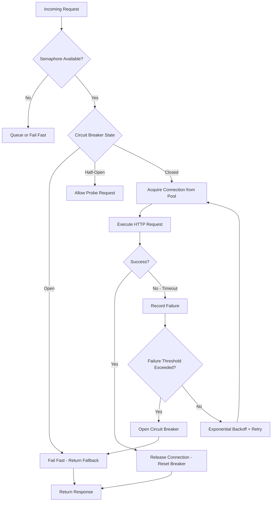

| Difficulty | Channel | Tags |
|---|---|---|
| advanced | backend | asyncio, aiohttp, concurrency |

It was Christmas Eve 2012, and Netflix engineers were watching their streaming platform crumble in real time. One slow database query had cascaded through 100+ microservices, saturating connection pools until the entire platform choked. Users staring at buffering wheels had no idea that a single degraded dependency was the culprit — and that the conventional wisdom of "add more capacity" was making things worse [1]. This incident reshaped how the industry thinks about failure resilience, and the lessons are more relevant than ever for anyone building async Python services with aiohttp.

---

> ### Real-World Case — Netflix
>
> Netflix's microservices architecture kept collapsing in production because a single slow downstream service would saturate connection pools, causing cascading failures. Engineers watched helplessly as one degraded database would fill up thread pools across 100+ services, taking the entire streaming platform down — including a high-profile Christmas Eve outage in 2012.
>
> | | |
> |---|---|
> | **Challenge** | In a distributed system with hundreds of microservices handling billions of requests, there was no isolation between dependencies. When Service C slowed down, Service B's thread pool would fill with requests waiting on C. Then Service A's thread pool would fill waiting on B. One slow dependency cascaded into total system failure. Traditional approaches of adding more threads or connections actually made things worse. |
> | **Solution** | Netflix built Hystrix, an industry-defining resilience library that implemented: (1) bulkhead pattern with per-dependency thread pools and semaphores to limit concurrent connections to each service, (2) circuit breakers that trip open when error rates exceed thresholds and fail fast instead of queueing, (3) fallback logic for graceful degradation, and (4) real-time monitoring. Each dependency got its own isolated resource pool — when one failed, only its pool filled up while the rest of the system stayed healthy. |
> | **Outcome** | Hystrix dramatically improved Netflix's uptime and became the industry standard for circuit breaker implementations, inspiring Resilience4j, Spring Cloud Circuit Breaker, and countless other libraries. It demonstrated that constraining (not expanding) connection pools during failures is the key to resilience — a counterintuitive insight that reshaped how the entire industry thinks about graceful degradation. |
> | **Lesson** | Connection pool exhaustion is the #1 cause of cascading failures in microservices. The counterintuitive fix is to make pools SMALLER, not larger — the bulkhead pattern. A constrained pool that fails fast (releasing threads and connections immediately) is infinitely better than a large pool that queues requests until everything collapses. As Netflix's Ben Christensen put it: 'Hystrix evolved from a series of production incidents involving saturated connection pools, cascading failures, and misconfigurations of pools, queues, timeouts.' |

---

## Hook — The Slow Database That Took Down Christmas

Every engineer has felt that sinking feeling when a downstream service stops responding. But what happens when one slow endpoint threatens your entire system architecture? In 2012, Netflix discovered the hard way that connection pools — those seemingly innocuous resource managers — can become silent weapons of mass destruction when they lack proper guardrails.

Imagine this: a single Cassandra node starts experiencing latency spikes. The requests queue up. Threads wait. More requests pile in. Before anyone can react, every service depending on that database has exhausted its connection pool. Those services stop responding to their callers, which fills up *their* pools too. The failure propagates like a chain reaction, and suddenly the entire Netflix streaming experience is degraded during peak holiday traffic.

The root cause wasn't a catastrophic hardware failure or a bad deployment. It was a missing pattern: *graceful degradation*.

## Problem — Why Connection Pools Become Liability Pools

Many developers treat connection pools as a performance optimization and nothing more. Reuse connections, reduce TCP handshake overhead, move on. But this view misses the real purpose of a pool: it is a **boundary** that protects your system from itself.

Without proper management, a connection pool under load exhibits dangerous behavior:

- **Unbounded queuing**: Requests pile up waiting for a connection, consuming memory and thread resources
- **Cascading timeouts**: A slow downstream service causes callers to timeout, which triggers retries, which adds *more* load to the already struggling service
- **Silent failures**: Connections silently drop or become stale, leaking resources until the application grinds to a halt
- **No backpressure**: The pool absorbs infinite incoming traffic with no mechanism to tell upstream services "stop, I'm full"

For async Python applications using aiohttp, these problems are compounded. Async doesn't mean magic — a misconfigured `ClientSession` with no connection limits is just a slower way to crash your service.

## Real-World Case — Netflix's Hystrix Revolution

The Christmas Eve 2012 outage was a watershed moment at Netflix. Engineers realized their systems were fundamentally unprotected against the most common failure mode in distributed systems: the slow dependency [1].

Ben Christensen and the Netflix team built **Hystrix**, a latency and fault tolerance library designed around the circuit breaker pattern. The core insight was counterintuitive: when a dependency fails, you should *constrain* — not expand — the resources allocated to it. Let it fail fast. Give it space to recover.

Hystrix introduced three key mechanisms that became industry standards:

| Mechanism | Purpose | Effect Under Load |
|-----------|---------|-------------------|
| Circuit Breaker | Stop requests to failing services | Prevents cascade failures |
| Bulkhead Pattern | Isolate thread pools per dependency | Contains blast radius |
| Fallback Logic | Return degraded responses | Maintains partial functionality |

The impact was dramatic. Netflix's uptime improved significantly, and Hystrix went on to inspire Resilience4j, Spring Cloud Circuit Breaker, and — later — the resilience4j-python ecosystem [2]. The pattern proved that intentional degradation is better than catastrophic collapse.

## Deep Dive — The Anatomy of Graceful Degradation

Building on Netflix's insights, a production-grade connection pool manager needs four interconnected layers. Think of them as the stages of a fire suppression system:

**1. Semaphore throttling** — This is your first line of defense. A semaphore limits how many concurrent requests can acquire a connection at any moment. Rather than letting requests pile up indefinitely (which consumes memory and creates a "slow death" scenario), the semaphore forces immediate backpressure. If the pool is full, callers wait a configurable time or fail fast.

**2. Circuit breaker** — This is the automated fire door. The circuit breaker monitors failure rates and "trips" when they exceed a threshold, immediately failing all subsequent requests without touching the network. After a cooldown period, it transitions to half-open, allowing a probe request to test if the service has recovered [3]. The state machine looks like this:

   `Closed → (failure threshold exceeded) → Open → (timeout elapses) → Half-Open → (probe succeeds) → Closed`

**3. Exponential backoff with jitter** — When retrying failed requests, you need *exponential backoff*. But there is a subtle trick: *jitter*. Without jitter, all retrying clients synchronize and hit the recovering service simultaneously — a phenomenon called the "thundering herd problem." Adding random jitter spreads retries across time, giving the downstream service breathing room to recover [4].

**4. Health checks and connection pruning** — Stale connections silently degrade performance. A background task should periodically verify connection viability and evict dead connections from the pool. This is especially important for long-running services that can accumulate hundreds of idle connections over hours.

Here is the thing, though: combining these mechanisms correctly requires careful orchestration. A circuit breaker that trips too aggressively causes false negatives. One that trips too late allows cascading failures. The art is in tuning these thresholds to your specific workload.

## Workflow — Building the Connection Pool Pipeline

Visualizing the full request lifecycle helps make these abstract concepts concrete. Here is how a request moves through a properly managed connection pool:



The pipeline enforces that every request passes through **three gates** before execution: the semaphore gate (admission control), the circuit breaker gate (failure isolation), and the connection pool gate (resource management). After execution, successes strengthen the system while failures potentially trigger the circuit breaker or engagement of backoff retry logic.

This approach ensures that when things go wrong, the system degrades **predictably and gracefully** rather than collapsing into a cascading failure.

## Code Example — Implementing It in Python with aiohttp

Building on the pipeline above, here is a production-ready connection pool manager that integrates semaphore throttling, exponential backoff with jitter, circuit breaker logic, and health checks:

```python
import asyncio
import aiohttp
import random
import time
from dataclasses import dataclass
from typing import Optional

@dataclass
class CircuitBreaker:
    failure_count: int = 0
    last_failure_time: float = 0.0
    threshold: int = 5
    cooldown_seconds: float = 30.0
    is_open: bool = False

    def record_failure(self) -> None:
        self.failure_count += 1
        self.last_failure_time = time.monotonic()
        if self.failure_count >= self.threshold:
            self.is_open = True

    def record_success(self) -> None:
        self.failure_count = 0
        self.is_open = False

    def should_allow_request(self) -> bool:
        if not self.is_open:
            return True
        elapsed = time.monotonic() - self.last_failure_time
        if elapsed >= self.cooldown_seconds:
            self.is_open = False  # half-open transition
            return True
        return False

class AsyncConnectionPool:
    def __init__(
        self,
        max_connections: int = 50,
        request_timeout: float = 10.0,
        max_retries: int = 3,
    ):
        self.semaphore = asyncio.Semaphore(max_connections)
        self.timeout = aiohttp.ClientTimeout(total=request_timeout)
        self.max_retries = max_retries
        self.breaker = CircuitBreaker()
        self.session: Optional[aiohttp.ClientSession] = None

    async def start(self) -> None:
        connector = aiohttp.TCPConnector(
            limit=self.semaphore._value,
            ttl_dns_cache=300,
            enable_cleanup_closed=True,
        )
        self.session = aiohttp.ClientSession(
            connector=connector,
            timeout=self.timeout,
        )

    async def close(self) -> None:
        if self.session:
            await self.session.close()

    async def request(self, method: str, url: str, **kwargs) -> aiohttp.ClientResponse:
        async with self.semaphore:
            if not self.breaker.should_allow_request():
                raise Exception("Circuit breaker open - service unavailable")

            last_exception = None
            for attempt in range(self.max_retries):
                try:
                    async with self.session.request(
                        method, url, **kwargs
                    ) as response:
                        self.breaker.record_success()
                        return await response.read()
                except (asyncio.TimeoutError, aiohttp.ClientError) as exc:
                    self.breaker.record_failure()
                    last_exception = exc
                    if attempt < self.max_retries - 1:
                        delay = (2 ** attempt) + random.uniform(0, 1)
                        await asyncio.sleep(delay)

            raise last_exception
```

**What is happening here?**

The `CircuitBreaker` class tracks failures and automatically transitions between closed, open, and half-open states. Once failures hit the threshold, all subsequent requests fail immediately — no network call needed — giving the downstream service time to recover.

The `AsyncConnectionPool` ties everything together. The semaphore enforces a hard limit on concurrent connections, preventing the queue buildup that killed Netflix's services. The retry loop uses exponential backoff with random jitter, spreading recovery traffic instead of creating a thundering herd. The aiohttp TCP connector's `ttl_dns_cache` reduces DNS overhead, and `enable_cleanup_closed` prevents stale connection leaks.

**Pro tip**: In production, parameterize `threshold`, `cooldown_seconds`, and `max_retries` from environment variables or a config system. The right values depend on your SLA and downstream service behavior. Monitor the circuit breaker state in your metrics system — a frequently tripping breaker is a signal that your downstream service needs attention, not just software intervention.

## Lessons Learned — What Netflix Taught the Industry

The Christmas Eve 2012 outage was painful, but the industry is better for it. Here are the key takeaways:

🔥 **Counterintuitive insight**: When a service is failing, reducing its access to resources is the right move. Your instinct says "add more capacity." The engineering reality says "constrain and isolate."

🎯 **Three non-negotiable patterns for async HTTP clients**:
- **Semaphore** every connection pool — without it, you have unbounded concurrency
- **Circuit breaker** every external dependency — without it, one failure takes everything
- **Exponential backoff with jitter** every retry — without jitter, you are just coordinating your own failure

⚠️ **Battle scars from production**:
- Always call `await session.close()` on shutdown. Leaked aiohttp sessions are a common source of "weird TCP connection limits" bugs in CI/CD environments
- SSL context validation matters — a misconfigured SSL context silently disables connection pooling in aiohttp
- Monitor `semaphore._value` and circuit breaker state transitions as custom metrics; these numbers tell you when a dependency is struggling before your users feel it

**What should you do differently tomorrow?**

Audit every `aiohttp.ClientSession` in your codebase. Does it have a connection limit? Does it handle failures gracefully? Is there a circuit breaker wrapping calls to critical external services? If the answer to any of these questions is "no," you have the same vulnerability Netflix had in 2012.

The tools are simpler than most developers expect: a semaphore, a counter, a timer, and a random number generator. But combined correctly, they transform a brittle connection pool into a resilient system boundary that protects your entire architecture.

---

## Connection Pool Request Lifecycle


<details>
<summary><strong>Original Interview Question</strong></summary>

**Q:** How would you implement a connection pool manager for aiohttp that handles graceful degradation under high load and connection timeouts?

**A:** Implement a connection pool manager for aiohttp using a semaphore to limit concurrent connections, exponential backoff for retrying failed requests, and circuit breaker pattern to gracefully degrade under high load and connection timeouts.

</details>

## Conclusion

The Christmas Eve that nearly broke Netflix became the catalyst that made them — and the industry — more resilient. The same patterns that saved their platform are available to every Python developer through aiohttp, asyncio, and a few dozen lines of careful code. The next time you configure a connection pool, ask yourself: is this a resource manager or a liability waiting to cascade? Build the circuit breaker. Set the semaphore. Add the jitter. Your future self, debugging a production incident at 2am, will thank you.

---

## References

1. [Netflix Hystrix Wiki — How Hystrix protects distributed systems](https://github.com/Netflix/Hystrix/wiki) — documentation
2. [Resilience4j — Fault tolerance library inspired by Hystrix](https://github.com/resilience4j/resilience4j) — documentation
3. [Martin Fowler — Circuit Breaker pattern](https://martinfowler.com/bliki/CircuitBreaker.html) — blog
4. [Wikipedia — Exponential backoff](https://en.wikipedia.org/wiki/Exponential_backoff) — article
5. [Wikipedia — Circuit breaker design pattern](https://en.wikipedia.org/wiki/Circuit_breaker_design_pattern) — article
6. [Python asyncio documentation — Coroutines and tasks](https://docs.python.org/3/library/asyncio.html) — documentation
7. [aiohttp official documentation — Client usage](https://docs.aiohttp.org/en/stable/) — documentation
8. [Python asyncio synchronization primitives — Semaphore](https://docs.python.org/3/library/asyncio-sync.html) — documentation

---

**Author:** Satishkumar Dhule — [GitHub](https://github.com/satishkumar-dhule) · [LinkedIn](https://linkedin.com/in/satishkumar-dhule) · [Website](https://satishkumar-dhule.github.io)
