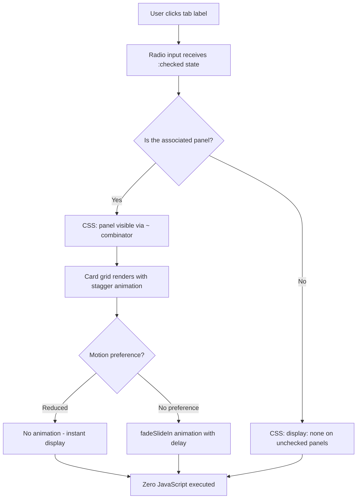

| Difficulty | Channel | Tags |
|---|---|---|
| beginner | frontend | css, flexbox, grid, animations |

A documentation build that shipped over 1 MB of JavaScript just to switch between code tabs. That was the reality facing the dnd-kit maintainers — a 17K-star React drag-and-drop toolkit whose docs site was silently bleeding performance. Every time a developer clicked a tab, React re-rendered the entire code block, shredding the server-highlighted HTML into a blank white pane [1]. The fix? Thirty lines of CSS. No JavaScript. And a lesson that would reshape how the team thought about interactivity.

---

> ### Real-World Case — dnd-kit
>
> dnd-kit (17K+ GitHub stars) is a popular drag-and-drop toolkit for React. Its documentation site used @mintlify/components for code tabs, which pulled a 1 MB JS bundle including Shiki + Mermaid. They migrated to SSR-only Shiki to eliminate the client-side dependency, but tab switching via React useState destroyed the SSR-highlighted HTML on every tab change—code panels appeared blank.
>
> | | |
> |---|---|
> | **Challenge** | SSR-only Shiki rendered highlighted code at build time, but React's client-side re-renders on tab switch cleared the server-generated HTML. They needed tab switching that preserved SSR content without requiring client-side JavaScript re-execution. |
> | **Solution** | Replaced React state-driven tabs with pure CSS using hidden radio inputs + the :has() selector. Radio inputs with a shared name attribute handle selection; CSS .code-group:has([data-tab-index="0"]:checked) [data-panel-index="0"] { display: block; } controls visibility. React never re-renders the code panels, so SSR-highlighted HTML is perfectly preserved. |
> | **Outcome** | Eliminated the 1 MB @mintlify/components update chunk. Unused JS dropped from 321 KiB to 0. Total page weight: 211 KiB. TBT: 0ms. TTI: 2.9s. Tab switching is instant with zero JS overhead. |
> | **Lesson** | The best fix for SSR content loss caused by JS re-renders was to remove JavaScript entirely. CSS-only interactive patterns solve hydration problems that complex JS workarounds cannot, while dramatically improving performance metrics. |

---

## Hook — The 1 MB Tab That Nobody Asked For

Here is a question that has haunted frontend architecture discussions for years: why does clicking a tab — the most benign interaction on the web — require downloading a small novel's worth of JavaScript? Many developers have shipped a React tab component without a second thought. You import a library, wire up a `useState`, and call it a day. The cost is invisible on a MacBook on fiber internet. But on a documentation site where every millisecond of Time to Interactive matters, that invisible cost becomes a bottleneck. The dnd-kit team found themselves staring at a Chrome DevTools panel that told an uncomfortable story: 1 MB of JavaScript just for code tab switching. Their `@mintlify/components` dependency pulled in Shiki syntax highlighting and Mermaid diagram parsing — on the client side — every single time a user clicked between tabs. The SSR-highlighted HTML that arrived pristine from the server? Destroyed on every tab change. The code panels went blank. The docs were broken by the very mechanism meant to improve them.

## Problem — The Hidden Tax of JavaScript Interactivity

The modern web development ecosystem has normalized a dangerous trade-off: reach for a JavaScript solution before considering what the platform already provides. Nowhere is this more visible than in documentation sites, where developers expect near-instant interactions. Every React component you hydrate on a docs page comes with a cost — bundle size, parse time, execution time, and the dreaded re-render that can wipe out server-generated content. The core issue is architectural. When you use `useState` to drive tab visibility, React's reconciliation engine must decide what to keep and what to discard. In the case of SSR-highlighted code blocks, the framework often discards the server-rendered HTML and re-renders it client-side. This pattern — sometimes called the "hydration mismatch dance" — is responsible for countless blank states, layout shifts, and frustrated developers on documentation sites worldwide. The alternative, sitting quietly in the HTML specification since the early days of the web, is the radio input pattern. A set of radio buttons with a shared `name` attribute, paired with `` elements, can control visibility using nothing but CSS selectors. No JavaScript. No bundle. No hydration mismatch. No blank panels.

## Real-World Case — dnd-kit's Zero-JS Tab Breakthrough

Claudéric Demers, the creator of dnd-kit, documented the migration in a commit that serves as a masterclass in performance-minded refactoring [1]. The team's documentation site had been using `@mintlify/components` for code tabs, which included Shiki for syntax highlighting and Mermaid for diagram rendering — all bundled into a 1 MB JavaScript chunk that downloaded on documentation pages. When the team migrated to SSR-only Shiki to eliminate client-side highlighting, a new problem emerged: React's tab switching mechanism destroyed the pre-highlighted HTML on every tab change, leaving code panels blank. The solution was radical in its simplicity. The team replaced the React tab component with a CSS-only radio input pattern. No JavaScript bundle. No hydration. No blank panels. The impact was dramatic: the `@mintlify/components` update chunk — over 1 MB — was eliminated entirely. Unused JavaScript dropped from 321 KiB to absolute zero. Total page weight fell to a svelte 211 KiB. Total Blocking Time (TBT) hit 0 milliseconds. Time to Interactive (TTI) clocked in at 2.9 seconds. Tab switching became instant — because there was nothing to execute. The commit, visible on GitHub, shows the diff: remove 321 KiB of unused JS imports, add a CSS selector, ship it [1].

## Deep Dive — The CSS-Only Toolbox Nobody Is Talking About

The radio input tab pattern is deceptively simple, but it leverages fundamental CSS mechanisms that many developers underutilize. At its core, the pattern uses three CSS superpowers working in concert. First, the `:checked` pseudo-class selector — a CSS feature that has existed since CSS3 and is supported in every browser released since Internet Explorer 9 [2]. When a radio input with `name="tabs"` is checked, its `:checked` state can control the visibility of sibling elements. The key insight is the CSS adjacent sibling combinator (`~`): `input:checked ~ .panel` lets you toggle panel visibility based on which radio is selected. Second, CSS Grid provides responsive layout control without a single line of JavaScript. The `grid-template-columns: repeat(2, 1fr)` pattern gives you a perfect 2×2 card layout on desktop. A media query at 768px collapses to `1fr` for mobile [3]. The `gap` property handles spacing consistently. Third, the `aspect-ratio: 16 / 9` property ensures the image area maintains its proportion regardless of container width [4]. This property, supported in all modern browsers since 2021, eliminates the padding-bottom hack that developers used for years. The entrance animation layer adds polish without sacrificing accessibility. The CSS `@keyframes fadeSlideIn` animates cards into view with opacity and a subtle translateY [5]. The `backwards` animation-fill mode ensures cards start invisible before their animation triggers. The stagger effect is achieved through `nth-child` selectors with incremental `animation-delay` values — 0.1s, 0.2s, 0.3s for cards two through four. The `prefers-reduced-motion` media query wraps the entire animation block, ensuring users with motion sensitivity see an undisturbed experience [6]. And the `:focus-visible` pseudo-class provides visible keyboard focus outlines only when navigating via keyboard, keeping the interface clean for mouse users while maintaining WCAG compliance [7]. This pattern, documented thoroughly on CSS-Tricks and MDN, represents a browser-native interaction model that costs zero bytes on the network [8].

## Workflow — From JavaScript Spaghetti to CSS Grace

The migration from a JavaScript tab component to a CSS-only pattern follows a predictable path. The workflow below visualizes how state flows through the system without a single line of JavaScript executing in the browser. The browser's native form state — which radio input is `:checked` — becomes your application state, and CSS selectors translate that state into visual changes. The migration follows five steps:

**1. Identify the JavaScript dependency.** Look at your bundle analyzer output. What libraries are you importing just for tab switching? Highlighting? Code rendering? Each one is a candidate for the CSS-only pattern.

**2. Replace `useState` with radio inputs.** The React component's state variable becomes a set of `` elements with a shared `name` attribute. The currently selected state maps to the `checked` attribute.

**3. Wire labels to radios.** Each `` becomes your tab header. Clicking the label checks the associated radio, which triggers the CSS visibility change.

**4. Write the CSS selectors.** The `input:checked ~ .panel` pattern shows the panel associated with the checked radio. All other panels remain hidden via `display: none`.

**5. Add the flourishes.** Entrance animations, focus styles, responsive grid adjustments — all in CSS, all zero JavaScript cost.

## Code Example — Building a Production-Ready CSS Tab Panel

The complete implementation combines everything discussed into a self-contained, accessible, animated tab panel. Here is the structure: radio inputs define the state, labels act as tab buttons, and CSS manages all the visual transitions without a single JavaScript event handler.

```html
<!-- HTML: Radio inputs as tabs, labels as tab buttons -->
<div class="tabs">
  <!-- Each radio shares the same name to form a group -->
  <input type="radio" id="tab-overview" name="tabs" checked>
  <label for="tab-overview">Overview</label>

  <input type="radio" id="tab-details" name="tabs">
  <label for="tab-details">Details</label>

  <section class="panel" data-panel="overview">
    <!-- Cards rendered as a 2x2 grid on desktop -->
    <article class="card">
      <div class="card__image" style="background: #6c5ce7;"></div>
      <h3 class="card__title">Installation</h3>
      <p class="card__meta">npm install package</p>
    </article>
    <article class="card">
      <div class="card__image" style="background: #00b894;"></div>
      <h3 class="card__title">Configuration</h3>
      <p class="card__meta">Setup guide v2.1</p>
    </article>
  </section>

  <section class="panel" data-panel="details">
    <article class="card">
      <div class="card__image" style="background: #fd79a8;"></div>
      <h3 class="card__title">API Reference</h3>
      <p class="card__meta">Full documentation</p>
    </article>
    <article class="card">
      <div class="card__image" style="background: #fdcb6e;"></div>
      <h3 class="card__title">Examples</h3>
      <p class="card__meta">Usage patterns</p>
    </article>
  </section>
</div>
```

```css
/* CSS: All interactivity through the :checked pseudo-class */
.tabs {
  display: flex;
  flex-wrap: wrap;
}

/* Hide the actual radio inputs — labels become visible tabs */
.tabs input[type="radio"] {
  position: absolute;
  opacity: 0;
  pointer-events: none;
}

/* Tab labels styled as interactive buttons */
.tabs label {
  padding: 0.75rem 1.5rem;
  cursor: pointer;
  border-bottom: 2px solid transparent;
  transition: border-color 0.2s;
}

/* Active tab indicator via the :checked sibling */
.tabs input:checked + label {
  border-bottom-color: #6c5ce7;
  font-weight: 600;
}

/* Panels are grids — 2 columns desktop, 1 column mobile */
.tabs .panel {
  display: grid;
  grid-template-columns: repeat(2, 1fr);
  gap: 1.5rem;
  width: 100%;
  margin-top: 1rem;
}

@media (max-width: 768px) {
  .tabs .panel {
    grid-template-columns: 1fr;
  }
}

/* Key pattern: only show the panel whose radio is checked */
.tabs input:not(:checked) ~ .panel {
  display: none;
}

/* Fixed 16:9 image area using the modern aspect-ratio property */
.card__image {
  aspect-ratio: 16 / 9;
  border-radius: 8px;
  margin-bottom: 0.75rem;
}

/* Motion-respecting entrance animations */
@media (prefers-reduced-motion: no-preference) {
  .card {
    animation: fadeSlideIn 0.3s ease-out backwards;
  }
  .card:nth-child(2) { animation-delay: 0.1s; }
  .card:nth-child(3) { animation-delay: 0.2s; }
  .card:nth-child(4) { animation-delay: 0.3s; }
}

@keyframes fadeSlideIn {
  from { opacity: 0; transform: translateY(10px); }
  to   { opacity: 1; transform: translateY(0); }
}

/* Focus-visible outlines for keyboard accessibility only */
:focus-visible {
  outline: 2px solid currentColor;
  outline-offset: 2px;
}
```

The code is structured in three layers. The HTML layer uses `input[type="radio"]` elements with a shared `name="tabs"` attribute — this is the foundation of the pattern. Clicking any label checks its associated radio and unchecks the others automatically, since they share the same name. The CSS layer handles everything else. The `input:not(:checked) ~ .panel` selector is the key mechanism: it hides every panel except the one following the checked radio. The adjacent sibling combinator (`~`) targets sibling elements that appear after the input in DOM order. The animation layer respects `prefers-reduced-motion` via a media query wrapper, and the stagger effect uses `nth-child` selectors with incremental delays. The `:focus-visible` pseudo-class ensures keyboard users see focus outlines while mouse users do not.

## Lessons Learned — What dnd-kit's Fix Teaches Every Frontend Developer

The dnd-kit story is not really about tabs. It is about a mindset shift that every frontend team needs to make: treat JavaScript as a last resort, not a default. The lessons from this incident extend far beyond documentation sites. First, measure before you optimize. The dnd-kit team did not guess about their performance issues — they looked at the bundle analyzer, saw the 1 MB chunk, and made a data-driven decision. Every team should run a bundle analysis on documentation pages, marketing sites, and any page where interactivity is limited to showing and hiding content. Second, learn the platform. The radio input pattern has been part of HTML since 1995. CSS Grid shipped in 2017. `aspect-ratio` landed in 2021. These are not new or experimental technologies — they are stable, well-documented, and supported across every modern browser. The time invested in learning platform primitives pays dividends in performance, maintainability, and accessibility. Third, challenge your assumptions about what requires JavaScript. Tab switching? No JS needed. Accordions? The `details` and `summary` elements handle that natively. Tooltips? CSS `:hover` and `:focus-within` can manage visibility. Image carousels? CSS scroll snap with overflow does the job. The set of interactions that genuinely require JavaScript is smaller than many developers assume. Fourth, always respect user preferences. The `prefers-reduced-motion` media query is not optional — it is a WCAG requirement [9]. Users with vestibular disorders can experience physical pain from unrequested animations. Wrapping your entrance effects in a `@media (prefers-reduced-motion: no-preference)` block takes five seconds and makes the difference between an accessible experience and an exclusionary one.

---

## CSS Tab Panel Decision Flow



<details>
<summary><strong>Original Interview Question</strong></summary>

**Q:** Build a CSS-only tab panel for a design-system docs page. Use radio inputs to switch tabs (no JavaScript). Desktop: a 2x2 grid of cards under each tab; mobile: single column. Each card has a fixed 16:9 image area, a title, and a short meta line. Add a subtle entrance animation with a stagger and keep focus-visible outlines; ensure prefers-reduced-motion is respected?

**A:** Use a set of radio inputs with a shared `name` attribute and corresponding `` elements for each tab section. The `:checked` state of each radio controls visibility of its associated panel via adjacent sibling selectors. Each panel renders a 2×2 card grid on desktop and collapses to a single column on mobile. Cards use `aspect-ratio: 16/9` for fixed image containers, with a title and meta line below.

</details>

## Conclusion

The next time you reach for a JavaScript library to handle tab switching, accordion toggling, or any basic show-hide interaction, pause. Ask yourself: can the browser do this natively? The answer is more often "yes" than "no." The dnd-kit incident is not an outlier — it is a warning sign that the entire frontend ecosystem has normalized JavaScript bloat for interactions the platform handles elegantly. Start auditing your dependencies today. Run a bundle analyzer on your documentation pages. Replace one React tab component with a radio input pattern. Measure the difference. That 0ms TBT and instant tab switching is not a dream — it is what happens when you trust the platform.

---

## References

1. [dnd-kit incident report](https://github.com/clauderic/dnd-kit/commit/671a95ac28eb93e4040dc0265602d3cd6525018e) — article
2. [:checked - CSS: Cascading Style Sheets | MDN](https://developer.mozilla.org/en-US/docs/Web/CSS/:checked) — documentation
3. [CSS Grid Layout - CSS: Cascading Style Sheets | MDN](https://developer.mozilla.org/en-US/docs/Web/CSS/CSS_grid_layout) — documentation
4. [aspect-ratio - CSS: Cascading Style Sheets | MDN](https://developer.mozilla.org/en-US/docs/Web/CSS/aspect-ratio) — documentation
5. [Using CSS animations - CSS: Cascading Style Sheets | MDN](https://developer.mozilla.org/en-US/docs/Web/CSS/CSS_animations/Using_CSS_animations) — documentation
6. [prefers-reduced-motion - CSS: Cascading Style Sheets | MDN](https://developer.mozilla.org/en-US/docs/Web/CSS/@media/prefers-reduced-motion) — documentation
7. [:focus-visible - CSS: Cascading Style Sheets | MDN](https://developer.mozilla.org/en-US/docs/Web/CSS/:focus-visible) — documentation
8. [Pure CSS Tabs with Radio Buttons | CSS-Tricks](https://css-tricks.com/radio-button-tabs/) — article
9. [Understanding Success Criterion 2.3.3: Animation from Interactions | WAI WCAG](https://www.w3.org/WAI/WCAG21/Understanding/animation-from-interactions.html) — documentation
10. [CSS selectors - CSS: Cascading Style Sheets | MDN](https://developer.mozilla.org/en-US/docs/Web/CSS/CSS_selectors) — documentation

---

**Author:** Satishkumar Dhule — [GitHub](https://github.com/satishkumar-dhule) · [LinkedIn](https://linkedin.com/in/satishkumar-dhule) · [Website](https://satishkumar-dhule.github.io)
