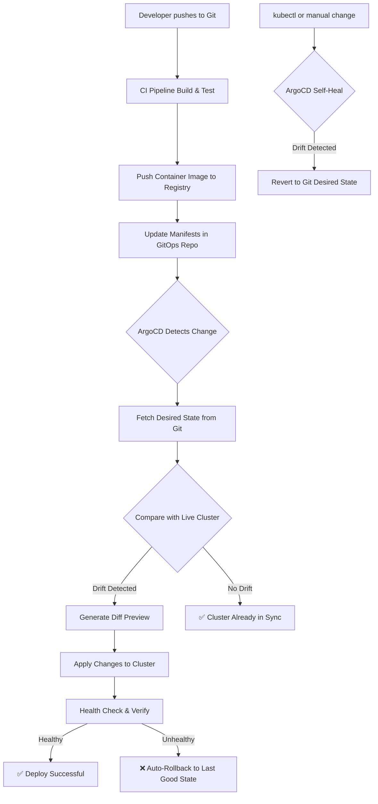

| Difficulty | Channel | Tags |
|---|---|---|
| beginner | devops | argocd, flux, declarative |

When onboarding a single microservice takes two full days, something is fundamentally broken. At Zepto, a fast-growing Indian quick-commerce unicorn, that was the reality — 500+ developers across 20+ teams bottlenecked by manual CI/CD pipelines and infrastructure provisioning that consumed entire sprints. The cost: frequent misconfigurations, service instability, and developer frustration that slowed the entire organization. This is the story of how GitOps with ArgoCD transformed that chaos into a 10-minute workflow. [1]

---

> ### Real-World Case — Zepto
>
> Zepto, a fast-growing Indian quick-commerce unicorn delivering groceries in minutes, faced critical bottlenecks scaling their engineering organization. Teams spent days manually onboarding new microservices, configuring CI/CD pipelines, and provisioning infrastructure with little visibility across environments, causing frequent misconfigurations and service instability.
>
> | | |
> |---|---|
> | **Challenge** | 500+ developers across 20+ teams needed to ship features at the speed their business promised customers (10-minute deliveries), but onboarding a new microservice took 2 days of manual work. With no standardized platform, each team reinvented deployment pipelines, leading to configuration drift, snowflake clusters, and instability. |
> | **Solution** | Built an internal developer platform using Backstage, Kubernetes, and ArgoCD for GitOps-driven deployments. ArgoCD managed 700+ applications with declarative Git-based synchronization, self-healing, and automated rollbacks. Developers self-served via Backstage templates that automatically generated ArgoCD Application manifests, eliminating manual CI/CD setup. |
> | **Outcome** | Reduced microservice onboarding from 2 days to 10 minutes (99% reduction). 500+ developers across 20+ teams gained full CI/CD coverage and operational independence. Unified visibility across 700+ ArgoCD applications and 400+ AWS resources. Weekly onboarding queues eliminated entirely. |
> | **Lesson** | GitOps with ArgoCD transforms developer velocity when paired with a self-service platform — the declarative model eliminates configuration drift at scale, and Git-based rollbacks make 'undo' as fast as 'deploy'. The platform team's job shifts from gatekeeping to paving the road. |

---

## Hook — The Deployment Pipeline That Became a Parking Lot

Imagine your most productive engineering day. Now imagine spending the first two hours waiting for someone else to provision infrastructure for a new service. That was every day at Zepto. Teams opened tickets, waited for platform engineers to manually configure CI/CD pipelines, provision AWS resources, and finally — maybe — get code deployed. The queue grew. Sprints slipped. Motivation eroded. And when things went wrong — which they did, often — no one could agree on who changed what or when. The imperative approach — engineers running kubectl commands against production clusters, making ad-hoc hotfixes — had created a tangled web of configuration drift that was nearly impossible to untangle. Zepto hit the wall that every scaling Kubernetes organization eventually hits: imperative deployment breaks at scale.

## Problem — Why Imperative Deployments Are a Scaling Liability

Here is the hard truth: imperative deployments work great for one service and one developer. The moment you scale beyond that, they stop being a deployment strategy and start being a liability. When engineers run kubectl apply, kubectl edit, or helm upgrade --install directly on a cluster, they create what GitOps practitioners call configuration drift. The cluster state diverges from what is in version control. Suddenly, your production environment has tweaks that nobody documented. A load balancer setting patched at 2am. A ConfigMap hotfixed and never committed. And when disaster strikes — a pod crash, a bad rollout, a network partition — you cannot simply roll back because you have no single source of truth. The real cost of imperative operations is invisible until something breaks. Then it becomes very visible, very expensive, and very loud. Many developers discover that what felt like speed (just run a quick command!) actually becomes technical debt with compound interest. [2]

## Real-World Case — Zepto's GitOps Transformation

Zepto's engineering leadership recognized that their manual approach was not just slow — it was dangerous. With 700+ ArgoCD applications and 400+ AWS resources to manage across 20+ teams, the configuration drift problem grew exponentially with every new microservice. Every manual intervention created more technical debt. Their solution was a developer platform combining Backstage for the developer portal, ArgoCD for GitOps deployments, and Kubernetes as the runtime layer. The results speak for themselves: microservice onboarding dropped from 2 days to 10 minutes — a 99% reduction. All 500+ developers gained self-service CI/CD coverage with full operational independence. The weekly onboarding queues that had plagued the platform team disappeared entirely. Most importantly, the platform team shifted from firefighting tickets to building capabilities, because developers could deploy without waiting for anyone. The fundamental shift? Moving from imperative, ticket-driven operations to declarative, Git-driven self-service. [1]

## Deep Dive — Declarative vs Imperative: The Plot Twist

Here is where most developers get surprised. You might think GitOps is just "YAML in Git plus auto-deploy." And while that is technically true, it misses the deeper insight. The real power of the declarative approach is not the automation — it is the reconciliation loop. ArgoCD does not simply apply your manifests once and walk away. It continuously monitors the cluster, comparing the actual state against the desired state defined in Git. If someone runs kubectl delete deployment nginx on a production cluster, ArgoCD detects the drift within its configurable health check interval (typically 1–5 minutes) and recreates the deployment to match the Git state. This self-healing capability is the game-changer. [3] The declarative approach means you define outcomes, not steps. "I want 3 replicas of this service with this container image" — not "Run kubectl scale, then update the image, then check rollout status." This philosophical shift from imperative verbs (do, run, create) to declarative nouns (desired state, current state, reconciliation) is what makes Kubernetes operations auditable, repeatable, and safe at scale. For teams using Helm charts [4] or Kustomize overlays [5], ArgoCD handles template rendering and diff computation, giving you a preview of exactly what changes before they happen. This is the plot twist most engineers miss: declarative is not slower — it is faster because it eliminates the cognitive overhead of orchestrating steps.

## Workflow — The GitOps Deployment Pipeline in Action

Building on the declarative foundation, here is how a GitOps workflow with ArgoCD actually operates. The flow begins when a developer commits code to a Git repository. A CI pipeline builds and pushes a container image. Then — and this is where GitOps differs from traditional CD — instead of deploying directly to the cluster, the CI pipeline updates the Kubernetes manifests in a separate GitOps repository. ArgoCD detects this change (via polling or webhooks), compares the desired state in Git against the live cluster, computes the diff, and applies only the necessary changes. The diagram below illustrates this continuous reconciliation loop. The critical insight: Git is not just a trigger — it is the single source of truth for both application code and infrastructure configuration. Every change is tracked, reviewed via pull requests, and audit-ready. [6]

## Code Example — Deploying a Microservice with ArgoCD

The heart of any ArgoCD setup is the Application Custom Resource Definition (CRD). This YAML manifest tells ArgoCD what to deploy, where to deploy it, and how to handle sync operations. The source block points to the Helm chart in the GitOps repository, the destination specifies the target cluster and namespace, and the syncPolicy block configures auto-sync with pruning and self-healing. The retry configuration with exponential backoff ensures resilience against transient failures. The CreateNamespace option eliminates the manual step of pre-creating namespaces — a common pain point for teams scaling from 10 to 100+ microservices.

## Lessons Learned — What Zepto's Journey Teaches Every Kubernetes Team

Zepto's transformation offers actionable lessons for any team adopting GitOps. First, self-healing is not optional — it is the entire point. Without automatic drift remediation, you are using Git as a fancy deployment trigger, not a true source of truth. Second, invest in developer experience. Zepto paired ArgoCD with Backstage to create a self-service portal, which was key to getting 500+ developers to adopt the workflow. Third, start small and standardize. Pick one Helm chart template, get that working end-to-end, then layer on complexity. Teams that try to migrate 700 applications at once are the teams that fail. Fourth, observability matters. Zepto's unified view across 700+ ArgoCD applications did not happen by accident — they deliberately built dashboards around the GitOps workflow. [7] Finally, remember that GitOps is a cultural shift, not just a technical one. It requires teams to commit to code reviews for infrastructure changes, resist the temptation to hotfix production directly, and trust the reconciliation loop to maintain state. The teams that embrace this discipline reap the rewards: auditable deployments, zero-configuration rollbacks, and engineering teams that ship with confidence instead of anxiety.

---

## GitOps Deployment Pipeline with ArgoCD Reconciliation Loop

<strong>Original Interview Question</strong>

**Q:** You're setting up GitOps for a microservices deployment. How would you configure ArgoCD to automatically sync changes from your Git repository to Kubernetes, and what's the difference between declarative and imperative approaches in this context?

**A:** I'd configure ArgoCD by setting up a Git repository containing Kubernetes manifests or Helm charts, creating an Application CRD that points to the Git repository, enabling auto-sync with a health check interval of 3 minutes, and implementing self-healing to automatically revert any manual changes. The declarative approach involves defining the desired state in Git through YAML manifests, Helm charts, or Kustomize configurations, where ArgoCD continuously reconciles the actual state with the desired state. In contrast, the imperative approach uses kubectl commands to make direct changes to the cluster, bypassing the Git repository as the single source of truth.

## Conclusion

Zepto's journey from 2-day onboarding cycles to 10-minute self-service deployments is not just a DevOps success story — it is proof that the declarative model fundamentally changes how engineering organizations operate at scale. The difference between imperative and declarative approaches is not about syntax or tools. It is about trust. Do you trust your engineers to run commands correctly every time, or do you trust a system designed to converge toward a known, reviewed, and version-controlled state? The teams that choose the latter do not just deploy faster — they sleep better. Start small: pick one service, define its desired state in a GitOps repository, configure ArgoCD, and let the reconciliation loop do the rest. Once you see your first automatic drift correction, you will never go back.

---

## References

1. [Zepto Wins CNCF End User Case Study Contest for Developer Platform Innovation with Backstage, Argo, and Kubernetes](https://www.cncf.io/announcements/2025/08/05/zepto-wins-cncf-end-user-case-study-contest-for-developer-platform-innovation-with-backstage-argo-and-kubernetes) — blog
2. [Kubernetes Declarative Management](https://kubernetes.io/docs/concepts/overview/working-with-objects/declarative-management/) — documentation
3. [ArgoCD Documentation — Automated Sync and Self-Healing](https://argo-cd.readthedocs.io/en/stable/) — documentation
4. [Helm Documentation — The Package Manager for Kubernetes](https://helm.sh/docs/) — documentation
5. [Kustomize — Kubernetes Native Configuration Management](https://kubectl.docs.kubernetes.io/guides/) — documentation
6. [OpenGitOps — Principles and Standards for GitOps](https://opengitops.dev/) — documentation
7. [Flux CD Documentation — GitOps for Kubernetes](https://fluxcd.io/docs/) — documentation
8. [Cloud Native Computing Foundation — Projects Landscape](https://www.cncf.io/projects/) — documentation

---

**Author:** Satishkumar Dhule — [GitHub](https://github.com/satishkumar-dhule) · [LinkedIn](https://linkedin.com/in/satishkumar-dhule) · [Website](https://satishkumar-dhule.github.io)
