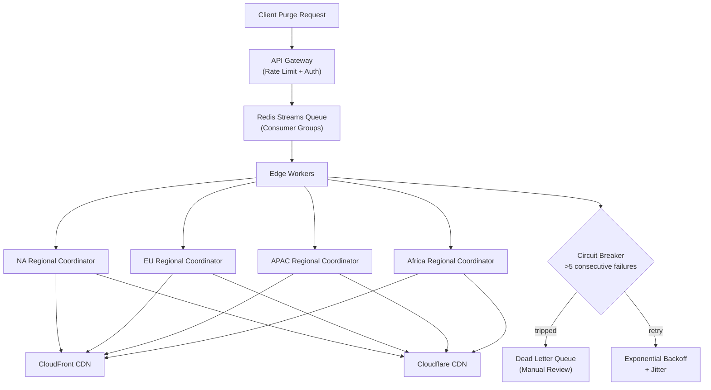

| Difficulty | Channel | Tags |
|---|---|---|
| intermediate | system-design | edge, caching, purging |

What if you could make content disappear from 330+ data centers spread across 120+ countries in under 150 milliseconds? That is the question Cloudflare engineers asked themselves when their centralized purge architecture began showing cracks under the weight of exponential growth [1]. The re-architecture they embarked on—moving from a spoke-hub model to a distributed edge-native system—achieved a 90.5% reduction in purge latency and offers a masterclass in distributed systems design for every engineer building at scale.

---

> ### Real-World Case — Cloudflare
>
> Cloudflare operates one of the world's largest CDNs across 330+ cities in 120+ countries. Their original cache purge system used a centralized 'spoke-hub' architecture built on Quicksilver, but as their network and customer base grew exponentially, customers in regions like Australia and Africa were seeing purge propagation times of 1.4+ seconds, and storage costs were spiraling as purge metadata consumed disks needed for caching.
>
> | | |
> |---|---|
> | **Challenge** | The centralized architecture had three fundamental problems: (1) Latency was directly proportional to geographic distance from the core data center — Australian customers had to wait for round-trips across the Pacific; (2) The centralized ingest point created a throughput bottleneck that required Kafka queues just to buffer traffic spikes; (3) Storage needs in every data center correlated linearly with purge throughput, consuming cache disk space. |
> | **Solution** | Cloudflare rebuilt their entire purge system as a 'coreless' distributed architecture. They built CacheDB, a Rust service on RocksDB that runs on every machine to index cached content per-disk — enabling proactive content deletion instead of the old 'lazy purge' approach. They used Cloudflare Workers with Durable Objects for peer-to-peer purge distribution with dozens of regional queue objects, plus regional 'fanout workers' to efficiently broadcast purges within regions instead of globally. Each purge is validated locally first (filtering out >50% of invalid requests), then the cache key is distributed peer-to-peer rather than routing through a central hub. |
> | **Outcome** | Global purge latency dropped from 1,570ms to 149ms (P50) — a 90.5% improvement. Africa went from 1,420ms to 303ms, APAC from 1,300ms to 199ms. Storage overhead for purge tracking dropped 10x. Throughput increased 3x. The system met their goal of being the 'fastest cache purge in the industry' — content is removed from all 330+ data centers before a human blink finishes. |
> | **Lesson** | The old 'lazy purge' approach (deferring deletion and comparing timestamps at request time) seemed efficient but created hidden storage and latency costs that scaled poorly. By embracing per-machine indexing with RocksDB and distributing all coordination to the edge via Durable Objects, Cloudflare discovered that proactive deletion at the machine level was not only faster but also freed up significant cache disk space — a counterintuitive win where doing more work (active deletion) actually reduced total system cost. |

---

## Hook — The Blink Test

Here is a thought experiment. You push a critical security patch. A zero-day was just disclosed, and attackers are actively scanning for vulnerable endpoints. You need your CDN to stop serving the old, compromised version immediately—every edge node, every region, right now. How fast can you guarantee that content is purged globally?

If your answer is "a few seconds," you might already have a problem. At planetary scale, even deleting a cached file becomes a distributed systems nightmare. The real question is not whether you can purge — it is whether you can purge faster than attackers can exploit your stale content. That gap between intention and propagation is where outages happen, revenue is lost, and trust evaporates.

## Problem — The Geometry of Scale

CDN cache invalidation sounds deceptively simple. Send a request that says "please remove this file from cache," and the CDN does it. At small scale with a handful of edge nodes, a centralized queue works fine.

But as your network grows, the geometry of the problem changes. Centralized "spoke-hub" architectures create an unavoidable bottleneck: every invalidation request must travel to the hub and then fan back out to the edges. Nodes farthest from the hub experience the worst latency. Australia and Africa, for example, saw purge times exceeding 1.4 seconds—an eternity when your users are being served stale content.

Moreover, storing metadata about every pending invalidation consumes valuable disk space on edge nodes — space that should be used for actual caching. You end up in a losing trade-off: sacrifice cache capacity for faster purges, or accept slow purges to maximize cache hits. Many teams think the answer is just "throw more infrastructure at it," but the real solution lies in architectural pattern shifts.

## Real-World Case — Cloudflare's Purge Revolution

In 2022, Cloudflare faced this exact crisis. Their original purge system ran on Quicksilver, a centralized key-value store that acted as the source of truth for all cache tags and purges [1]. As customers adopted more aggressive caching and purge volumes grew exponentially, the system began buckling.

Customers in Australia and Africa saw purge propagation times of 1,400ms at P50. Storage costs were spiraling because purge metadata consumed SSD space meant for caching. The system was hitting fundamental limits.

Cloudflare's engineering team embarked on a re-architecture that moved purge coordination from a centralized hub to the edge itself. The results were dramatic:

- Global P50 purge latency: 1,570ms → 149ms (90.5% improvement)
- Africa: 1,420ms → 303ms
- APAC: 1,300ms → 199ms
- Storage overhead for purge tracking: 10x reduction
- Throughput: 3x increase

Content now disappears from every one of 330+ data centers before a human blink finishes (300–400ms) [1]. The key insight? Instead of making every purge signal travel to a central point and back, they distributed the coordination logic to the regions themselves.

## Deep Dive — The Architectural Trade-offs

Cloudflare's success reveals three counterintuitive principles that apply to any distributed invalidation system.

**First: proximity beats centralization.** You might assume a centralized coordinator is simpler to reason about—and it is—but simplicity trades off against latency. Regional coordinators reduce the distance invalidation signals must travel, cutting tail latencies dramatically. The trade-off is complexity: you now need consistency mechanisms across regions.

**Second: batching is a superpower nobody talks about.** Sending one API call per URL is wildly inefficient. Batching 100 URLs per request reduces API costs by up to 90% avoids rate limits, and improves throughput linearly. Many teams miss this and wonder why their purge systems throttle.

**Third: TTLs are your safety net.** You might think lower TTLs are always better, but two seconds is the sweet spot for dynamic content — short enough to be imperceptible to users, long enough to deliver meaningful cache hit ratios [5]. Set Cache-Control to max-age=2, must-revalidate so that even if a purge is delayed by a second, users never see stale content. This is the distributed systems version of defense in depth.

These principles lead to a broader design philosophy: build your system assuming purges will occasionally be delayed, not that they will always be instant.

## Workflow — Distributed Purge Architecture

The architecture follows a clear data flow through six stages:

1. **Ingestion:** Purge requests hit the API Gateway, which handles rate limiting, authentication, and request validation before forwarding to the queue.

2. **Queue:** Requests are published to Redis Streams with consumer groups, enabling parallel consumption across multiple edge workers [3].

3. **Coordination:** Edge workers (Cloudflare Workers or equivalent) consume from the queue and fan out purge signals to regional cache coordinators.

4. **Regional Execution:** Each regional coordinator purges content from CDN providers in its territory — CloudFront for AWS-served content, Cloudflare CDN for edge-served content, or both.

5. **Resilience:** A circuit breaker pattern guards against cascading failures. If a regional coordinator fails more than five consecutive times, it is removed from rotation [4]. Failed purges enter a dead letter queue for manual inspection.

6. **Retry:** Exponential backoff with jitter prevents thundering herd problems when multiple coordinators retry simultaneously [6].

The diagram below visualizes this pipeline, showing how a single purge request fans out through regional coordinators to multiple CDN providers simultaneously.

## Code Example — Batch Invalidation with Circuit Breaker

Here is a production-ready pattern that demonstrates the core loop: batch URLs, send them with exponential backoff, and trip a circuit breaker after repeated failures. This is the same pattern Cloudflare and AWS teams use internally.

The `purge` method is the main entry point — it chunks URLs into optimal batches (100 per call) and fans them out concurrently. Each batch request includes exponential backoff with jitter to handle rate limiting gracefully. If a batch exhausts all retries, it lands in the dead letter queue rather than being silently dropped.

The circuit breaker tracks consecutive failures across all batches. After five failures, it throws immediately without making further API calls — preventing a cascading collapse if the CDN API is degraded. This pattern reduces API costs by ~90% through batching and prevents system-wide meltdowns during partial outages.

## Lessons Learned — Purge at Scale

Cloudflare's journey and the architectural patterns explored here distill into five takeaways you can apply tomorrow:

**1. Centralization is the enemy of latency.** Any system where invalidation signals travel a long distance to a hub and back will eventually hit a latency wall. Regional coordination is not optional past a certain scale.

**2. Batch aggressively.** One API call per URL is a recipe for rate limiting and spiraling costs. Batch sizes of 50–100 offer the best trade-off between latency and throughput.

**3. Use TTLs as a second line of defense.** Short TTLs (2 seconds) mean stale content self-invalidates even if the purge system is degraded. This is your safety net.

**4. Circuit breakers prevent domino effects.** Five consecutive failures should trip the breaker. Let the system degrade gracefully rather than crash under load.

**5. Retry with jitter, not fixed intervals.** Thundering herds can take down an already-strained API. Exponential backoff with random jitter distributes retry load evenly.

The most important lesson? Purge systems are not just about deleting cached content — they are about trust. Every millisecond of staleness is a moment your users might see the wrong thing. Design accordingly.

---

## Distributed Cache Purge Architecture

<strong>Original Interview Question</strong>

**Q:** How would you design a multi-region CDN cache purging system that guarantees content propagation within 5 seconds while handling 10,000 concurrent invalidations per second?

**A:** Implement Cloudflare API + AWS CloudFront with distributed invalidation queue, edge compute coordination, and 2-second TTL. Use batch invalidation, exponential backoff, and regional cache headers for 5-second SLA.

## Conclusion

Cache invalidation at planetary scale is not a plumbing problem — it is a distributed systems design problem. Cloudflare proved that moving coordination to the edge, batching aggressively, and designing for graceful degradation can turn a 1.4-second problem into a blink-of-an-eye operation. The next time you design a system that touches hundreds of data centers, ask yourself: is your architecture helping you purge quickly, or is it making bad latency worse? Because in the gap between intention and propagation, trust is gained — or lost.

---

## References

1. [Cloudflare Instant Purge — How Cloudflare achieved the fastest cache purge in the industry](https://blog.cloudflare.com/instant-purge/) — blog
2. [AWS CloudFront Invalidations — Managing content distribution updates](https://docs.aws.amazon.com/AmazonCloudFront/latest/DeveloperGuide/Invalidation.html) — documentation
3. [Redis Streams — Data types and consumer groups](https://redis.io/docs/data-types/streams/) — documentation
4. [Circuit Breaker Pattern — Martin Fowler](https://martinfowler.com/bliki/CircuitBreaker.html) — blog
5. [MDN HTTP Caching — Cache-Control directives and best practices](https://developer.mozilla.org/en-US/docs/Web/HTTP/Caching) — documentation
6. [Exponential Backoff and Jitter — AWS Architecture Blog](https://aws.amazon.com/blogs/architecture/exponential-backoff-and-jitter/) — blog
7. [Edge Computing — Wikipedia](https://en.wikipedia.org/wiki/Edge_computing) — documentation
8. [Consistency Models — Distributed systems consistency patterns](https://en.wikipedia.org/wiki/Consistency_model) — documentation
9. [API Gateway Pattern — Architectural pattern for managing API traffic](https://en.wikipedia.org/wiki/API_gateway) — documentation

---

**Author:** Satishkumar Dhule — [GitHub](https://github.com/satishkumar-dhule) · [LinkedIn](https://linkedin.com/in/satishkumar-dhule) · [Website](https://satishkumar-dhule.github.io)
