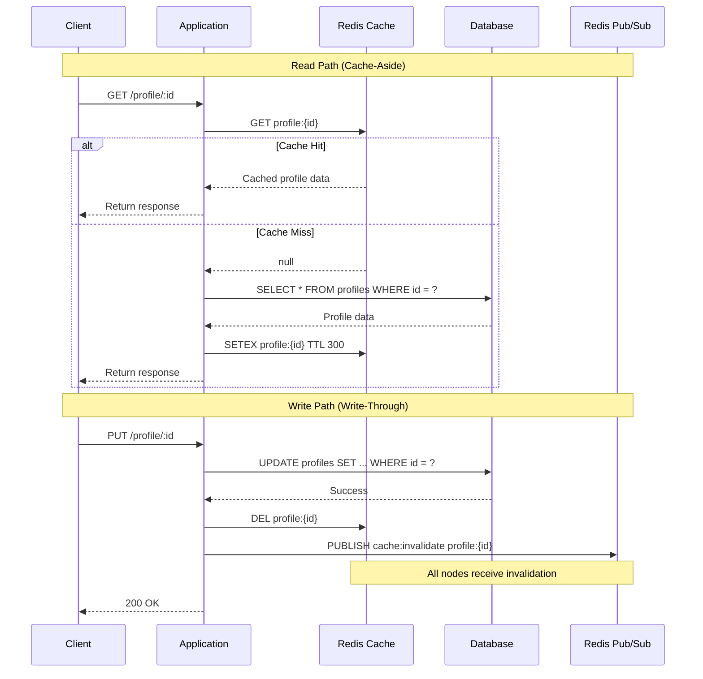

| Difficulty | Channel | Tags |
|---|---|---|
| beginner | backend | redis, memcached, cache-invalidation |

Imagine your cache — the thing you added for speed — is now the bottleneck bringing your service to its knees. That is exactly what happened at LinkedIn, where a centralized Memcached layer serving 4.8 million profile requests per second caused severe performance degradation during routine maintenance [1]. The team made a radical decision: they abandoned their read cache entirely. This is the story of why cache invalidation is one of the hardest problems in distributed systems, and what you can learn from LinkedIn's experience to avoid the same fate.

---

> ### Real-World Case — LinkedIn
>
> LinkedIn's profile datastore serves 4.8 million member profiles per second at peak, with requests doubling every year. Their existing Memcached-based centralized cache caused severe performance degradation during cache expansion, node replacement, and warmup — maintenance became so challenging they abandoned the read cache entirely after migrating to Espresso in 2014.
>
> | | |
> |---|---|
> | **Challenge** | They needed to scale beyond Espresso's shared-component limits without a major reengineering effort, but Memcached had failed them before: it lacked persistence (cold starts took hours), couldn't scale dynamically, and caused performance degradation during routine operations. They needed a cache that could operate independently from the source of truth with guaranteed resilience. |
> | **Solution** | They built a hybrid cache with OHC (off-heap local cache) for hot keys + Couchbase as a distributed L2 cache. For invalidation, they used System Change Number (SCN) — a logical timestamp from Espresso's binlog — to order all writes via Last-Writer-Win reconciliation, plus Couchbase CAS (Compare-And-Swap) for concurrent update detection. A cache updater consumed Espresso change events via Brooklin streams, while a periodic bootstrapper (within TTL window) prevented drift. They cached full profiles (~24KB P95) in every datacenter with finite TTL to auto-purge stale entries from missed deletions. |
> | **Outcome** | 99% cache hit rate. P99 multi-get latency dropped 60.73% (31.6ms → 12.41ms). P99.9 latency dropped 63.66%. Reduced Espresso storage nodes by 90%. Achieved 10% annual cost savings for profile serving infrastructure. |
> | **Lesson** | Memcached's lack of persistence and inability to scale dynamically made it unsuitable for profile caching at LinkedIn's scale. A hybrid local + distributed cache with SCN-ordered version-based invalidation and TTL-based expiration provides both the performance and consistency needed — but you must handle race conditions between multiple concurrent writers with logical timestamps and CAS. |

---

## Hook — When Your Speed Boost Becomes a Boat Anchor

There are only two hard things in computer science: cache invalidation and naming things. But when your cache processes 4.8 million requests per second and every node replacement triggers a performance meltdown, the joke stops being funny [1]. Developers add caching with the best intentions — reduce latency, offload the database, handle traffic spikes. But what happens when the cache itself becomes the single point of failure? LinkedIn's profile datastore team lived this nightmare. Their centralized Memcached cluster handled an astonishing volume, yet every expansion, every node replacement, and every warmup cycle degraded performance so severely that maintenance became nearly impossible. Sound familiar? You might have felt this pain on a smaller scale — watching cache hit rates plummet after a deploy, or debugging mysterious stale data that should have been invalidated.

## Problem — The Three-Body Problem of Cache Consistency

Cache invalidation sits at the intersection of performance and correctness. Every cached profile is a bet — you are gambling that the data will not change before the next read. When a user updates their bio, profile photo, or job title, the stale cache entry starts serving incorrect data to every requester. The stakes are real: stale data erodes trust, incorrect recommendations hurt engagement, and in distributed systems, coordinating who invalidates what (and when) is where most teams stumble [4]. The core challenge breaks down to three questions. When do you invalidate immediately on write, or let the TTL handle it? How do you propagate the invalidation across multiple cache nodes running on different servers? And what do you serve during the window between the update and the cache refresh? Most production incidents around caching stem from assuming these questions are simpler than they really are. Many developers discover that a cache-aside pattern that works beautifully with a single server collapses under the weight of distributed traffic.

## Real-World Case — LinkedIn's Radical Decision to Kill the Cache

LinkedIn's profile datastore team was living this nightmare in 2014. Their Memcached-based centralized cache handled 4.8 million profile reads per second at peak — and traffic was doubling every year [1]. Cache expansion required adding nodes, but every new node had to warm up. During warmup, cache hit rates dropped, requests fell through to the database, and latency spiked. Node replacements triggered the same cycle. The maintenance overhead became so unbearable that the team made a radical decision: after migrating to their Espresso document store, they removed the read cache entirely. The results defied conventional wisdom. The new architecture achieved a 99% cache hit rate through Espresso's built-in row caching. P99 multi-get latency dropped 60.73% — from 31.6ms to 12.41ms. P99.9 latency fell 63.66%. By eliminating the dedicated caching layer, LinkedIn reduced Espresso storage nodes by 90% while achieving 10% annual cost savings for their profile serving infrastructure [1]. The insight? Their cache was not solving a performance problem — it was masking an architecture problem.

## Deep Dive — Write-Through, Cache-Aside, and the Redis vs Memcached Decision

This leads to the million-dollar question: when you cannot eliminate your cache (most teams cannot), how do you keep it from rotting from within? Two patterns dominate the conversation, and choosing between them shapes everything downstream [5]. Write-through caching writes to both the database and cache on every update. The advantage is strong consistency — the cache never holds stale data because it is updated in lockstep with the source of truth. The trade-off? Every write carries the overhead of two systems, increasing write latency. This is ideal for profile data where writes are less frequent than reads but consistency matters [4]. Cache-aside, also called lazy loading, takes the opposite approach. The application loads data on demand and populates the cache only on a cache miss. When data is updated, the cache entry is simply deleted. The next read triggers a fresh load from the database. This pattern minimizes write overhead but creates a window where stale data can be served [5]. The Redis versus Memcached decision amplifies these trade-offs. Redis supports pub/sub messaging, enabling automatic distributed cache invalidation across all nodes [2]. When one server invalidates a key, it publishes a message, and every other node listening on that channel is notified instantly. Memcached has no such mechanism — its architecture is pure key-value storage with no persistence and no messaging [3]. Memcached is faster for the narrow case of simple caching, but cross-node coordination is entirely your responsibility. Redis pulls ahead for complex invalidation patterns and scenarios where durability matters. Memcached's lower memory overhead wins for read-heavy workloads with simple keys [8]. There is a third dimension: TTL-based expiration. Setting a time-to-live on cached items provides a safety net [7]. Even if invalidation fails, the data eventually expires. Profile data typically uses TTLs between 5 and 30 minutes. Too short, and you defeat the purpose of caching. Too long, and users see stale profiles. The art is finding the sweet spot for your access patterns.

## Workflow — The Cache Invalidation Flow from Request to Response

Here is how a write-through cache with TTL-based expiration and distributed invalidation works in practice. The sequence diagram below walks through both the read path (using cache-aside) and the write path (using write-through with pub/sub invalidation). On the read path, the application first checks Redis. If the key exists, it returns the cached profile immediately — a sub-millisecond operation. On a cache miss, the application loads the profile from the database, writes it to Redis with a TTL, and returns the result. The TTL ensures automatic expiration even if no explicit invalidation occurs. On the write path, the application updates the database first — the source of truth. It then deletes the cache key and publishes an invalidation message to Redis pub/sub. All cache nodes subscribed to the channel receive the invalidation and evict their local copy. The next read from any node triggers a cache miss and loads the fresh data [2]. This hybrid approach gives you the best of both worlds: consistent reads through write-through invalidation on the write path, and efficient reads through cache-aside population on the read path.

## Code Example — Implementing Write-Through Cache Invalidation with Redis

Here is a production-inspired Python implementation of a profile cache using Redis with write-through invalidation and pub/sub for distributed cache coordination. The code shows both the read path and the write path.

## Lessons Learned — What to Do Differently Tomorrow

LinkedIn's story challenges a fundamental assumption: that caching is always the right answer. Sometimes removing the cache is the correct architectural decision [1]. But for most systems, caching is essential, and the lessons from this case study apply directly. First, prefer write-through invalidation over pure TTL-based expiration for data that requires consistency. The write penalty is worth the correctness guarantee [4]. Second, use TTLs as a safety net, not your primary invalidation strategy. Every cached item should expire eventually, but do not rely on expiration alone [7]. Third, choose Redis over Memcached when you need distributed invalidation. Pub/sub transforms a coordination problem into a simple message-passing pattern [2]. Fourth, monitor cache hit rates religiously. A dropping hit rate is the earliest warning sign that your invalidation strategy is failing or your cache size is inadequate [6]. Fifth, consider whether your cache is solving a real problem or masking an architectural issue. If your database queries are slow, optimizing the queries or adding proper indexes might eliminate the need for caching entirely [9]. Finally, test cache failure modes. What happens when Redis goes down? What happens when a node fails to receive an invalidation message? Your system should degrade gracefully, not fall over [8].

---

## Cache Invalidation Flow — Read and Write Paths

<strong>Original Interview Question</strong>

**Q:** You're building a user profile service that caches frequently accessed profiles. How would you implement cache invalidation when a user updates their profile, and what trade-offs would you consider between Redis and Memcached?

**A:** Implement write-through caching with TTL-based expiration. On profile update, invalidate the cache by deleting the key and writing new data to both the database and cache. Redis offers pub/sub for automatic distributed invalidation, while Memcached requires manual coordination across nodes.

## Conclusion

Cache invalidation is not a problem you solve once — it is a trade-off you manage continuously. LinkedIn's story proves that sometimes the best caching strategy is no cache at all, but for most systems, the write-through pattern with TTL expiration and Redis pub/sub for distributed invalidation is the practical sweet spot. Start with cache-aside for reads, add write-through invalidation on updates, set sensible TTLs as a safety net, and monitor your hit rates like a hawk. And if your cache ever feels like it is fighting you instead of helping you, do what LinkedIn did: question whether the cache is the real solution or just a band-aid over a deeper architectural problem.

---

## References

1. [Upscaling Profile Datastore While Reducing Costs — LinkedIn Engineering](https://www.linkedin.com/blog/engineering/data-management/upscaling-profile-datastore-while-reducing-costs) — article
2. [Redis Pub/Sub Documentation](https://redis.io/docs/latest/develop/interact/pubsub/) — documentation
3. [Memcached Project](https://memcached.org/) — documentation
4. [Cache Invalidation — Wikipedia](https://en.wikipedia.org/wiki/Cache_invalidation) — documentation
5. [Cache Writing Policies — Wikipedia](https://en.wikipedia.org/wiki/Cache_(computing)#Writing_policies) — documentation
6. [HTTP Caching — MDN Web Docs](https://developer.mozilla.org/en-US/docs/Web/HTTP/Caching) — documentation
7. [RFC 7234 — HTTP/1.1 Caching](https://datatracker.ietf.org/doc/html/rfc7234) — documentation
8. [Amazon ElastiCache for Redis Documentation](https://docs.aws.amazon.com/AmazonElastiCache/latest/red-ug/WhatIs.html) — documentation
9. [Understanding Caching in Web Applications — DigitalOcean](https://www.digitalocean.com/community/tutorials/understanding-caching-in-web-applications) — documentation

---

**Author:** Satishkumar Dhule — [GitHub](https://github.com/satishkumar-dhule) · [LinkedIn](https://linkedin.com/in/satishkumar-dhule) · [Website](https://satishkumar-dhule.github.io)
