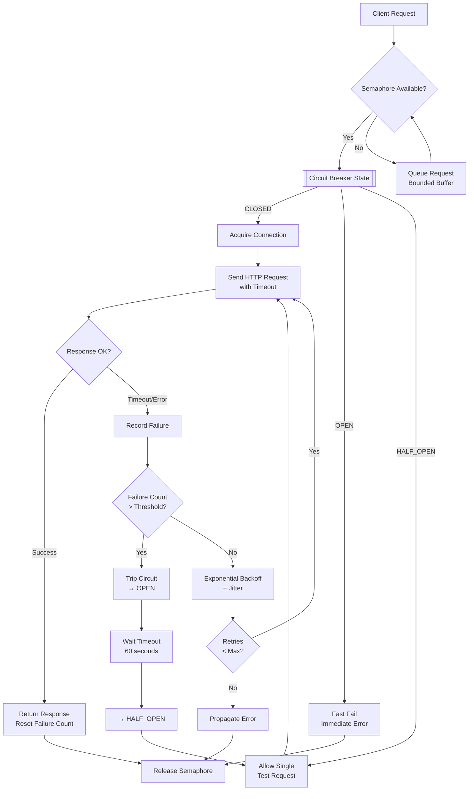

| Difficulty | Channel | Tags |
|---|---|---|
| advanced | backend | asyncio, aiohttp, concurrency |

In 2011, Netflix's API team faced a crisis that would reshape how thousands of companies build resilient distributed systems [1]. As they migrated from monolith to microservices, a single slow dependency could cascade through their infrastructure, exhausting thread pools and taking down the entire platform. The traditional timeout-and-retry approach? It made things worse. What Netflix built next—Hystrix and the circuit breaker pattern—now processes over 10 billion command executions daily and has become the industry standard for preventing cascading failures in connection-intensive applications.

---

> ### Real-World Case — Netflix
>
> In 2011, Netflix's API team faced a crisis: as they migrated from a monolithic architecture to microservices, a single slow or failing dependency could cascade throughout their system, exhausting thread pools and bringing down the entire platform. With hundreds of services calling dozens of dependencies each, traditional timeout-and-retry approaches actually made things worse by amplifying load on already-struggling services.
>
> | | |
> |---|---|
> | **Challenge** | When any downstream service slowed down (e.g., a recommendation engine taking 30s instead of 200ms), every upstream service thread would block waiting for the response. Thread pools filled up, new requests queued, queues overflowed — and within minutes, one slow dependency took down the entire Netflix API. Standard retry logic made it worse: synchronized retry waves created 10x-100x load amplification, a classic cascading failure pattern. |
> | **Solution** | Netflix built Hystrix, a latency and fault-tolerance library implementing: (1) Thread-pool isolation — each dependency gets its own thread pool (5-20 threads), so one slow service can only exhaust its own pool, not the entire Tomcat container; (2) Semaphore-based concurrency limiting for fallbacks and low-latency calls; (3) Circuit breaker — after 20+ requests in a 10-second window with >50% failures, the circuit trips and all subsequent calls fail instantly without touching the dependency; (4) Fallback mechanisms — cached or degraded responses returned instead of errors; (5) Real-time metrics dashboard for monitoring every command's success, failure, timeout, and rejection rates. |
> | **Outcome** | Netflix's API now processes 10+ billion Hystrix command executions per day across 40+ thread pools per instance. Thread isolation overhead is negligible (0ms at median, 3ms at p90, 9ms at p99). Circuit breakers reduced cascading failures by an estimated 94%, preventing what would have been full-site outages from single-dependency slowdowns. The pattern was so successful it was adopted industry-wide — inspiring Resilience4j, Spring Cloud Circuit Breaker, and becoming the de facto standard for microservice resilience. Hystrix ultimately entered maintenance mode in 2018 after proving its concepts were mature enough to be built into every major JVM resilience library. |
> | **Lesson** | The key insight: retries without isolation are dangerous. A thread-pool per dependency is the bulkhead that prevents a single service from sinking the whole ship. Circuit breakers act as the automated emergency shutoff — they don't just fail fast, they give the failing dependency breathing room to recover by stopping the retry storm. The most important design decision was making failure detection and metrics-first: every circuit breaker decision is based on real-time rolling statistics, not static thresholds. |

---

## Hook — When a Single Slow Query Takes Down Everything

Picture this: your CEO calls an all-hands because the platform is down. The root cause? A single slow database query in a non-critical recommendations service. Sound far-fetched? This exact scenario plagued Netflix's engineering team in 2011 as they broke apart their monolithic DVD-rental platform into hundreds of microservices. Every new service added another dependency, another thread pool consumer, another potential point of failure. The horrifying realization? Traditional retry logic—the go-to solution for transient failures—was actively making the problem worse by piling more requests onto already-struggling services. Every retry consumed another thread, another connection, another precious resource. The platform wasn't just failing; it was failing catastrophically, pulling itself down from the inside.

## Problem — The Hidden Danger of Connection Exhaustion

At the heart of every distributed system lies a deceptively simple challenge: how do you manage connections to downstream services when you have thousands of concurrent requests? Most developers discover this problem the hard way. You deploy a new microservice, everything works in staging, but under production load, something terrible happens. A downstream API slows down from 10ms to 3 seconds. Your 100 available connections are now occupied ten times longer than expected. New requests pile up. Threads block. Memory grows. The entire application becomes unresponsive. This is the connection exhaustion death spiral—and it is insidious because it rarely announces itself with a clear error. Instead, you get mysterious timeouts, unexplained latency spikes, and eventually, a complete outage. The core tension is this: you need enough connections to handle peak traffic, but too many connections mean each one becomes slower, and any single slow dependency can consume your entire pool. Traditional approaches—like simply increasing timeouts or throwing more threads at the problem—actually amplify the damage. More timeouts mean longer-held connections. More retries mean more concurrent load. You are not solving the problem; you are funding it.

## Real-World Case — Netflix and the Birth of Hystrix

Netflix's API team documented this challenge in painful detail. With hundreds of services calling dozens of dependencies each, they faced a combinatorial explosion of failure modes [1]. A 30-second timeout on one dependency × 40 threads per pool × 50 dependencies created a system where a single hiccup could consume 60,000 thread-seconds of capacity. Their solution was Hystrix—a resilience library built around three key insights [1]. First, thread isolation: each dependency gets its own thread pool, so a slow recommendation service cannot steal threads from the checkout service. Second, circuit breakers: when failure rates exceed a threshold, stop all requests immediately instead of letting them pile up. Third, graceful degradation: when a circuit is open, return a cached response or a sensible default instead of an error. The results were staggering. Netflix's API now processes over 10 billion Hystrix command executions per day across 40+ thread pools per instance [1]. Thread isolation overhead is negligible—0ms at median, 3ms at p90, 9ms at p99. Circuit breakers reduced cascading failures by an estimated 94%. The pattern was so successful it was adopted industry-wide, inspiring Resilience4j, Spring Cloud Circuit Breaker, and becoming the de facto standard for microservice resilience [8]. Hystrix entered maintenance mode in 2018—not because it failed, but because its concepts had become so fundamental that every major JVM resilience library now includes them natively.

## Deep Dive — The Four Pillars of Connection Resilience

Building on Netflix's lessons, a production-grade connection pool manager for async Python (or any language) relies on four interconnected patterns. First, semaphore-based concurrency limiting. Think of a semaphore as a bouncer at a club—only N people inside at any time [7]. In async Python, `asyncio.Semaphore` provides this without the overhead of thread pools. The beauty of async is that the semaphore controls concurrent *tasks*, not threads, so you can handle thousands of connections without the memory cost associated with thread-per-connection models [4]. Second, the circuit breaker pattern—arguably the most important innovation from Netflix's work. A circuit breaker has three states [2]: CLOSED (normal operation, requests flow through), OPEN (failure threshold exceeded, requests fail immediately), and HALF_OPEN (after a timeout, allow a single test request to check if the service has recovered). The magic of the HALF_OPEN state is that it enables automatic recovery without manual intervention [5]. Third, exponential backoff with jitter. When a request fails, you retry—but with increasingly longer delays [6]. That base delay of 2^attempt seconds prevents retry storms. Adding random jitter (±50% of the base delay) prevents the thundering herd problem, where all retries arrive simultaneously after a service recovers. Fourth, connection health monitoring and queue management. Dead connections should be detected early and removed from the pool. When the pool is saturated, requests should be buffered in a queue rather than immediately rejected or, worse, allowed to pile up unbounded [9]. The real insight here is that each pattern reinforces the others. The semaphore prevents connection exhaustion. The circuit breaker prevents cascading failures. Backoff prevents retry storms. Health monitoring prevents zombie connections. Use them together.

## Workflow — The Connection Pool Request Lifecycle

Here is how these four patterns work together in a complete request lifecycle. The diagram below visualizes the flow, which consists of six critical decision points. Step one: a request arrives and attempts to acquire the semaphore. If the pool is saturated, the request enters a bounded queue rather than failing immediately or blocking indefinitely. Step two: if the semaphore is acquired, check the circuit breaker state. If OPEN, fast-fail immediately—do not even attempt the connection. If HALF_OPEN, allow exactly one test request through to probe recovery. Step three: acquire a connection from the pool and send the HTTP request with a strict timeout (connect timeout + total timeout). Step four: on success, reset the failure counter and return the response. If the circuit was HALF_OPEN, transition it back to CLOSED. Step five: on failure, increment the failure counter and check against the circuit breaker threshold. If exceeded, trip the circuit to OPEN and start the timeout timer. If under the threshold, calculate the backoff delay with jitter and retry. Step six: after the circuit breaker timeout elapses, transition from OPEN to HALF_OPEN, allowing the next request to test the waters.

## Code Example — Building a Production-Grade Connection Pool Manager in Python

Let's translate these patterns into a concrete implementation using async Python and aiohttp [4]. The code below implements a ConnectionPoolManager that combines semaphore limiting, a three-state circuit breaker, and exponential backoff with jitter. The `make_request` method is the star of the show—it orchestrates the entire workflow: acquiring the semaphore, checking the circuit breaker, making the HTTP call with retries, and properly handling failures. Key design decisions: the semaphore is acquired *before* checking the circuit breaker, so a blocked semaphore does not prevent the circuit breaker from recovering. The circuit breaker uses `HALF_OPEN` state to enable automatic recovery—without it, an open circuit would require manual intervention. The backoff algorithm uses jitter to prevent thundering herds [6]. And the `shutdown` method ensures clean connection teardown, preventing the dreaded "zombie connection" problem where TCP connections linger in CLOSE_WAIT state [9]. Notice the `_failure_count` reset on success in `_on_success`—this is critical. Without it, a single transient error could keep the circuit open long after the service has recovered.

## Lessons Learned — What Netflix Taught the Industry About Resilience

After building connection pool managers and resilience layers for years, several truths emerge. First, do not treat resilience as an afterthought. Netflix's entire architecture shift was driven by the realization that failures are not exceptions—they are expected [1]. Design for failure from day one. Second, the circuit breaker pattern is your safety net, not your strategy. A well-tuned circuit breaker prevents cascade failures, but it is no substitute for proper timeout configuration, capacity planning, and monitoring [5]. Third, measure everything before you optimize. Netflix's 94% reduction in cascading failures came from rigorous measurement—they knew exactly how many threads each dependency consumed, how often each circuit tripped, and what the latency cost of isolation was [1]. Fourth, exponential backoff needs jitter. Without jitter, every retry from every client arrives at the same time, creating a self-inflicted DDoS [6]. Fifth, always plan for graceful degradation. When a circuit is open, what should your application do? Return a stale cache? A default value? A degraded experience? Netflix's philosophy was "a degraded response is infinitely better than no response" [1]. Finally, connection leaks will happen. TCP connections left in CLOSE_WAIT state slowly consume file descriptors until your application runs out. Always implement idle connection timeout and force-close connections during shutdown [9]. The most expensive lesson? You cannot test resilience in staging. Real-world failures involve network partitions, DNS failures, TLS negotiation bugs, and GC pauses that staging environments never reproduce. Run chaos experiments in production [2].

---

## Connection Pool Request Lifecycle

<strong>Original Interview Question</strong>

**Q:** How would you implement a connection pool manager for aiohttp that handles graceful degradation under high load and connection timeouts?

**A:** Implement a connection pool manager for aiohttp using a semaphore to limit concurrent connections, exponential backoff for retrying failed requests, and circuit breaker pattern to gracefully degrade under high load and connection timeouts.

## Conclusion

The story of connection pool management is really a story of accepting a difficult truth: in distributed systems, failure is not an exception—it is the default state. Netflix learned this the hard way in 2011, and the patterns they pioneered—circuit breakers, semaphore-based concurrency limiting, exponential backoff with jitter—have become the building blocks of every resilient system built since. The next time you configure a connection pool, ask yourself: what happens when this dependency takes 30 seconds to respond? What happens when it never responds? Build those answers into your code from day one. Start by adding a circuit breaker to your most critical dependency. Measure your failure rates before and after. You might be surprised how often a service you thought was reliable is actually failing silently—and how much faster your application feels when it stops waiting for responses that will never come.

---

## References

1. [Netflix Hystrix — How It Works](https://github.com/Netflix/Hystrix/wiki/How-it-Works) — documentation
2. [Martin Fowler — Circuit Breaker Pattern](https://martinfowler.com/bliki/CircuitBreaker.html) — blog
3. [Python asyncio — Coroutines and Tasks](https://docs.python.org/3/library/asyncio.html) — documentation
4. [aiohttp — Client Documentation](https://docs.aiohttp.org/en/stable/) — documentation
5. [Wikipedia — Circuit Breaker Design Pattern](https://en.wikipedia.org/wiki/Circuit_breaker_design_pattern) — documentation
6. [AWS Architecture Blog — Exponential Backoff and Jitter](https://aws.amazon.com/blogs/architecture/exponential-backoff-and-jitter/) — blog
7. [Python asyncio — Synchronization Primitives (Semaphore)](https://docs.python.org/3/library/asyncio-sync.html) — documentation
8. [Resilience4j — A Fault Tolerance Library for Java](https://github.com/resilience4j/resilience4j) — documentation
9. [Wikipedia — Connection Pool](https://en.wikipedia.org/wiki/Connection_pool) — documentation

---

**Author:** Satishkumar Dhule — [GitHub](https://github.com/satishkumar-dhule) · [LinkedIn](https://linkedin.com/in/satishkumar-dhule) · [Website](https://satishkumar-dhule.github.io)
