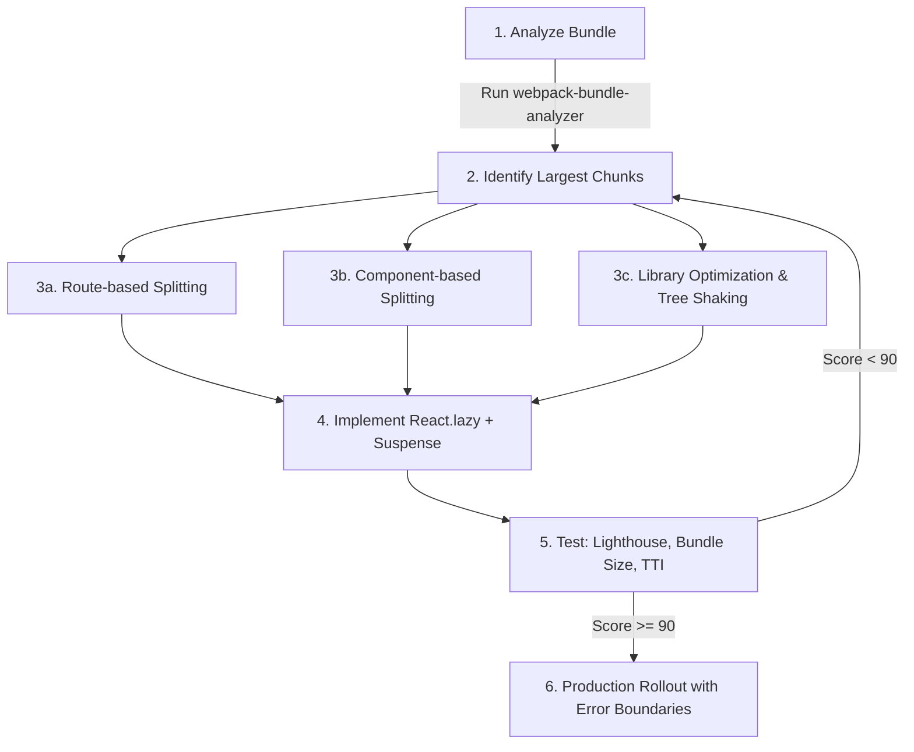

| Difficulty | Channel | Tags |
|---|---|---|
| intermediate | frontend | lighthouse, bundle, lazy-loading |

In 2015, Twitter faced an existential threat. Emerging markets were exploding with new users, but those users were on low-end Android devices connected over 2G and 3G networks. The native app was too heavy, data was too expensive, and Twitter was losing the next billion users before they even signed up. Their solution? A React PWA called Twitter Lite that delivered the full experience in just 1-3% of the data cost of native — and drove a 75% increase in tweets sent [1]. The secret wasn't magic. It was ruthless performance optimization. Here is how you can apply the same principles to your React app.

---

> ### Real-World Case — Twitter
>
> In 2015, Twitter set out to reach users in emerging markets with slow networks and expensive data plans. They built Twitter Lite — a React-based PWA that was the largest React PWA at the time — targeting users on low-end Android devices over 2G/3G connections. The app needed to deliver the full Twitter experience at a fraction of the data cost.
>
> | | |
> |---|---|
> | **Challenge** | Twitter's mobile web experience suffered from monolithic JavaScript bundles that bloated initial load times. Every user downloaded all routes and components upfront regardless of what they actually used, making the app nearly unusable on the median mobile hardware (Moto G4) and 3G connections where most of their growth market users lived. |
> | **Solution** | Twitter implemented route-based code splitting using Webpack's CommonsChunkPlugin and React Loadable to break monolithic bundles into per-route chunks loaded on demand. They added performance budgets, Service Workers for aggressive caching, a data saver mode that replaced images with blurred previews (reducing image data by 40%), and used the PRPL pattern to optimize delivery. The team made small but cumulative wins across code splitting, component rendering optimization, image loading, and runtime performance tracking. |
> | **Outcome** | Twitter Lite drove a 75% increase in tweets sent, 65% increase in pages per session, and 20% decrease in bounce rate vs the previous mobile web experience. The PWA delivered the core Twitter experience in just 1-3% of the data cost of native apps. Users swiped and messaged more on the PWA than on native, with session times actually longer on web. The PWA loaded in under 5 seconds on most devices, and the codebase remained largely unchanged for over 8 years. |
> | **Lesson** | Route-based code splitting is the highest-leverage performance optimization for large React apps. Performance is a continuous game of small, cumulative wins — not a single fix. Perhaps most surprisingly, a well-optimized PWA can outperform native apps on engagement metrics when data costs and device constraints are addressed head-on. The most critical enabler was making performance an organizational priority from the top down. |

---

## Hook — The 4.2 Second Wall

Your Lighthouse score is 65. The bundle is 2.1MB. Time to Interactive is 4.2 seconds. Every one of those numbers is a leaky bucket — users are draining away while your JavaScript finishes parsing on their device. Sound familiar? Here is the uncomfortable truth: most React apps are overweight not because of React itself, but because developers treat `import` statements like they are free. They are not. Every import adds bytes. Every byte adds milliseconds. And on a mid-range Android phone on 3G, those milliseconds compound into a wall between your user and your product. Twitter faced this exact wall in 2015. They had to compress an entire social network into a sub-5-second load experience on hardware that cost $50. What they discovered changed how the industry thinks about React performance.

## Problem — The Silent Bloat Epidemic

Modern React apps suffer from a subtle but devastating problem: dependencies are too easy to add and too hard to remove. A team adds lodash for one utility function. A charting library for a single dashboard. A date picker for one form field. Individually, each decision seems reasonable. Collectively, you get a 2.1MB bundle. The real kicker? Most of that JavaScript is never executed on the initial page load. Studies show that 70-90% of a typical React app's JavaScript is unused during the first render [2]. Users pay the full download, parse, and execute cost for features they might never use. This is the silent bloat epidemic — and it is the number one reason your Lighthouse score is stuck at 65.

## Real-World Case — Twitter Lite

Twitter's emerging markets problem was acute. The native Android app was 23MB. Data in countries like India, Indonesia, and Brazil costs 10-20x more per gigabyte than in the US. A user checking Twitter for five minutes could exhaust their entire daily data budget. Twitter's engineering team made a bold bet: build a Progressive Web App in React that delivered the full product experience in under 100KB of JavaScript on first load [1]. They achieved this through aggressive code splitting — each route loaded only its own JavaScript chunk. The timeline view loaded just timeline code. The compose tweet view loaded just compose code. Nothing else. The results were staggering: a 75% increase in tweets sent, 65% increase in pages per session, and a 20% decrease in bounce rate. Users on the PWA actually had longer session times than on native. The codebase remained stable for over 8 years [3]. This wasn't a toy demo — it was the largest React PWA in production at the time.

## Deep Dive — Code Splitting Strategies and the Art of Deferred Loading

There are three levels of code splitting, and most teams only use one. **Route-based splitting** is the easiest win: every route gets its own chunk loaded on demand. Twitter Lite used this as their foundation. **Component-based splitting** goes deeper: heavy components like charts, rich text editors, or maps get their own chunks and only load when they actually render. Many developers discover that a dashboard page can cut its initial JavaScript by 80% just by deferring the chart library until the chart is in the viewport [4]. **Library-level splitting** is the most advanced: third-party libraries themselves get split into logical chunks. Moment.js (now deprecated, but a classic example) could be split into locale chunks. Lodash should use per-method imports. The key insight from Twitter's approach is that splitting isn't just about routes — it is about user behavior. What does the user actually need right now? Load that. Everything else can wait. You might think lazy loading everything is always the answer. Here is the plot twist: over-splitting actually hurts performance. Every split creates an HTTP request. On HTTP/1.1, more requests mean more latency. On HTTP/2, the overhead is lower but still real. You need to find the sweet spot — typically 3-6 chunks for initial route, with 20-30KB as the minimum viable chunk size [5].

## Workflow — From 65 to 90+ in Six Steps

Getting from a Lighthouse score of 65 to 90+ requires a systematic approach. You cannot just add `React.lazy()` everywhere and call it a day. Here is the battle-tested workflow that teams at Twitter, Shopify, and Airbnb have used to transform their React performance. The flowchart below maps the journey from analysis to production rollout.

## Code Example — Implementing Production-Grade Lazy Loading

Route-based splitting with React.lazy() is the foundation, but production code needs error boundaries, loading states, and preloading strategies. Here is how Twitter Lite's pattern translates to a modern React app using React Router.

## Lessons Learned — What 8 Years of Twitter Lite Taught Us

Twitter Lite's codebase remained largely unchanged for over 8 years [1]. That stability was not an accident — it was the result of architectural decisions that stood the test of time. Here is what you should take away: First, **measure before you optimize**. Without bundle analysis, you are flying blind. Second, **split by user intent, not by component**. The question is not "what can I lazily load?" but "what does this user need right now?" Third, **error boundaries are non-negotiable**. A failed lazy load should never break the entire app. Fourth, **preloading is the hidden superpower**. Twitter preloaded critical chunks based on user behavior patterns — if someone was reading a tweet, the compose chunk loaded in the background [3]. Fifth, **accept the trade-off**. Code splitting changes your loading waterfall from "one big file" to "critical file + async chunks." That trade-off is almost always worth it for time-to-interactive, but it means your total bytes downloaded might increase (because of chunk overhead). Optimize for perceived performance, not just raw metrics.

---

## React Performance Optimization Pipeline

<strong>Original Interview Question</strong>

**Q:** You're tasked with improving a React app's Lighthouse performance score from 65 to 90+. The bundle size is 2.1MB and Time to Interactive is 4.2s. What specific steps would you take to optimize the bundle and implement lazy loading?

**A:** Implement code splitting with React.lazy() and Suspense, analyze bundle composition with webpack-bundle-analyzer to identify largest chunks, remove unused dependencies and optimize imports, add dynamic imports for heavy components and third-party libraries, implement route-based splitting for better initial load times, and utilize tree shaking with proper ES module configuration.

## Conclusion

Your Lighthouse score of 65 is not a failure. It is an invitation. Twitter proved that with the right strategy, a React app can deliver a world-class experience on hardware and networks you would never expect. The same techniques that powered Twitter Lite — bundle analysis, route-based splitting, component-based deferral, error boundaries, and preloading — can take your app from 65 to 90+. Start with a bundle analyzer. Find your biggest chunks. Split by user intent, not by component. And never forget: every byte you do not ship is a millisecond your user does not wait.

---

## References

1. [How We Built Twitter Lite](https://blog.x.com/engineering/en_us/topics/open-source/2017/how-we-built-twitter-lite) — blog
2. [Reduce JavaScript payloads with code splitting](https://developer.mozilla.org/en-US/docs/Web/Performance/Critical_rendering_path#reducing_javascript_payloads_with_code_splitting) — documentation
3. [Twitter Lite: A PWA for the Next Billion Users](https://developers.google.com/web/showcase/2017/twitter) — blog
4. [React.lazy – Lazy loading with Suspense](https://react.dev/reference/react/lazy) — documentation
5. [webpack-bundle-analyzer](https://github.com/webpack-contrib/webpack-bundle-analyzer) — documentation
6. [Code Splitting in webpack](https://webpack.js.org/guides/code-splitting/) — documentation
7. [Lighthouse Performance Scoring](https://developer.chrome.com/docs/lighthouse/performance/performance-scoring) — documentation
8. [Tree Shaking – MDN Web Docs](https://developer.mozilla.org/en-US/docs/Glossary/Tree_shaking) — documentation

---

**Author:** Satishkumar Dhule — [GitHub](https://github.com/satishkumar-dhule) · [LinkedIn](https://linkedin.com/in/satishkumar-dhule) · [Website](https://satishkumar-dhule.github.io)
