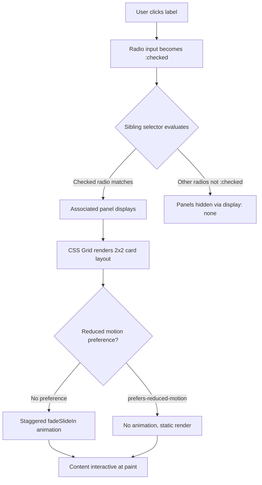

| Difficulty | Channel | Tags |
|---|---|---|
| beginner | frontend | css, flexbox, grid, animations |

Imagine you are the first engineer hired for a design systems team at a growing SaaS company. Your first task? Build a tab component for the documentation site. Simple, right? Before you reach for React, consider this: Netflix once shipped 300kB of JavaScript on their logged-out homepage — the very first page millions of potential subscribers see [1]. On 3G connections, that page took 7 agonizing seconds to become interactive. Seven seconds of staring at a frozen screen. For a tab switcher. This is the story of why sometimes, the most powerful tool in your arsenal is the one you already have: CSS.

---

> ### Real-World Case — Netflix
>
> Netflix's logged-out homepage (where users sign up) had 300kB of JavaScript from React, Lodash, and other client-side libraries. On 3G connections, it took 7 seconds to become interactive — devastating for a landing page that's the first impression for millions of new users worldwide.
>
> | | |
> |---|---|
> | **Challenge** | The tabbed UI components on the homepage (tabs for features, plans, FAQ sections) were built with React client-side, requiring the entire React runtime + hydration data to load before users could even click a tab. This was pure overhead for a simple tab-switching interaction. |
> | **Solution** | Netflix ported their homepage tabs and other simple interactive components (language switcher, cookie banner) from client-side React to lighter alternatives. While they used vanilla JavaScript rather than pure CSS-only, the core principle was identical: eliminating JavaScript framework overhead for simple UI state management like tab switching. |
> | **Outcome** | Time-to-Interactive decreased by 50%. JavaScript bundle size reduced by 200kB (from ~300kB to ~100kB). The tab component went from requiring React hydration to being instantly interactive on page load. |
> | **Lesson** | Simple interactive components like tab panels don't need a JavaScript framework. The CSS radio-button hack (or minimal vanilla JS) eliminates the framework tax entirely — React's 45kB runtime + hydration overhead for a tab switcher is wasteful. Server-render the HTML, use lightweight patterns for interaction. |

---

## Hook — The Tab That Cost Seconds

Picture this: you are in a product review meeting. The design system team presents the new documentation site. It looks beautiful. The tabs slide smoothly. The cards animate in with perfect stagger. Then someone asks the question nobody wants to hear: "How fast does it load on a slow connection?" Silence. You check the bundle. React runtime. A utility library. The tab component alone pulls in 40kB of parsed JavaScript. For tabs. Tabs have worked without JavaScript since 1995. The uncomfortable truth is that many developers have been trained to reach for JavaScript before CSS, even when CSS can handle the job perfectly well. This instinct — JavaScript-first thinking — has quietly become one of the biggest performance taxis in modern web development.

## Problem — The JavaScript Tax Nobody Talks About

Modern frontend development has a dependency problem. Not with package managers — with thinking. When a designer hands over a comp with tabs, the default reaction for many teams is: "Let me find a React tab component." But every kilobyte of JavaScript you ship has a cost far beyond the network transfer. The browser must download it, parse it, compile it, and execute it before your component becomes interactive. On a desktop with fiber internet, that cost is invisible. But on a mid-range Android phone on a 3G connection — which is how a significant portion of the world experiences the web — that cost is devastating [2]. CSS Grid layout, on the other hand, requires zero parsing time, zero compilation, and zero execution. It is layout instructions that the browser's native engine handles at native speed. The gap between CSS and JavaScript for layout tasks is not just about file size — it is about when interactivity actually happens. A CSS-only tab panel is interactive the moment the first paint completes. A JavaScript-rendered tab panel needs the full hydration pipeline first.

## Real-World Case — Netflix's 200kB Wake-Up Call

Netflix's logged-out homepage (where users go to sign up) was suffering from a problem that sounds absurd in retrospect but is painfully familiar to anyone who has worked on a large web app. The page had accumulated roughly 300kB of JavaScript from React, Lodash, and various client-side libraries [1]. For a landing page. The page that makes the first impression for millions of potential subscribers worldwide. The engineering team measured their Time-to-Interactive on 3G connections and found it was taking 7 seconds. Seven seconds of a blank or frozen page before a user could do anything. Their solution was radical but effective: they aggressively moved to vanilla JavaScript, replacing React components with lightweight, CSS-first alternatives. The result? They cut their JavaScript bundle by 200kB — from ~300kB down to ~100kB. Time-to-Interactive dropped by 50%. And here is the part that keeps coming up in design system discussions: their tab component went from requiring React hydration to being instantly interactive on page load [1]. Not faster. Instant. Because it was built with CSS.

## Deep Dive — The Radio Toggle Pattern and CSS Grid

The core pattern powering CSS-only tabs is elegant in its simplicity: a hidden radio input, a visible label, and the `:checked` pseudo-class with sibling combinators. Here is how it works at a fundamental level. Multiple `` elements share the same `name` attribute, making them mutually exclusive — only one can be `:checked` at a time [3]. Each radio's corresponding `` acts as the clickable tab button. When a user clicks a label, the associated radio becomes `:checked`. The magic happens with the CSS general sibling combinator (`~`): `.tabs input:not(:checked) ~ .panel { display: none; }` hides all panels except the one tied to the currently selected radio. This pattern exploits how the `:checked` state persists without any JavaScript intervention [3]. For the card grid inside each panel, CSS Grid with `grid-template-columns: repeat(2, 1fr)` creates the 2×2 layout on desktop [4]. On mobile, a single media query flips it to `1fr` for a single-column stack [9]. The 16:9 image area is handled by `aspect-ratio: 16 / 9`, a property that now enjoys widespread browser support [6]. This eliminates the old padding-bottom hack that developers had to use for years to maintain aspect ratios in responsive layouts.

## Workflow — Building the CSS-Only Tab Pattern

Building a CSS-only tab panel follows a predictable sequence that you can apply to any design system component. The Mermaid diagram below maps the complete architecture:



The workflow reveals something important: the path from user action to interactive content has zero JavaScript dependencies. Step by step, you start by defining your radio inputs and labels in the HTML structure. Each radio gets a unique `id`, and its label references that `id` via the `for` attribute. The panels appear as siblings after the radio inputs. Then comes the CSS wiring: the `:checked` state drives which panel is visible using `input:checked ~ .panel`. The grid layout inside each panel handles both desktop and mobile layouts via a single media query breakpoint [2][9]. Finally, you layer on the entrance animations using `@keyframes` and `animation-delay` for stagger — but only when `prefers-reduced-motion: no-preference` is true [5][7]. This respects user accessibility settings while still delivering that polished feel.

## Code Example — A Production-Ready CSS Tab Panel

Here is a complete, production-ready implementation of a CSS-only tab panel for a design system documentation page. The code integrates every concept discussed — radio toggles, CSS Grid, responsive breakpoints, staggered animations, and accessibility.

```html
<div class="tabs">
  <!-- Radio inputs: hidden, but drive all tab state -->
  <input type="radio" name="docs-tabs" id="tab-overview" checked>
  <input type="radio" name="docs-tabs" id="tab-api">
  <input type="radio" name="docs-tabs" id="tab-examples">

  <!-- Labels act as clickable tab buttons -->
  <div class="tabs__nav">
    <label for="tab-overview" tabindex="0">Overview</label>
    <label for="tab-api" tabindex="0">API</label>
    <label for="tab-examples" tabindex="0">Examples</label>
  </div>

  <!-- Panel for Overview -->
  <section class="panel" id="panel-overview">
    <article class="card">
      <div class="card__image" style="background: #e2e8f0"></div>
      <h3 class="card__title">Getting Started</h3>
      <p class="card__meta">5 min read · Updated 2026</p>
    </article>
    <!-- Repeat for 3 more cards to form 2x2 grid -->
  </section>

  <!-- Panel for API -->
  <section class="panel" id="panel-api">
    <article class="card">
      <div class="card__image" style="background: #cbd5e1"></div>
      <h3 class="card__title">Configuration</h3>
      <p class="card__meta">Reference · 12 endpoints</p>
    </article>
  </section>
</div>
```

```css
/* Hide radio inputs visually but keep them accessible */
.tabs input[type="radio"] {
  position: absolute;
  opacity: 0;
  width: 0;
  height: 0;
}

/* Hide all panels by default */
.tabs input:not(:checked) ~ .panel {
  display: none;
}

/* Active tab label styling */
.tabs input#tab-overview:checked ~ .tabs__nav label[for="tab-overview"],
.tabs input#tab-api:checked ~ .tabs__nav label[for="tab-api"],
.tabs input#tab-examples:checked ~ .tabs__nav label[for="tab-examples"] {
  border-bottom: 2px solid #3b82f6;
  color: #3b82f6;
  font-weight: 600;
}

/* 2x2 card grid — desktop */
.panel {
  display: grid;
  grid-template-columns: repeat(2, 1fr);
  gap: 1.5rem;
  padding: 1.5rem 0;
}

/* Single column — mobile */
@media (max-width: 768px) {
  .panel {
    grid-template-columns: 1fr;
  }
}

/* Fixed 16:9 image container */
.card__image {
  aspect-ratio: 16 / 9;
  border-radius: 0.5rem;
  margin-bottom: 0.75rem;
}

/* Staggered entrance animation *.
@media (prefers-reduced-motion: no-preference) {
  .card {
    animation: fadeSlideIn 0.35s ease-out backwards;
  }
  .card:nth-child(2) { animation-delay: 0.08s; }
  .card:nth-child(3) { animation-delay: 0.16s; }
  .card:nth-child(4) { animation-delay: 0.24s; }
}

@keyframes fadeSlideIn {
  from { opacity: 0; transform: translateY(12px); }
  to   { opacity: 1; transform: translateY(0); }
}

/* Keyboard accessibility outlines */
:focus-visible {
  outline: 2px solid #3b82f6;
  outline-offset: 2px;
}

/* Label hover and active states */
.tabs__nav label {
  cursor: pointer;
  padding: 0.75rem 1.25rem;
  border-bottom: 2px solid transparent;
  transition: color 0.2s, border-color 0.2s;
}

.tabs__nav label:hover {
  color: #1e40af;
}
```

The pattern is straightforward. The radio inputs are visually hidden but remain in the DOM for accessibility — screen readers can still interact with them. The general sibling combinator (`~`) handles panel visibility: when a radio is `:checked`, Firefox, Chrome, and Safari all correctly apply the subsequent panel's grid display [8]. The `:focus-visible` outline ensures keyboard-only users get a clear focus indicator without cluttering mouse interactions with focus rings [5]. The staggered animation only fires for users who haven't set `prefers-reduced-motion`, respecting motion sensitivity while still providing visual polish for those who want it [7].

## Lessons Learned — When to Hold and When to Fold

The Netflix story teaches a broader lesson than "CSS is faster than JavaScript." It teaches that every dependency you add should earn its place. That tab component? It does not need a framework. That accordion? Native `` and `` elements handle it. The real skill is knowing when to reach for a tool versus when the platform already has you covered. Here are the concrete takeaways. First, audit your dependencies ruthlessly — question every import, especially in landing pages and marketing sites where first impressions matter most [1]. Second, the radio toggle pattern scales beautifully beyond tabs — you can use it for accordions, image carousels, and slide-out drawers. Third, always wrap animations in `prefers-reduced-motion` checks; it is not optional, it is a responsibility [7]. Fourth, `aspect-ratio` eliminates years of padding-bottom hacks — use it everywhere [6]. Finally, `:focus-visible` is your best friend for accessible keyboard navigation without visual clutter [5]. The next time your design system needs a tab component, ask yourself: does this really need JavaScript? Sometimes the fastest code is the code you do not write.

---

## CSS Tab Panel State Flow


<details>
<summary><strong>Original Interview Question</strong></summary>

**Q:** Build a CSS-only tab panel for a design-system docs page. Use radio inputs to switch tabs (no JavaScript). Desktop: a 2x2 grid of cards under each tab; mobile: single column. Each card has a fixed 16:9 image area, a title, and a short meta line. Add a subtle entrance animation with a stagger and keep focus-visible outlines; ensure prefers-reduced-motion is respected?

**A:** Use a set of radio inputs with a shared `name` attribute and corresponding `` elements for each tab section. The `:checked` state of each radio controls visibility of its associated panel via adjacent sibling selectors. Each panel renders a 2×2 card grid on desktop and collapses to a single column on mobile. Cards use `aspect-ratio: 16/9` for fixed image containers, with a title and meta line below.

</details>

## Conclusion

Netflix's 7-second problem was not a React bug or a slow API — it was a mindset problem. The team defaulted to JavaScript when the platform already had everything they needed. Tab components, accordions, carousels, and many other UI patterns do not require a framework. They require an understanding of what CSS can do. Before you import that next component library, ask yourself: can the browser handle this natively? The answer might just save your users seven seconds.

---

## References

1. [How Netflix Dramatically Improved Their Frontend Performance](https://gomakethings.com/how-netflix-dramatically-improved-their-front-end-performance-by-switching-to-vanilla-js/) — blog
2. [Responsive Web Design — Wikipedia](https://en.wikipedia.org/wiki/Responsive_web_design) — documentation
3. [CSS :checked pseudo-class — MDN](https://developer.mozilla.org/en-US/docs/Web/CSS/:checked) — documentation
4. [CSS Grid Layout — MDN](https://developer.mozilla.org/en-US/docs/Web/CSS/grid) — documentation
5. [CSS :focus-visible pseudo-class — MDN](https://developer.mozilla.org/en-US/docs/Web/CSS/:focus-visible) — documentation
6. [CSS aspect-ratio property — MDN](https://developer.mozilla.org/en-US/docs/Web/CSS/aspect-ratio) — documentation
7. [prefers-reduced-motion media query — MDN](https://developer.mozilla.org/en-US/docs/Web/CSS/@media/prefers-reduced-motion) — documentation
8. [CSS Subsequent-sibling combinator — MDN](https://developer.mozilla.org/en-US/docs/Web/CSS/Subsequent-sibling_combinator) — documentation
9. [Using CSS Media Queries — MDN](https://developer.mozilla.org/en-US/docs/Web/CSS/Media_Queries/Using_media_queries) — documentation

---

**Author:** Satishkumar Dhule — [GitHub](https://github.com/satishkumar-dhule) · [LinkedIn](https://linkedin.com/in/satishkumar-dhule) · [Website](https://satishkumar-dhule.github.io)
