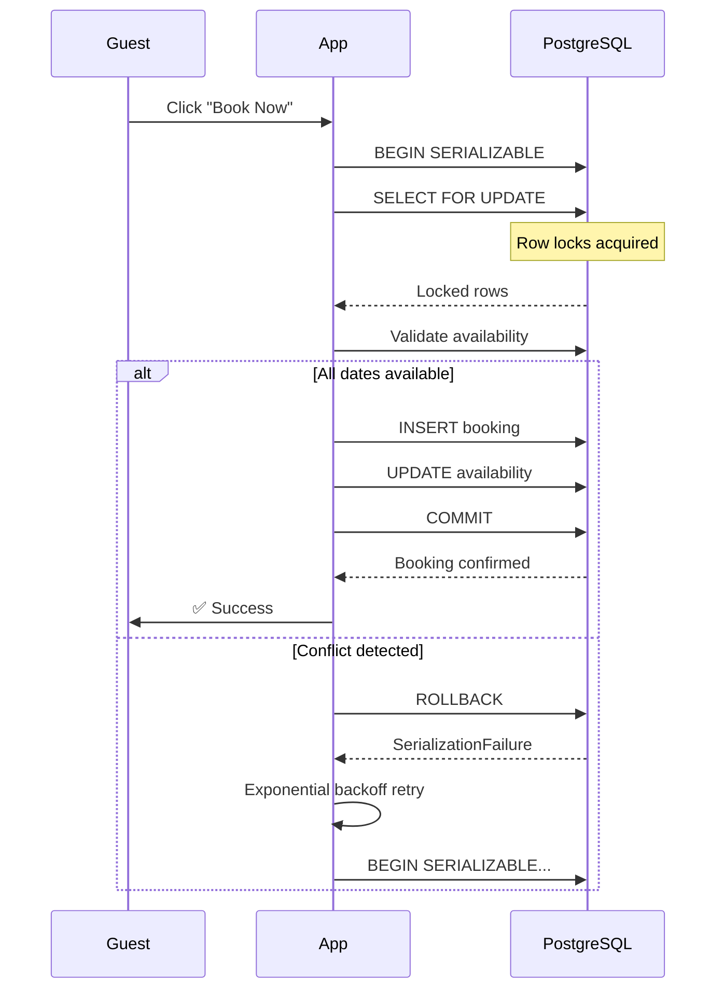

| Difficulty | Channel | Tags |
|---|---|---|
| intermediate | database | acid, isolation-levels, mvcc |

In the nanoseconds between a user clicking 'Book' and seeing a confirmation, a silent battle unfolds inside your database. Airbnb learned this the hard way: after migrating to microservices, their payments system hit a devastating race condition that could double-charge guests and double-payout hosts with a single click [1]. The fix — a transaction architecture so robust it achieved 99.999% consistency — holds lessons for every developer building concurrent systems.

---

> ### Real-World Case — Airbnb
>
> After migrating to a Service Oriented Architecture (SOA), Airbnb's payments system faced race conditions where users clicking 'Book' twice could double-charge guests and double-payout hosts. Network failures and client timeouts triggered duplicate requests across microservices, risking millions in erroneous transactions and massive customer trust erosion.
>
> | | |
> |---|---|
> | **Challenge** | Guarantee exactly-once processing across distributed payments microservices handling charges, refunds, and payouts. Building a separate idempotency service would add latency and suffer the same consistency problems. They needed a generic, ultra-low-latency solution that shielded product developers from distributed systems complexity. |
> | **Solution** | Airbnb built 'Orpheus', a general-purpose idempotency library using unique idempotency keys per request with ACID database transactions combined via Java lambdas. The framework splits API calls into three phases (Pre-RPC, RPC, Post-RPC) to separate DB writes from network calls, enabling atomic rollback on failures. Idempotency data lives in the master database (never replicas) for strong consistency. Errors are classified as retryable vs non-retryable for safe auto-retry with exponential backoff. |
> | **Outcome** | Achieved 99.999% (five 9s) consistency for payment operations. The Orpheus framework eliminated double charges/duplicate payments at scale across Airbnb's global platform. In the follow-up payment orchestration redesign, every major workflow was built as a Directed Acyclic Graph of idempotent steps on top of Orpheus, enabling both synchronous and asynchronous exactly-once processing via Kafka. |
> | **Lesson** | Idempotency at the application layer combined with atomic DB transactions is more practical and lower-latency than distributed transaction protocols like 2PC. The counterintuitive insight: building a library rather than a standalone service avoids the very consistency and latency problems it aims to solve. Never use read replicas for idempotency checks — replica lag causes exactly the duplicate payments you're trying to prevent. |

---

## Hook — Two Travelers, One Bed, Zero Margin for Error

Picture this: two travelers find the same Kyoto machiya on Airbnb. Both check the calendar — green lights across the board. Both pull out their phones. Both tap 'Confirm Booking' at 3:42:01 PM. In a naive system, both succeed. You now have an overbooking: two confirmed guests for the same bed on the same night, one furious host, and a customer support fire drill that could have been avoided entirely.

This is not a hypothetical. It is the exact class of problem that forced Airbnb to fundamentally rethink how its distributed payments system handled concurrency [1]. The stakes? Millions of dollars in erroneous transactions and the kind of trust erosion that no refresh of the brand guidelines can fix.

## Problem — Why Concurrent Bookings Are Deceptively Hard

Race conditions in booking systems are easy to introduce and notoriously hard to reproduce. The core issue is a *lost update*: two transactions read the same state, both conclude the resource is available, and both proceed without seeing each other's writes.

Reading stale data is the silent killer in concurrent systems. You check availability, see three free nights, and start building your reservation. But in the microseconds between your read and your write, another session has already claimed two of those nights. Your transaction commits, blissfully unaware that it just overwrote someone else's valid booking.

Many developers reach for the simplest fix — wrapping everything in a database transaction — only to discover that the default READ COMMITTED isolation level does nothing to prevent *phantom reads*. A phantom read occurs when a transaction re-executes a query and finds new rows that another transaction inserted since the first read. In booking terms, your availability check returns results that are already stale before you finish parsing them.

This is where understanding isolation levels stops being academic and starts saving your weekend.

## Real-World Case — Airbnb's Orpheus Framework

Airbnb's incident is particularly instructive because it operates at massive scale and the stakes are financial. After migrating to a Service Oriented Architecture (SOA), their payments system encountered a thorny problem: network failures and client timeouts were triggering duplicate requests across microservices. A single user click could translate into multiple payment attempts — each one capable of charging the guest and paying the host [1].

The result could have been catastrophic. Double-charged guests. Double-paid hosts. A massive erosion of trust that no marketing campaign could fix. Payments is a domain where consistency is not just desirable — it is a contractual obligation.

Airbnb built a framework called Orpheus to tackle this head-on. Every payment workflow was modeled as a Directed Acyclic Graph (DAG) of idempotent steps, running on top of Kafka for both synchronous and asynchronous exactly-once processing. The framework guaranteed that even if a step executed multiple times (due to retries, network partitions, or client failures), the side effects would only apply once.

The result? 99.999% consistency for payment operations. That is five nines — a level of reliability usually reserved for mission-critical aerospace systems. At Airbnb's global scale, this meant thousands of potential double-payment incidents were silently prevented every single day.

## Deep Dive — SERIALIZABLE Isolation, MVCC, and Row-Level Locks

Building on Airbnb's approach, solving the double booking problem requires understanding three interlocking concepts: isolation levels, multiversion concurrency control (MVCC), and locking strategies.

**SERIALIZABLE isolation** is the strongest guarantee the SQL standard defines. It ensures that concurrent transactions produce the same result as if they executed one after another — serially, not concurrently. PostgreSQL implements this through Serializable Snapshot Isolation (SSI), which detects read-write conflicts that could break serializability and aborts one of the conflicting transactions [2]. This is your safety net: if two bookings collide, PostgreSQL detects it and forces a retry.

**MVCC** is the engine that makes this efficient. Instead of locking every row a transaction reads, PostgreSQL keeps multiple versions of each row. A transaction sees a snapshot of the database as of the moment its first query begins [3]. This means reads never block writes and writes never block reads — critical for a high-traffic booking system where availability checks must be fast.

**SELECT FOR UPDATE** is where you get precise. While MVCC handles reads, explicit row-level locks handle writes. When you run SELECT FOR UPDATE on availability rows, PostgreSQL locks those specific rows so no other transaction can modify or lock them until your transaction commits or rolls back [4]. This is how you prevent two concurrent bookings from both seeing the same "available" rows.

Here is the trade-off many developers miss: optimistic concurrency control (OCC) works well when contention is low, but booking *hot* properties is the definition of high contention. A Taylor Swift concert weekend in Tokyo? Every transaction will conflict. In those cases, pessimistic locking (SELECT FOR UPDATE) performs better because it serializes access early rather than paying the cost of repeated rollbacks and retries [5].

## Workflow — The Booking Transaction Lifecycle

Here is how a properly designed booking transaction flows from click to confirmation:

1. **Pre-check**: The application checks availability from a cache or read replica for fast UX feedback.
2. **Begin SERIALIZABLE transaction**: The critical path starts with the strictest isolation level.
3. **SELECT FOR UPDATE**: Lock the specific date rows for the requested property. This blocks concurrent transactions from booking the same dates.
4. **Validate availability**: Confirm every requested date is still available under the lock.
5. **INSERT the booking**: Create the reservation record.
6. **UPDATE availability**: Mark the dates as booked.
7. **COMMIT**: Release locks and make changes visible to other transactions.
8. **Invalidate cache**: Clear cached availability so subsequent reads see the new state.
9. **Handle conflicts**: If PostgreSQL detects a serialization anomaly, catch the SerializationFailure, wait with exponential backoff, and retry from step 2.

The diagram below illustrates this flow, including the conflict retry path.

## Code Example — Booking Transaction in Python

The following Python function implements a safe booking transaction with automatic retry on serialization failures:

## Lessons Learned — Transaction Patterns That Scale

If there is one takeaway from Airbnb's Orpheus framework and the database patterns above, it is this: preventing double bookings is not about wrapping code in a transaction — it is about deliberate architecture at every layer.

Here are the patterns worth adopting:

**Use SERIALIZABLE isolation for financial operations.** READ COMMITTED is fine for dashboards and analytics, but any operation where consistency has monetary consequences should use SERIALIZABLE [2]. The performance cost is real but bounded — and far cheaper than the cost of a double payment.

**Lock hot rows explicitly.** MVCC snapshot reads are great for read-heavy workloads, but when two transactions will fight over the same rows (think "booked" properties on New Year's Eve), SELECT FOR UPDATE prevents wasted round-trips [4].

**Implement idempotent retry with exponential backoff.** Serialization failures are not fatal — they are a signal to try again. Airbnb's Orpheus framework demonstrated that idempotency keys (a unique identifier for each operation) paired with retry logic can achieve five-nines consistency [1].

**Write concurrent load tests.** The booking flow that works in development with one user will break in production with a hundred concurrent requests. Tools like pgbench or custom scripts that simulate 50+ simultaneous booking attempts will surface isolation bugs before your customers do.

**Cache availability, but invalidate aggressively.** Fast reads matter for UX, but stale caches cause conflict spikes. Every successful booking should immediately purge the affected availability from cache [6].

---

## Booking Transaction Flow with Conflict Handling

<strong>Original Interview Question</strong>

**Q:** You're building a booking system for Airbnb where multiple users can reserve the same property simultaneously. How would you design the transaction handling to prevent double bookings while maintaining high availability?

**A:** Use SERIALIZABLE isolation with optimistic concurrency control. Implement row-level locks on property availability tables, use MVCC snapshot reads for checking availability, and apply application-level validation to ensure atomic booking operations.

## Conclusion

The next time you design a booking system, remember Airbnb's lesson: preventing double bookings requires deliberate architecture across every layer. Choose the right isolation level — SERIALIZABLE for operations where consistency has monetary consequences. Implement row-level locks on hot resources so concurrent transactions don't silently step on each other. Build idempotent retry logic with exponential backoff because failures in distributed systems are a question of when, not if. And write concurrent load tests that simulate peak traffic — the race condition that survives development will announce itself in production. The difference between a booking system that works and one that fails at the worst possible moment is a few microseconds of careful transaction design. Airbnb's five-nines consistency wasn't an accident. It was engineered, one serialized transaction at a time.

---

## References

1. [Avoiding Double Payments in a Distributed Payments System — Airbnb Engineering](https://medium.com/airbnb-engineering/avoiding-double-payments-in-a-distributed-payments-system-2981f6b070bb) — blog
2. [PostgreSQL Documentation: Transaction Isolation](https://www.postgresql.org/docs/current/transaction-iso.html) — documentation
3. [Multiversion Concurrency Control — Wikipedia](https://en.wikipedia.org/wiki/Multiversion_concurrency_control) — documentation
4. [PostgreSQL Documentation: Explicit Locking](https://www.postgresql.org/docs/current/explicit-locking.html) — documentation
5. [Optimistic Concurrency Control — Wikipedia](https://en.wikipedia.org/wiki/Optimistic_concurrency_control) — documentation
6. [Patterns of Distributed Systems: Idempotent Receiver — Martin Fowler](https://martinfowler.com/articles/patterns-of-distributed-systems/idempotent-receiver.html) — article
7. [Apache Kafka Documentation: Semantics (Exactly-Once Processing)](https://kafka.apache.org/documentation/#semantics) — documentation
8. [PostgreSQL Documentation: Write-Ahead Log (WAL)](https://www.postgresql.org/docs/current/wal-intro.html) — documentation

---

**Author:** Satishkumar Dhule — [GitHub](https://github.com/satishkumar-dhule) · [LinkedIn](https://linkedin.com/in/satishkumar-dhule) · [Website](https://satishkumar-dhule.github.io)
