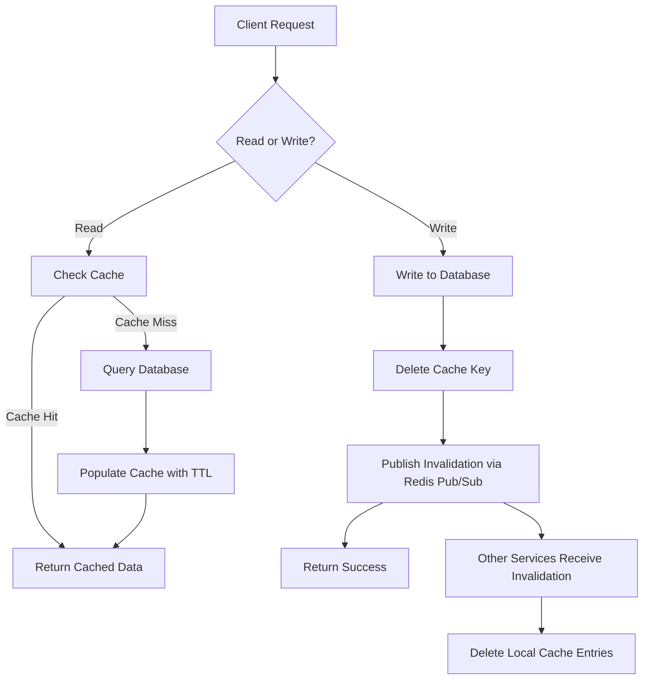

| Difficulty | Channel | Tags |
|---|---|---|
| beginner | backend | redis, memcached, cache-invalidation |

Imagine serving 150 million reads per second. Now imagine that every cache miss feels like a tiny explosion across your infrastructure. That is the scale Uber's engineering team operates at, and when they discovered that each microservice was managing its own Redis caches for Docstore with duplicated invalidation logic, stale data was silently poisoning user profiles across the fleet [1]. Uber's story is a masterclass in why cache invalidation — often called one of computer science's two hardest problems — deserves your attention long before your pager goes off at 3 AM.

---

> ### Real-World Case — Uber
>
> Uber's engineering teams were each provisioning and maintaining their own Redis caches for microservices accessing Docstore, their distributed database. Cache invalidation logic was duplicated across teams, leading to inconsistencies, stale data, and painful region failovers where caches had to be rebuilt from scratch.
>
> | | |
> |---|---|
> | **Challenge** | Design a centralized, strongly-consistent caching layer that handles massive read throughput (tens of millions of reads/second) while ensuring cache entries are invalidated within seconds of database writes — not the minutes that TTL-only approaches provide. |
> | **Solution** | Built CacheFront — an integrated Redis caching layer inside Docstore's query engine. For invalidation, they implemented a three-tier strategy: (1) TTL expiration as a safety net, (2) CDC-driven invalidation via Flux (tailing MySQL binlogs) to invalidate or upsert rows within sub-second delays, and (3) direct write-path invalidation where the storage engine returns affected row keys so the cache is invalidated immediately on write. They verified consistency with a shadow-read mode that compares cached vs database data in real time. |
> | **Outcome** | Serves over 150 million reads per second during peak hours. Achieved 75% reduction in P75 latency and 67% reduction in P99.9 latency. Measured 99.99% cache consistency via shadow reads. Cross-region failover now works with warm caches instead of cold starts. |
> | **Lesson** | No single invalidation strategy is enough at scale. TTL alone is too slow, CDC alone has a delay window, and write-path alone misses background updates. Uber's key insight was layering all three: write-path invalidation for immediate consistency, CDC for catch-up, and TTL as the ultimate safety net. This also shows that decentralizing cache management across microservices creates more problems than it solves. |

---

## Hook — What if your profile service was built on a lie?

You update your profile picture, hit save, and the page refreshes. But there it is — your old face, staring back at you. An hour later, still there. You refresh again. Nothing. Sound familiar? Every developer has felt that sinking feeling when stale data makes your application look broken. Now scale that feeling to Uber's global fleet of microservices, where each team was independently running their own Redis caches against Docstore, their distributed database. Cache invalidation logic was copy-pasted across services, which meant consistency guarantees were basically a suggestion. The result? Region failovers required rebuilding entire caches from scratch — cold starts that took forever and stung even more.

## Problem — The impossible choice between fast and true

Here is the fundamental tension: databases are slow (relatively speaking) and caches are fast, but caches lie. They serve you yesterday's truth while pretending it is today's. The phrase "eventual consistency" is comforting until a user sees their ex-partner's name on their profile because a cache key was never invalidated. Cache invalidation is genuinely hard because it requires your system to answer one question perfectly: when does "old" become "wrong"? Most teams default to TTL-based expiration — set it and (try to) forget it. But TTLs are a compromise: too short and you defeat the purpose of caching, too long and your users start tweeting about bugs. This leads to a deeper question: should you update the cache on writes or wait for the next read? That choice shapes your entire caching architecture.

## Real-World Case — Uber's integrated cache transformation

Uber's engineering teams were in a familiar mess: every microservice that talked to Docstore provisioned and maintained its own Redis cache. Cache logic was a snowflake — different TTLs, different invalidation strategies, different failure modes. Cross-region failovers were a nightmare because each cache had to be rebuilt from zero, resulting in cascading latency spikes that affected millions of riders and drivers. Uber took a platform approach instead. They built an integrated caching layer that sits between microservices and Docstore, handling cache invalidation centrally through Redis pub/sub channels [1]. The results speak for themselves: the system now handles over 150 million reads per second during peak hours. P75 latency dropped 75%. P99.9 latency improved by 67%. Shadow reads confirmed 99.99% cache consistency. And region failovers now start with warm caches instead of cold builds [1]. The lesson? Centralized invalidation logic beats distributed chaos every time.

## Deep Dive — Redis vs Memcached: picking your weapon

Uber chose Redis for their integrated layer. Would Memcached have worked too? It depends on what you are optimizing for. Memcached is beautiful in its simplicity — an in-memory key-value store with O(1) operations and minimal overhead. It scales horizontally by just adding nodes. But Memcached has no built-in mechanism for cache invalidation across nodes. You cannot publish a "key X is stale" message to all Memcached instances [2]. You either wait for TTLs or implement your own coordination layer (good luck). Redis, on the other hand, ships with pub/sub channels, which lets any node broadcast invalidation messages to every other node instantly [3]. It also supports persistence (RDB snapshots, AOF logs), which means a restart does not have to be a cold start — critical for Uber's failover scenarios [5]. The trade-off? Redis is heavier. Each pub/sub message adds network overhead. Persistence consumes disk I/O. Memcached is leaner, faster for pure get/set workloads, and simpler to reason about [4]. Here is the rule of thumb: if your caching layer is a tactical optimization for a single service, Memcached is fine. If it is a platform that multiple services depend on for correctness, you need Redis's coordination primitives. One subtle trap: Redis pub/sub messages are fire-and-forget. If a subscriber is down, the message disappears [3]. Many developers combine pub/sub with a local invalidation log to handle missed messages — a pattern Uber almost certainly relies on.

## Workflow — Write-through with a side of cache-aside

The battle-tested approach combines two patterns. For writes, use write-through: update the database first, then delete or update the cache key. For reads, use cache-aside: check cache, return on hit, query database on miss, populate cache, return [7]. Here is the flow in detail:

1. Client issues a profile update request
2. API handler writes the new data to the primary database
3. After the database write succeeds, the handler deletes the corresponding cache key(s)
4. The handler publishes an invalidation message via Redis pub/sub to other services that might hold copies
5. On the next read, cache-aside kicks in — the cache misses, the database is queried for fresh data, and the cache is repopulated with a new TTL

The "delete on write" approach is deliberate. Many developers instinctively want to update the cache with the new value on write (write-through update). Deleting instead is safer because it avoids race conditions: if two concurrent writes arrive, a delete + next-read-repopulate model guarantees you never serve data from a stale partial update.

## Code Example — Building a write-through cache layer in Python

Here is a production-oriented implementation of write-through caching with Redis invalidation for a user profile service [6]. This code mirrors the patterns Uber would use at the service level, with centralized invalidation via pub/sub.

## Lessons Learned — Cache with humility, invalidate with authority

Uber's journey reveals several truths that apply at any scale. First, centralize your invalidation logic — if every microservice implements its own cache strategy, you are not building a system, you are building a pile of bugs that happen to serve traffic. Second, prefer delete-on-write over update-on-write to avoid race conditions. Third, choose your cache technology based on your coordination needs, not just speed benchmarks. Memcached is fast; Redis helps you stay correct. Fourth, always monitor cache hit rates and set up alerts for sudden drops — a cache stampede can take down a service faster than a traffic spike [8]. Finally, test your cache behavior under failure. What happens when Redis goes down? When the network partitions? Write-through with database fallback means your service degrades but does not die.

---

## Cache Invalidation Workflow

<strong>Original Interview Question</strong>

**Q:** You're building a user profile service that caches frequently accessed profiles. How would you implement cache invalidation when a user updates their profile, and what trade-offs would you consider between Redis and Memcached?

**A:** Implement write-through caching with TTL-based expiration. On profile update, invalidate the cache by deleting the key and writing new data to both the database and cache. Redis offers pub/sub for automatic distributed invalidation, while Memcached requires manual coordination across nodes.

## Conclusion

Cache invalidation is not a problem you solve once and forget. It is a design constraint that shapes how you think about consistency, latency, and failure. Uber's integrated cache taught the industry that the right answer is rarely "just set a TTL" — it is a deliberate architecture of write-through semantics, publish-subscribe coordination, and relentless monitoring. Here is the one thing to tell your team tomorrow: if your invalidation logic is scattered across services, you have already lost. Centralize it, delete on write, and use Redis pub/sub to keep everyone honest. Your future self — awake and not staring at a pager — will thank you.

---

## References

1. [Uber incident report](https://www.uber.com/us/en/blog/how-uber-serves-over-40-million-reads-per-second-using-an-integrated-cache/) — blog
2. [Memcached - Wikipedia](https://en.wikipedia.org/wiki/Memcached) — documentation
3. [Redis Pub/Sub Documentation](https://redis.io/docs/latest/develop/interact/pubsub/) — documentation
4. [Cache (computing) - Wikipedia](https://en.wikipedia.org/wiki/Cache_(computing)) — documentation
5. [Redis Persistence (RDB/AOF)](https://redis.io/docs/latest/operate/oss_and_stack/management/persistence/) — documentation
6. [AWS ElastiCache Caching Best Practices](https://docs.aws.amazon.com/AmazonElastiCache/latest/dg/Strategies.html) — documentation
7. [Write-Through Cache Pattern - DigitalOcean](https://www.digitalocean.com/community/tutorials/caching-strategies-and-best-practices) — blog
8. [Cache Stampede - Wikipedia](https://en.wikipedia.org/wiki/Cache_stampede) — documentation

---

**Author:** Satishkumar Dhule — [GitHub](https://github.com/satishkumar-dhule) · [LinkedIn](https://linkedin.com/in/satishkumar-dhule) · [Website](https://satishkumar-dhule.github.io)
