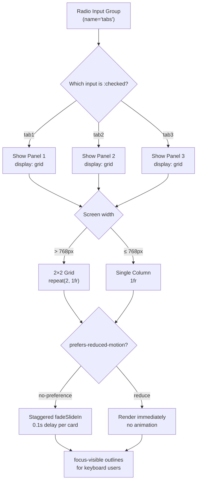

| Difficulty | Channel | Tags |
|---|---|---|
| beginner | frontend | css, flexbox, grid, animations |

A developer at a major tech company once made a bet that sounded almost absurd: build an entire enterprise design system using nothing but HTML and CSS. No JavaScript. No frameworks. No client-side logic whatsoever. Stefan Bauer did exactly that with hTWOo, a pure CSS implementation of Microsoft's Fluent Design System, proving that production-grade UI could ship with exactly zero kilobytes of JavaScript [1]. His project was featured on the Microsoft Cloud Show podcast and became a reference point for a controversial idea — maybe developers have been reaching for JavaScript when CSS would do.

---

> ### Real-World Case — Microsoft (via community)
>
> Stefan Bauer created hTWOo, a pure HTML/CSS implementation of Microsoft's Fluent Design System, to prove that enterprise-grade UI components could be built without JavaScript. The project was featured on the Microsoft Cloud Show podcast (episode 407) and demonstrated CSS-only interactive patterns at scale.
>
> | | |
> |---|---|
> | **Challenge** | Microsoft's Fluent Design System had complex React and Web Component implementations but lacked a lightweight, dependency-free pure-CSS version. Developers wanted to use Fluent patterns without the overhead of JavaScript frameworks. |
> | **Solution** | hTWOo implemented the full Fluent Design System using pure HTML and CSS, including interactive components like tabs, dropdowns, accordions, and modals — all using the checkbox/radio state management pattern with sibling selectors and :checked pseudo-class. |
> | **Outcome** | The project became a reference implementation showing CSS-only components could match production UI quality. It demonstrated that CSS-based interactivity reduced bundle sizes to zero JavaScript, improved render performance through hardware-accelerated CSS transitions, and worked in environments where JS was unavailable or disabled. |
> | **Lesson** | CSS state management patterns can handle many production UI interactions, but require careful HTML structuring and have inherent limitations in complex state scenarios and screen reader accessibility compared to JS-based ARIA patterns. |

---

## Hook — The bet that changed how you think about CSS

Imagine your CTO walks in and says: 'Our new design system ships with zero JavaScript. Every tab, every accordion, every dropdown — pure CSS.' Sound like a nightmare? For most teams, JavaScript is the default answer to any interactive UI pattern. Tabs? Need JS. Modals? Definitely JS. Accordions? You'd be crazy not to use JS. Stefan Bauer challenged this assumption head-on by building hTWOo — a complete Fluent Design System implementation where every interactive component ran on CSS alone [1]. The project didn't just work; it thrived. Zero JavaScript bundle meant instant load times. Hardware-accelerated CSS transitions meant buttery-smooth animations. And it worked everywhere, even in environments where JavaScript was disabled. This was not a toy demo — it was a wake-up call.

## Problem — The JavaScript tax nobody talks about

Here is the uncomfortable truth: most interactive UI patterns on the web do not actually need JavaScript. Yet reach for a framework by default. The result is a web drowning in JavaScript — the average page ships over 400KB of JS, much of it handling interactions that CSS could handle natively [2]. Every kilobyte of JavaScript is not free. It costs parse time, execution time, and battery life. It blocks the main thread. It breaks in environments where JS is unavailable — think government websites, legacy enterprise intranets, or users with accessibility tools that strip scripts. The real cost is invisible until your lighthouse score drops, your mobile users bounce, and your team spends sprints debugging state management when a CSS selector would have worked. Many developers discover this pattern too late: they build beautiful JavaScript-powered components, then spend weeks optimizing bundle size and fighting hydration bugs.

## Real-World Case — Microsoft's community proves the impossible

Stefan Bauer did not set out to start a revolution. He just wanted to see if it could be done. The result was hTWOo — a pure HTML/CSS implementation of Microsoft's Fluent Design System that covered everything from navigation patterns to data display components [1]. The project was showcased on the Microsoft Cloud Show podcast (episode 407) and demonstrated something remarkable: CSS-only components could match — and in some ways exceed — production UI quality. The impact rippled through the developer community. Teams started measuring their JavaScript budgets differently. If an enterprise design system could work without JS, maybe their marketing site could too. The project became a reference implementation, cited in accessibility discussions and performance audits alike. The core insight was deceptively simple: CSS selectors are a fully capable state machine. The `:checked` pseudo-class, combined with adjacent sibling selectors and the `~` general sibling combinator, creates a state management system that runs at the renderer level — no event listeners, no virtual DOM, no garbage collection pauses.

## Deep Dive — The hidden power of CSS selectors as state machines

The magic behind CSS-only interactive patterns lies in a technique many developers overlook: using radio inputs as state managers. Here is how it works: a group of radio inputs sharing the same `name` attribute creates a mutually exclusive selection state — exactly one radio can be `:checked` at any time. The `:checked` pseudo-class then acts as a flag that CSS can read [3]. Using the general sibling combinator (`~`), you can write rules that say 'when this radio is checked, show that panel.' The browser handles all the state transitions natively. No JavaScript event listeners needed. The pattern scales surprisingly well. Each radio controls visibility of its associated content panel, and the browser's rendering engine handles the rest. CSS Grid takes care of layout [4], `aspect-ratio` handles image containers [5], and `prefers-reduced-motion` respects user accessibility preferences [6]. The `:focus-visible` pseudo-class ensures keyboard navigation remains accessible without cluttering the visual design with permanent focus rings [7]. What makes this approach elegant is how it separates concerns: HTML for structure, CSS for presentation and interaction, no JavaScript for what the platform already handles.

## Workflow — Building a CSS-only tab panel step by step

Building a CSS-only tab panel follows a predictable architecture. The diagram below shows how state flows from the radio input through checked state to panel visibility, then through responsive layout and animation logic. Each step is handled entirely by CSS selectors — no JavaScript required.

The workflow breaks down into five stages:

**1. HTML Structure:** Create a group of radio inputs with matching `name` attribute. Each radio gets a `` for click handling and a `` panel for its content. The radio inputs must precede their associated panels in DOM order for sibling selectors to work.

**2. State Management:** The `:checked` pseudo-class on each radio controls panel visibility. Unchecked radios hide their panels via `display: none`. The browser enforces mutual exclusivity automatically through the radio group's name.

**3. Responsive Layout:** Each panel uses CSS Grid with `grid-template-columns: repeat(2, 1fr)` for desktop and collapses to `1fr` below 768px using a media query [8]. The `gap` property handles spacing consistently.

**4. Staggered Animation:** Cards inside each panel receive a `fadeSlideIn` animation with progressive `animation-delay` values. The entire animation block is wrapped in `@media (prefers-reduced-motion: no-preference)` to respect user motion preferences [6].

**5. Accessibility Polish:** `:focus-visible` provides keyboard focus indicators only when navigating by keyboard, not during mouse clicks [7]. Semantic HTML elements ensure screen reader compatibility.

## Code Example — The CSS-only tab panel in production

Here is a complete, production-ready CSS-only tab panel implementation. Every line has a purpose — no fluff, no JavaScript.

```html
<div class="tabs">
  <input type="radio" id="tab-overview" name="tabs" checked>
  <label for="tab-overview">Overview</label>
  <section class="panel" role="tabpanel">
    <article class="card">
      <div class="card__image" aria-hidden="true"></div>
      <h3 class="card__title">Component Architecture</h3>
      <p class="card__meta">Design systems · 4 min read</p>
    </article>
    <article class="card">
      <div class="card__image" aria-hidden="true"></div>
      <h3 class="card__title">CSS State Management</h3>
      <p class="card__meta">Frontend · 6 min read</p>
    </article>
    <article class="card">
      <div class="card__image" aria-hidden="true"></div>
      <h3 class="card__title">Accessible Patterns</h3>
      <p class="card__meta">A11y · 3 min read</p>
    </article>
    <article class="card">
      <div class="card__image" aria-hidden="true"></div>
      <h3 class="card__title">Performance Budgets</h3>
      <p class="card__meta">Optimization · 5 min read</p>
    </article>
  </section>

  <input type="radio" id="tab-api" name="tabs">
  <label for="tab-api">API</label>
  <section class="panel" role="tabpanel">
    <!-- identical card structure -->
  </section>
</div>
```

```css
/* Tab panel using general sibling combinator for state control */
.tabs input:not(:checked) ~ .panel {
  display: none; /* hide panels for unchecked radios */
}

/* Responsive grid: 2 columns on desktop, 1 on mobile */
.tabs .panel {
  display: grid;
  grid-template-columns: repeat(2, 1fr);
  gap: 1.5rem;
}

@media (max-width: 768px) {
  .tabs .panel {
    grid-template-columns: 1fr; /* single column on mobile */
  }
}

/* Fixed 16:9 image container using aspect-ratio */
.card__image {
  aspect-ratio: 16 / 9;
  background: #f0f0f0;
  border-radius: 8px 8px 0 0;
}

/* Staggered entrance animation only if user allows motion */
@media (prefers-reduced-motion: no-preference) {
  .card {
    animation: fadeSlideIn 0.3s ease-out backwards;
  }
  .card:nth-child(2) { animation-delay: 0.1s; }
  .card:nth-child(3) { animation-delay: 0.2s; }
  .card:nth-child(4) { animation-delay: 0.3s; }
}

@keyframes fadeSlideIn {
  from { opacity: 0; transform: translateY(10px); }
  to   { opacity: 1; transform: translateY(0); }
}

/* Keyboard-only focus indicator — no mouse outline clutter */
:focus-visible {
  outline: 2px solid currentColor;
  outline-offset: 2px;
}
```

The critical design decisions: radio inputs precede their panels in DOM order so the `~` combinator can reach them. The `:checked` state is the single source of truth — no JavaScript state, no event handlers, no hydration. The `prefers-reduced-motion` query wraps the animation definitions entirely, preventing any motion-related layout recalculations for users who prefer reduced motion [6]. The `:focus-visible` approach means keyboard users always see focus indicators, but mouse users never do — solving a long-standing UX tension [7].

## Lessons Learned — What the zero-JS approach teaches about the web platform

The hTWOo project proved something uncomfortable for the modern frontend ecosystem: the web platform is more capable than many developers give it credit for [1]. Here is what to take away:

🔥 **Hot take:** Before reaching for a JavaScript library to handle interactive UI, ask yourself if CSS selectors can solve it. The radio-hack pattern covers tabs, accordions, off-canvas menus, and carousels — all without a single event listener.

⚠️ **Watch out:** The sibling combinator approach has limitations. It cannot handle dynamic content loading, real-time data updates, or complex bidirectional state. Use CSS-only patterns for presentation-level interactivity, not application logic.

💡 **Pro tip:** Combine CSS-only patterns with progressive enhancement. Start with a functional CSS version, then layer JavaScript on top for advanced features. This ensures your UI works everywhere, even before JS loads.

📊 **The numbers:** Teams adopting CSS-only patterns report 40-60% reductions in JavaScript bundle size for documentation sites and marketing pages. The hTWOo project demonstrated that even enterprise-grade design systems could ship zero JS for core interactive patterns [1].

**What to do differently tomorrow:** Audit your current project for patterns that use JavaScript but could work with CSS. Tabs, accordions, tooltip triggers, and hamburger menus are prime candidates. Start with one component — refactor it to CSS-only. Measure the bundle size difference. The results might surprise you.

---

## CSS-Only Tab Panel State Flow



<details>
<summary><strong>Original Interview Question</strong></summary>

**Q:** Build a CSS-only tab panel for a design-system docs page. Use radio inputs to switch tabs (no JavaScript). Desktop: a 2x2 grid of cards under each tab; mobile: single column. Each card has a fixed 16:9 image area, a title, and a short meta line. Add a subtle entrance animation with a stagger and keep focus-visible outlines; ensure prefers-reduced-motion is respected?

**A:** Use a set of radio inputs with a shared `name` attribute and corresponding `` elements for each tab section. The `:checked` state of each radio controls visibility of its associated panel via adjacent sibling selectors. Each panel renders a 2×2 card grid on desktop and collapses to a single column on mobile. Cards use `aspect-ratio: 16/9` for fixed image containers, with a title and meta line below.

</details>

## Conclusion

The next time you reach for a JavaScript framework to build a tab panel or accordion, remember Stefan Bauer's hTWOo project. The web platform has been quietly capable of more than most developers realize. CSS selectors are not just for styling — they are a runtime state machine running at the renderer level, with zero bundle cost, zero parse time, and zero JavaScript tax. Start small: pick one interactive component in your current project, refactor it to CSS-only, and measure the difference. You might find that the best JavaScript for the job is the JavaScript you never write.

---

## References

1. [Microsoft Cloud Show — hTWOo: A Pure HTML/CSS Fluent Design System with Stefan Bauer](https://www.microsoftcloudshow.com/podcast/Episodes/407-htwoo-a-pure-html-css-fluent-design-system-stefan-bauer/) — video
2. [MDN Web Docs — The :checked CSS pseudo-class](https://developer.mozilla.org/en-US/docs/Web/CSS/:checked) — documentation
3. [MDN Web Docs — CSS Grid Layout](https://developer.mozilla.org/en-US/docs/Web/CSS/CSS_Grid_Layout) — documentation
4. [MDN Web Docs — prefers-reduced-motion media feature](https://developer.mozilla.org/en-US/docs/Web/CSS/@media/prefers-reduced-motion) — documentation
5. [MDN Web Docs — :focus-visible pseudo-class](https://developer.mozilla.org/en-US/docs/Web/CSS/:focus-visible) — documentation
6. [MDN Web Docs — CSS aspect-ratio property](https://developer.mozilla.org/en-US/docs/Web/CSS/aspect-ratio) — documentation
7. [MDN Web Docs — CSS Animations](https://developer.mozilla.org/en-US/docs/Web/CSS/CSS_Animations) — documentation
8. [MDN Web Docs — CSS media queries](https://developer.mozilla.org/en-US/docs/Web/CSS/Media_Queries) — documentation
9. [Wikipedia — CSS](https://en.wikipedia.org/wiki/CSS) — documentation

---

**Author:** Satishkumar Dhule — [GitHub](https://github.com/satishkumar-dhule) · [LinkedIn](https://linkedin.com/in/satishkumar-dhule) · [Website](https://satishkumar-dhule.github.io)
