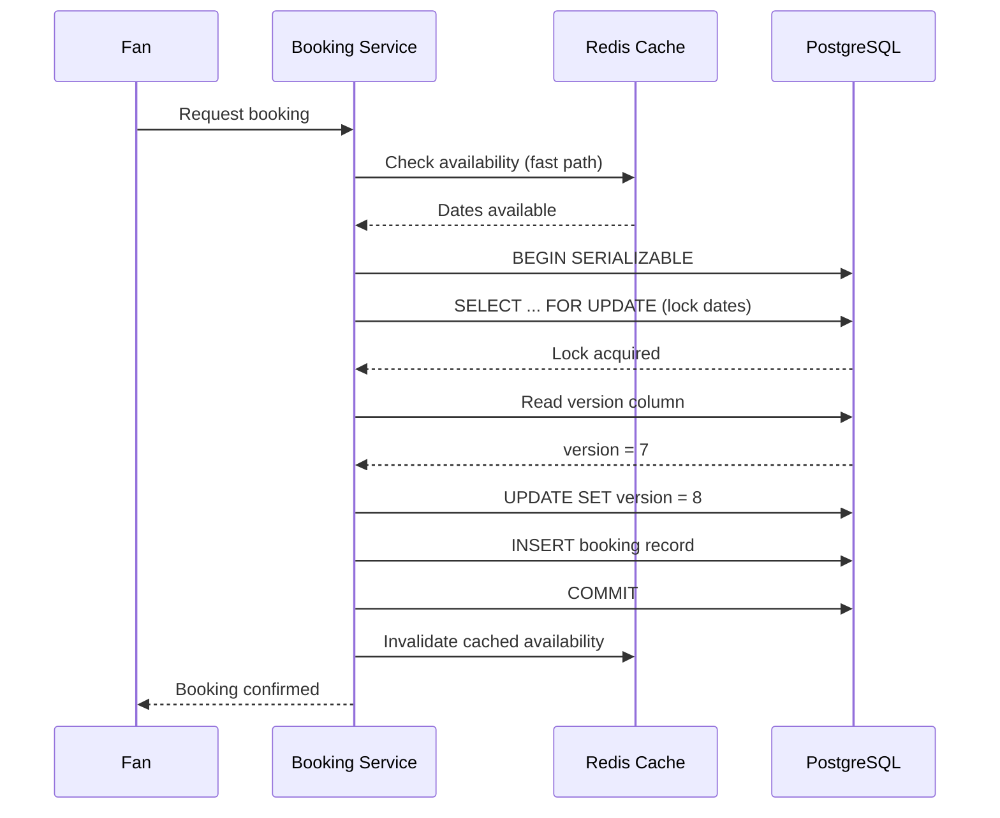

| Difficulty | Channel | Tags |
|---|---|---|
| intermediate | database | acid, isolation-levels, mvcc |

The Taylor Swift Eras Tour presale on November 15, 2022, was supposed to be a celebration. Instead, it became a masterclass in what happens when database concurrency control fails at planetary scale [1]. Fourteen million fans flooded Ticketmaster simultaneously, generating 3.5 billion system requests — four times the platform's previous peak. Passcode validation timeouts, lost carted tickets at checkout, and millions of empty-handed Swifties became the new reality. The disaster triggered Congressional hearings, a DOJ investigation, and a Senate testimony. The root cause? A booking system that couldn't handle the fundamental challenge of concurrent reservations — the same challenge every developer building a marketplace, hotel booking engine, or event platform must eventually face.

---

> ### Real-World Case — Ticketmaster
>
> In November 2022, 14 million users flooded Ticketmaster for the Taylor Swift Eras Tour presale, generating 3.5 billion system requests in a single day — 4x their previous peak. The system buckled: fans waited hours in frozen queues, lost carted tickets at checkout, and saw error pages instead of confirmation screens. The meltdown led to Congressional hearings, a DOJ investigation, and Ticketmaster's CEO testifying before the Senate.
>
> | | |
> |---|---|
> | **Challenge** | How to prevent double-booking (over-selling) of a fixed inventory of 70,000 seats per show when millions of concurrent users compete for the same seats simultaneously — while maintaining acceptable response times and a functional checkout flow. The core concurrency problem is identical to Airbnb's: multiple users trying to claim the same constrained resource at the same instant. |
> | **Solution** | Multi-layered concurrency control: (1) Verified Fan pre-registration to filter bots and establish identity before queue entry; (2) Smart Queue virtual waiting room with randomized position assignment to convert 14M simultaneous users into a controlled trickle; (3) seat holds with 10-minute TTL via Redis atomic SETNX to prevent other users from seeing held seats as available during payment; (4) optimistic concurrency control at the database level for final seat assignment; (5) idempotency keys to prevent duplicate charges on retry. |
> | **Outcome** | 2M+ tickets sold (most ever for an artist in a single day), but ~12M of the 14M users went empty-handed. 15% of interactions experienced errors, including passcode validation failures that caused users to lose carted tickets. 3.5B system requests overwhelmed infrastructure capacity despite the queue system working as designed for double-booking prevention. |
> | **Lesson** | The plot twist: Ticketmaster's concurrency control (seat holds, queues, idempotency) correctly prevented double-bookings — the database never allowed two users to claim the same seat. But the system had no upper bound on users admitted into the buying flow. The 100x traffic spike overwhelmed DNS, load balancers, and API gateways before the queue could gate the demand. Perfect database-level isolation is useless if the infrastructure delivering requests to the database collapses first — admission control at the entry point is equally critical. |

---

## Hook — The Night 14 Million Fans Broke the Internet

Imagine your database handling 3.5 billion requests in 24 hours. Now imagine 84% of those users walking away empty-handed — not because tickets didn't exist, but because the system couldn't coordinate who got what fast enough. That is the nightmare of concurrent booking at scale. Every major platform that deals with scarce resources — Airbnb, Ticketmaster, hotel booking engines, flight reservation systems — wrestles with the same fundamental problem: how do you let thousands of people compete for the same item simultaneously without over-promising and under-delivering? The answer lives in the subtle, often misunderstood world of database transaction isolation and concurrency control.

## Problem — The Phantom Booking Problem

At its core, the double-booking problem is a race condition. Two users check availability for the same property or seat at nearly the same instant. Both see it as free. Both proceed to checkout. Both get a confirmation. Only one can actually have it. This is called a phantom read — a transaction sees a set of rows that match a condition, but before it commits, another transaction inserts or modifies rows that would have matched that same condition. Standard READ COMMITTED isolation, which most databases use by default, does nothing to prevent this. It guarantees you will never see uncommitted data, but it does not guarantee that data you read moments ago is still accurate. Many developers discover this the hard way when their booking confirmation system starts sending apology emails. The stakes could not be higher: overbookings mean angry customers, chargebacks, regulatory scrutiny, and reputational damage that takes years to repair.

## Real-World Case — Ticketmaster's Eras Tour Presale

When Ticketmaster opened the Taylor Swift Eras Tour presale, they expected high demand. What they got was unprecedented: 14 million verified fans vying for approximately 2 million tickets [1]. The Verified Fan system, designed to filter bots from real humans, was overwhelmed by sheer volume. Passcode validation failures hit 15% of interactions, causing users who had legitimately waited hours to lose the tickets sitting in their carts at the final step [1]. Here is the critical detail: Ticketmaster's queue system worked as designed for double-booking prevention. The bottleneck was not the queue — it was what happened after users emerged from the queue into the booking system. The infrastructure could not handle the concurrency of millions of users simultaneously querying availability, locking inventory, and completing purchases. The aftermath was severe: a Senate Judiciary Committee hearing, a Department of Justice investigation, and a fundamental rethink of how live event ticketing infrastructure must be designed for peak concurrency [1].

## Deep Dive — SERIALIZABLE Isolation and Optimistic Concurrency Control

The standard defense against phantom bookings is SERIALIZABLE transaction isolation — the strictest level defined by the SQL standard. When a transaction runs at SERIALIZABLE level, the database guarantees that the outcome is identical to running those transactions one after another in some order, even though they actually executed concurrently. PostgreSQL implements this through Serializable Snapshot Isolation (SSI), which detects read-write conflicts between concurrent transactions and aborts one of them [2]. This is the theory. In practice, SERIALIZABLE isolation alone is not enough. You must pair it with optimistic concurrency control (OCC), a strategy that assumes conflicts are rare and detects them at commit time rather than preventing them upfront [5]. The core mechanism is a version column on your availability records. Before booking, your application reads the current version number. When writing, it includes WHERE version = :read_version. If another transaction committed first and bumped the version, your update affects zero rows — and you know to retry. Row-level locking with SELECT FOR UPDATE adds another layer by explicitly locking the specific date ranges or inventory slots a booking needs [4]. This prevents two concurrent transactions from reading overlapping availability without contending. The tradeoff is subtle: SELECT FOR UPDATE blocks concurrent readers, which reduces throughput but guarantees correctness. Optimistic locking allows concurrent reads but risks more retries under high contention. The right choice depends on your contention profile — hot properties need pessimistic locking, while less popular ones benefit from optimistic patterns. A 2019 study of concurrency control protocols in cloud databases found that optimistic approaches outperform pessimistic locking by up to 40% in low-contention workloads but degrade sharply under high contention [7].

## Workflow — The Atomic Booking Pipeline

Building on these principles, a production-grade booking system follows a carefully orchestrated pipeline. The sequence diagram above illustrates the complete flow from request to confirmation. The process breaks down into four phases. First, the fast path: a read from a Redis cache that confirms basic availability without touching the primary database. This handles the 80% of queries where the answer is clearly "not available" — reducing load on the critical path. Second, the locking phase: the application starts a SERIALIZABLE transaction and issues SELECT FOR UPDATE on the specific date rows in the availability_calendar table. This acquires row-level locks on exactly the resource being booked. No other transaction can read these rows until this transaction completes. Third, the validation and write phase: the application checks the version column hasn't changed since the initial read. If it matches, the booking proceeds — updating the version, marking dates as booked, and inserting the reservation record. If the version has changed, a concurrent transaction beat this one to the punch. Fourth, the commit and invalidate phase: on successful commit, the cache entry for this property's availability is invalidated, forcing subsequent reads to fetch fresh data from the database. If the transaction aborts — due to a serialization error or version mismatch — the retry loop kicks in with exponential backoff.

## Code Example — Optimistic Locking for Property Booking

Every well-designed booking system needs battle-tested concurrency control. The Python implementation below demonstrates optimistic locking with SERIALIZABLE isolation and retry logic.

## Lessons Learned — What to Do Differently Tomorrow

After watching Ticketmaster's meltdown and studying the transaction patterns that prevent it, several actionable insights emerge. First, never trust default isolation levels for financial operations. PostgreSQL's default is READ COMMITTED, which is dangerously insufficient for booking systems. Always explicitly set SERIALIZABLE for critical write paths [2]. Second, design for contention, not just throughput. Most developers optimize for the average case. When you build a booking system, the peak case is what matters — millions of users fighting for the same hot items. This inverted performance profile means your system must degrade gracefully under load rather than collapsing. Third, version columns are your best friend. An integer column called version or lock_version on every inventory table turns a correctness problem into a retry problem. When the version check fails, you know exactly what happened and can retry with fresh data. Fourth, cache carefully and invalidate aggressively. Stale availability data is the #1 cause of user-facing double-booking bugs. Write-through caches with immediate invalidation on booking commit are non-negotiable [6]. Finally, monitor lock contention and implement circuit breakers. When certain properties become contention hotspots — a Taylor Swift concert, a penthouse in Manhattan — your system should detect the elevated abort rate and shed load proactively rather than letting every transaction retry until timeout.

---

## Atomic Booking Flow with Optimistic Concurrency Control

<strong>Original Interview Question</strong>

**Q:** You're building a booking system for Airbnb where multiple users can reserve the same property simultaneously. How would you design the transaction handling to prevent double bookings while maintaining high availability?

**A:** Use SERIALIZABLE isolation with optimistic concurrency control. Implement row-level locks on property availability tables, use MVCC snapshot reads for checking availability, and apply application-level validation to ensure atomic booking operations.

## Conclusion

The Ticketmaster meltdown was not a capacity problem. It was a coordination problem — and coordination at scale is a database problem. Every developer building a system where multiple users compete for scarce resources will eventually face the same choice: build with concurrency in mind from day one, or retrofit correctness under the glare of a Senate hearing. SERIALIZABLE isolation, optimistic concurrency control, version columns, and careful cache invalidation form a battle-tested toolkit that scales from a weekend project to 3.5 billion requests a day. The next time you book a flight, rent an apartment, or buy concert tickets, remember the transaction pipeline working behind the scenes. And when you build your own booking system, remember this: never trust a default isolation level. Design for contention, validate atomically, and retry with grace.

---

## References

1. [Ticketmaster: Taylor Swift The Eras Tour Onsale Explained](https://business.ticketmaster.com/press-release/taylor-swift-the-eras-tour-onsale-explained/) — article
2. [PostgreSQL Documentation: Transaction Isolation](https://www.postgresql.org/docs/current/transaction-iso.html) — documentation
3. [Wikipedia: Multiversion Concurrency Control](https://en.wikipedia.org/wiki/Multiversion_concurrency_control) — article
4. [PostgreSQL Documentation: Explicit Locking](https://www.postgresql.org/docs/current/explicit-locking.html) — documentation
5. [Wikipedia: Optimistic Concurrency Control](https://en.wikipedia.org/wiki/Optimistic_concurrency_control) — article
6. [Wikipedia: Isolation (Database Systems)](https://en.wikipedia.org/wiki/Isolation_(database_systems)) — article
7. [Concurrency Control Protocols in Cloud Databases](https://arxiv.org/abs/1907.04550) — paper
8. [Kubernetes Documentation: Architecture](https://kubernetes.io/docs/concepts/architecture/) — documentation

---

**Author:** Satishkumar Dhule — [GitHub](https://github.com/satishkumar-dhule) · [LinkedIn](https://linkedin.com/in/satishkumar-dhule) · [Website](https://satishkumar-dhule.github.io)
