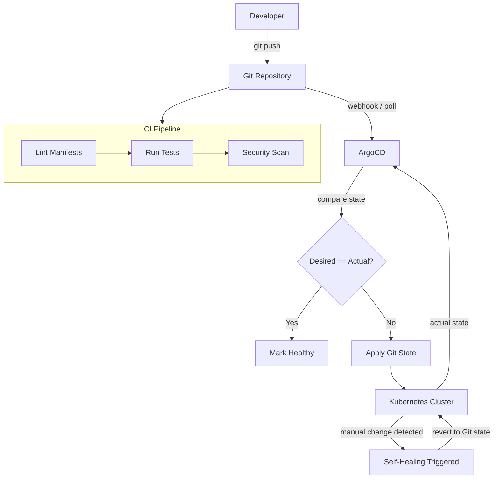

| Difficulty | Channel | Tags |
|---|---|---|
| beginner | devops | argocd, flux, declarative |

In 2018, Intuit—the company behind TurboTax, QuickBooks, and Mint—bet their entire cloud native transformation on a tool most developers had never heard of. At the time, deploying a single service took days. Onboarding a new developer required a three-day setup marathon. Fast forward to today, and Intuit manages over 3,000 production services across 350+ clusters, with deployments that complete in minutes instead of days [1]. The secret weapon? GitOps with ArgoCD. The real secret? Understanding the difference between declarative and imperative approaches—and why picking the wrong one can quietly sink your infrastructure.

---

> ### Real-World Case — Intuit
>
> Intuit (makers of TurboTax, QuickBooks, Mint) faced painfully slow deployment cycles after their lift-and-shift cloud migration. Teams took days or weeks to deploy releases, and onboarding a new developer required a 3-day setup process. In 2018, they acquired Applatix, the startup that created the Argo project, and bet their entire cloud native transformation on GitOps with ArgoCD.
>
> | | |
> |---|---|
> | **Challenge** | After migrating to public cloud, Intuit's lift-and-shift approach barely improved velocity. Releases were a 'ceremony' taking days to roll out across their fleet via manual scripts. New developer onboarding took 3 days. During tax season they had to manually order servers months in advance. They needed a declarative, self-service platform that could scale across hundreds of clusters while providing instant rollback and audit trails. |
> | **Solution** | Intuit built 'Modern SaaS' — a GitOps platform using Kubernetes and ArgoCD where Git serves as the single source of truth for deployments. Developers declare their desired state, ArgoCD continuously reconciles the cluster, and every change is versioned and auditable. The platform eliminated manual kubectl commands and arcane scripts. They later scaled this to 350+ clusters with 3,000+ services across 50,000+ namespaces, and recently added AI-powered Slack bots for natural language GitOps operations. |
> | **Outcome** | Deployment cycles collapsed from days to minutes. MTTR dropped from 45 minutes to under 5 minutes. Creating or upgrading a service takes less than 10 minutes, including automated CI/CD pipelines. In 18 months, Intuit went from 0 to ~2,000 services on Kubernetes. By 2026, they manage 350+ clusters with 3,000+ production services. Releases that used to be multi-day ceremonies now happen in minutes with automated rollback. |
> | **Lesson** | The plot twist: Intuit's first attempt at AI-assisted GitOps (building a UI extension into ArgoCD) failed because experts went straight to logs and novices never opened ArgoCD. The breakthrough came when they moved AI troubleshooting into Slack — where engineers already lived. The lesson: adoption follows workflow proximity. Don't build new interfaces; integrate where users already are. Also: acquiring the startup that created your core tool (Applatix/Argo) is a power move few companies can replicate, but the GitOps principles they pioneered are universal. |

---

## Hook — The 3am Deploy Nobody Talks About

Picture this: a developer runs `kubectl apply` on a production cluster at 2:47 AM. The change looks innocent—a minor config tweak. But by 3:15 AM, the pager is screaming. A downstream service is crashing in ways nobody anticipated. The team scrambles to find the last person who touched the cluster, but there is no audit trail. No Git history. No rollback button. Just a mess and a growing incident ticket. That is the reality of imperative deployment—and it is far more common than most teams admit.

## Problem — The Silent Killer of Reliable Deployments

Configuration drift is the silent killer of Kubernetes reliability. When engineers run ad-hoc `kubectl` commands directly against a cluster, the actual state diverges from what is defined in version control. Over weeks and months, environments become snowflakes—production works in ways staging does not, and nobody can explain why. The symptoms are predictable: mysterious outages, failed rollbacks, and onboarding processes that take days instead of hours. Intuit felt this pain acutely after their lift-and-shift cloud migration. What should have been an agility multiplier turned into a bottleneck. Services took days to deploy. New engineers spent their first week just setting up their local environment. The imperative approach had scaled their infrastructure but not their operational sanity.

## Real-World Case — Intuit's GitOps Bet

Intuit's turning point came in 2018 when they acquired Applatix, the startup behind the Argo project. ArgoCD was originally built inside Applatix to solve the exact problem Intuit was facing: how do you make Kubernetes deployments reliable, auditable, and fast at scale? Intuit's leadership made a bold bet—they would adopt GitOps as the operating model for their entire cloud native transformation [1]. The results were staggering. Within 18 months, they went from zero to approximately 2,000 services on Kubernetes. Deployment cycles collapsed from days to minutes. Mean Time To Recovery (MTTR) dropped from 45 minutes to under 5. Creating or upgrading a service now takes less than 10 minutes, including automated CI/CD pipelines. By 2026, Intuit manages 350+ clusters with 3,000+ production services [1]. Releases that used to be multi-day ceremonies now happen in minutes with automated rollback. The key insight? GitOps did not just change their tools—it changed how their teams thought about state.

## Deep Dive — Declarative vs Imperative: The Real Difference

Many developers think the difference between declarative and imperative is just syntax. It is not. The difference is who owns the truth. In the imperative model, the engineer running `kubectl` commands owns the truth. The cluster state is whatever the last command left it as. There is no history, no audit trail, and no automatic recovery if something goes wrong. Imperative changes are ephemeral—they exist only in the cluster's etcd store until something overwrites them. In the declarative GitOps model, the Git repository owns the truth. Kubernetes manifests, Helm charts, or Kustomize overlays in Git define the complete desired state. ArgoCD continuously reconciles the actual cluster state with this declared state [2]. If someone runs `kubectl delete deployment` on a production cluster, ArgoCD detects the drift and automatically re-applies the manifest from Git within minutes. This self-healing behavior is the feature that saves teams during incidents. Here is the counterintuitive part: declarative GitOps is actually faster in practice, not slower. Intuit proved this. The reason is that imperative workflows require human judgment at every step. "Did I apply the right manifest?" "Is this the correct context?" "Did that other team change something?" Each question adds minutes or hours. Declarative GitOps removes the judgment—you push to Git, and ArgoCD handles the rest [3]. The trade-off comes during debugging. Imperative workflows let you quickly probe the cluster with `kubectl exec` or `kubectl describe` because you are already authenticated. In GitOps, the debugging loop is longer: inspect the ArgoCD UI, check the Application status, find the drift, trace back to the Git commit. For emergency hotfixes, this extra step can feel painful. Teams that succeed with GitOps build emergency override procedures—a separate Git branch or a temporary disable-self-heal flag—for those rare moments when speed trumps process.

## Workflow — The GitOps Reconciliation Loop

The heart of GitOps is the reconciliation loop—a continuous cycle that keeps the cluster in sync with Git. Here is how it works:

1. A developer pushes changes to a Git repository containing Kubernetes manifests or Helm charts.
2. A CI pipeline validates the manifests (linting, unit tests, security scans) and merges to the main branch.
3. ArgoCD detects the change—either via a webhook from the Git provider or through its polling mechanism (typically every 3 minutes).
4. ArgoCD compares the desired state (Git) against the actual state (cluster).
5. If drift is detected, ArgoCD applies the Git state to the cluster using the configured sync strategy.
6. ArgoCD monitors the cluster and re-applies the Git state if any manual changes occur (self-healing).
7. Health checks validate that the application is running correctly before marking the sync as successful.

The diagram below illustrates this continuous reconciliation loop, showing how every component in the pipeline connects to maintain a single source of truth.

## Code Example — Declaring Your First ArgoCD Application

Configuring ArgoCD starts with an Application Custom Resource Definition (CRD). This YAML tells ArgoCD which Git repository to watch, what path contains the manifests, and which Kubernetes cluster to sync to. Here is a production-oriented example with auto-sync, self-healing, and health checks:

## Lessons Learned — What Intuit's Journey Teaches Us

Intuit's GitOps transformation reveals several hard-won lessons for any team considering this path. First, GitOps is not a tool—it is an operating model. You cannot drop ArgoCD into an existing cluster and expect miracles. The team must adopt Git as the single source of truth for everything: configuration, secrets (via Sealed Secrets or External Secrets), and infrastructure definitions. Second, self-healing is both a superpower and a trap. When configured correctly, it automatically reverts unauthorized changes and prevents configuration drift [4]. But during an incident, self-healing can fight against you if ArgoCD keeps reverting a manual workaround. Build an explicit incident response procedure: a flag to disable sync temporarily, a dedicated hotfix branch with expedited review, or a separate emergency Git repo. Third, start with a pilot service, not a fleet migration. Intuit grew from 0 to 2,000 services over 18 months—they did not try to migrate 2,000 services on day one. Pick a single, low-risk microservice. Configure the Application CRD. Test the sync behavior. Break it intentionally and verify that self-healing works. Only then expand. Finally, invest in observability. ArgoCD provides a UI and CLI, but you need metrics around sync duration, drift frequency, and reconciliation failures to understand the health of your GitOps pipeline [5]. Without this data, you are flying blind. The most important takeaway? Your deployment process should bore you. If deploys are exciting, something is wrong. GitOps makes deploys boring—and that is the highest compliment you can give an operational practice.

---

## GitOps Reconciliation Loop with ArgoCD

<strong>Original Interview Question</strong>

**Q:** You're setting up GitOps for a microservices deployment. How would you configure ArgoCD to automatically sync changes from your Git repository to Kubernetes, and what's the difference between declarative and imperative approaches in this context?

**A:** I'd configure ArgoCD by setting up a Git repository containing Kubernetes manifests or Helm charts, creating an Application CRD that points to the Git repository, enabling auto-sync with a health check interval of 3 minutes, and implementing self-healing to automatically revert any manual changes. The declarative approach involves defining the desired state in Git through YAML manifests, Helm charts, or Kustomize configurations, where ArgoCD continuously reconciles the actual state with the desired state. In contrast, the imperative approach uses kubectl commands to make direct changes to the cluster, bypassing the Git repository as the single source of truth.

## Conclusion

GitOps with ArgoCD transforms Kubernetes deployments from stressful manual ceremonies into automated, auditable, and boringly reliable processes. Intuit proved that the declarative approach does not just prevent configuration drift—it fundamentally changes how fast and confidently teams can ship. The path forward is clear: pick one service, define your desired state in Git, enable auto-sync and self-healing, and see what minutes-to-deploy feels like. Your 2am pager will thank you.

---

## References

1. [Intuit case study — CNCF](https://www.cncf.io/case-studies/intuit/) — article
2. [ArgoCD Documentation](https://argo-cd.readthedocs.io/en/stable/) — documentation
3. [Declarative Management of Kubernetes Objects Using Configuration Files](https://kubernetes.io/docs/tasks/manage-kubernetes-objects/declarative-config/) — documentation
4. [GitOps Principles](https://www.gitops.tech/) — documentation
5. [CNCF Argo Project](https://www.cncf.io/projects/argo/) — documentation
6. [Helm Documentation](https://helm.sh/docs/) — documentation
7. [Kubernetes Imperative Commands](https://kubernetes.io/docs/tasks/manage-kubernetes-objects/imperative-command/) — documentation
8. [Kustomize Configuration Management](https://kubectl.docs.kubernetes.io/guides/config_management/) — documentation

---

**Author:** Satishkumar Dhule — [GitHub](https://github.com/satishkumar-dhule) · [LinkedIn](https://linkedin.com/in/satishkumar-dhule) · [Website](https://satishkumar-dhule.github.io)
