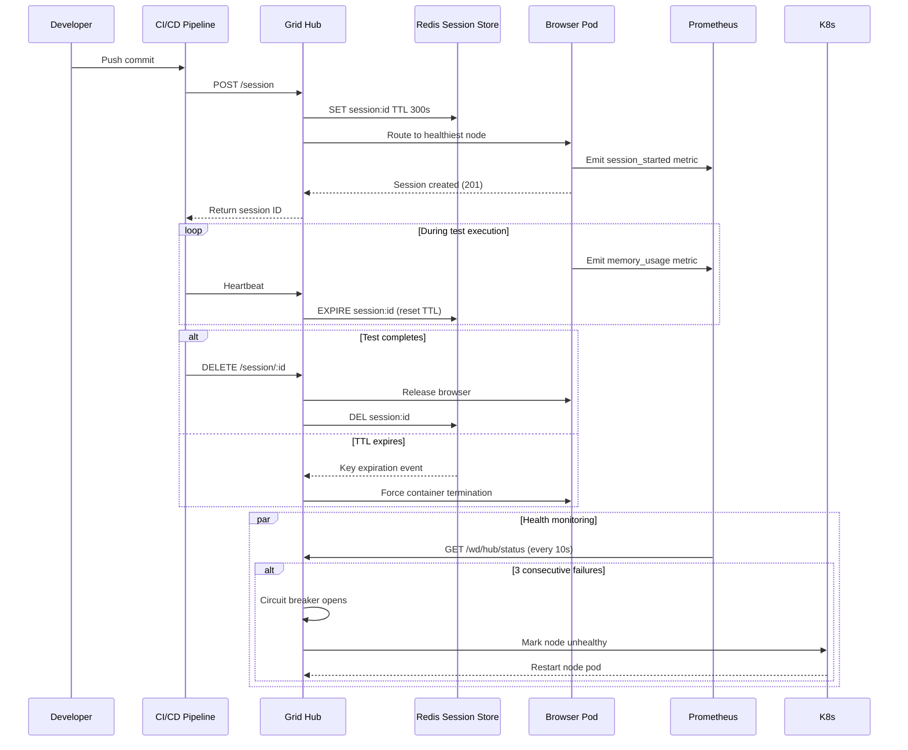

| Difficulty | Channel | Tags |
|---|---|---|
| advanced | system-design | selenium, webdriver, grid |

Friday afternoon at 3 PM. A developer pushes a commit they have been wrestling with for two days. The test suite kicks off. Then the waiting begins. An hour passes. Two hours. By the time results come back — red, of course, a flaky test in an unrelated module — it is too late to fix anything before the weekend. This was the daily reality for Expedia Group's 2000+ engineers, where a single test run could block deployments for over three hours [1]. With 250+ daily commits across 35 project teams, the bottleneck was never the code — it was the test infrastructure itself.

---

> ### Real-World Case — Expedia Group
>
> With 2000+ developers making 250+ daily commits across 35+ project teams, Expedia's UI test suites took hours to run sequentially. A single test run could block deployments for 3+ hours, meaning any commit during that window was invisible until the next deployment cycle. Teams were bottlenecked by their own test infrastructure.
>
> | | |
> |---|---|
> | **Challenge** | They needed to run 1000+ concurrent UI tests in minutes rather than hours while keeping cloud costs under control. Traditional Selenium Grid couldn't scale dynamically, and third-party cross-browser vendors would cost $2.41M/year for 1000 parallel connections. They needed a solution that auto-scaled nodes on demand and shut them down immediately after tests completed. |
> | **Solution** | They built SeleniumGridScaler, an open-source Selenium Grid plugin integrated with AWS EC2 API that dynamically spins up and terminates browser nodes based on real-time test demand. Each hub auto-calculates required nodes, provisions EC2 instances (max 15 browser sessions per c5.xlarge), runs tests in parallel, and terminates everything immediately after completion. They later evolved this to DA-Kube running on EKS with Docker, Helm, and Traefik for faster node provisioning (seconds vs 2-4 minutes) and per-Git-branch isolated grids. |
> | **Outcome** | 90-100+ hubs running 150,000+ tests daily. 4,500+ EC2 nodes created and terminated on demand per day. Test execution dropped from hours to 5 minutes for 1000 tests. Annual infrastructure cost: ~$80K vs $2.41M for equivalent third-party vendor capacity. Achieved 10x faster test execution with 3-4 daily test runs (up from 1-2). |
> | **Lesson** | Building an internal auto-scaling Selenium Grid platform is dramatically cheaper than third-party browser vendors at scale — $80K/year vs $2.41M. The key insight was that paying per-test-execution with third parties is cost-prohibitive when you need thousands of parallel sessions, but your own auto-scaling infrastructure costs a fraction because you only pay for underlying compute and can terminate nodes instantly. |

---

## Hook — The Friday afternoon deployment killer

Expedia Group ran one of the largest Selenium Grid deployments in the world: 90 to 100+ hubs executing 150,000+ tests daily [1]. Every day, 4,500+ EC2 nodes were created and terminated on demand to keep up. And yet, developers still waited hours for test results. The problem was so acute that deployment windows shrank to one or two per day, meaning any commit made after the morning run was invisible until the next cycle. Developers learned to batch their work. Feature velocity cratered. The test infrastructure had become a gate, not a gateway. This is the moment when most engineering organizations reach a painful conclusion: the tools that worked for 50 tests do not work for 50,000. The question is not whether to rebuild. It is how.

## Problem — Why Selenium Grid breaks at scale

Selenium Grid is deceptively simple to start. You spin up a hub, register a few nodes, and suddenly your tests run in parallel. It feels like a superpower until your test suite grows past a few hundred cases. Then things start to fray. Browser nodes leak memory like a sieve — every page load, every DOM query, every unclosed WebDriver session leaves debris in the JVM heap. Traditional Selenium Grid architectures use a hub-and-node model where the hub is a single point of failure and nodes are long-lived processes [2]. Without automatic session lifecycle management, orphaned sessions accumulate until a node runs out of memory and crashes, taking every running test with it. Node failures ripple through the grid. A single node running at 90% memory can slow response times for the entire pool. Session timeouts compound. Developers start seeing WebDriver exceptions that have nothing to do with their code — "unable to connect to node," "session not created," "timed out waiting for slot." The grid becomes a black box. Nobody knows which nodes are healthy, how many sessions are active, or why tests that passed locally fail on the grid. Sound familiar?

## Real-World Case — How Expedia Group rewrote the rules

Expedia Group did what most organizations only dream of: they tore down their legacy grid and rebuilt it on Kubernetes [1]. The results are staggering. Test execution for 1,000 test cases dropped from hours to just 5 minutes. Teams went from one or two test runs per day to three or four. The infrastructure cost? Approximately $80,000 per year — compared to $2.41 million for equivalent third-party vendor capacity. That is a 30x cost reduction. The architecture used Kubernetes StatefulSets to manage browser nodes across multiple availability zones, Docker containers for node isolation, Helm for deployment management, and Traefik for load balancing [1]. Every node pod was ephemeral — created on demand, terminated when finished, leaving no memory leaks behind. The lesson is clear: the grid itself must be as ephemeral as the sessions it manages. When you treat nodes as cattle rather than pets, memory leaks become impossible.

## Deep Dive — Architecture for 10,000 concurrent sessions

Building on Expedia's blueprint, a production-grade grid for 10,000 concurrent sessions requires four architectural pillars. First, the control plane. A distributed hub layer using Kubernetes StatefulSets with leader election prevents split-brain during network partitions [3]. The hub does not store state — it routes requests. All session state lives in a Redis cluster with TTL-based expiration [6]. Every session gets a key with a default TTL of 300 seconds, extended by heartbeats during active use. If a session goes silent, Redis evicts the key and the hub triggers cleanup. Second, resource isolation. Each browser node is a Kubernetes pod with strict resource limits: 2GB RAM and 1 CPU per node. With 50 sessions per node, 10,000 sessions require a minimum of 200 nodes. Horizontal Pod Autoscaling scales the node pool based on queue depth rather than CPU utilization, which prevents over-provisioning during traffic spikes [4]. The cluster needs roughly 520GB of memory — 400GB baseline plus a 30% safety buffer. Third, health monitoring. Prometheus scrapes metrics from every hub and node every 15 seconds [5]. Custom exporters track session duration, queue depth, memory per node, and garbage collection pauses. Grafana dashboards visualize memory trends, node health, and session distribution [8]. Alerts fire when any node crosses 80% memory utilization — giving operators time to drain and replace it before it fails. Fourth, resilience patterns. A circuit breaker sits in front of every node [7]. If a node returns three consecutive 503 errors on the /status endpoint, the circuit opens and the hub stops routing traffic to it for 30 seconds. During that window, the node drains active sessions and restarts. The real insight: most grid failures are slow, not sudden. Memory leaks take hours to crash a node. Circuit breakers catch the degradation curve early.

## Workflow — Following a session from commit to result

Here is the journey of a single test through the grid. A developer pushes code to the CI/CD pipeline. The pipeline requests a new WebDriver session by POSTing to the hub. The hub checks its Redis store for node availability, selects the healthiest node using weighted round-robin (based on current load and response time), and registers a new session key with a 300-second TTL. The browser pod receives the command, launches a Chrome instance, and sends a session ID back through the hub to the CI pipeline. Now the test executes. Every 60 seconds, the test runner sends a heartbeat to extend the session TTL in Redis. Prometheus records memory usage, session duration, and command latency. If the test completes successfully, a DELETE destroys the session, clears the Redis key, and terminates the browser process. If the TTL expires — say the test hung or the runner crashed — Redis fires a key expiration event. The hub catches it and force-terminates the associated browser container. Parallel to this, the health check loop runs every 10 seconds. The hub pings each node's /status endpoint. Three consecutive failures trigger the circuit breaker. The node enters a 30-second recovery window where it drains existing sessions but accepts no new ones. If recovery fails, Kubernetes restarts the pod. This architecture ensures that no single failure cascades.

## Code Example — Building a resilient grid session manager

The following Python class demonstrates the core pattern: session creation with Redis TTL registration, background heartbeat for extending TTL during execution, and deterministic cleanup that prevents orphaned sessions. This is essentially the session lifecycle logic that runs inside Expedia's grid architecture.

## Lessons Learned — What 150,000 tests per day taught us

Expedia Group's transformation yields five lessons for any team scaling test infrastructure. One: treat nodes as ephemeral. Long-lived browser nodes accumulate memory leaks. Use Kubernetes pods that are created per-session or restarted on a rolling schedule. Two: make session TTLs non-negotiable. Every session must have an expiration, even if it gets extended by heartbeats. Without TTLs, a crashed CI runner leaves zombie sessions that consume resources until manual cleanup. Three: monitor at the right granularity. Average memory across all nodes is useless. Track per-node memory, per-session duration, and queue depth [5]. A session running for 45 minutes is probably stuck. Four: use circuit breakers, not load balancers [7]. Load balancers distribute traffic evenly, which means they send requests to degrading nodes at the same rate as healthy ones. Circuit breakers remove failing nodes from rotation entirely. Five: plan for the cost curve. Expedia saved 30x over vendor solutions by using Kubernetes and open-source tooling [1]. The operational complexity is real, but at scale, the economics are undeniable. The takeaway: your test infrastructure should be as observable, resilient, and ephemeral as the production infrastructure it validates.

---

## Session Lifecycle Flow

<strong>Original Interview Question</strong>

**Q:** Design a scalable Selenium Grid architecture to handle 10,000 concurrent test sessions with 99.9% uptime, ensuring zero memory leaks through automatic session lifecycle management, real-time monitoring, and graceful node failure recovery across multiple data centers?

**A:** Deploy Kubernetes cluster with auto-scaling node pools, Redis session store with TTL policies, Prometheus metrics for memory monitoring, circuit breakers for node isolation, and sidecar containers for session cleanup. Implement health checks, resource quotas, and rolling updates.

## Conclusion

The next time your team stares at a spinning loader waiting for test results, remember Expedia Group's numbers: 30x cost savings, 10x faster execution, and a grid that handles 150,000 tests daily without breaking a sweat. The architecture exists. The patterns are proven. The only question is whether you will build it before your test infrastructure becomes the bottleneck your developers complain about at retrospectives. Start with ephemeral nodes, enforce session TTLs, and monitor every dimension of memory. Your Friday afternoons will thank you.

---

## References

1. [Expedia Group: Da Kube — Selenium Grid using Kubernetes, Docker, Helm and Traefik](https://medium.com/expedia-group-tech/da-kube-selenium-grid-using-kubernetes-docker-helm-and-traefik-856b802d1d08) — blog
2. [Selenium Grid Documentation](https://www.selenium.dev/documentation/grid/) — documentation
3. [Kubernetes StatefulSets](https://kubernetes.io/docs/concepts/workloads/controllers/statefulset/) — documentation
4. [Horizontal Pod Autoscaling](https://kubernetes.io/docs/tasks/run-application/horizontal-pod-autoscale/) — documentation
5. [Prometheus — Monitoring system and time series database](https://prometheus.io/docs/introduction/overview/) — documentation
6. [Redis — Key expiration and eviction](https://redis.io/docs/latest/develop/use/keyspace/) — documentation
7. [Martin Fowler — Circuit Breaker pattern](https://martinfowler.com/bliki/CircuitBreaker.html) — article
8. [Grafana — Observability and data visualization](https://grafana.com/docs/) — documentation
9. [Docker — Container runtime documentation](https://docs.docker.com/) — documentation
10. [Kubernetes Pod Disruption Budgets](https://kubernetes.io/docs/concepts/workloads/pods/disruptions/) — documentation

---

**Author:** Satishkumar Dhule — [GitHub](https://github.com/satishkumar-dhule) · [LinkedIn](https://linkedin.com/in/satishkumar-dhule) · [Website](https://satishkumar-dhule.github.io)
