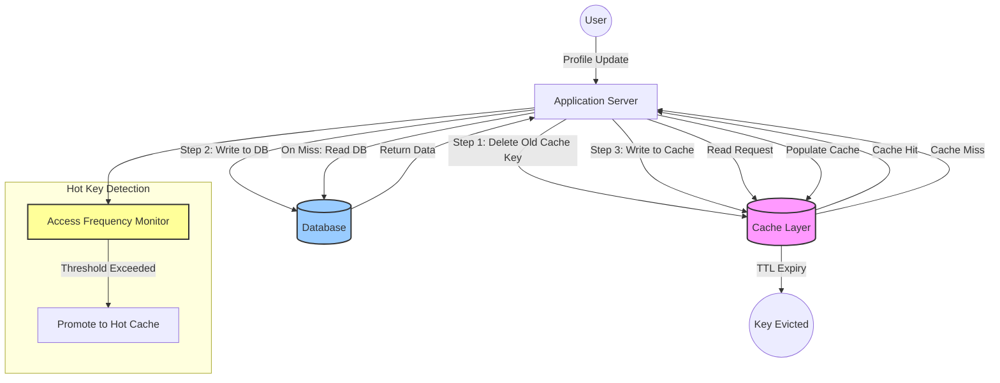

| Difficulty | Channel | Tags |
|---|---|---|
| beginner | backend | redis, memcached, cache-invalidation |

When Ellen DeGeneres snapped a celebrity selfie at the 2014 Oscars, nobody expected it to bring down Twitter. But at peak traffic, a single Memcached shard buckled under 2.5 million retweets, triggering a 25-minute global outage [1]. The culprit? A hot key — one piece of content so popular it overwhelmed the caching layer designed to make everything fast. This is the story of how cache invalidation works, why Twitter's infrastructure failed, and what every developer needs to know before their own viral moment strikes.

---

> ### Real-World Case — Twitter
>
> During the 2014 Oscars, Ellen DeGeneres tweeted a celebrity selfie that became the most retweeted post ever at the time (2.5M+ retweets in hours). The viral spike caused a single Memcached shard to be overloaded, triggering a 25-minute site-wide outage at peak traffic.
>
> | | |
> |---|---|
> | **Challenge** | A single cache key (the selfie's metadata) became a 'hot key' routing all traffic to one Memcached shard. Twitter's FNV1-32 hash function was known to ignore the least significant byte, and their hot key promotion algorithm (1% sampling) failed to detect large-value keys in time. The result: NIC saturation on 1Gb hosts, cascading failures across the user data service, and a full site outage. |
> | **Solution** | Twitter implemented 50+ changes across their caching infrastructure: switched from FNV1-32 to Murmur3 for better key distribution, tuned hot key detection algorithms (the existing one had only 0.3% hit rate in some clusters), upgraded cache hosts from 1Gb to 10Gb NICs, and developed groupcache — a distributed cache that mirrors super-hot items across multiple peers to prevent single-shard hotspots. |
> | **Outcome** | 25-minute site outage during the Oscars; 2.5M+ retweets of a single piece of content brought down a global platform. Post-fix, cache hit rates improved significantly after replacing the 0.3%-effective hot key promotion algorithm. Twitter later open-sourced Twemproxy and Pelikan to help the industry avoid similar Memcached scaling pitfalls. |
> | **Lesson** | A single cache key can bring down a global platform if hot key detection and hash distribution aren't hardened. The 'plot twist': Twitter's own FNV1-32 hash — which they knew was flawed since at least 2014 — concentrated all large-value keys onto the same shards because it ignored the last byte where the variance lived. Sometimes the bug isn't in the cache, it's in how you shard it. |

---

## Hook — The Selfie That Broke the Internet

It was Oscar night 2014. Ellen DeGeneres tweeted a photo that would become the most retweeted post in history: a star-studded selfie with Bradley Cooper, Jennifer Lawrence, and other A-listers. Within hours, that single piece of content accumulated over 2.5 million retweets. What happened next is a cautionary tale that should make every backend engineer sit up straight. A single Memcached shard — responsible for caching that tweet's data — became hammered with requests. The hot key promotion algorithm, designed to detect and handle popular content, was functioning at just 0.3% effectiveness [1]. The result: 25 minutes of site-wide downtime during one of the year's biggest cultural events. Twitter's caching layer didn't just fail — it failed spectacularly, publicly, and at the worst possible moment.

## Problem — Why Cache Invalidation Is Hard

Here is the fundamental tension: caches make things fast, but they also serve stale data. Every time a user updates their profile, changes their avatar, or posts new content, the cache must reflect that change. If the cache still holds the old version, you get a stale read — users see outdated information. Invalidating cache correctly means answering three questions: *When* should you evict data? *How* do you ensure all servers agree on the new value? And *what* happens when millions of users request the same key simultaneously? Many developers reach for a simple TTL (time-to-live) and call it done. But as Twitter learned, a TTL-based strategy without hot key protection can collapse under viral traffic. The challenge is not just cache invalidation — it is distributed cache invalidation under extreme load, where every millisecond of latency and every stale read directly impacts the user experience.

## Real-World Case — Twitter's Oscars Outage

The 2014 Oscars outage became a defining moment for Twitter's infrastructure team. The incident exposed a critical flaw in their caching architecture: the hot key promotion algorithm was supposed to detect when a specific piece of content became globally popular and promote it to a dedicated cache tier. But the algorithm was barely functional — operating at 0.3% effectiveness, meaning 99.7% of hot keys went undetected [1]. When Ellen's selfie went viral, that single key overwhelmed its Memcached shard. Since Memcached lacks built-in replication or failover for individual hot keys, the shard's latency spiked, cascading into a site-wide outage. The fix was not a simple configuration change. Twitter overhauled their caching infrastructure, open-sourcing Twemproxy (a proxy for Memcached and Redis) and later Pelikan (a more performant caching framework) to help the broader industry avoid similar pitfalls [4][5]. Post-fix, cache hit rates improved dramatically — a testament to how much headroom proper caching design provides.

## Deep Dive — Redis vs Memcached: Choosing Your Weapon

Building on Twitter's experience, let's explore the two dominant caching solutions and their trade-offs. Memcached is the lightweight specialist: it caches key-value pairs in memory and does little else. Its simplicity means lower memory overhead per key and straightforward horizontal scaling — you add nodes, rehash keys, and move on. However, Memcached has no persistence, no replication, and no built-in mechanism for notifying other nodes when a key changes. This is exactly why Twitter's hot key caused such damage: without pub/sub or a coordination layer, the only way to invalidate across nodes is manual — and manual doesn't scale. Redis, on the other hand, is the Swiss Army knife of caching. It offers pub/sub messaging for instant cross-node invalidation, persistence to disk, and advanced data structures like sorted sets and hyperloglogs [2]. Need to invalidate a cached profile across six application servers simultaneously? Redis pub/sub broadcasts the invalidation event. Need to survive a restart without a cold cache? Redis persistence has you covered [2]. Here is the trade-off: Redis is heavier. It consumes more memory for the same data, requires more configuration, and its single-threaded event loop means one slow command can block everything. Memcached's multi-threaded architecture handles concurrent requests more predictably for simple get/set workloads [3]. The right choice depends on your invalidation complexity. If you need distributed coordination, Redis wins. If you are doing pure key-value caching with minimal invalidation logic, Memcached's simplicity may be the better bet.

## Workflow — A Resilient Cache Invalidation Strategy

The most battle-tested approach combines write-through caching with TTL-based expiration and a dedicated hot key detection layer. Here is how it works:

1. **Read (cache-aside)**: Application checks cache first. On a miss, reads from the database and populates the cache.
2. **Write (write-through)**: On profile update, write to both database and cache simultaneously. Delete the old cache key first to prevent partial updates.
3. **TTL safety net**: Set a TTL of 5–30 minutes on cached profiles. Even if invalidation fails, stale data self-destructs.
4. **Hot key detection**: Monitor access frequency per key. When a key exceeds a threshold, promote it to a dedicated hot key cache tier with higher availability.
5. **Distributed invalidation**: Use Redis pub/sub or a message queue to broadcast invalidation events across all application nodes [2].

The diagram below shows the full request flow — from user action through cache invalidation to database synchronization.

## Code Example — Write-Through Cache Invalidation in Python

This implementation shows a write-through cache invalidation pattern for a user profile service. It handles cache-aside reads, write-through updates with key deletion, TTL-based expiration, and a simple hot key monitor.

## Lessons Learned — What Twitter's Outage Teaches Us

If there is one thing to take away from Twitter's 2014 outage, it is this: **your cache is only as good as your invalidation strategy**. Here are the non-negotiable practices every team should adopt:

- **Never rely on TTL alone**. TTL is a safety net, not a strategy. Always implement explicit invalidation on write operations.
- **Monitor hot keys proactively**. Use request frequency histograms, not averages. A single hot key can be invisible in p99 metrics but devastating at the shard level.
- **Choose your cache for your invalidation pattern**. If you need distributed invalidation, Redis pub/sub is practically required [2]. If you have simple key-value needs, Memcached's simplicity is an advantage — but you *must* implement your own coordination layer.
- **Test under viral load**. Twitter's 0.3% hot key detection rate was a bug that only manifested under extreme traffic. Simulate spikes that are 10x your expected peak.
- **Open source your learnings**. Twitter's Twemproxy and Pelikan [4][5] helped an entire industry avoid the same mistakes. When you find a fix, share it.

Tomorrow, review your cache layer. Ask yourself: what happens when one key gets 2.5 million requests? If you do not have a good answer, that selfie could be yours.

---

## Write-Through Cache Invalidation Flow with Hot Key Detection

<strong>Original Interview Question</strong>

**Q:** You're building a user profile service that caches frequently accessed profiles. How would you implement cache invalidation when a user updates their profile, and what trade-offs would you consider between Redis and Memcached?

**A:** Implement write-through caching with TTL-based expiration. On profile update, invalidate the cache by deleting the key and writing new data to both the database and cache. Redis offers pub/sub for automatic distributed invalidation, while Memcached requires manual coordination across nodes.

## Conclusion

Ellen's selfie was a once-in-a-platform event, but the caching failure it triggered happens every day at smaller scales. The pattern is universal: a popular piece of data, an under-engineered caching layer, and a sudden spike that exposes the gap between theory and production. By implementing write-through caching with explicit invalidation, monitoring hot keys with frequency histograms instead of averages, and choosing Redis when your invalidation needs cross server boundaries, your service will survive its own viral moment. The next time a pager goes off at 2am, make sure the problem is not something as preventable as a cold cache.

---

## References

1. [Twitter incident report — Dan Luu](https://danluu.com/cache-incidents/) — blog
2. [Redis Documentation — Pub/Sub](https://redis.io/docs/latest/develop/interact/pubsub/) — documentation
3. [Memcached Wiki](https://github.com/memcached/memcached/wiki) — documentation
4. [Twemproxy — Twitter's Redis/Memcached Proxy](https://github.com/twitter/twemproxy) — documentation
5. [Pelikan — Twitter's Caching Framework](https://github.com/twitter/pelikan) — documentation
6. [Cache Writing Policies — Wikipedia](https://en.wikipedia.org/wiki/Cache_(computing)#Writing_policies) — blog
7. [AWS Database Caching Strategies](https://docs.aws.amazon.com/whitepapers/latest/database-caching-strategies/caching-strategies.html) — documentation
8. [Cache Invalidation Patterns — DigitalOcean](https://www.digitalocean.com/community/tutorials/understanding-database-caching-strategies) — blog

---

**Author:** Satishkumar Dhule — [GitHub](https://github.com/satishkumar-dhule) · [LinkedIn](https://linkedin.com/in/satishkumar-dhule) · [Website](https://satishkumar-dhule.github.io)
