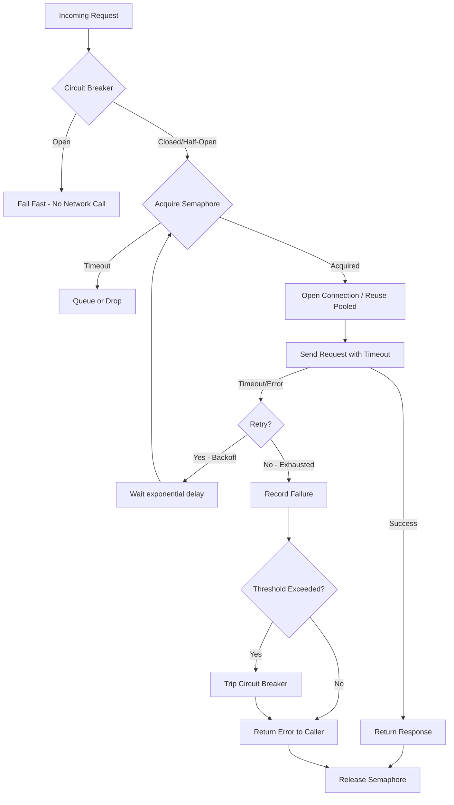

| Difficulty | Channel | Tags |
|---|---|---|
| advanced | backend | asyncio, aiohttp, concurrency |

In 2015, Netflix's API system faced a terrifying problem. Every user request triggered calls to over 100 microservices — recommendations, user profiles, search, ratings — all orchestrated in real time. They were processing 10+ billion thread-isolated and 200+ billion semaphore-isolated command executions per day across 40+ thread pools [1]. And then, one slow service nearly took everything down. A single sluggish recommendations endpoint would exhaust thread pools, starve Tomcat, and cascade failure across the entire platform. Sound familiar? You may not be Netflix, but if you have ever built a system that talks to external services over HTTP, you have felt this pain. The question is: how do you build a connection pool that protects itself — that degrades gracefully when things go wrong rather than dragging your whole application into the abyss?

---

> ### Real-World Case — Netflix
>
> Netflix's API system orchestrates hundreds of microservices to serve a single user request. By 2015, they were operating 100+ Hystrix command types with 40+ thread pools processing 10+ billion thread-isolated and 200+ billion semaphore-isolated command executions per day. A single slow or failing dependency (like a recommendations or user-profile service) could cascade — exhausting thread pools, starving Tomcat, and taking down the entire platform.
>
> | | |
> |---|---|
> | **Challenge** | How do you prevent a single slow downstream service from cascading into a full API outage? With thousands of microservices, constant deploys, and millions of requests per second, they needed a way to isolate failures, fail fast, and gracefully degrade instead of letting connection pool exhaustion propagate system-wide. |
> | **Solution** | Netflix built Hystrix, implementing the circuit breaker pattern combined with semaphore-based concurrency limiting and thread-pool isolation (bulkhead pattern). Each remote call is wrapped in a HystrixCommand with: (1) a fixed-size thread pool or semaphore to limit concurrent connections per dependency, (2) configurable timeouts per command, (3) a circuit breaker that trips when error rates exceed thresholds (default: 50% failures in a 10-second window of 20+ requests), and (4) fallback logic for graceful degradation. They tuned circuits by starting with liberal timeouts (1000ms default) and 10-thread pools, then tightened values based on 99.5th percentile latency in production. |
> | **Outcome** | Hystrix eliminated cascading failures across Netflix's microservice architecture. The circuit breaker isolates failing dependencies within seconds, preventing thread-pool exhaustion from spreading. Fail-fast behavior reduced average response times during partial outages from 30+ second timeouts to sub-millisecond circuit-breaker rejections. The Hystrix dashboard provides real-time visibility into every dependency's health. The pattern was so successful it became the industry-standard reference implementation, inspiring resilience libraries across Java, Python (pybreaker, aioretry), Node.js, and .NET. |
> | **Lesson** | The counterintuitive insight: failing fast is better than trying to succeed. When a dependency is unhealthy, continuing to make requests wastes resources and makes the outage worse. A circuit breaker should trip aggressively — it's far better to serve a degraded fallback (cached data, default response) for 30 seconds than to let a slow dependency consume your entire connection pool and take down unrelated features. |

---

## Hook — What happens when your downstream service ghosts you?

Imagine this: your Python async service sends a GET request to a recommendations API. The service is slow today — maybe a bad deploy, maybe a thundering herd of traffic. Your semaphore-counted connection pool starts filling up with in-flight requests. New requests pile into the queue. Response times climb from 50ms to 5 seconds, then to 30 seconds. Tomcat threads start blocking. Other services depending on yours start timing out. Before you know it, a single slow dependency has dominoed into a site-wide outage. This is not a theoretical exercise. It happened to Netflix. It happened to Amazon. It has happened to nearly every engineering team that builds distributed systems without intentional failure boundaries [1]. The good news? The patterns to prevent this are well understood — and implementing them in aiohttp is more straightforward than you might think.

## Problem — Connection pools are not just about reuse

Many developers think a connection pool is just a cache of pre-opened TCP connections. You grab one, make a request, return it. Done. But that is like saying an airbag is just a pillow. The real value of a connection pool is not performance — it is *protection*. When your system makes 10,000 requests per second to a downstream service, that pool is your first line of defense. Without it, every socket opened is a potential leak. Every timeout is a thread held hostage. Every retry is an avalanche waiting to happen. A well-designed connection pool manager does three things that most naive implementations miss. First, it limits *concurrency*, not just total connections — using a semaphore to cap how many requests are in flight at once [6]. Second, it introduces *backpressure*: when the pool is saturated, it queues requests with a sensible drop policy rather than letting them pile up unbounded. Third — and this is where most teams get it wrong — it handles *degradation mode*: when a service starts failing, the pool should fail fast, not fail slowly.

## Real-World Case — Netflix and the Hystrix that saved microservices

Netflix's engineering team documented their microservice architecture crisis in painful detail. Every user request to the Netflix API resolved into a fan-out to dozens of dependency services. Under normal load, this worked beautifully. But during partial outages — a slow deployment on the user-profile service, a traffic spike overwhelming recommendations — the impact was catastrophic. A single slow dependency would hold onto Tomcat threads for 30+ seconds waiting for timeouts. Those threads could not serve other requests. The thread pool would exhaust. Other dependencies would pile up behind the slow one. The entire API surface became unavailable, even though 90% of services were healthy. Sound like a cascading failure? That is exactly what it was. Netflix's response was Hystrix — a resilience library that introduced the circuit breaker pattern to microservices at scale [1]. The results were dramatic. Fail-fast behavior reduced average response times during partial outages from 30+ second timeouts to sub-millisecond circuit-breaker rejections. The dashboard gave every team real-time visibility into every dependency's health. The pattern was so successful it became the industry standard, inspiring pybreaker, aioretry, resilience4j, and countless other libraries.

## Deep Dive — The three pillars of graceful degradation

Building on what Netflix learned, three core patterns form the foundation of any production-grade connection pool manager. **Semaphore-based concurrency limiting** is the first line of defense. Unlike a simple connection limit, a semaphore controls how many *requests* are in flight, not just how many TCP connections are open [6]. When the semaphore is exhausted, new requests either wait in a bounded queue or fail immediately — your choice depending on latency requirements. The key insight: bounded queuing prevents unbounded memory growth. **Exponential backoff** is the second pillar. When a request fails — whether from a timeout, connection reset, or 5xx — retrying immediately is almost always the wrong move [5]. The failing service is already under stress; hammering it with retries makes things worse. Instead, back off: wait 100ms, then 200ms, then 400ms, with jitter to avoid thundering herd synchronization. **The circuit breaker pattern** is the crown jewel [2]. Track failures in a sliding window. When the failure rate crosses a threshold (say 50% in a 10-second window), trip the breaker to "open." All requests fail instantly — no network call made, no thread held. After a cooldown period (typically 30-60 seconds), transition to "half-open" and allow a single probe request. If it succeeds, close the breaker. If it fails, stay open. This is the pattern that saved Netflix.

## Workflow — The life of a request through a resilient pool

Here is how a typical request flows through a properly designed connection pool manager. The Mermaid diagram below illustrates the decision tree — and notice how many paths end in "fail fast" rather than "wait forever." This is intentional: every millisecond you spend waiting on a doomed request is a millisecond your users spend staring at a loading spinner.



The diagram shows the decision chain for every request. Notice how the circuit breaker check happens *before* the semaphore acquisition — there is no point acquiring a precious semaphore slot if you are just going to fail immediately. The timeout on semaphore acquisition is also critical; if you cannot get a slot within X milliseconds, either queue the request (with a bounded queue) or drop it and return a 503.

## Code Example — Building a production-grade ConnectionPoolManager for aiohttp

Let's translate these patterns into code. The following implementation combines semaphore-based concurrency limiting, exponential backoff for retries, and a circuit breaker that prevents cascade failures [3][4].

```python
import asyncio
import aiohttp
from asyncio import Semaphore, TimeoutError
from typing import Optional, Callable
import random

class ConnectionPoolManager:
    """Resilient connection pool with circuit breaker and exponential backoff."""

    def __init__(
        self,
        max_connections: int = 100,
        circuit_breaker_threshold: int = 5,
        circuit_breaker_timeout: int = 30,
        max_retries: int = 3
    ):
        self.semaphore = Semaphore(max_connections)
        self.session: Optional[aiohttp.ClientSession] = None
        self._timeout = aiohttp.ClientTimeout(total=10, connect=5)
        self._max_retries = max_retries

        # Circuit breaker state
        self._breaker_open = False
        self._failure_count = 0
        self._circuit_breaker_threshold = circuit_breaker_threshold
        self._circuit_breaker_timeout = circuit_breaker_timeout
        self._last_failure_time = 0.0
        self._breaker_tripped_at = 0.0

    async def __aenter__(self):
        connector = aiohttp.TCPConnector(
            limit=max(1, self.semaphore._value),
            ttl_dns_cache=300,
            enable_cleanup_closed=True
        )
        self.session = aiohttp.ClientSession(connector=connector)
        return self

    async def __aexit__(self, *exc):
        if self.session:
            await self.session.close()

    async def make_request(self, url: str, **kwargs) -> aiohttp.ClientResponse:
        """Make a request with circuit breaker, semaphore, and retry logic."""
        # Check circuit breaker first — no point wasting a semaphore slot
        if self._is_circuit_open():
            raise aiohttp.ClientError("Circuit breaker is open — failing fast")

        # Acquire semaphore to cap concurrent in-flight requests
        async with self.semaphore:
            for attempt in range(self._max_retries):
                try:
                    async with self.session.get(
                        url, timeout=self._timeout, **kwargs
                    ) as response:
                        # Success resets the breaker
                        self._on_success()
                        return response

                except (asyncio.TimeoutError, aiohttp.ClientError) as e:
                    self._on_failure()
                    if self._is_circuit_open() or attempt == self._max_retries - 1:
                        raise
                    # Exponential backoff with jitter
                    wait_time = (2 ** attempt) + random.uniform(0, 0.5)
                    await asyncio.sleep(wait_time)

    def _is_circuit_open(self) -> bool:
        if not self._breaker_open:
            return False
        # Check if enough time has passed to try half-open
        elapsed = asyncio.get_event_loop().time() - self._breaker_tripped_at
        if elapsed >= self._circuit_breaker_timeout:
            self._breaker_open = False  # half-open: allow a probe
            return False
        return True

    def _on_success(self):
        self._failure_count = 0
        self._breaker_open = False

    def _on_failure(self):
        self._failure_count += 1
        self._last_failure_time = asyncio.get_event_loop().time()
        if self._failure_count >= self._circuit_breaker_threshold:
            self._breaker_open = True
            self._breaker_tripped_at = self._last_failure_time
```

The design decisions here matter. The circuit breaker check runs *before* the semaphore acquisition — you never waste a precious concurrent slot on a request destined to fail. The exponential backoff uses jitter (`random.uniform(0, 0.5)`) to prevent synchronized retry storms [5]. The `ClientTimeout` with separate `connect` and `total` parameters prevents connection-phase hangs from holding slots indefinitely. And the session uses `TCPConnector` with DNS caching and cleanup — two often-overlooked settings that prevent socket leaks under high churn.

## Lessons Learned — What 200 billion command executions taught Netflix (and should teach you)

So what should you do differently starting tomorrow? First, **never deploy a connection pool without a circuit breaker**. The semaphore limits concurrency, but the circuit breaker is what saves you from cascading failures. Without it, you are one slow dependency away from a site-wide outage [1][2]. Second, **bounded queues are non-negotiable**. An unbounded queue of pending requests is just a memory leak waiting to happen. Use `asyncio.Queue(maxsize=...)` with a sensible drop policy. Third, **monitor everything**. The Hystrix dashboard gave Netflix teams real-time per-dependency metrics — failure rates, latency percentiles, circuit breaker state. You need the same. Track your pool's semaphore utilization, circuit breaker state transitions, and retry rates in your metrics system. Fourth, **test your degradation mode**. Do not just test the happy path. Inject latency, drop connections, return 500s. Watch your circuit breaker trip. Watch your pool drain gracefully. Your staging environment should include simulated chaos — because the first time your circuit breaker trips should not be in production at 3 AM on a holiday weekend.

---

## Request Lifecycle Through Resilient Connection Pool


<details>
<summary><strong>Original Interview Question</strong></summary>

**Q:** How would you implement a connection pool manager for aiohttp that handles graceful degradation under high load and connection timeouts?

**A:** Implement a connection pool manager for aiohttp using a semaphore to limit concurrent connections, exponential backoff for retrying failed requests, and circuit breaker pattern to gracefully degrade under high load and connection timeouts.

</details>

## Conclusion

Building a connection pool manager that gracefully degrades under load is not about writing clever code — it is about designing failure boundaries that protect your system from its own dependencies. Netflix learned this the hard way, processing billions of requests before Hystrix became the blueprint for resilience engineering [1]. The patterns are proven: semaphore-based concurrency limits prevent resource exhaustion, exponential backoff prevents retry storms, and circuit breakers prevent cascading failures. Your aiohttp application deserves the same protections. Start small — add a circuit breaker to your most critical external dependency this week. Monitor the results. You might be surprised how often a service you trusted was actually on the verge of failing. The code is ready. The patterns are proven. The only question left is: will your connection pool protect you, or will it become the weakest link in your architecture?

---

## References

1. [Netflix Hystrix Operations Wiki](https://github.com/Netflix/Hystrix/wiki/Operations) — documentation
2. [Circuit Breaker Design Pattern — Wikipedia](https://en.wikipedia.org/wiki/Circuit_breaker_design_pattern) — article
3. [Python asyncio — Coroutines and Tasks](https://docs.python.org/3/library/asyncio.html) — documentation
4. [aioHTTP Client Documentation](https://docs.aiohttp.org/en/stable/) — documentation
5. [Exponential Backoff — Wikipedia](https://en.wikipedia.org/wiki/Exponential_backoff) — article
6. [Semaphore (Programming) — Wikipedia](https://en.wikipedia.org/wiki/Semaphore_(programming)) — article
7. [HTTP Connection Management in HTTP/1.x — MDN](https://developer.mozilla.org/en-US/docs/Web/HTTP/Connection_management_in_HTTP_1.x) — documentation
8. [RFC 7230 — Hypertext Transfer Protocol (HTTP/1.1)](https://datatracker.ietf.org/doc/html/rfc7230) — documentation

---

**Author:** Satishkumar Dhule — [GitHub](https://github.com/satishkumar-dhule) · [LinkedIn](https://linkedin.com/in/satishkumar-dhule) · [Website](https://satishkumar-dhule.github.io)
