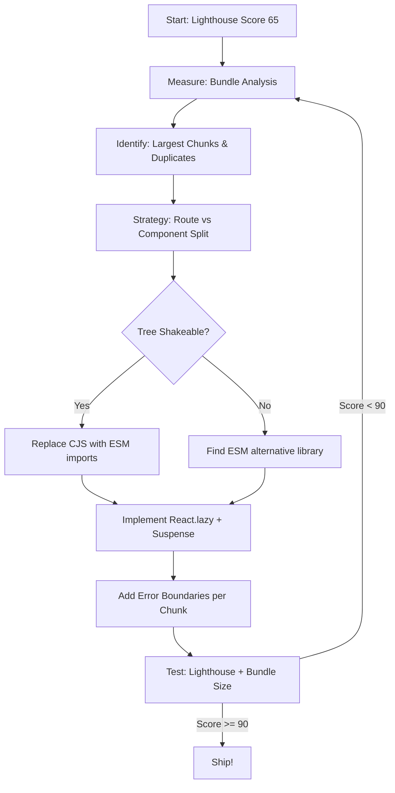

| Difficulty | Channel | Tags |
|---|---|---|
| intermediate | frontend | lighthouse, bundle, lazy-loading |

In 2017, Tinder shipped a React/Redux Progressive Web App in just three months. The result? A bloated 166KB JavaScript bundle that took over 11 seconds to load on mobile [1]. Users in data-costly markets were staring at a blank screen long enough to swipe right on boredom. This is the story of how they turned it around — and what every developer can learn about lazy loading, code splitting, and the art of the performance budget.

---

> ### Real-World Case — Tinder
>
> Tinder built 'Tinder Online' — a React/Redux Progressive Web App — in 3 months to bring their dating experience to the web and expand into data-costly markets. Early versions suffered from monolithic JavaScript bundles causing load times over 11 seconds on mobile, making the web experience feel sluggish compared to native.
>
> | | |
> |---|---|
> | **Challenge** | Large monolithic JavaScript bundles (166KB+ for core routes) delayed Time to Interactive. Users on median mobile hardware (Moto G4) over 4G faced 5-11 second load times. The web app needed to match native app performance on swipe responsiveness, messaging, and session engagement or users would bounce. |
> | **Solution** | Implemented route-based code splitting with React Router and React Loadable (the precursor to React.lazy), enforced strict performance budgets (~155KB core/vendor, ~55KB async chunks, 20KB CSS), used webpack-bundle-analyzer to identify waste (replaced localForage with raw IndexedDB, removed unused polyfills via babel-preset-env), added Service Worker precaching with Workbox, preloaded critical bundles with link rel=preload (saving 1s), enabled webpack scope hoisting (8% faster parsing), and upgraded React 15→16 (6.7% vendor chunk reduction). |
> | **Outcome** | Core bundle dropped from 166KB to 101KB (39% reduction). DCL improved from 5.46s to 4.69s. First paint dropped from 1000ms to ~500ms with preloading. Total load time improved ~60%. The PWA outperformed the native app on swipe frequency, message volume, profile edits, and session length. Featured at Google I/O and Chrome Dev Summit as a benchmark for React PWA performance. |
> | **Lesson** | Performance budgets are essential guardrails — they force disciplined code splitting and prevent regression as features grow. Route-based code splitting + Service Worker precaching + preloading can close the gap between web and native. But the real unlock was combining bundle analysis (webpack-bundle-analyzer) with aggressive library replacement, not just splitting for its own sake. |

---

## Hook — The 11-Second Nightmare

Imagine spending three months building a web app that matches your native experience feature-for-feature. You ship it, pat each other on the back, and wait for the users to pour in. Instead, they leave. The bundle is too heavy. The phone stutters. The first paint takes an eternity. This was Tinder's reality when 'Tinder Online' launched. The core JavaScript bundle sat at 166KB — but that was before gzip, before polyfills, before everything the runtime needed to boot. Real-world load times hit 11 seconds on 3G networks. In markets where every kilobyte costs money, that might as well be infinity.

## Problem — The Monolithic Bundle Tax

Single-page applications have a dirty secret: you pay the full JavaScript tax before the user sees a single pixel. Every component, every utility, every third-party library — they all get merged into one gigantic bundle that must download, parse, and execute before anything becomes interactive [2]. For a React app like Tinder's, that meant every user downloaded the dashboard code, the analytics engine, the chat module, and the settings panel, even if they only wanted to swipe a few profiles. The math is brutal: JavaScript is the most expensive resource on the web. A 100KB image renders incrementally; 100KB of JavaScript blocks the main thread until the parser finishes. When your Time to Interactive hits 4.2 seconds (or worse, Tinder's 11 seconds), you are bleeding users with every millisecond.

## Real-World Case — Tinder's PWA Resurrection

Here is where the story takes a turn. Tinder's engineering team realized the problem was not their framework — it was how they shipped it. They went to work with a laser focus on performance budgets. The results were staggering: core bundle dropped from 166KB to 101KB — a 39% reduction. DOM Content Loaded improved from 5.46s to 4.69s. First paint dropped from 1000ms to roughly 500ms with preloading strategies [1]. Total load time improved by approximately 60%. But the most surprising metric was engagement: the PWA actually outperformed the native app on swipe frequency, message volume, profile edits, and session length. Users preferred the web experience. Tinder's work was featured at Google I/O and Chrome Dev Summit as a benchmark for React PWA performance. The lesson? Performance is not just about saving milliseconds — it is about changing user behavior.

## Deep Dive — Code Splitting, Tree Shaking, and the Art of 'Ship Less'

Many developers think performance optimization means micro-optimizations — inlining a function here, reducing a re-render there. The reality is more brutal and more rewarding: the biggest wins come from not shipping code at all. Three core techniques drive this.

**Code splitting** is the practice of breaking your monolithic bundle into smaller chunks that load on demand. React's `React.lazy()` combined with `Suspense` gives you a declarative API for exactly this [3]. The key insight? Route-based splitting is the lowest-hanging fruit. Users on `/dashboard` should never download the analytics module. Component-based splitting handles the rest — heavy charts, rich text editors, video players that should only initialize when they enter the viewport.

**Tree shaking** relies on ES module static analysis. When you import `{ debounce } from 'lodash'`, a smart bundler like webpack or Rollup can eliminate the other 99% of lodash you are not using [4]. The catch? CommonJS modules (require) cannot be tree-shaken. If you are stuck with a library that ships CommonJS, you either find an ESM alternative or accept the dead weight.

**Bundle analysis** is the compass that guides all of this. Tools like `webpack-bundle-analyzer` produce a treemap visualization of your bundle composition [5]. Most teams discover the same painful pattern: a massive third-party library they use for a single utility function, or an accidentally duplicated dependency that doubled the size of a critical chunk.

Here is the plot twist: aggressive code splitting can backfire. Too many tiny chunks create a waterfall of HTTP requests that actually degrades performance. The sweet spot is chunk sizes between 20KB and 50KB — large enough to compress efficiently, small enough to load quickly [6]. Tinder's team understood this balance, which is why they ended up with a leaner bundle that still loaded predictably.

## Workflow — The Performance Optimization Pipeline

The following diagram maps the end-to-end workflow Tinder's team followed — and that you can replicate in any React project:



The workflow is iterative, not linear. Tinder went through multiple rounds of measurement and refactoring before landing on their 60% improvement. Each pass reveals new opportunities — an image format upgrade, a polyfill removal, a server-side tweak. The key is starting with data, not guesses.

## Code Example — Lazy Loading in Practice

Here is how you implement route-based and component-based code splitting in a modern React app with error boundaries:

```javascript
import React, { Suspense, lazy } from 'react';
import { Routes, Route } from 'react-router-dom';

// Route-based splitting: each route loads its own chunk
const Dashboard = lazy(() => import(/* webpackChunkName: "dashboard" */ './pages/Dashboard'));
const Analytics = lazy(() => import(/* webpackChunkName: "analytics" */ './pages/Analytics'));
const Profile = lazy(() => import(/* webpackChunkName: "profile" */ './pages/Profile'));

// Component-based splitting: heavy UI elements load on demand
const HeavyChart = lazy(() => import(/* webpackChunkName: "chart" */ './components/HeavyChart'));
const RichTextEditor = lazy(() => import(/* webpackChunkName: "editor" */ './components/RichTextEditor'));

function ErrorFallback({ error }) {
  return <div>Something went wrong: {error.message}</div>;
}

class ErrorBoundary extends React.Component {
  state = { hasError: false, error: null };
  static getDerivedStateFromError(error) {
    return { hasError: true, error };
  }
  render() {
    if (this.state.hasError) {
      return <ErrorFallback error={this.state.error} />;
    }
    return this.props.children;
  }
}

function App() {
  return (
    <ErrorBoundary>
      <Suspense fallback={<div className="spinner" aria-label="Loading page">Loading...</div>}>
        <Routes>
          <Route path="/" element={<Dashboard />} />
          <Route path="/analytics" element={<Analytics />} />
          <Route path="/profile" element={<Profile />} />
        </Routes>
      </Suspense>
    </ErrorBoundary>
  );
}
```

**What is happening here?** Each `React.lazy()` call tells webpack to create a separate chunk file. The `/* webpackChunkName: "name" */` comment gives it a human-readable filename instead of the default numeric hash. `Suspense` with a `fallback` handles the loading state — display a spinner, a skeleton, or a shimmer placeholder. The `ErrorBoundary` catches failures (network timeout, chunk load failure, parse error) and shows a graceful fallback instead of a white screen of death [7]. Without error boundaries, a single chunk failure takes down the entire app. Tinder learned this the hard way during early rollout when slow networks caused intermittent crashes.

## Lessons Learned — What Tinder's Story Teaches Us

1. **Start with measurement, not guessing.** Tinder's team did not randomly optimize — they used bundle analysis to find the actual culprits. Run `webpack-bundle-analyzer` before writing a single line of optimization code.

2. **Performance is a feature, not a polish step.** Tinder built their PWA in three months and shipped performance-critical features like preloading and route splitting from day one of the rewrite. Retrofitting performance is always harder than baking it in [8].

3. **Error boundaries are non-negotiable.** When you split code into dozens of chunks, any one of them can fail. A chunk loading error should not crash your entire app. Wrap each lazy route in its own boundary.

4. **User experience metrics lie.** Tinder's PWA outperformed native on engagement metrics. The web is not inherently slower — it just has a different performance profile. Optimize for the metrics that matter to your users: time to interactive, first paint, and perceived smoothness.

5. **The 90th percentile is your true baseline.** Average performance numbers hide the pain of users on slow networks. Tinder targeted markets with expensive data plans. Those users are the ones who will churn first and tell their friends to leave too.

---

## Performance Optimization Pipeline


<details>
<summary><strong>Original Interview Question</strong></summary>

**Q:** You're tasked with improving a React app's Lighthouse performance score from 65 to 90+. The bundle size is 2.1MB and Time to Interactive is 4.2s. What specific steps would you take to optimize the bundle and implement lazy loading?

**A:** Implement code splitting with React.lazy() and Suspense, analyze bundle composition with webpack-bundle-analyzer to identify largest chunks, remove unused dependencies and optimize imports, add dynamic imports for heavy components and third-party libraries, implement route-based splitting for better initial load times, and utilize tree shaking with proper ES module configuration.

</details>

## Conclusion

Tinder's story proves that performance is not just about numbers on a dashboard — it is about changing how users experience your product. A 60% improvement in load time led to users swiping more, messaging more, and engaging longer than even the native app. The tools are in your hands: webpack-bundle-analyzer, React.lazy, Suspense, error boundaries, and a disciplined approach to code splitting. Start today by running a bundle analysis on your current app. The first chunk you discover might be the one costing you users.

---

## References

1. [A Tinder Progressive Web App Performance Case Study](https://calendar.perfplanet.com/2017/a-tinder-progressive-web-app-performance-case-study/) — article
2. [MDN — Performance Budgets](https://developer.mozilla.org/en-US/docs/Web/Performance/Performance_budgets) — documentation
3. [React — Code Splitting with React.lazy](https://react.dev/reference/react/lazy) — documentation
4. [Webpack — Tree Shaking](https://webpack.js.org/guides/tree-shaking/) — documentation
5. [webpack-bundle-analyzer](https://github.com/webpack-contrib/webpack-bundle-analyzer) — documentation
6. [Web Performance Made Easy — Addy Osmani (Google I/O)](https://www.youtube.com/watch?v=Mv-l3-tJyjg) — video
7. [React — Error Boundaries](https://react.dev/reference/react/Component#catching-rendering-errors-with-an-error-boundary) — documentation
8. [The PRPL Pattern — web.dev](https://web.dev/articles/apply-instant-loading-with-prpl) — article

---

**Author:** Satishkumar Dhule — [GitHub](https://github.com/satishkumar-dhule) · [LinkedIn](https://linkedin.com/in/satishkumar-dhule) · [Website](https://satishkumar-dhule.github.io)
