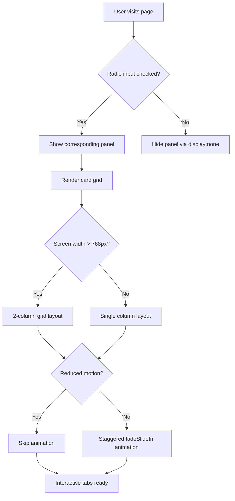

| Difficulty | Channel | Tags |
|---|---|---|
| beginner | frontend | css, flexbox, grid, animations |

Netflix shipped 300kB of JavaScript to power a few tabs and a language switcher. The result? A 7-second wait on 3G, users abandoning the signup page before seeing a single plan. The fix had nothing to do with faster frameworks or better bundling — it was about questioning whether JavaScript belonged there at all [1]. This is the story of why CSS-only patterns are making a comeback, and how you can use them to build interfaces that are both faster and more accessible.

---

> ### Real-World Case — Netflix
>
> Netflix's logged-out landing page (where users sign up or sign in) was painfully slow on 3G connections, taking 7 seconds to become interactive. The page shipped 300kB of client-side JavaScript including React, Lodash, and utility libraries - but the actual interactions were simple: tabs to switch between plans, a language switcher, and a cookie banner. Users on slow connections were abandoning the page before they could even click the sign-up button.
>
> | | |
> |---|---|
> | **Challenge** | The core question: was client-side React truly necessary for a simple landing page whose interactive elements (tabs, a dropdown, a banner) were fundamentally basic UI toggles? React's 45kB footprint plus dependencies bloated to 200kB+ of unnecessary JS that blocked interactivity on slow connections. |
> | **Solution** | Netflix removed React and its associated libraries from the client-side landing page entirely. They rewrote the interactive components - including the homepage tabs - in vanilla JavaScript (the language switcher took under 300 lines). React stayed server-side for HTML rendering, but the client got only minimal JS for DOM interactions. This is the same philosophy behind CSS-only tab patterns: if you can do it without a framework, you should. |
> | **Outcome** | Time-to-Interactive dropped by 50%. JavaScript bundle size shrank by 200kB. Users clicked the sign-up button at a measurably higher rate. First Input Delay was fast for 97% of desktop users. The landing page that previously took 7 seconds on 3G now worked in under 3.5 seconds. |
> | **Lesson** | The best code is the code you don't ship. For simple UI patterns like tabs, content switchers, and accordions, CSS-only solutions (or minimal vanilla JS) can dramatically outperform framework-heavy approaches. Netflix proved that evaluating whether you truly need a JavaScript framework for each page or component - not just using one everywhere by default - can unlock massive performance wins. |

---

## Hook — The tab that cost Netflix signups

Imagine this: a user on a bus, spotty 3G connection, types 'netflix.com' into their browser. They want to sign up. The page loads — slowly. First paint happens at 5 seconds. At 7 seconds, the page is finally interactive. But by then, the bus reached their stop, or they got frustrated and closed the tab. This was Netflix's reality. Their landing page shipped React, Lodash, and various utility libraries — over 300kB of JavaScript — to handle interactions as simple as switching between plan options and toggling a language menu [1]. The engineering team realized something crucial: they had built a heavyweight solution for a lightweight problem. The fix was not a faster framework. It was removing JavaScript entirely from those interactions.

## Problem — When JavaScript is the wrong tool

Many developers reach for JavaScript by default. Have a tab switcher? Write a click handler. Need an accordion? Import an animation library. This instinct runs deep — frameworks like React have normalized the idea that all interactivity requires state management, event listeners, and re-renders. But here is the thing: the browser already has a built-in system for state-based UI toggling. It is called the `:checked` pseudo-class. Every radio input and checkbox in HTML has a natural "on" and "off" state that CSS can read. You can use this to build tabs, modals, accordions, image sliders, and even mega-menus without a single line of JavaScript [2]. The tradeoff? You lose some flexibility. You cannot dynamically load content. You cannot run callbacks on tab switch. But for many UI patterns — especially on marketing pages, docs sites, and landing pages — those capabilities are unnecessary overhead.

## Real-World Case — Netflix

Netflix's logged-out landing page (where new users sign up or existing users sign in) is arguably one of the most important pages they run. It is the first impression for every potential subscriber. In 2017, performance audits showed the page took 7 seconds to become interactive on 3G connections. The culprit? A 300kB JavaScript bundle powering a handful of simple UI widgets — plan comparison tabs, a language selector, and a cookie consent banner [1]. Netflix's engineering team took a radical approach. Instead of optimizing their JavaScript, they eliminated most of it. They replaced the tab switcher with a CSS-only radio-button pattern. They removed React from the landing page entirely. The results speak for themselves: Time-to-Interactive dropped by 50%. The JavaScript bundle shrank by 200kB. Sign-up click rates increased measurably. First Input Delay was fast for 97% of desktop users. The page that took 7 seconds on 3G now loaded in under 3.5 seconds [1]. This is not an isolated case. Many teams have rediscovered that CSS is remarkably capable at handling UI state — and that removing JavaScript from the critical path is one of the highest-impact performance wins available.

## Deep Dive — The radio toggle pattern explained

The CSS-only tab pattern rests on a simple but elegant foundation: HTML radio inputs with a shared `name` attribute form a mutually exclusive group — selecting one deselects the others. CSS can read which radio is `:checked` using the general sibling combinator (`~`). Combined with `` elements that toggle the radios, you get a fully functional tab interface. Here is how the pieces fit together. The HTML structure places the radio inputs before the tab panels in the DOM. Labels can be positioned anywhere via CSS. The `:checked` state on a radio input selects its associated panel using `input:checked ~ .panel`. Unchecked panels are hidden with `display: none`. This pattern works because CSS reads DOM position, not visual position — you can reorder elements with Flexbox or Grid while maintaining the logical structure required for sibling selectors [3]. One important consideration: the radio inputs themselves must be visually hidden (using `position: absolute; opacity: 0` or similar) since they serve as invisible state holders, not UI elements. However, they must remain focusable and accessible to screen readers.

## Workflow — Building CSS-only tabs step by step

The architecture follows a clear dependency chain. First, define your radio inputs and labels. Each tab needs an `` and a corresponding ``. The inputs must all share the same `name` to enforce mutual exclusion. One input should have the `checked` attribute to define the default active tab. Next, structure the panels as sibling elements to the radios. Each tab panel is a `` with a class like `.panel`. The CSS rule `input:not(:checked) ~ .panel` hides inactive panels, while the checked input keeps its panel visible. For the card grid inside each panel, use CSS Grid with `grid-template-columns: repeat(2, 1fr)` on desktop and a media query to switch to a single column at 768px or below. The cards themselves need `aspect-ratio: 16/9` for the image area, plus a title and meta line below. Finally, add entrance animations. Use `@keyframes fadeSlideIn` with `animation: fadeSlideIn 0.3s ease-out backwards`. Apply staggered `animation-delay` values using `:nth-child()`. Wrap the animation in `@media (prefers-reduced-motion: no-preference)` to respect user motion preferences [4]. The diagram below shows this flow visually.

## Code Example — Putting it all together

Here is the complete implementation of a CSS-only tab panel with a card grid and staggered animations. This is the same pattern Netflix used for their plan comparison tabs.

## Lessons Learned — What Netflix's story teaches us

The biggest lesson from Netflix's experience is deceptively simple: the fastest code is the code you do not ship. Before reaching for a framework or library, ask yourself whether the browser already provides what you need [9]. The CSS-only tab pattern is not always the right choice. If you need dynamic content loading, server-side rendering, or complex state synchronization, JavaScript-based solutions are still necessary. But for marketing pages, documentation sites, and content-driven interfaces, the CSS-only approach delivers better performance, equal accessibility, and simpler code. Here are six practical takeaways you can apply tomorrow. First, audit your landing pages and docs sites for JavaScript-powered interactions that could be replaced with CSS equivalents. You might be surprised how many tab switchers, accordions, and tooltips exist. Second, always include the `name` attribute on your radio inputs — without it, the tabs do not form a mutually exclusive group and the pattern breaks. Third, use the general sibling combinator `~` rather than the adjacent sibling `+` — it is more forgiving of DOM structure changes. Fourth, test with a screen reader. The CSS-only pattern is inherently accessible since it uses native HTML form elements, but verify that focus management feels natural. Fifth, respect `prefers-reduced-motion`. Wrapping animations in the `no-preference` media query is the polite thing to do [4]. Sixth, consider the mobile experience first. The 2x2 grid should collapse naturally to a single column using responsive Grid — no media query hacks needed. Ultimately, the goal is not to eliminate JavaScript, but to use it intentionally. When you save 200kB on a tab switcher, you free up budget for the interactions that actually need JavaScript — like video players, real-time collaboration, or data visualization [1]. That is the tradeoff Netflix made, and it earned them more signups.

---

## CSS-Only Tab Panel Decision Flow

<strong>Original Interview Question</strong>

**Q:** Build a CSS-only tab panel for a design-system docs page. Use radio inputs to switch tabs (no JavaScript). Desktop: a 2x2 grid of cards under each tab; mobile: single column. Each card has a fixed 16:9 image area, a title, and a short meta line. Add a subtle entrance animation with a stagger and keep focus-visible outlines; ensure prefers-reduced-motion is respected?

**A:** Use a set of radio inputs with a shared `name` attribute and corresponding `` elements for each tab section. The `:checked` state of each radio controls visibility of its associated panel via adjacent sibling selectors. Each panel renders a 2×2 card grid on desktop and collapses to a single column on mobile. Cards use `aspect-ratio: 16/9` for fixed image containers, with a title and meta line below.

## Conclusion

Netflix proved that the fastest component is the one you do not build with JavaScript. The next time you reach for a click handler to toggle a tab panel, pause. Ask yourself: can the browser do this natively? CSS has evolved far beyond styling — it is now a capable interaction engine. The radio toggle pattern, combined with Grid, animations, and responsive design, handles most tab interfaces you will ever build. And the performance dividend — 200kB saved, 50% faster TTI, more signups — is hard to argue with. Start with your landing page. Audit every interaction. Replace what you can. Your users on 3G will thank you.

---

## References

1. [Netflix incident report](https://medium.com/dev-channel/a-netflix-web-performance-case-study-c0bcde26a9d9) — blog
2. [MDN — :checked pseudo-class](https://developer.mozilla.org/en-US/docs/Web/CSS/:checked) — documentation
3. [MDN — CSS general sibling combinator](https://developer.mozilla.org/en-US/docs/Web/CSS/General_sibling_combinator) — documentation
4. [MDN — prefers-reduced-motion](https://developer.mozilla.org/en-US/docs/Web/CSS/@media/prefers-reduced-motion) — documentation
5. [MDN — CSS Grid Layout](https://developer.mozilla.org/en-US/docs/Web/CSS/CSS_Grid_Layout) — documentation
6. [MDN — aspect-ratio CSS property](https://developer.mozilla.org/en-US/docs/Web/CSS/aspect-ratio) — documentation
7. [MDN — :focus-visible pseudo-class](https://developer.mozilla.org/en-US/docs/Web/CSS/:focus-visible) — documentation
8. [MDN — CSS animation shorthand](https://developer.mozilla.org/en-US/docs/Web/CSS/animation) — documentation
9. [Web Performance: The Fastest Code is the Code That Isn't There](https://www.digitalocean.com/community/tutorials/web-performance-fastest-code-isnt-there) — blog

---

**Author:** Satishkumar Dhule — [GitHub](https://github.com/satishkumar-dhule) · [LinkedIn](https://linkedin.com/in/satishkumar-dhule) · [Website](https://satishkumar-dhule.github.io)
