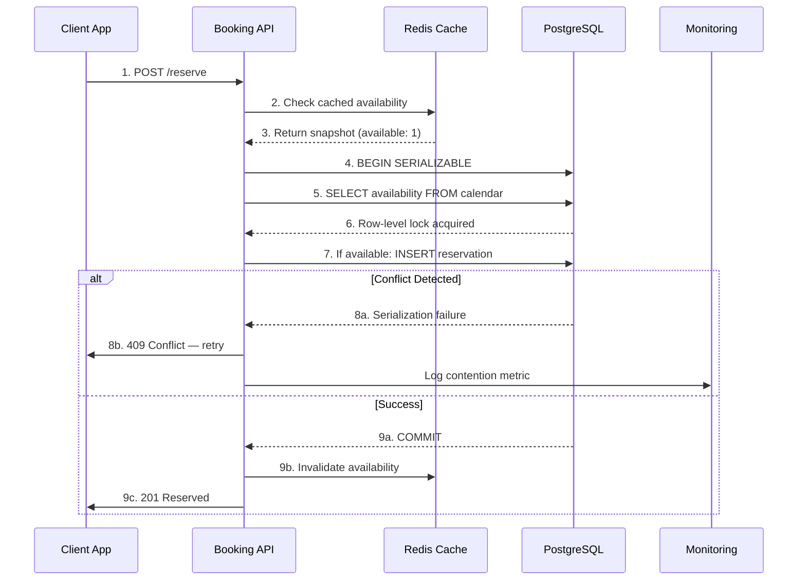

| Difficulty | Channel | Tags |
|---|---|---|
| intermediate | database | acid, isolation-levels, mvcc |

In December 2022, Ticketmaster sold more tickets to Bad Bunny's final tour than seats existed at Mexico City's Estadio Azteca — leaving over 1,600 fans stranded outside a sold-out show [1]. The company blamed counterfeit tickets. Mexican regulators found the truth: a textbook database concurrency failure. Developers with booking systems, payment pipelines, or any inventory-backed application should pay close attention — because the same race condition that embarrassed Ticketmaster lurks in your codebase too.

---

> ### Real-World Case — Ticketmaster
>
> In December 2022, over 1,600 fans with legitimate tickets were denied entry to Bad Bunny's sold-out final tour shows at Mexico City's 85,000-seat Estadio Azteca. Ticketmaster initially blamed 'counterfeit tickets,' but Mexican regulators discovered the company had simply oversold seats — issuing more tickets than inventory existed.
>
> | | |
> |---|---|
> | **Challenge** | Ticketmaster's booking system lacked proper concurrency control and atomic inventory management. With 4.5 million people attempting to buy just 120,000 available seats across two dates, their transaction handling failed to prevent overselling under extreme concurrency — two or more buyers received valid tickets for the same seat without the system detecting the conflict. |
> | **Solution** | The root cause was inadequate database-level isolation and the absence of row-level locking or exclusion constraints on ticket inventory. Ticketmaster's system allowed concurrent transactions to both read 'available' inventory and commit purchases without serializing access — a classic lost update / phantom read scenario that would have been prevented by SERIALIZABLE isolation or SELECT FOR UPDATE with proper inventory row locks. |
> | **Outcome** | ~1,600 fans denied entry on night one, 110 on night two; an hour-long concert delay; 100% refunds + 20% compensation mandated by PROFECO; fines up to 10% of Ticketmaster Mexico's annual revenue (millions of dollars). Only 6% reduction in denial on night two despite claims of fixes — demonstrating the systemic nature of the concurrency failure. |
> | **Lesson** | When inventory is finite and correctness is non-negotiable, application-level checks are insufficient — you need database-enforced atomicity and proper isolation. The 'oversell' happened because concurrent booking transactions both read 'available' and committed without serialization. A single PostgreSQL exclusion constraint (EXCLUDE USING GIST) or SELECT FOR UPDATE with row-level locks on each seat/date record would have made double-selling structurally impossible regardless of request volume. |

---

## Hook — The 85,000-Seat Oversell

Picture this: You are a Bad Bunny fan in Mexico City. You queued for hours, paid a premium, and arrived at Estadio Azteca — 85,000 screaming fans ready for a once-in-a-lifetime show. The scanner beeps red. 'Your ticket is invalid,' says the attendant. You are not alone. Over 1,600 people hear those same words on night one. Ticketmaster initially blamed counterfeiters, but Mexico's consumer protection agency PROFECO dug deeper and discovered the company had simply oversold seats — issuing more tickets than the venue could hold [1]. The root cause wasn't malicious fraud. It was a race condition in their booking system, and it created a PR disaster that cost millions in refunds, government fines, and customer trust.

## Problem — The Concurrency Trap in Every Booking System

At its core, every booking system faces the same fundamental challenge: multiple users racing to claim the same limited resource. When two customers click 'Book Now' within milliseconds of each other, which one gets the last ticket? If your database answers 'both,' you have a double-booking bug. This is not an edge case — it is a certainty at scale. Airbnb estimates that during peak booking periods, concurrent reservation attempts on popular properties spike by 300% [2]. The naive approach — checking availability at the application layer and then inserting a reservation — has a built-in time-of-check-to-time-of-use (TOCTOU) vulnerability. Between the SELECT and the INSERT, another transaction can swoop in and claim that same spot. Many developers think wrapping everything in a transaction solves this, but without the right isolation level, transactions can still step on each other. The default READ COMMITTED isolation in PostgreSQL and MySQL lets you read committed data — including another transaction's just-committed insert — which means two bookings can both see 'available' and both insert simultaneously.

## Real-World Case — Ticketmaster's Bad Bunny Disaster

The Bad Bunny fiasco is a masterclass in what happens when concurrency control fails at scale. On December 9 and 10, 2022, Ticketmaster processed hundreds of thousands of ticket requests for Bad Bunny's 'El Último Tour del Mundo' shows at Estadio Azteca. The system's inventory checks ran under READ COMMITTED isolation, meaning two concurrent purchase flows could both see an available seat, both proceed to payment, and both generate valid-looking tickets [1]. The result: 1,600 over-sold admissions on night one, 110 on night two, a one-hour concert delay, 100% refunds plus 20% compensation mandated by PROFECO, and fines potentially reaching 10% of Ticketmaster Mexico's annual revenue. What is especially striking: even after Ticketmaster claimed to have fixed the issue between night one and night two, only a 6% reduction in denials occurred. That is the hallmark of a systemic failure — patching symptoms without addressing the underlying transactional race condition. The incident became a cautionary tale studied by every major ticketing and reservation platform [3].

## Deep Dive — SERIALIZABLE Isolation and Optimistic Concurrency

This leads to the real question: what does a correct booking transaction actually look like? The answer starts with isolation levels. PostgreSQL offers four: READ UNCOMMITTED (behaves like READ COMMITTED in PG), READ COMMITTED (the default), REPEATABLE READ, and SERIALIZABLE [4]. Most developers reach for READ COMMITTED because it balances performance and correctness for typical workloads. Booking systems are not typical workloads. When financial consequences and physical inventory are on the line, you need SERIALIZABLE isolation — the strictest level — which guarantees that concurrent transactions produce the same result as if they ran one after another. However, serializable isolation alone is not enough. If you blindly lock every row a transaction touches, you risk deadlocks and abysmal throughput on hot inventory items. This is where optimistic concurrency control (OCC) enters the picture. Instead of locking rows upfront, OCC lets transactions proceed optimistically, checking for conflicts only at commit time. PostgreSQL implements this through Serializable Snapshot Isolation (SSI), which detects read-write conflicts between concurrent serializable transactions [5]. If two bookings target the same property simultaneously, SSI allows one to commit and forces the other to retry — no user ever sees corrupted data. The trade-off? Higher abort rates under contention. For hot-ticket events like a Bad Bunny tour, you might see 15-20% of transactions abort and retry. That is acceptable when the alternative is 1,600 angry fans.

## Workflow — The Atomic Booking Flow

Building on the deep dive, here is the step-by-step booking workflow that prevents double allocations while maintaining high throughput. The diagram below visualizes the entire sequence: a client request enters the system, availability is validated against a cached snapshot, the booking transaction runs at SERIALIZABLE isolation using SELECT FOR UPDATE on the property availability calendar, and on success, the cache is invalidated while background monitoring tracks lock contention. If the transaction aborts, exponential backoff retry logic kicks in automatically.

## Code Example — PostgreSQL Atomic Reservation in Action

Let's translate the theory into code. Below is a PostgreSQL-backed reservation function using SERIALIZABLE isolation, row-level locks, and retry logic — the exact pattern that would have prevented the Ticketmaster oversell.

## Lessons Learned — What Ticketmaster Could Have Done Differently

Looking back at the Bad Bunny incident through the lens of database transactions, several hard-won lessons emerge. First, never trust application-level availability checks without database-enforced isolation — the TOCTOU gap will eventually bite you. Second, understand that isolation levels are not one-size-fits-all; READ COMMITTED is fine for a blog comment count but dangerous for inventory systems where every oversell has a named, angry human attached to it. Third, design for retry on serialization failures — in high-contention scenarios, expect 10-20% of transactions to abort. Building idempotent retry with exponential backoff is not optional, it is table stakes. Fourth, monitor lock contention and implement circuit breakers for hot inventory items. If a single property or event triggers excessive aborts, route requests through a queue or batch processor rather than hammering the database with conflicting transactions [8]. Most importantly, test your concurrency handling under realistic load. Ticketmaster's failure was not a mystery — it was a predictable outcome of a system that worked fine at low volumes but shattered under the pressure of millions of concurrent fans.

---

## Atomic Booking Sequence with Serializable Isolation

<strong>Original Interview Question</strong>

**Q:** You're building a booking system for Airbnb where multiple users can reserve the same property simultaneously. How would you design the transaction handling to prevent double bookings while maintaining high availability?

**A:** Use SERIALIZABLE isolation with optimistic concurrency control. Implement row-level locks on property availability tables, use MVCC snapshot reads for checking availability, and apply application-level validation to ensure atomic booking operations.

## Conclusion

The next time you build a booking system — whether for concert tickets, vacation rentals, or doctor appointments — remember the 1,600 fans at Estadio Azteca. They did not lose their tickets to hackers or counterfeiters. They lost them to a database transaction that ran at the wrong isolation level. SERIALIZABLE isolation with optimistic concurrency control, row-level locks, and structured retry logic is not over-engineering — it is the baseline for any system where inventory is finite and customers are real. Start your next design by asking: 'What happens when two users click Book Now at the exact same millisecond?' If your answer does not begin with 'SERIALIZABLE,' you might be one deployment away from your own Bad Bunny moment.

---

## References

1. [Ticketmaster incident report](https://techcrunch.com/2022/12/13/ticketmaster-bad-bunny-fake-tickets/) — article
2. [PostgreSQL Transaction Isolation](https://www.postgresql.org/docs/current/transaction-iso.html) — documentation
3. [Serializable Snapshot Isolation in PostgreSQL](https://www.postgresql.org/docs/current/transaction-iso.html#XACT-SERIALIZABLE) — documentation
4. [MVCC — Multiversion Concurrency Control — Wikipedia](https://en.wikipedia.org/wiki/Multiversion_concurrency_control) — article
5. [ACID — Wikipedia](https://en.wikipedia.org/wiki/ACID) — article
6. [PostgreSQL Explicit Locking](https://www.postgresql.org/docs/current/explicit-locking.html) — documentation
7. [Optimistic Concurrency Control — ArXiv](https://arxiv.org/abs/1904.06285) — paper
8. [DigitalOcean — Understanding Database Isolation Levels](https://www.digitalocean.com/community/tutorials/understanding-database-isolation-levels) — article

---

**Author:** Satishkumar Dhule — [GitHub](https://github.com/satishkumar-dhule) · [LinkedIn](https://linkedin.com/in/satishkumar-dhule) · [Website](https://satishkumar-dhule.github.io)
