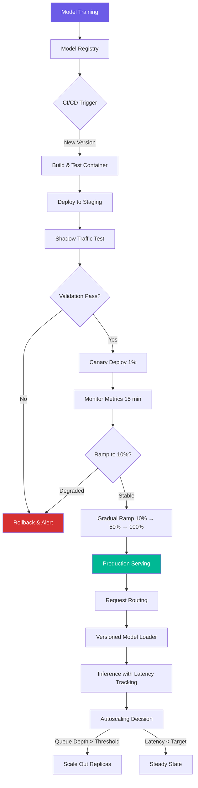

| Difficulty | Channel | Tags |
|---|---|---|
| beginner | devops | mlops, deployment |

What if every time your team trained a better model, it took two months to get it into production? In 2015, that was reality at Uber. With hundreds of ML use cases across Eats recommendations, ETA prediction, surge pricing, fraud detection, and customer support, every team built bespoke training pipelines and serving infrastructures independently. Engineers burned 60–70% of their time on plumbing [1]. The result? A median six-week gap between a trained model and production deployment.

---

> ### Real-World Case — Uber
>
> In 2015, Uber had hundreds of ML use cases across teams (Eats recommendations, ETA prediction, surge pricing, fraud detection, customer support), but each team built bespoke training pipelines and serving infrastructure independently. Engineers spent 60-70% of their time on infrastructure plumbing, and the median time from a trained model to production was 6 weeks.
>
> | | |
> |---|---|
> | **Challenge** | There was no standardized separation between deployment and serving concerns. Every team independently solved the same problems — model versioning, request routing, feature retrieval, autoscaling, and monitoring — leading to massive duplication, training-serving skew from inconsistent feature computation, and the inability to share or reuse models across the company. |
> | **Solution** | Uber built Michelangelo, an end-to-end ML platform with a clean architectural separation between the deployment layer (CI/CD training pipelines, model registry, automated canary deployments, rollback mechanisms, drift monitoring) and the serving layer (dedicated prediction service with sub-5ms latency, a real-time feature store with batch + streaming paths, traffic splitting for A/B testing, and model shadowing for safe validation). Models were compiled as standardized artifacts deployed across Uber's data centers via a unified deployment infrastructure. |
> | **Outcome** | Time from experiment to production collapsed from months to days. By 2019, Michelangelo powered 400+ active ML projects, 20K+ training jobs per month, 5K+ models in production, and handled 45M+ real-time predictions per second at peak with sub-5ms P95 latency. The platform became the de facto ML infrastructure across all of Uber, including Uber Eats, Rider, Driver, and autonomous vehicle teams. |
> | **Lesson** | The bottleneck in scaling ML is almost never the algorithms — it's the infrastructure separation. Deployment (CI/CD pipelines, model registry, training orchestration, monitoring) and serving (low-latency inference, feature retrieval, request routing, autoscaling) are fundamentally different concerns that must be architecturally decoupled, even within the same platform. Standardize the operational layer; leave the scientific layer flexible. |

---

## Hook — The Two-Month Chasm Between Training and Production

You have just finished training a model that improves ETA predictions by 15%. The metrics look stellar. Your stakeholder is thrilled. Then reality hits: six weeks of infrastructure work stand between you and production. Every team at Uber was living this nightmare independently — reinventing the wheel for deployment pipelines, serving infrastructure, monitoring, and rollback strategies. The core problem was not model quality. It was the invisible wall between two worlds that most ML engineers underestimate: deployment and serving.

## Problem — Why Your Model Is Stuck in Notebook Purgatory

Many teams think deployment and serving are the same thing. They are not. Deployment is the journey: CI/CD pipelines, infrastructure provisioning, model registry, environment configuration, monitoring setup, and rollback mechanisms. Serving is the destination: runtime inference APIs, request routing, model loading, response optimization, and autoscaling under load. Confusing the two is like confusing building a restaurant kitchen with serving a five-course meal. Deployment gets your model into a production environment. Serving keeps it performing when thousands of requests hit it simultaneously. One is about getting there. The other is about thriving once you arrive.

## Real-World Case — Uber's Michelangelo Awakening

Uber realized the fragmented approach was unsustainable. They built Michelangelo — a unified ML platform that treated deployment and serving as distinct but integrated systems [1]. The transformation was stunning: experiment-to-production time collapsed from months to days. By 2019, Michelangelo powered 400+ active ML projects, ran 20,000+ training jobs per month, served 5,000+ models in production, and handled 45 million real-time predictions per second at peak with sub-5ms P95 latency. This was not a marginal improvement. It was an order-of-magnitude shift in ML velocity. The lesson? Separating concerns between deployment and serving was the unlock.

## Deep Dive — Deployment vs. Serving: The Technical Showdown

Here is where most engineers get tripped up. Deployment tools like Kubernetes, Docker, Terraform, MLflow, SageMaker, and Vertex AI handle infrastructure lifecycle — provisioning compute, setting up CI/CD via GitHub Actions or Jenkins, managing model registries, and orchestrating rollbacks. Serving frameworks like TensorFlow Serving, TorchServe, FastAPI with gRPC, or BentoML handle runtime inference — loading model weights into memory, routing requests to the correct model version, optimizing batch size, and managing autoscaling policies.

The mistake many teams make is treating them as interchangeable. You can deploy a model on Kubernetes without a proper serving layer, and you will get... a container that crashes under load. Conversely, you can set up TorchServe without deployment automation, and you will spend two days configuring each new model version by hand.

Scaling introduces another layer of nuance. Horizontal scaling (pod replicas, container orchestration) handles increased request volume. Vertical scaling (GPU memory, CPU allocation) handles model size. The serving framework determines which strategy works — and the wrong choice means cold starts that spike latency to 10 seconds instead of 50 milliseconds.

🔥 **Hot Take**: If your team spends more time on deployment configuration than on serving optimization, you have the wrong priorities. Deployment should be automated and boring. Serving should be your competitive advantage.

## Workflow — From Commit to Inference in Five Stages

A mature ML platform follows a predictable workflow that separates deployment from serving concerns:

1. **Model Training & Registration**: Train your model, log metrics and artifacts to a model registry (MLflow). Every model version gets a unique ID.

2. **CI/CD Pipeline**: On registration, a GitHub Actions or Jenkins pipeline triggers. It runs validation tests, builds a container image with the model and serving framework, and pushes to a staging environment.

3. **Staging Validation**: Traffic is shadowed — duplicated to the new model without impacting production responses. Metrics are compared. If performance degrades, the pipeline halts.

4. **Canary Deployment & Traffic Ramp**: 1% of traffic routes to the new model version. Metrics are monitored for 15 minutes. If stable, ramp to 10%, 50%, 100%.

5. **Production Serving**: The serving layer handles request routing, model versioning, batch aggregation, and autoscaling based on queue depth and latency.

The diagram below visualizes this end-to-end workflow, showing how deployment and serving interact while remaining distinct concerns.

## Code Example — Building a Production-Ready Serving Endpoint with Versioning

Here is a practical example using FastAPI and BentoML to create a serving endpoint that handles model versioning, request batching, and monitoring — exactly the kind of infrastructure Uber's Michelangelo platform standardized:

```python
import bentoml
import numpy as np
from fastapi import FastAPI, HTTPException
from pydantic import BaseModel
import time
import logging

# Load the latest and a specific model version from BentoML model store
# This separates deployment (model storage/versioning) from serving (runtime)
latest_model = bentoml.sklearn.get("eta_predictor:latest")
v2_model = bentoml.sklearn.get("eta_predictor:v2")

# FastAPI handles request routing and validation (serving layer)
app = FastAPI(title="ETA Prediction Serving API")

class PredictionRequest(BaseModel):
    features: list[float]
    model_version: str = "latest"

class PredictionResponse(BaseModel):
    prediction: float
    latency_ms: float
    model_version: str

@app.post("/predict", response_model=PredictionResponse)
async def predict(request: PredictionRequest):
    start = time.time()

    # Route to the correct model version
    if request.model_version == "v2":
        model = v2_model
    elif request.model_version == "latest":
        model = latest_model
    else:
        raise HTTPException(status_code=400, detail=f"Unknown version: {request.model_version}")

    # Convert input and run inference
    features = np.array(request.features).reshape(1, -1)
    result = model.predict(features)[0]

    # Track latency for monitoring and autoscaling decisions
    latency = (time.time() - start) * 1000
    logging.info(f"Prediction by {request.model_version}: {latency:.1f}ms")

    return PredictionResponse(
        prediction=float(result),
        latency_ms=round(latency, 2),
        model_version=request.model_version
    )
```

The pattern separates two concerns cleanly. The deployment pipeline (not shown here) registers trained models into the BentoML store with version tags. The serving layer (this code) only worries about runtime — loading the right version, handling requests, and measuring performance. When latency exceeds thresholds, Kubernetes HPA scales replicas horizontally. When model drift is detected, a new version is deployed and the canary process begins — without any code changes to this endpoint.

## Lessons Learned — What Six Weeks Taught Uber About ML Infrastructure

Uber's Michelangelo journey distilled into three hard-won lessons:

1. **Deployment and serving are separate disciplines**. Treating them as one leads to infrastructure spaghetti. Deployment is about repeatability and safety (CI/CD, rollbacks, environment parity). Serving is about performance and reliability (latency, throughput, autoscaling). Standardize both, but keep them decoupled.

2. **Automate deployment until it is boring**. The goal is one-click (or zero-click) promotion from training to canary to full production. If deploying a model requires a manual runbook, you have a scaling problem. Uber went from six weeks to days by making deployment invisible.

3. **Measure serving metrics obsessively**. P50 latency tells you nothing useful. Track P95, P99, cold start frequency, queue depth, and error rates by model version. Michelangelo's sub-5ms P95 was not an accident — it was the result of constant measurement and iteration.

⚠️ **Watch Out**: Do not optimize serving before you have automated deployment. Premature optimization of inference latency while every deploy is a manual, risky, multi-day process is like polishing the rims on a car with no engine.

---

## ML Model Deployment to Production Serving Pipeline



<details>
<summary><strong>Original Interview Question</strong></summary>

**Q:** Explain the key differences between model serving and model deployment in ML systems, including specific technologies, scaling considerations, and real-world implementation patterns?

**A:** Deployment encompasses CI/CD pipelines, infrastructure setup, and monitoring using tools like Kubernetes, MLflow, and SageMaker. Serving focuses on runtime inference APIs with frameworks like TensorFlow Serving, TorchServe, or BentoML, handling request routing, model versioning, and autoscaling. Key trade-offs include latency vs throughput, batch vs real-time inference, and cold start optimization.

</details>

## Conclusion

The line between deployment and serving is invisible until you cross it — and crossing it without understanding the distinction is how teams end up with fragile, unscalable ML systems. Uber's Michelangelo journey proved that separating these concerns is not academic theory; it is the difference between a six-week deployment cycle and handling 45 million predictions per second with sub-5ms latency. Your models are only as good as the infrastructure that serves them. Start treating deployment and serving as the two distinct disciplines they are, and you might just collapse your own time-to-production from months to days.

---

## References

1. [Michelangelo: Uber's Machine Learning Platform](https://www.uber.com/en-SE/blog/michelangelo-machine-learning-platform/) — blog
2. [Kubernetes Concepts Overview](https://kubernetes.io/docs/concepts/overview/) — documentation
3. [MLflow Documentation](https://mlflow.org/docs/latest/index.html) — documentation
4. [TensorFlow Serving Guide](https://www.tensorflow.org/tfx/guide/serving) — documentation
5. [TorchServe Documentation](https://pytorch.org/serve/) — documentation
6. [BentoML Documentation](https://docs.bentoml.com/en/latest/) — documentation
7. [What is AWS SageMaker](https://docs.aws.amazon.com/sagemaker/latest/dg/whatis.html) — documentation
8. [GitHub Actions Documentation](https://docs.github.com/en/actions) — documentation

---

**Author:** Satishkumar Dhule — [GitHub](https://github.com/satishkumar-dhule) · [LinkedIn](https://linkedin.com/in/satishkumar-dhule) · [Website](https://satishkumar-dhule.github.io)
