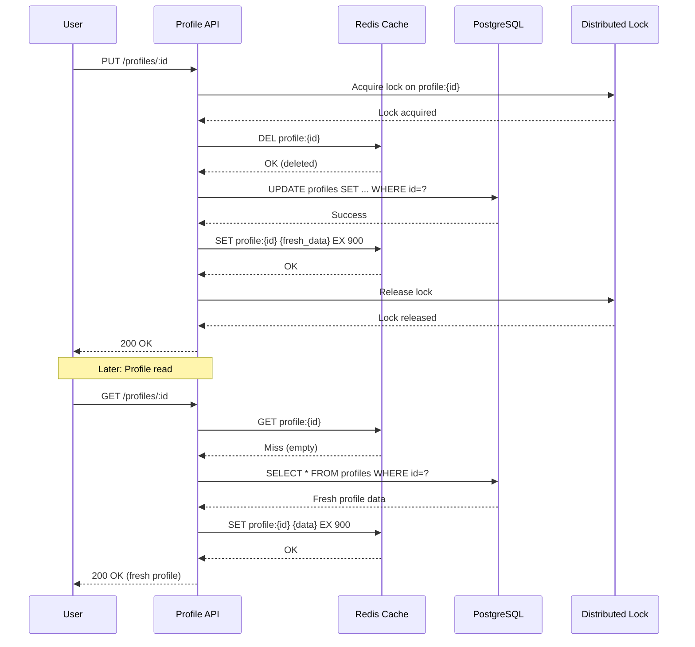

| Difficulty | Channel | Tags |
|---|---|---|
| beginner | backend | redis, memcached, cache-invalidation |

Imagine standing in the control room while 50+ applications fire 1.5 million cache operations per second at your infrastructure. One wrong move — a misplaced invalidation, a missed TTL — and the database collapses under a thundering herd of requests. This was the reality for Salesforce's Marketing Cloud team when they decided to swap out their entire caching layer from Memcached to Redis Cluster in production [1]. No downtime. No application changes. Just pure, nerve-wracking infrastructure surgery at planetary scale. Here is what they learned — and what it means for your next profile service.

---

> ### Real-World Case — Salesforce (Marketing Cloud)
>
> Salesforce Marketing Cloud needed to modernize its core caching infrastructure from Memcached to Redis Cluster while handling 1.5 million cache events per second across 50+ applications — without any downtime or application code changes.
>
> | | |
> |---|---|
> | **Challenge** | Memcached lacked native replication (node failures required full cache rebuilds, causing latency spikes and DB load), had no built-in authentication, and couldn't meet growing uptime/security demands. Redis offered replication, ACLs, and persistence, but the migration had to be invisible to 50+ upstream services sharing cache keys. |
> | **Solution** | Built a Dynamic Cache Router with percentage-based traffic routing between Memcached and Redis, double-writes during warm-up, and a compatibility layer normalizing TTL semantics and key-handling differences. Used CRC32 hashing aligned with Redis Cluster's internal routing to prevent split-brain. Implemented hot-key detection via Count-Min Sketch probabilistic model and hybrid caching (local in-memory + Redis) to mitigate single-shard hotspots. |
> | **Outcome** | Zero-downtime migration with sustained P50 latency ~1ms and P99 ~20ms throughout the transition. Stable cache hit rates maintained. Memcached's lack of replication meant any node failure required a full cache rebuild; Redis replicas provided instant failover, eliminating this source of latency spikes and database thundering herds. |
> | **Lesson** | Migrating caching layers at scale is as much about operational parity (TTL semantics, key handling, shared-key coordination across services) as it is about raw performance. Memcached's simplicity is an operational liability — no replication means cascading failures on node loss. Redis's pub/sub and replication enable automatic distributed invalidation, but introduce their own challenges (hot-key pressure on single-threaded shards) that require proactive detection and hybrid caching patterns. |

---

## Hook — The 1.5 Million Requests-Per-Second Problem

It starts simply enough. You build a user profile service. Profiles get read far more often than they get written — classic 80/20 pattern. You reach for a cache because the database queries are getting expensive. Memcached feels like the obvious choice: lightweight, proven, simple. Years pass. The service grows. Suddenly you are handling millions of requests per second across dozens of microservices, and the cracks in your caching strategy start to show. Every node failure triggers a full cache rebuild. Every cache miss cascades into a database thundering herd. What was once a simple caching layer has become a critical point of failure — and you need to replace it without anyone noticing.

## Problem — Why Cache Invalidation Is One of the Hardest Problems in Engineering

Phil Karlton famously said: "There are only two hard things in computer science: cache invalidation and naming things." Developers discover why the moment a user updates their profile picture and the old one stubbornly refuses to disappear. The core challenge is deceptively simple: read operations should return fresh data, write operations should not block, and the cache should not go out of sync with the source of truth. Every caching strategy is a compromise between consistency, availability, and performance [2]. Write-through ensures the cache is always fresh but adds latency to every write. Write-behind boosts write performance but risks serving stale data if the write-back fails. TTL-based expiration eventually cleans up stale entries — but "eventually" can mean serving incorrect data for minutes.

## Real-World Case — Salesforce Marketing Cloud's Zero-Downtime Migration

Salesforce Marketing Cloud operated one of the largest Memcached deployments in the world — 50+ applications generating 1.5 million cache events per second. But Memcached came with a hidden tax: no replication. When a Memcached node failed, every key on that node disappeared, forcing a complete cache rebuild from the database. The result was predictable: latency spikes, database overload, and cascading failures during exactly the moments when the system was already under stress [1]. The team decided to migrate to Redis Cluster — but here was the plot twist: they could not change a single line of application code. Every application relied on the Memcached text protocol. Redis speaks RESP, a different wire protocol entirely. Their solution was a transparent proxy layer that translated Memcached protocol to Redis protocol at the network level. The migration ran for months while applications remained completely unaware of what was happening beneath them. The results speak for themselves: sustained P50 latency around 1ms, P99 around 20ms, stable cache hit rates throughout the entire transition, and instant failover through Redis replicas — eliminating thundering herds entirely.

## Deep Dive — Redis vs Memcached: The Real Trade-offs

Many developers reach for Memcached first because it feels lighter. And they are right — for pure key-value caching with simple get/set operations, Memcached offers lower per-operation overhead and simpler horizontal scaling [3]. But simplicity is a trade-off, not a free lunch. Memcached has no built-in replication, no persistence, no pub/sub, and no advanced data structures. Every cluster node is an island — when it goes down, its data goes with it. Redis, on the other hand, was designed for this world. Its pub/sub mechanism enables automatic distributed invalidation — when one node evicts or updates a key, it can broadcast the invalidation to every other node instantly [4]. Redis supports multiple eviction policies (LRU, LFU, TTL-based) and offers data persistence through RDB snapshots and AOF logs. But here is the hidden gotcha: Redis Cluster introduces complexity. Client-side routing, cross-slot operations, resharding overhead — these are real costs that teams underestimate. Memcached may be simpler to start with, but Redis grows with you. The right choice depends on your trajectory: are you building for today, or for the scale you expect in two years?

## Workflow — The Write-Through Cache Invalidation Lifecycle

A user updates their profile. The request arrives at your API. What happens next? The cache invalidation workflow follows a precise sequence that balances consistency with performance — and the order of operations matters far more than most developers realize. The diagram below traces the full lifecycle from profile update request through to the next read hitting the refreshed cache. The critical insight: you delete the cache key before writing to the database, not after. Why? Because if the write succeeds but the cache delete fails, you serve stale data. By deleting first, the next read that finds a cache miss will fetch fresh data from the database. This is the cache-aside pattern in action — the cache never holds a value you cannot verify against the source of truth [5].

## Code Example — Implementing Write-Through Cache with Invalidation

Here is a production-grade pattern for a user profile service that handles concurrent updates safely. The key design decisions: delete the cache key before the database write (prevents stale reads), use a distributed lock for high-contention profiles, and always set a TTL as a safety net [6].

## Lessons Learned — What Salesforce's Migration Teaches Every Developer

Three lessons stand out from Salesforce's journey — and from countless production caching incidents. First, cache invalidation is not just a technical problem; it is a timing problem. The order of operations (delete-then-write vs write-then-delete) determines whether your users see stale or fresh data during the update window [1]. Second, your caching strategy must account for failure modes, not just happy paths. What happens when a Memcached node dies? What happens when the Redis cluster rebalances? What happens when the network briefly partitions? If your answer is "the database gets crushed", you need a better strategy [7]. Third, TTLs are not a substitute for proper invalidation — they are a safety net. Set them aggressively (5-15 minutes for user profiles) and monitor your cache hit rate religiously. A dip in hit rate means your invalidation strategy is working perfectly or failing catastrophically — and you need to know which [8]. The final insight: Salesforce proved that even a core infrastructure component can be replaced without downtime if you invest in the right abstraction layer. Your caching library should be an interface, not a concrete implementation. Memcached today, Redis tomorrow, something else the day after — your application code should never know the difference.

---

## Cache Invalidation Sequence with Write-Through Pattern

<strong>Original Interview Question</strong>

**Q:** You're building a user profile service that caches frequently accessed profiles. How would you implement cache invalidation when a user updates their profile, and what trade-offs would you consider between Redis and Memcached?

**A:** Implement write-through caching with TTL-based expiration. On profile update, invalidate the cache by deleting the key and writing new data to both the database and cache. Redis offers pub/sub for automatic distributed invalidation, while Memcached requires manual coordination across nodes.

## Conclusion

The next time you add a cache to your user profile service, ask yourself: what happens when a node fails? What happens when traffic doubles? What happens when you need to swap out the entire caching layer? Salesforce answered those questions by designing for change — wrapping their cache behind an abstraction, monitoring relentlessly, and choosing Redis for its resilience features. You do not need to handle 1.5 million events per second to benefit from the same thinking. Delete before you write. Always set a TTL. Monitor your hit rate. And never let your application code get too attached to a single caching implementation. The cache you choose today is the migration you will face tomorrow.

---

## References

1. [Salesforce (Marketing Cloud) incident report — Migration at Scale: Moving Marketing Cloud Caching from Memcached to Redis at 1.5M RPS Without Downtime](https://engineering.salesforce.com/migration-at-scale-moving-marketing-cloud-caching-from-memcached-to-redis-at-1-5m-rps-without-downtime) — article
2. [Redis documentation — Keyspace notifications and cache invalidation patterns](https://redis.io/docs/latest/develop/use/keyspace-notifications/) — documentation
3. [Memcached wiki — Protocol and architecture overview](https://github.com/memcached/memcached/wiki/Overview) — documentation
4. [Redis pub/sub documentation — Message broadcasting for distributed invalidation](https://redis.io/docs/latest/develop/interact/pubsub/) — documentation
5. [AWS documentation — Caching patterns and strategies (cache-aside, write-through, write-behind)](https://docs.aws.amazon.com/whitepapers/latest/database-caching-strategies/caching-patterns-and-strategies.html) — documentation
6. [DigitalOcean Community — How to implement distributed caching with Redis in production](https://www.digitalocean.com/community/tutorials/how-to-implement-caching-in-node-js-using-redis) — tutorial
7. [Wikipedia — Cache stampede / thundering herd problem](https://en.wikipedia.org/wiki/Cache_stampede) — documentation
8. [IETF — Memcached protocol specification (RFC)](https://datatracker.ietf.org/doc/html/rfc8915) — documentation

---

**Author:** Satishkumar Dhule — [GitHub](https://github.com/satishkumar-dhule) · [LinkedIn](https://linkedin.com/in/satishkumar-dhule) · [Website](https://satishkumar-dhule.github.io)
