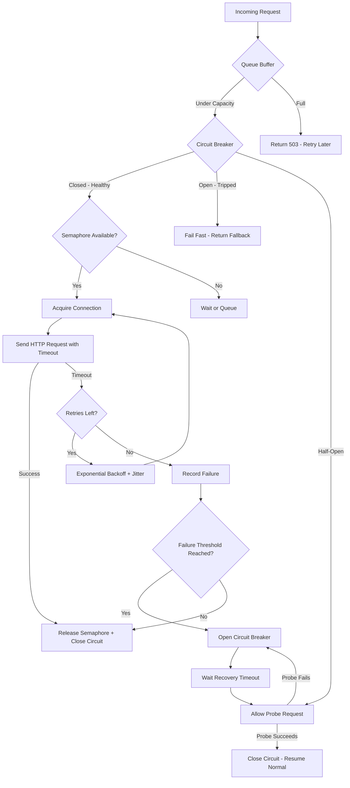

| Difficulty | Channel | Tags |
|---|---|---|
| advanced | backend | asyncio, aiohttp, concurrency |

It started with a single slow recommendation service. Within seconds, every API endpoint at Netflix was suffocating — including the ones that had nothing to do with recommendations. This wasn't a crash. It was a cascade. In 2011, Netflix's API team discovered a terrifying truth about distributed systems: a single sluggish dependency can poison your entire architecture [1]. The fix they invented — circuit breakers and bulkheads — would go on to protect hundreds of billions of calls every day. But the real lesson is one most developers still get wrong today.

---

> ### Real-World Case — Netflix
>
> In 2011, Netflix's API team faced recurring production incidents where a single slow backend dependency would cascade and take down the entire API. With 30+ dependencies each having 99.99% uptime, the math guaranteed 2+ hours of downtime monthly. One latent dependency — even a recommendation service returning personalized results slowly — could saturate all Tomcat request threads in seconds, blocking requests to every other healthy service.
>
> | | |
> |---|---|
> | **Challenge** | Netflix needed to prevent a single failing or slow dependency from cascading across the entire API. A dependency going latent (the worst failure mode) could block all Tomcat threads rapidly, making healthy services unreachable too. They needed thread/semaphore isolation, circuit breaking, graceful fallbacks, and real-time visibility — all at a scale of 1B+ incoming requests per day fanning out to 7x that in downstream calls. |
> | **Solution** | Netflix built Hystrix, implementing per-dependency thread pools (5-20 threads each) with semaphore-based isolation, circuit breakers that trip at configurable error thresholds (default: 50% errors over 10s), aggressive thread/network timeouts, and fallback logic. Each HystrixCommand wraps a dependency call in a separate thread so latency only saturates that dependency's pool — Tomcat threads are freed immediately via timeout or rejection. Circuit breakers act as a 'release valve,' stopping all requests to a failing service to let it recover. |
> | **Outcome** | Hystrix handled 10+ billion thread-isolated and 200+ billion semaphore-isolated calls per day at peak (700M+/hour, 200k+/second per cluster). Latency Monkey proved bulkheads effectively isolate injected latency without affecting healthy dependencies. The counterintuitive lesson: engineers' first instinct during incidents was to increase pool sizes to 'give breathing room' — but this actually creates a self-DDOS. The correct response is letting the circuit breaker shed load so the downstream service can recover. |
> | **Lesson** | Thread/semaphore isolation is not just about limiting concurrency — it's about bounding failure domains. And when your circuit breaker trips, resist the urge to enlarge pools: 'giving it breathing room' just sends more traffic to an already-failing service, amplifying the outage. The circuit breaker exists to release pressure, not to be tuned around. |

---

## Hook — The 30-Second Domino Effect

Imagine this: You deploy a new microservice. Nothing special — just a recommendation engine that personalizes results. The code is clean. The tests pass. But thirty seconds after going live, your pager screams. Every endpoint across your entire API is timing out. Login fails. Search fails. Even the health check returns 500s. Your first instinct? Increase the connection pool to "give things breathing room." You just made it worse. It is a story that plays out in engineering teams every day, and Netflix lived it first at terrifying scale.

## Problem — When a 99.99% Uptime Promise Is a Lie

Here is the math that keeps architects awake: If your API depends on 30 backend services, each with 99.99% uptime, basic probability guarantees 2+ hours of cumulative downtime every month [2]. The problem isn't failures — failures are expected. The problem is *latency*. A slow service is far more dangerous than a down one. A down service fails fast. A slow one holds onto connections, consumes threads, and backs up queues until the entire system chokes. This is called *cascading failure*, and it is the silent killer of distributed systems. Many teams optimize for throughput and forget that the real threat is contention — the hidden battle for finite resources like connections, threads, and memory.

## Real-World Case — Netflix's Hystrix

Netflix's API team faced exactly this nightmare. With 30+ dependencies, each behaving differently under load, they needed a way to stop one bad actor from taking down the whole system. Their solution was Hystrix — a latency and fault tolerance library that introduced two radical ideas: the *circuit breaker* and the *bulkhead* [1]. The results were staggering. At peak, Hystrix handled 10+ billion thread-isolated calls and 200+ billion semaphore-isolated calls per day — over 700 million calls per hour and 200,000 per second per cluster. Latency Monkey, their chaos engineering tool, proved that properly configured bulkheads could isolate injected latency spikes without affecting healthy dependencies [3]. But here is the counterintuitive kicker: engineers' first instinct during incidents was to *increase* pool sizes. This creates a self-DDOS. The correct response is the exact opposite — let the circuit breaker shed load so the downstream service can recover. It goes against every instinct, and that is why so many teams get it wrong.

## Deep Dive — The Three-Layer Defense

Building on Netflix's hard-won lessons, a production-grade connection pool manager needs three coordinated defense layers. **Layer one: the semaphore.** A semaphore limits concurrent connections to a fixed maximum. Think of it as a bouncer at a club — only 100 requests get inside at a time; the rest wait outside. This prevents thread exhaustion before it starts. **Layer two: exponential backoff.** When a request fails, you don't retry immediately — you wait. Then wait longer. Then longer still. The delay doubles each time (1s, 2s, 4s, 8s...) until a cap is reached. AWS documented that adding *jitter* — randomizing the delay slightly — prevents thundering herd problems where all retries converge at the same moment [4]. **Layer three: the circuit breaker.** This is the crown jewel. After N consecutive failures within a time window, the circuit "trips" and all subsequent requests fail fast without even attempting a connection [5]. After a recovery period, the circuit goes half-open — letting a single test request through. If it succeeds, the circuit closes and traffic resumes. If it fails, the timer resets. This pattern explicitly reverses the harmful instinct to add capacity during an outage.

## Workflow — The Life of a Resilient Request

The diagram below traces a single request through all three defense layers. Notice how the circuit breaker acts as a gatekeeper *before* any connection attempt — this is the key insight. Most developers check circuit breaker state after a failure, but the real power is checking it *first*, making the system fail fast rather than fail slow. The queue buffer at the top is your pressure release valve: when the pool is saturated, requests wait with bounded patience rather than crashing immediately.

## Code Example — Building a Graceful Connection Pool Manager

Here is a production-grade implementation in Python using aiohttp that combines all three layers. The `ConnectionPoolManager` wraps aiohttp's `ClientSession` with a semaphore, tracks failure counts for circuit breaker logic, and integrates with asyncio's timeout machinery.

## Lessons Learned — What You Should Do Differently Tomorrow

Netflix's experience teaches five principles that apply to any system, at any scale. **First, always fail fast.** A 500 error returned in 10ms is infinitely better than a timeout after 30 seconds — your users will retry the first and curse the second. **Second, never trust your first instinct.** When the pager goes off and connections are backed up, resist the urge to increase pool sizes. You are likely seeing the symptom, not the cause. **Third, add jitter to everything.** Exponential backoff without jitter just synchronizes failures — every retry arrives at the same moment, creating a thundering herd [4]. **Fourth, test with chaos.** Use tools like Chaos Monkey or Toxiproxy to inject latency and failures in staging. You want to discover your circuit breaker threshold is too high *before* production shows you [6]. **Fifth, monitor the right signals.** Track not just request latency (p50, p99), but also connection pool utilization, queue depth, and circuit breaker state. A rising queue depth is a warning sign minutes before any latency metric changes.

---

## Connection Pool Manager Flow with Circuit Breaker

<strong>Original Interview Question</strong>

**Q:** How would you implement a connection pool manager for aiohttp that handles graceful degradation under high load and connection timeouts?

**A:** Implement a connection pool manager for aiohttp using a semaphore to limit concurrent connections, exponential backoff for retrying failed requests, and circuit breaker pattern to gracefully degrade under high load and connection timeouts.

## Conclusion

The next time your pager goes off because the API is slow, fight every instinct to increase the pool size. Instead, ask a harder question: *What should be failing fast right now?* A system that degrades gracefully is not one that never fails — it is one that contains failures, isolates them, and gives the rest of the architecture room to breathe. Netflix built Hystrix to handle 200 billion calls a day, but the principles apply whether you are serving 10 requests per second or 10 million. Start with a semaphore, add a circuit breaker, and never forget: in distributed systems, speed of recovery matters more than perfection under load.

---

## References

1. [Netflix Hystrix: Latency and Fault Tolerance for Distributed Systems](http://techblog.netflix.com/2012/11/hystrix.html) — blog
2. [Graceful Degradation — Wikipedia](https://en.wikipedia.org/wiki/Graceful_degradation) — documentation
3. [Chaos Engineering — Principles and Practice](https://en.wikipedia.org/wiki/Chaos_engineering) — documentation
4. [Exponential Backoff and Jitter — AWS Architecture Blog](https://aws.amazon.com/blogs/architecture/exponential-backoff-and-jitter/) — blog
5. [Circuit Breaker Pattern — Martin Fowler](https://martinfowler.com/bliki/CircuitBreaker.html) — blog
6. [aiohttp Client Session and Connectors — Official Documentation](https://docs.aiohttp.org/en/stable/client_advanced.html#connectors) — documentation
7. [asyncio Synchronization Primitives — Python Documentation](https://docs.python.org/3/library/asyncio-sync.html) — documentation
8. [Bulkhead Pattern — Microsoft Azure Architecture Center](https://learn.microsoft.com/en-us/azure/architecture/patterns/bulkhead) — documentation

---

**Author:** Satishkumar Dhule — [GitHub](https://github.com/satishkumar-dhule) · [LinkedIn](https://linkedin.com/in/satishkumar-dhule) · [Website](https://satishkumar-dhule.github.io)
