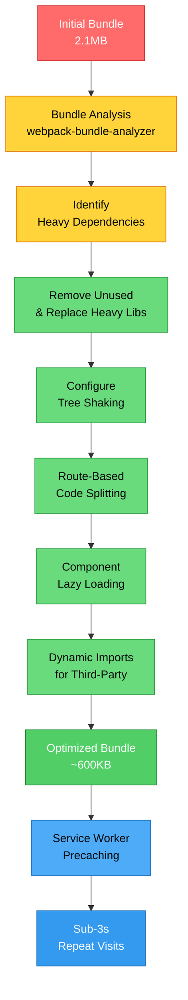

| Difficulty | Channel | Tags |
|---|---|---|
| intermediate | frontend | lighthouse, bundle, lazy-loading |

In 2017, a small team inside Twitter faced a seemingly impossible challenge: bring the full Twitter experience to emerging markets where 80% of traffic was mobile, often on 2G/3G networks with low-end devices [1]. The result was Twitter Lite—a React PWA that would redefine what developers thought was possible on the mobile web. Their engineering team discovered that the path from a 65 Lighthouse score to 90+ was not about one magic trick, but a systematic rethinking of how JavaScript reaches the browser.

---

> ### Real-World Case — Twitter (X)
>
> In 2015-2017, Twitter wanted to reach users in emerging markets where 80% of traffic was mobile, often on 2G/3G networks with low-end devices. They built Twitter Lite — a React PWA — but initial bundle sizes and time-to-interactive were too slow for these conditions. The engineering team, led by Nicolas Gallagher, had to rethink their entire delivery strategy.
>
> | | |
> |---|---|
> | **Challenge** | Deliver a fully-featured Twitter experience (timelines, tweets, DMs, notifications) on devices with as little as 512MB RAM over 2G/3G networks. The initial React bundle was too large, causing 4s+ time-to-interactive. Storage was also a concern — the native Android app required 23.5MB of downloads. |
> | **Solution** | Used webpack to break scripts into granular pieces loaded on demand — only the code for the visible screen was sent initially. Implemented route-based code splitting (React.lazy wasn't stable yet, so they used webpack dynamic imports with a custom system), streamed the initial HTML with preload instructions for critical resources, added a Service Worker to cache the app shell and precache additional chunks for near-instant repeat visits, virtualized the timeline to only render visible tweets (rendering incrementally via requestAnimationFrame), and deferred non-critical work to requestIdleCallback. Image optimization and a 'data saver' mode further reduced payloads. |
> | **Outcome** | Initial load under 5s on 3G (down from 10s+); 50% reduction in 99th-percentile TTI latency; 30% reduction in average load time; repeat visits boot in under 3s. Business metrics: +65% pages per session, +75% Tweets sent, -20% bounce rate. The PWA is only 600KB over the wire vs 23.5MB for native — less than 3% of the storage. 250K+ daily users launch from homescreen; 10M+ push notifications delivered daily. |
> | **Lesson** | Aggressive code splitting and progressive loading aren't just technical metrics — they directly drive business outcomes. The techniques needed to serve emerging markets (granular webpack chunks, app shell caching, virtualized rendering) improved the experience for every user globally. The biggest surprise: by shipping 97% less code upfront, users didn't just load the page faster — they engaged far more deeply. |

---

## Hook — The 23.5MB Problem

Picture this: your React app weighs 2.1MB and takes over four seconds before a single button becomes clickable. Now imagine your users are on a 2G connection in a rural area, paying per megabyte. That was the reality Twitter faced in 2015. Their native iOS and Android apps clocked in at 23.5MB—an impossible ask for users with limited storage and expensive data plans. The web version had to be fundamentally different. It had to be fast, lightweight, and reliable on devices that cost under $100. Enter Twitter Lite: a React PWA that eventually shipped just 600KB over the wire. Less than 3% of the native app's size. The question is not whether you can achieve similar numbers. The question is whether you can afford not to.

## Problem — The Death by a Thousand Imports

Many developers do not realize how quickly a React app's bundle grows until it is too late. A single import of a charting library adds 200KB. Moment.js? Another 200KB+ for locale data you probably do not need. Before you know it, your "simple" dashboard app is shipping megabytes of JavaScript that nobody asked for on first load. This is not just a numbers game—it directly and measurably impacts user experience. Every kilobyte of JavaScript translates to parse time, compile time, and execution time all blocking the main thread [5]. The result is a sluggish Time to Interactive (TTI) that drives users away. Research shows that a one-second delay in page load can reduce conversions by 7% [4]. For a company like Twitter, that is millions of lost interactions every day. Sound familiar? The bundle bloat epidemic affects every React team, and the fix requires more than just "add code splitting and call it a day."

## Real-World Case — Twitter (X)

Twitter's engineering team, led by Nicolas Gallagher, approached this as a systematic optimization problem rather than a series of random tweaks. They started by analyzing their bundle composition and discovered that large portions of their codebase were unnecessary for initial renders. Components for timelines, notifications, and direct messages were all bundled together, forcing users to download features they might not touch for minutes or even hours [1]. By implementing route-based code splitting, aggressive tree shaking, and component-level lazy loading, they transformed their delivery strategy from the ground up. The results were not incremental—they were transformational. Initial load dropped from over 10 seconds to under 5 seconds on 3G networks. The 99th-percentile TTI latency fell by 50%, meaning even users at the network edge got a fast experience. Average load time dropped 30%. The business metrics followed like clockwork: pages per session jumped 65%, Tweets sent increased 75%, and bounce rate dropped by 20%. Over 250,000 daily users launch the PWA from their homescreen, and the team delivers over 10 million push notifications daily [1]. This was not a performance tuning exercise—it was a fundamental rethinking of how and when code reaches the user.

## Deep Dive — The Anatomy of Code Splitting

Code splitting sounds simple in theory: split your bundle into smaller chunks and load them on demand. The devil, as always, is in the execution. There are two primary strategies, and choosing between them is where most teams go wrong. Route-based splitting is the low-hanging fruit—every route gets its own chunk, and users only download what they need for the current page. Component-based splitting goes deeper, letting you lazy load heavy components like charts, text editors, or maps even within a single route [2]. Here is the tradeoff most documentation does not tell you: too many tiny chunks hurt performance because of network overhead (DNS lookups, TLS negotiation, HTTP headers). Too few chunks undo the benefits entirely. The sweet spot? Use route-based splitting as your default, then selectively apply component-level splitting only for components that are genuinely heavy (over 50KB) and not critical to the initial render [4]. This is where bundle analysis tools like webpack-bundle-analyzer become your best friend [3]. They reveal exactly what is in every chunk, letting you make data-driven decisions instead of guessing. Another counterintuitive insight: lazy loading does not always mean loading less. It means loading the right thing at the right time. Twitter applied the PRPL pattern—Push critical resources, Render initial route, Pre-cache remaining routes, Lazy-load non-critical resources [8]. The result was an experience that felt instant even on 3G.

## Workflow — The Optimization Pipeline

Here is the step-by-step playbook that teams like Twitter's follow to systematically transform React performance from middling to blazing fast:

**Step 1: Measure, Measure, Measure** — Run Lighthouse to establish your baseline. Capture TTI, First Contentful Paint, and bundle size.[5]
**Step 2: Run Bundle Analysis** — Use webpack-bundle-analyzer to visualize your bundle composition. Identify the heaviest chunks and unexpected duplicate dependencies. [3]
**Step 3: Audit Your Imports** — Remove unused libraries. Replace heavy alternatives (date-fns over Moment.js, Lodash per-method imports over the full library). Configure sideEffects: false in package.json for tree shaking. [7]
**Step 4: Implement Route-Based Splitting** — Wrap each top-level route with React.lazy() and Suspense. Add /* webpackChunkName: */ magic comments for readable chunk names. [2]
**Step 5: Apply Component-Level Splitting** — Identify heavy components that are below the fold or interaction-triggered (modals, charts, editors) and wrap them in React.lazy().
**Step 6: Add Error Boundaries** — Every lazy-loaded component needs an ErrorBoundary parent. Network failures happen, and a broken white screen is the worst possible outcome.
**Step 7: Cache with Service Workers** — Use a service worker to precache route chunks so repeat visits boot in under 3 seconds. [10]

Each step builds on the previous one, and skipping any step leaves performance on the table.

## Code Example — From Theory to Production

Let us put this into practice. Here is how you would set up production-grade code splitting with error boundaries, chunk naming, and bundle analysis verification:

## Lessons Learned — The Performance Mindset

After a decade of optimizing React applications at scale, several patterns consistently separate teams that succeed from those that chase metrics in circles. First, never optimize blind. Twitter's team did not guess—they used data to drive every decision, from which routes to split to which libraries to replace. Second, route-based splitting should be your default architecture, not an afterthought you add when Lighthouse screams at you. Third, component-based splitting is powerful but expensive—each React.lazy() call adds overhead, so reserve it for genuinely heavy components that are 50KB or more. Fourth, error boundaries are not optional. The real world has flaky networks, CDN failures, and browser quirks. If a chunk fails to load, your users need a graceful fallback, not a blank screen [9]. The battle scars from real deployments teach a hard truth: performance optimization is a continuous discipline, not a one-time project. The teams that embed these practices into their development workflow—bundle size budgets in CI, regular Lighthouse audits, automated chunk analysis—are the ones that maintain 90+ scores long after the initial optimization sprint ends.

---

## React Bundle Optimization Pipeline

<strong>Original Interview Question</strong>

**Q:** You're tasked with improving a React app's Lighthouse performance score from 65 to 90+. The bundle size is 2.1MB and Time to Interactive is 4.2s. What specific steps would you take to optimize the bundle and implement lazy loading?

**A:** Implement code splitting with React.lazy() and Suspense, analyze bundle composition with webpack-bundle-analyzer to identify largest chunks, remove unused dependencies and optimize imports, add dynamic imports for heavy components and third-party libraries, implement route-based splitting for better initial load times, and utilize tree shaking with proper ES module configuration.

## Conclusion

The journey from a 65 Lighthouse score to 90+ is not about finding one silver bullet. It is about building a systematic approach: measure where you are, analyze what you are shipping, split intelligently at both the route and component level, and cache aggressively for repeat visits. Twitter proved that a React app can load in under 5 seconds on 3G and deliver a native-like experience at just 3% of the storage cost. Your app can too. Start by running a bundle analysis today. The data will tell you exactly where to begin, and the Twitter playbook shows you how to finish.

---

## References

1. [Twitter (X) incident report](https://web.dev/case-studies/twitter) — blog
2. [React.lazy and Suspense documentation](https://react.dev/reference/react/lazy) — documentation
3. [webpack-bundle-analyzer](https://github.com/webpack-contrib/webpack-bundle-analyzer) — documentation
4. [Code splitting and lazy loading best practices](https://web.dev/articles/code-splitting) — blog
5. [Lighthouse performance scoring](https://developer.chrome.com/docs/lighthouse/performance/) — documentation
6. [Dynamic import() - MDN Web Docs](https://developer.mozilla.org/en-US/docs/Web/JavaScript/Reference/Operators/import) — documentation
7. [Tree shaking - webpack documentation](https://webpack.js.org/guides/tree-shaking/) — documentation
8. [The PRPL pattern - web.dev](https://web.dev/articles/apply-instant-loading-with-prpl) — blog
9. [Intersection Observer API - MDN Web Docs](https://developer.mozilla.org/en-US/docs/Web/API/Intersection_Observer_API) — documentation
10. [Service Worker API - MDN Web Docs](https://developer.mozilla.org/en-US/docs/Web/API/Service_Worker_API) — documentation

---

**Author:** Satishkumar Dhule — [GitHub](https://github.com/satishkumar-dhule) · [LinkedIn](https://linkedin.com/in/satishkumar-dhule) · [Website](https://satishkumar-dhule.github.io)
