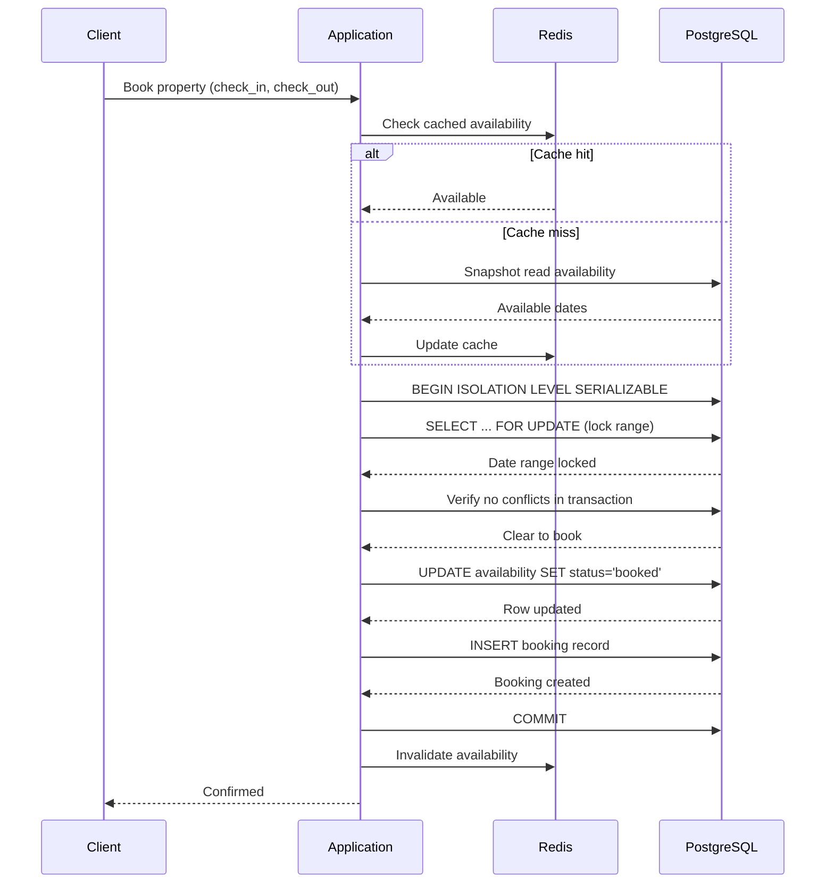

| Difficulty | Channel | Tags |
|---|---|---|
| intermediate | database | acid, isolation-levels, mvcc |

It was supposed to be the happiest day for Taylor Swift fans. Instead, November 15, 2022, became a cautionary tale for every engineer who has ever touched a booking system. Ticketmaster's servers faced 3.5 billion system requests — four times the previous peak — as 14 million users (and a swarm of bots) tried to secure Eras Tour tickets [1]. Queues froze, seats vanished mid-checkout, and the general sale was canceled entirely, triggering Congressional hearings and a $5 billion class-action lawsuit. Behind the chaos was a problem every booking system shares: how do you let thousands of people compete for the same resource without letting two of them walk away thinking they won?

---

> ### Real-World Case — Ticketmaster (Live Nation)
>
> In November 2022, Ticketmaster opened presale for Taylor Swift's Eras Tour — the first tour since 2018. 3.5 million fans pre-registered via Verified Fan, the largest in company history. On sale day, 14 million users (including bot attacks) hit the site simultaneously, generating 3.5 billion system requests — 4x the previous peak. The site buckled: queues paused, thousands lost seats mid-checkout, and the general sale was canceled entirely, sparking Congressional hearings and a class-action lawsuit seeking $5B+ in damages.
>
> | | |
> |---|---|
> | **Challenge** | How do you prevent double-booking when 14 million users compete for 70,000 seats in milliseconds? Ticketmaster's existing architecture — Redis distributed locks (`SET NX PX`) for fast seat holds with PostgreSQL unique constraints as the correctness safety net — was designed for 1x peak traffic. But with 4x peak load, bot attacks on the Verified Fan auth service created cascading failures: users with valid codes couldn't reach the queue, the queue drain rate had to be slowed to stabilize the system, and expired holds during extended waits created phantom availability that triggered more contention. |
> | **Solution** | Ticketmaster uses a multi-layered concurrency control architecture: (1) A virtual waiting room (Queue-it) converts 14M users into a controlled admission stream of ~500/sec. (2) Redis `SET seat:{event}:{id} {owner_token} NX PX 600000` provides sub-millisecond distributed seat locks with automatic 10-minute TTL, ensuring only one user can hold a seat at a time. (3) On lock success, the seat state is asynchronously written to PostgreSQL with unique constraints as the hard correctness backstop — even if Redis fails or a bug slips through, the database rejects duplicate sales. (4) Two-phase booking separates inventory hold from payment via a Temporal saga: reserve → charge → confirm, with compensating transactions for failures. (5) Optimistic concurrency control with version columns on the seat record is the final defense during payment confirmation. |
> | **Outcome** | Despite the meltdown, 2 million tickets were sold in a single day — the most ever for a single artist. Over 2.4 million tickets sold across all presales. But 14 million users competed, meaning only ~14% succeeded. The incident triggered Congressional antitrust hearings, multiple lawsuits, and a 26% drop in Live Nation stock. Ticketmaster later implemented per-event infrastructure pre-provisioning, pre-loading seat maps into Redis before on-sales, and dynamically scaling queue drain rates based on real-time system health signals. The lesson: a system that works at 1x peak can fail catastrophically at 4x when bot attacks amplify contention. |
> | **Lesson** | Defense-in-depth for concurrency matters — but only if every layer survives its expected load. Redis locks handle the hot path, PostgreSQL constraints are the safety net, but if the admission gate (Verified Fan + queue) fails first, nothing else matters. True double-booking prevention requires load-shedding at the entry point, not just locking at the database. |

---

## Hook — 3.5 Billion Requests and a Meltdown

Picture this: your database is handling 3.5 billion requests in a single day. Not over a month. Not over a week. One day. That was the reality for Ticketmaster's engineering team when Taylor Swift's Eras Tour went on sale [1]. The system had been tested at 1x peak load, but nobody accounted for 4x — or for bot traffic that made every seat a battleground. The result? Over 2 million tickets were sold (the most ever for a single artist), but 14 million users competed, meaning roughly 86% walked away empty-handed. Live Nation's stock dropped 26%. Multiple lawsuits followed. This is what happens when a booking system cannot handle contention at scale. And here is the uncomfortable truth: the same race conditions that brought Ticketmaster to its knees play out every day on smaller stages — an Airbnb property getting two bookings in the same millisecond, a flight seat sold to two passengers, a conference room double-booked. The scale changes, but the fundamental database problem does not.

## Problem — The Lost Update Race Condition

At its core, double booking is a textbook race condition called the "lost update." Here is how it happens: two users check availability for the same property at nearly the same time. User A's query says "no bookings exist, seat is free." User B's query, microseconds later, also says "no bookings exist, seat is free." Both proceed to book. Both succeed. Now you have two guests showing up to the same apartment on the same night. Many developers think a simple SELECT before INSERT prevents this. Here is why that is wrong. In PostgreSQL's default READ COMMITTED isolation level, each statement sees a fresh snapshot of committed data. If two transactions interleave, they each see the same "available" state because neither has committed yet. The classic check-then-act pattern is fundamentally broken under concurrency. The technical term for this is a "non-repeatable read" — you read the data, it looks fine, and by the time you write, the ground has already shifted beneath you. The stakes are real. Overbooked hotels pay for alternative accommodations. Double-sold flights require rebooking and compensation. And at Ticketmaster scale, the cost is measured in lawsuits and stock crashes.

## Real-World Case — Ticketmaster's Eras Tour Meltdown

Ticketmaster's infrastructure failure was not a single point of collapse — it was a cascade. The Verified Fan system had 3.5 million pre-registered users, the largest in company history [1]. When the presale opened, 14 million users — including bot networks — hit the site simultaneously. The system generated 3.5 billion requests, overwhelming every layer: the load balancers, the API servers, the queue system, and crucially, the databases. What went wrong technically? Multiple factors. The seat map data (".map" files) had to be fetched for every user, creating massive read contention. As users added tickets to carts, those seats had to be locked in the database, but the lock contention on hot inventory (floor seats, front rows) created bottlenecks. Transactions began timing out. Users lost held seats mid-checkout. The cache layer, designed for normal loads, was overwhelmed by the sheer volume of writes from failed and aborted bookings. Ticketmaster's post-mortem revealed they later implemented per-event infrastructure pre-provisioning, pre-loading seat maps into Redis and dynamically scaling queue drain rates based on real-time system health signals [1]. The lesson is brutal: a system that works at 1x peak can fail catastrophically at 4x when bot attacks amplify contention.

## Deep Dive — SERIALIZABLE Isolation and the MVCC Safety Net

This leads to the core technical question: what isolation level protects you from the lost update? The answer is SERIALIZABLE, the strictest of PostgreSQL's four isolation levels [2]. Here is the mental model: SERIALIZABLE guarantees that the outcome of concurrent transactions is identical to running them one at a time in some order. It catches not just dirty reads and non-repeatable reads, but phantom reads and serialization anomalies — the exact class of bugs that cause double bookings. But SERIALIZABLE comes with trade-offs. Under the hood, PostgreSQL's SERIALIZABLE implementation uses Serializable Snapshot Isolation (SSI), which detects read-write conflicts between concurrent transactions and aborts one with a serialization error [2]. The abort rate increases with contention. For a hot property with 100 concurrent booking attempts, you can expect a significant percentage to fail and retry. This is where optimistic concurrency control shines. Instead of locking rows preemptively (pessimistic locking), you let transactions proceed optimistically and only check for conflicts at commit time. You implement this with version columns: each row has a version number that you increment on update. Your UPDATE statement includes a WHERE version = expected_version clause. If zero rows are updated, someone else changed it first. You retry. The beauty of this approach is that it works well under contention because transactions that would have blocked each other with row locks instead run concurrently and only fail at commit. However — and this is the plot twist — optimistic locking is not a silver bullet. Under extreme contention (like Ticketmaster's floor seats), the retry rate becomes excessive. For those cases, you need a hybrid: pessimistic locking with SELECT FOR UPDATE for the highest-contention resources, and optimistic locking for everything else [3]. MVCC (Multi-Version Concurrency Control) makes all of this possible [4]. PostgreSQL maintains multiple versions of each row so that a transaction sees a consistent snapshot, unaffected by concurrent writes. A long-running read transaction does not block a write transaction, and vice versa — until you explicitly ask for serialization guarantees. This is what allows Airbnb's availability calendar to serve millions of reads while simultaneously processing thousands of writes [5].

## Workflow — The Atomic Booking Transaction

Building on the deep dive, here is the concrete workflow that a platform like Airbnb would use to handle concurrent bookings safely. The process combines cache reads for speed, SERIALIZABLE transactions for safety, and retry logic for resilience. Step one: the user submits a booking request with property ID and date range. Step two: the application checks a Redis cache for availability — fast, no database hit needed for the common case. Step three: if the cache indicates availability, the application opens a SERIALIZABLE transaction and uses SELECT FOR UPDATE to lock the specific date range in the availability table. Step four: inside the same transaction, it re-verifies that no conflicting bookings exist — this is the critical check that prevents the lost update. Step five: it atomically updates the availability records with a version increment and creates the booking. Step six: on successful commit, it invalidates the cache so subsequent reads see the updated state. Step seven: if a serialization error occurs, the application rolls back and retries with exponential backoff. The Mermaid diagram below illustrates this complete sequence.

## Code Example — PostgreSQL Booking with Retry Logic

This Python implementation ties together everything discussed: SERIALIZABLE isolation, atomic version checks, and exponential backoff retry. The code handles both serialization conflicts (retriable) and actual booking conflicts (non-retriable).

## Lessons Learned — What Every Engineer Should Take Away

First, never trust a check-then-act pattern without SERIALIZABLE isolation or explicit locking. It will fail under load. Second, optimistic concurrency with version columns is your default strategy — it scales well and avoids lock contention. Reserve SELECT FOR UPDATE for the hottest resources where the retry cost of optimistic locking exceeds the lock wait time. Third, cache aggressively for reads but invalidate ruthlessly on writes. Stale availability data is what lets double bookings sneak through cache-backed fast paths. Fourth, design for failure at 10x your expected peak, not 2x. Ticketmaster's 4x spike broke them because their infrastructure was provisioned for normal peaks [1]. Pre-provision, use circuit breakers to shed load, and monitor lock contention as a key health metric [8]. Finally, remember that database isolation levels are not just academic concepts. The choice between READ COMMITTED and SERIALIZABLE is the difference between a working booking system and a class-action lawsuit. Every time you skip the isolation level configuration because "it works on my machine," remember the 14 million fans who stared at frozen Ticketmaster queues. Test at scale. Test with contention. And always, always wrap your bookings in SERIALIZABLE.

---

## Atomic Booking Transaction Flow

<strong>Original Interview Question</strong>

**Q:** You're building a booking system for Airbnb where multiple users can reserve the same property simultaneously. How would you design the transaction handling to prevent double bookings while maintaining high availability?

**A:** Use SERIALIZABLE isolation with optimistic concurrency control. Implement row-level locks on property availability tables, use MVCC snapshot reads for checking availability, and apply application-level validation to ensure atomic booking operations.

## Conclusion

The Ticketmaster meltdown was not a freak accident. It was the predictable outcome of a system designed for 1x peak load meeting 4x peak load with bot amplification [1]. For every developer building a booking system — whether for 14 million Taylor Swift fans or a single Airbnb property — the lesson is the same: database concurrency is not an afterthought, it is the foundation. Start with SERIALIZABLE isolation. Use version columns for optimistic locking. Cache reads but invalidate on every write. Test at 10x your expected traffic. And when your boss asks why the system needs to be "over-engineered," tell them about the 14 million people who showed up to buy tickets and the 12 million who walked away with nothing.

---

## References

1. [Ticketmaster (Live Nation) incident report — Taylor Swift Eras Tour On-Sale Explained](https://business.ticketmaster.com/press-release/taylor-swift-the-eras-tour-onsale-explained/) — article
2. [PostgreSQL Documentation — Transaction Isolation](https://www.postgresql.org/docs/current/transaction-iso.html) — documentation
3. [PostgreSQL Documentation — Explicit Locking](https://www.postgresql.org/docs/current/explicit-locking.html) — documentation
4. [PostgreSQL Documentation — Multi-Version Concurrency Control (MVCC)](https://www.postgresql.org/docs/current/mvcc-intro.html) — documentation
5. [Wikipedia — Optimistic Concurrency Control](https://en.wikipedia.org/wiki/Optimistic_concurrency_control) — paper
6. [Wikipedia — ACID Properties](https://en.wikipedia.org/wiki/ACID) — documentation
7. [Wikipedia — Exponential Backoff](https://en.wikipedia.org/wiki/Exponential_backoff) — documentation
8. [Wikipedia — Circuit Breaker Design Pattern](https://en.wikipedia.org/wiki/Circuit_breaker_design_pattern) — documentation

---

**Author:** Satishkumar Dhule — [GitHub](https://github.com/satishkumar-dhule) · [LinkedIn](https://linkedin.com/in/satishkumar-dhule) · [Website](https://satishkumar-dhule.github.io)
