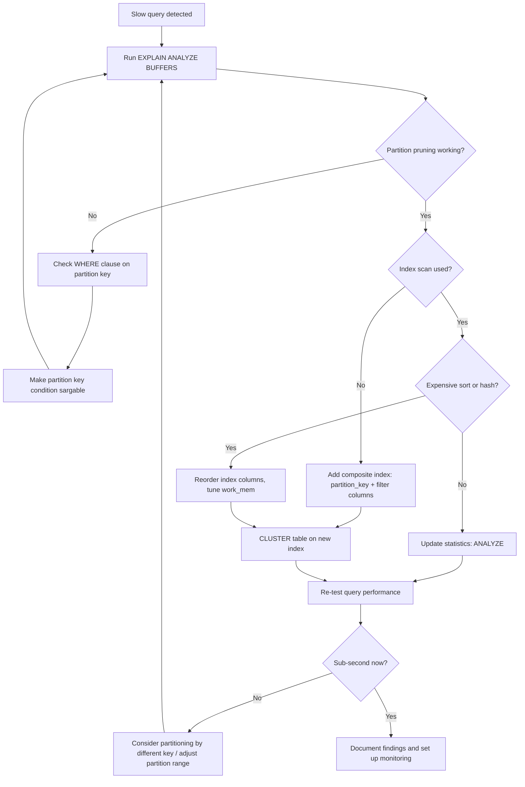
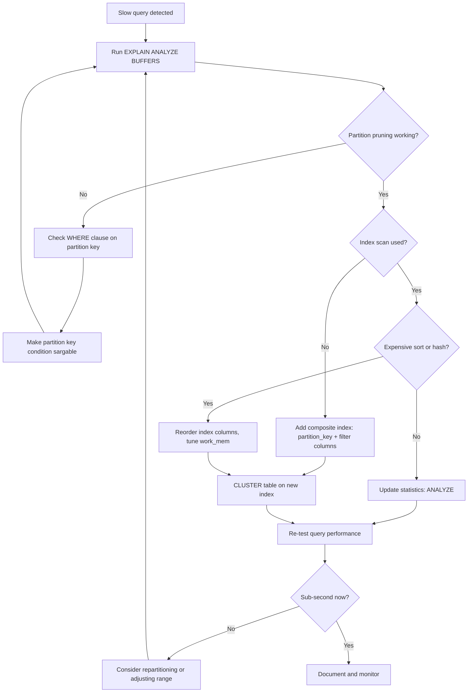

| Difficulty | Channel | Tags |
|---|---|---|
| intermediate | database | explain, query-plan, partitioning |

Prefect Cloud's fastest-growing database table hit 400 million rows and was doubling every two months. Their indexes no longer fit in memory. Dashboard queries crawled. A billion rows loomed on the horizon [1]. This is the story of how they rescued their database — and what you can learn before your own tables spiral out of control.

---

> ### Real-World Case — Prefect
>
> Prefect Cloud's fastest-growing database table had 400M rows and was doubling every ~2 months, projected to exceed 1B rows. Despite careful indexing, query performance was degrading — indexes could no longer fit in memory, table statistics became unreliable, and dashboard queries slowed to a crawl. They needed to partition the table without any downtime.
>
> | | |
> |---|---|
> | **Challenge** | A single PostgreSQL table with 400M rows (soon to be 1B+) was experiencing severe query degradation. Indexes were too large to fit in memory, statistics were unreliable, and simple queries were performing sequential scans. The table was live in production supporting critical customer workflows — they could not take it offline to restructure it. |
> | **Solution** | Prefect implemented a zero-downtime partitioning strategy: (1) Created a new partitioned copy of the table with date-range partitions, (2) Built a PostgreSQL VIEW that UNIONed old and new tables, with INSTEAD OF triggers routing INSERTs to the new table and UPDATEs/DELETEs to both, (3) Backfilled data in batches of 1000 rows using a DELETE-then-INSERT loop until old table emptied, (4) Swapped the VIEW for the new partitioned table. They also ensured partition keys matched query patterns and set plan_cache_mode to force_custom_plan. |
> | **Outcome** | Enabled Prefect Cloud to continue scaling past 1B+ rows without downtime. Partition pruning dramatically reduced the data scanned per query — queries that previously scanned hundreds of millions of rows now touched only the relevant partition. The entire migration was completed with only a few days of degraded service and brief periods of outage despite the table being actively used for critical customer operations. |
> | **Lesson** | The partition key must match your actual query patterns — not just the data's natural ordering. Queries that don't filter on the partition key will scan ALL partitions and perform WORSE than a single large table. Always verify partition pruning in the EXPLAIN plan by checking how many partitions appear under the Append node. Composite indexes covering both the partition key and filtered columns are essential for optimal performance. |

---

## Hook — The Moment Your Database Betrays You

You have done everything right. You added indexes. You vacuum regularly. You normalized your schema. And yet, the query that used to return in 200 milliseconds now takes 30 seconds — and getting worse every week. Your users are complaining. Your dashboards are timing out. Your CEO is asking "what broke?"

Sound familiar? You are not alone. Every team that builds data-intensive applications eventually hits this wall. The question is: do you know how to fight back?

## Problem — Why Indexes Stop Saving You at Scale

Here is the uncomfortable truth about indexes: they are not magic. An index on a 10-million-row table is snappy. An index on a 100-million-row table is... okay. But at 400 million rows, indexes become unwieldy. They consume gigabytes of RAM. Table statistics grow stale. The query planner makes bad decisions because its estimates are wildly inaccurate.

Many developers reach for more indexes when queries slow down. That is the wrong instinct. More indexes mean slower writes, more bloat from dead tuples, and a query planner that has too many options — some of them terrible [2]. The real problem is structural: you are asking PostgreSQL to scan an ever-growing pile of data when it only needs a fraction of it.

This is where partitioning enters the picture. The core idea is elegant: split one massive table into many smaller, self-contained tables (partitions) based on a range of values. When you query on the partition key, PostgreSQL can skip entire partitions entirely — a technique called partition pruning [3].

## Real-World Case — Prefect Cloud's Billion-Row Challenge

In early 2023, Prefect's engineering team noticed something alarming. Their fastest-growing database table was approaching 400 million rows and showed no signs of slowing down. At the current growth rate, it would cross one billion rows within months [1].

Standard indexing had done its job for years. But the team started seeing classic scaling failure symptoms:

- Indexes ballooned past available RAM, forcing the OS to page-swap
- Table statistics became unreliable — `ANALYZE` could no longer sample representatively
- Even simple dashboard queries took tens of seconds
- The table was actively used by customers for critical operations — downtime was not an option

Prefect needed to partition this table without taking the database offline. They chose a declarative partitioning strategy using PostgreSQL's native `PARTITION BY RANGE` feature. The migration was executed with a careful multi-phase approach: creating the partitioned parent table, attaching existing data chunks as partitions, and backfilling historical data in batches [1].

The results were dramatic. Partition pruning meant queries scanned only the relevant partition instead of the entire table. What previously touched hundreds of millions of rows now touched millions. The migration involved only a few days of degraded service and brief outages — a remarkable outcome for a table under active production load [1].

## Deep Dive — Reading the EXPLAIN Tea Leaves

Before you touch a single `CREATE INDEX` statement, you need to diagnose the real bottleneck. That means reading the `EXPLAIN (ANALYZE, BUFFERS)` output. Here is what to look for:

**1. Partition Pruning Gone Wrong**
The most common failure mode: you partitioned your table but the query planner is still scanning all partitions. Look for "Append" or "Merge Append" nodes in the plan. If you see all partition names listed, your WHERE clause is not sargable (Search ARGument ABLE) — meaning PostgreSQL cannot determine which partitions to exclude at plan time [4].

**2. Sequential Scans You Did Not Order**
A sequential scan on a massive partition is a red flag. It means PostgreSQL decided your index is not worth using. Why? Maybe the query returns too many rows (high estimated cost per-index scan). Maybe statistics are stale. Maybe the index is bloated from dead tuples [5].

**3. The Expensive Sort**
`Sort` nodes consuming disproportionate cost often indicate that you are ordering by a column that is not the first column in the index. If the partition key is `event_date` and you sort by `status`, PostgreSQL may fetch all matching rows then sort in memory — expensive at scale [6].

**4. Hash Aggregate Overload**
When PostgreSQL builds a hash table for aggregation, it needs to fit in `work_mem`. If the hash table spills to disk, you will see "HashAgg Batches: x" with disk-based batches. This kills performance [7].

Once you decode the query plan, the optimization path becomes clear: composite indexes on `(partition_key, filtered_column)`, regular statistics refreshes, and careful `work_mem` tuning.

## Workflow — From Slow Query to Sub-Second Response

Here is a battle-tested process for diagnosing and fixing partition query performance:



**Step-by-step breakdown:**

1. **Run the diagnostic.** Always use `EXPLAIN (ANALYZE, BUFFERS)` — not plain `EXPLAIN`. The difference between estimated and actual row counts reveals when statistics are stale.

2. **Check partition pruning.** If you see every partition name in the plan, your query predicate may not match the partition key type or format. For example, filtering on `date_trunc('day', event_date)` is not sargable on a `event_date` partition key — use a range instead.

3. **Inspect index usage.** If PostgreSQL chooses a sequential scan despite having an index, check `pg_stat_user_tables` for `n_dead_tup` — high bloat means the index is not useful. A `REINDEX` may be needed [8].

4. **Build the composite.** Add indexes on `(partition_key, column_you_filter_on)` so the query planner can prune both at the partition and page level.

5. **Cluster for locality.** `CLUSTER` physically reorders the table data to match the index order. This dramatically improves range scan performance by reducing the number of pages read [6].

## Code Example — Implementing the Fix

Here is the exact pattern Prefect used — and you can use — to diagnose and fix slow partition queries:

```sql
-- Step 1: Diagnose the problem
-- Look for sequential scans, all partitions listed, or high buffer counts
EXPLAIN (ANALYZE, BUFFERS) 
SELECT * FROM events 
WHERE event_date BETWEEN '2024-01-01' AND '2024-01-31'
  AND status = 'completed';

-- Step 2: Check partition pruning (run this to see partition info)
EXPLAIN (ANALYZE, BUFFERS, SUMMARY) 
SELECT * FROM events 
WHERE event_date >= '2024-01-01' 
  AND event_date < '2024-02-01'
  AND status = 'completed';

-- Step 3: Add a composite index that covers both the partition key
-- and the filtered column, created CONCURRENTLY to avoid locks
CREATE INDEX CONCURRENTLY idx_events_date_status 
ON events (event_date, status);

-- Step 4: Update statistics so the planner knows about the new index
ANALYZE events;

-- Step 5: (Optional) Cluster the table for physical ordering
-- This is a blocking operation — schedule during maintenance
CLUSTER events USING idx_events_date_status;

-- Step 6: Verify the improvement
EXPLAIN (ANALYZE, BUFFERS) 
SELECT * FROM events 
WHERE event_date BETWEEN '2024-01-01' AND '2024-01-31'
  AND status = 'completed';
```

**What each step accomplishes:**

Step 1 establishes the baseline — the raw query plan with actual execution times and buffer hits. Pay close attention to the "loops" count. If you see `loops=12` for a table with 12 partitions, every partition was scanned.

Step 2 uses a slightly more inclusive date range format (`>=` and `<` instead of `BETWEEN`). In some PostgreSQL versions, range expressions are more reliably sargable than `BETWEEN` for partition pruning.

Step 3 is the key optimization. The composite index `(event_date, status)` allows the planner to seek directly to the rows matching both conditions within each partition. Without it, PostgreSQL finds rows by date, then filters by status in memory.

Step 4 (`ANALYZE`) is easy to forget and costly to skip. Fresh statistics help the planner choose the right plan — including whether to use your shiny new index.

Step 5 (`CLUSTER`) is the power move. It physically reorders the table so that rows with similar index values are stored on the same or adjacent pages. This cuts the number of disk reads dramatically for range queries. Use it when consecutive reads on the sorted order are common.

## Lessons Learned — What 1 Billion Rows Taught Prefect (and You)

Prefect's journey from 400M rows to beyond 1B offers several hard-won lessons:

**1. Partition before you think you need to.** If your table is growing at 2x every two months, you are one quarter away from pain. Partitioning is easier today than it will be tomorrow. The cost of doing it early is negligible; the cost of doing it under duress is significant [1].

**2. The default PostgreSQL statistics target is too low.** With `default_statistics_target` at 100, PostgreSQL samples 300 × 100 = 30,000 rows. For a 400M-row table, that is 0.0075% of the data. Bump it up for critical columns [7].

**3. A composite index beats a single-column index every time.** A single-column index on `event_date` finds dates, then filters. A composite on `(event_date, status)` finds exactly the rows needed. The difference is the difference between a table scan and a targeted lookup.

**4. Monitor your bloat.** Run `pgstattuple` or query `pg_stat_all_tables` for `n_dead_tup`. High bloat means the query planner will ignore your index — it knows the index pages are full of dead entries [5].

**5. Do not fear `CLUSTER`.** Yes, it locks the table. But the performance gain from physical locality is often 10x or more on range queries. Schedule it during low-traffic windows — monthly for most workloads.

**What should you do differently tomorrow?**

- Pull up your largest table and check its growth rate
- Run `EXPLAIN (ANALYZE, BUFFERS)` on your top 5 slowest queries
- If any table exceeds 50M rows without partitioning, start planning the migration
- Set up monitoring for partition pruning effectiveness using `pg_stat_user_tables`

One billion rows is not a death sentence for PostgreSQL. But without partitioning, smart indexes, and regular maintenance — it will feel like one.

---

## Query Performance Diagnostic Workflow



<details>
<summary><strong>Original Interview Question</strong></summary>

**Q:** You have a PostgreSQL table with 100M rows partitioned by date. A query filtering on a specific date range is still slow. What would you check in the EXPLAIN plan and how would you optimize it?

**A:** Check partition pruning effectiveness, index utilization patterns, and expensive sort operations. Create composite indexes on (date, filtered_columns) and evaluate clustering strategies for optimal data access.

</details>

## Conclusion

The data is never going to get smaller. Your tables will grow, your indexes will bloat, and your queries will slow down — unless you intervene. Partitioning is not an exotic optimization reserved for database reliability engineers at FAANG companies. It is a standard tool in PostgreSQL, and the only question is whether you implement it on your terms or under incident response pressure. Run the EXPLAIN plan. Read the Append nodes. Add the composite index. And for the love of production, partition before you have to.

---

## References

1. [Partitioning a Production PostgreSQL Table Without Downtime — Prefect](https://www.prefect.io/blog/database-partitioning-prod-postgres-without-downtime) — blog
2. [Table Partitioning — PostgreSQL Documentation](https://www.postgresql.org/docs/current/ddl-partitioning.html) — documentation
3. [Partition Pruning — PostgreSQL Documentation](https://www.postgresql.org/docs/current/ddl-partitioning.html#DDL-PARTITION-PRUNING) — documentation
4. [EXPLAIN — PostgreSQL Documentation](https://www.postgresql.org/docs/current/sql-explain.html) — documentation
5. [Routine Vacuuming — PostgreSQL Documentation](https://www.postgresql.org/docs/current/routine-vacuuming.html) — documentation
6. [CLUSTER — PostgreSQL Documentation](https://www.postgresql.org/docs/current/sql-cluster.html) — documentation
7. [Performance Tips — PostgreSQL Documentation](https://www.postgresql.org/docs/current/performance-tips.html) — documentation
8. [Index Maintenance — PostgreSQL Wiki](https://wiki.postgresql.org/wiki/Index_Maintenance) — documentation

---

**Author:** Satishkumar Dhule — [GitHub](https://github.com/satishkumar-dhule) · [LinkedIn](https://linkedin.com/in/satishkumar-dhule) · [Website](https://satishkumar-dhule.github.io)
