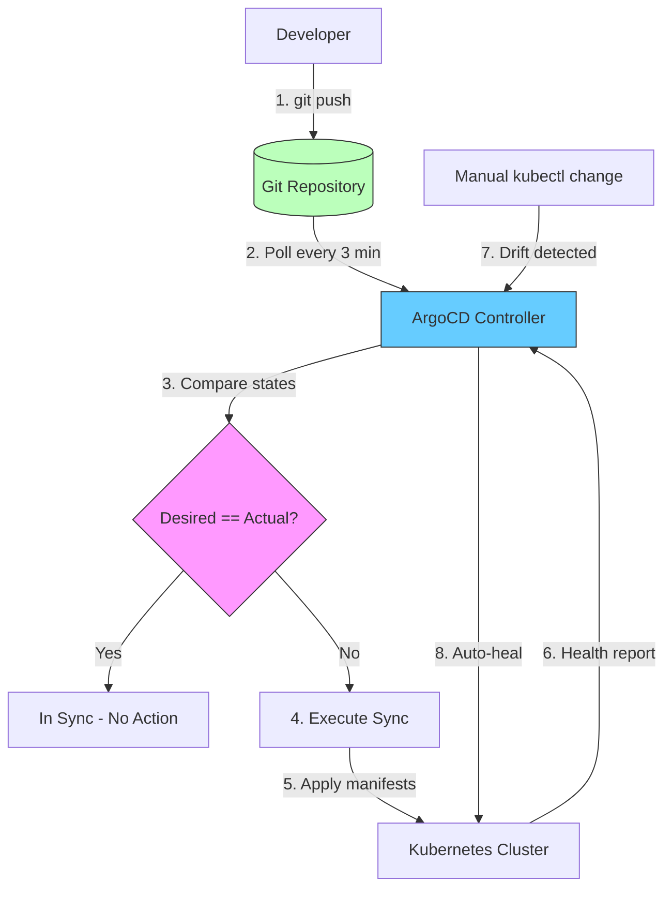

| Difficulty | Channel | Tags |
|---|---|---|
| beginner | devops | argocd, flux, declarative |

In 2018, Intuit faced a developer productivity crisis. Despite migrating to the cloud, deployment cycles still took days — their 'lift-and-shift' strategy had failed to deliver on the promise of faster delivery [1]. Then they acquired Applatix, the startup behind the Argo project, and set out to build something that would change how the world deploys software. Within 18 months, they went from zero to 2,000 services on Kubernetes across 100+ clusters, and ArgoCD became the industry standard for GitOps.

---

> ### Real-World Case — Intuit
>
> Intuit, the financial software giant behind TurboTax and QuickBooks, was stuck with deployment cycles that took days. Their 'lift-and-shift' cloud migration barely improved velocity. In 2018, they acquired Applatix (the startup behind Argo) and tasked them with building a self-service developer platform using Kubernetes and GitOps. The result? They created ArgoCD - now the industry-standard GitOps tool used by 60% of Kubernetes clusters worldwide.
>
> | | |
> |---|---|
> | **Challenge** | Intuit's deployment process was a slow, manual ceremony. Releases took days across their fleet, requiring complex Tomcat/Apache setups and manual scripts. A new developer took 3 days just to onboard. MTTR was 45 minutes. Their lift-and-shift cloud migration only delivered marginal improvements. They needed a radically faster, fully declarative approach to managing deployments at scale - and no existing tool fit their needs. |
> | **Solution** | Intuit built ArgoCD as a declarative GitOps continuous delivery tool for Kubernetes. The philosophy: Git is the single source of truth. Developers declare their desired state in Git repos, and ArgoCD continuously reconciles the live cluster with that state. They combined this with Kubernetes, Envoy, Prometheus, and Open Policy Agent to create a self-service 'Modern SaaS' platform where creating or upgrading a service takes under 10 minutes, including automated CI/CD pipelines. |
> | **Outcome** | Deployment cycle decreased from days to minutes. MTTR dropped from 45 minutes to under 5 minutes. In 18 months, Intuit went from zero to 2,000 services on Kubernetes across 100+ clusters. Creating or upgrading a service now takes less than 10 minutes. Developer onboarding dropped from 3 days to under an hour. The Argo project was donated to CNCF and now runs in nearly 60% of Kubernetes clusters globally. |
> | **Lesson** | The best platform tools are born from real pain. Intuit didn't adopt GitOps - they invented the tool because no existing solution met their needs. The declarative Git-as-source-of-truth model proved so effective that it became an industry standard, adopted by companies from Deutsche Telekom to Google. The 'plot twist': ArgoCD wasn't created by a startup or cloud vendor - it came from a 40-year-old accounting software company that needed to ship faster. |

---

## Hook — The Disaster of Slow Deployments

Imagine explaining to your CEO that the hotfix for a critical production bug will take three days to deploy. Now imagine explaining it again next week. That was the reality at Intuit before GitOps. Despite investing heavily in cloud migration, their teams were stuck in a cycle of slow, manual releases. The cloud was supposed to fix this — but a 'lift-and-shift' approach had just moved the slow parts to someone else's computer. The problem wasn't the infrastructure. The problem was how they were telling the infrastructure what to do. And if you are still deploying with `kubectl apply`, you might be in the same boat.

## Problem — Configuration Drift Is Eating Your Deployments

Here is the uncomfortable truth: most teams manage Kubernetes the same way they managed physical servers — by manually applying changes. Someone runs `kubectl scale deployment`, someone else edits a ConfigMap by hand, and before you know it, your production cluster looks nothing like your Git repository. This is configuration drift, and it is the #1 cause of 'it works in staging' syndrome [3]. The stakes are higher than you think. A single manual override at 2 AM can cascade into a multi-hour incident when automated pipelines overwrite those changes days later, wiping out critical configuration you forgot to commit. Many developers discover this the hard way — staring at a 500 error, trying to figure out which manual change just got clobbered by an automated sync.

## Real-World Case — Intuit's GitOps Transformation

Intuit's story is the best argument for GitOps you will ever find. Before adopting ArgoCD, their deployment pipeline was a bottleneck that took days to push changes through [1]. The 'Modern SaaS' platform team had a mandate: build a self-service developer experience that removes infrastructure toil. What they built changed the industry. Within 18 months, Intuit went from running nothing on Kubernetes to managing 2,000 services across 100+ clusters. Deployment cycles dropped from days to minutes. Mean Time To Recovery (MTTR) fell from 45 minutes to under 5 minutes. Creating or upgrading a service now takes less than 10 minutes. Developer onboarding — which previously took 3 days — was cut to under an hour [1]. The platform they built was eventually donated to the CNCF, where ArgoCD now runs in nearly 60% of Kubernetes clusters globally [5].

## Deep Dive — Declarative vs Imperative: The Philosophical Divide

The difference between declarative and imperative approaches is not just technical — it is a fundamental shift in how you think about infrastructure. The imperative approach is what most developers learn first: run `kubectl create deployment nginx --image=nginx` and the cluster does exactly what you told it, right now. It is intuitive. It is immediate. And it is a maintenance nightmare at scale. The declarative approach flips the script: instead of telling the cluster what to do, you tell it what you want the final state to look like — then let the system figure out how to get there [3]. ArgoCD is the engine that makes this work. It runs inside your cluster, continuously comparing the actual state against the desired state defined in Git. When it detects drift — a manual change, a resource that was deleted, a misconfigured replica count — it reconciles the cluster back to the declared state [2]. This is where the 'self-healing' magic comes from. Here is the real tradeoff:

| Aspect | Declarative (GitOps) | Imperative (kubectl) |
|--------|---------------------|---------------------|
| Source of truth | Git repository | Tribal knowledge / terminal history |
| Audit trail | Full Git history | None |
| Rollback | `git revert` | Manual re-apply |
| Drift detection | Automatic | Requires diff tool |
| Collaboration | PR reviews | Screen sharing |
| Learning curve | Steeper initial setup | Immediate, but costly later |

Many developers think declarative means more YAML. The reality is more nuanced. You are trading upfront investment in configuration for long-term sanity. And when your pager goes off at 3 AM, you will be grateful that a `git revert` is all it takes to roll back.

## Workflow — The GitOps Pipeline from Commit to Cluster

So how does this actually work in practice? The GitOps pipeline follows a clean, observable loop:

The flow starts when a developer pushes a change to the Git repository — a modified Helm values file, an updated Kustomize overlay, or a new Kubernetes manifest. ArgoCD, which continuously polls the repository (typically every 3 minutes), detects the change. It compares the desired state from the repo against the live state of the cluster. If they match, nothing happens. If they diverge, ArgoCD executes a sync operation, applying the desired manifests to the cluster using the Kubernetes API [2]. Once applied, ArgoCD monitors the health of the deployed resources, updating its status dashboard. If someone makes a manual change through `kubectl`, ArgoCD detects the drift on its next reconciliation and automatically reverts it — this is self-healing in action [4].

This pull-based model has a critical security advantage: ArgoCD runs inside the cluster with a Kubernetes ServiceAccount, meaning no cluster credentials ever leave your network. Compare this to traditional CI/CD pipelines that need admin credentials stored in Jenkins or GitHub Actions, creating a massive attack surface.

## Code Example — Your First ArgoCD Application

Let's make this concrete. Here is how you define an ArgoCD Application that deploys a microservice using Helm:

```yaml
apiVersion: argoproj.io/v1alpha1
kind: Application
metadata:
  name: payment-service
  namespace: argocd
spec:
  project: default
  source:
    repoURL: https://github.com/company/gitops-config.git
    targetRevision: main
    path: services/payment
    helm:
      valueFiles:
        - values-prod.yaml
  destination:
    server: https://kubernetes.default.svc
    namespace: payments
  syncPolicy:
    automated:
      prune: true       # Delete resources removed from Git
      selfHeal: true    # Revert manual cluster changes
      allowEmpty: false
    syncOptions:
      - CreateNamespace=true
    retry:
      limit: 5
      backoff:
        duration: 5s
        factor: 2
        maxDuration: 3m
```

Walking through this: the `source` block tells ArgoCD where to find your configuration — in this case, a Helm chart in the `services/payment` directory of your GitOps repository [6]. The `destination` tells it which cluster and namespace to deploy into. The `syncPolicy` is where the power lies: `prune: true` ensures resources deleted from Git are removed from the cluster, `selfHeal: true` automatically reverts any manual changes. The `retry` block with exponential backoff handles transient failures — if a sync fails, ArgoCD retries with increasing delays up to 3 minutes. This single YAML file replaces hundreds of imperative `kubectl` commands and provides a full audit trail through Git history.

## Lessons Learned — What 2,000 Services Taught Intuit

After running this playbook at massive scale, several hard-won lessons emerged:

First, **separate your app code and config repos**. Keeping Kubernetes manifests in a different repository from application source code prevents CI/CD loops and gives cleaner audit trails. You should not trigger a build just because you bumped a replica count [2].

Second, **leave room for imperativeness where it makes sense**. Horizontal Pod Autoscalers manage replica counts dynamically — you should not hardcode replicas in Git if HPA needs to adjust them. The ArgoCD docs explicitly recommend this: not everything needs to be in Git [2].

Third, **pin your Helm chart versions and Kustomize bases**. Using remote bases with `:HEAD` is a recipe for surprise changes. A Kustomize overlay that worked yesterday might break today because an upstream base changed. Always use commit SHAs or tags [8].

Finally, **ruthless consistency is the goal**. Enable both `prune: true` and `selfHeal: true` in production. Without these, drift accumulates silently, and you end up debugging incidents that started with a 'quick fix' someone forgot to commit.

The most common mistake teams make? Mixing imperative `kubectl apply` commands with ArgoCD-managed resources. The two systems fight over ownership, creating confusing state conflicts. Pick one approach and commit to it.

---

## GitOps Reconciliation Pipeline



<details>
<summary><strong>Original Interview Question</strong></summary>

**Q:** You're setting up GitOps for a microservices deployment. How would you configure ArgoCD to automatically sync changes from your Git repository to Kubernetes, and what's the difference between declarative and imperative approaches in this context?

**A:** I'd configure ArgoCD by setting up a Git repository containing Kubernetes manifests or Helm charts, creating an Application CRD that points to the Git repository, enabling auto-sync with a health check interval of 3 minutes, and implementing self-healing to automatically revert any manual changes. The declarative approach involves defining the desired state in Git through YAML manifests, Helm charts, or Kustomize configurations, where ArgoCD continuously reconciles the actual state with the desired state. In contrast, the imperative approach uses kubectl commands to make direct changes to the cluster, bypassing the Git repository as the single source of truth.

</details>

## Conclusion

Intuit's story is not just about a tool — it is about a mindset shift. The question is no longer whether GitOps works; it is whether you can afford to keep deploying the old way. Start by moving one service to an ArgoCD Application. Enable auto-sync and self-healing. Watch what happens the next time someone runs a manual `kubectl edit` — and sees ArgoCD undo it in seconds. That moment, when you realize the cluster is now self-governing, is when GitOps clicks. One commit is all it takes.

---

## References

1. [Intuit case study: GitOps transformation and ArgoCD adoption](https://www.cncf.io/case-studies/intuit/) — article
2. [ArgoCD Documentation — Best Practices](https://argo-cd.readthedocs.io/en/stable/user-guide/best_practices/) — documentation
3. [Kubernetes — Declarative Management](https://kubernetes.io/docs/tasks/manage-kubernetes-objects/declarative-config/) — documentation
4. [Kubernetes — Object Management Overview](https://kubernetes.io/docs/concepts/overview/working-with-objects/object-management/) — documentation
5. [CNCF — Argo Project Overview](https://www.cncf.io/projects/argo/) — documentation
6. [Helm Documentation](https://helm.sh/docs/) — documentation
7. [Git Documentation](https://git-scm.com/doc) — documentation
8. [Kustomize — Native Kubernetes Configuration Management](https://kustomize.io/) — documentation

---

**Author:** Satishkumar Dhule — [GitHub](https://github.com/satishkumar-dhule) · [LinkedIn](https://linkedin.com/in/satishkumar-dhule) · [Website](https://satishkumar-dhule.github.io)
