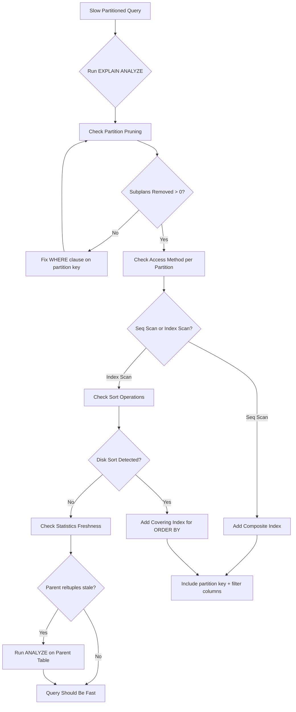

| Difficulty | Channel | Tags |
|---|---|---|
| intermediate | database | explain, query-plan, partitioning |

When Hatchet, a durable queue built on Postgres, crossed 200 million rows, their carefully designed database started showing symptoms that haunt every engineering team at scale: index bloat, cripplingly slow deletes, and queries that used to finish in milliseconds now crawling into multiple seconds [1]. They implemented daily range partitioning on their task tables, and query performance returned to normal — but only after one critical step most teams miss. If you are dealing with a partitioned table that feels like it is getting slower instead of faster, the EXPLAIN plan is already telling you exactly what is wrong. You just need to know where to look.

---

> ### Real-World Case — Hatchet
>
> Hatchet, a durable queue built on Postgres, stored hundreds of millions of tasks per day. After hitting ~200M rows, they saw index bloat and slow deletes, so they implemented daily range partitioning on their task tables.
>
> | | |
> |---|---|
> | **Challenge** | Days after rolling out partitioning, queries on partitioned tables got up to 10x slower (from a few ms to >20ms), causing massive CPU spikes under moderate load. The slow queries involved partitioned tables in JOIN statements with compound primary keys. |
> | **Solution** | Using EXPLAIN ANALYZE, they discovered row estimates were off by a factor of 6,100,000x. They called in Postgres expert Laurenz Albe, who identified that autovacuum does NOT run ANALYZE on parent partitioned tables (only on child partitions). Manually running ANALYZE on the parent table immediately fixed all issues. |
> | **Outcome** | Query performance returned to normal after adding periodic ANALYZE calls on parent partitioned tables. |
> | **Lesson** | A critical-but-easy-to-miss footnote in Postgres docs: 'autovacuum does not run ANALYZE on partitioned tables, and this can cause suboptimal plans.' Always check EXPLAIN ANALYZE for row estimate mismatches—if estimated rows are wildly off on partitioned tables, stale statistics on the parent are the likely culprit. |

---

## Hook — The 3 a.m. Query That Woke Everyone Up

You have done everything right. You partitioned your massive table by date. You celebrated when the migration finished. You told your team the performance problems were solved. Then, a week later, a simple date-range query — the kind you optimized for — is still dragging. The pager goes off at 3 a.m. because a dashboard timed out. Sound familiar? Many engineering teams discover the hard way that partitioning a table is not the same as optimizing a query. Partitioning is a storage strategy. Query optimization is a separate craft. And the bridge between them is a skill most developers learn only after a production incident.

## Problem — Partitioning Is Not a Silver Bullet

At its core, partitioning is about dividing a large logical table into smaller physical pieces. When done well, the query planner can skip irrelevant partitions entirely — a mechanism called *partition pruning*. But here is the plot twist: partitioning can actually make queries *slower* if the planner scans every partition anyway. The most common failure modes are subtle. Maybe your WHERE clause references a function-wrapped date column, preventing the planner from recognizing the partition key. Maybe your indexes are bloated because you did not realize that each partition builds its own index independently. Or maybe — and this is the one that catches most teams — you forgot that the parent partitioned table's statistics are empty, and the planner is making decisions in the dark. Every one of these problems shows up clearly in an EXPLAIN plan if you know the patterns to look for.

## Real-World Case — How Hatchet Debugged 200 Million Rows

Hatchet built a durable queue on Postgres that processed hundreds of millions of tasks daily. As they approached 200 million rows — a number that sounds theoretical until you are staring at 500 GB of data — their task table became nearly unmanageable. Index bloat from constant inserts and deletes caused query times to spike. Deletes, which are already expensive in Postgres due to MVCC, became unusably slow. Their solution: daily range partitioning on the `inserted_at` column, splitting data into one partition per day. But here is the critical detail most posts gloss over — the fix was not the partitioning itself. The actual breakthrough came when they added periodic `ANALYZE` calls on the *parent* partitioned table. Without that, Postgres lacked accurate statistics on the partition structure, and the query planner could not make smart decisions about which partitions to scan [1]. It is a classic "the solution created a new problem" story — one that illustrates why understanding the planner's inner workings is essential.

## Deep Dive — What the EXPLAIN Plan Actually Reveals

When you run `EXPLAIN (ANALYZE, BUFFERS)` on a slow query against a partitioned table, the output tells a three-act story. Act one: **partition pruning**. Look for `Subplans Removed` in the output. If this number is zero or suspiciously low, the planner scanned partitions it could have skipped. The usual culprit? A WHERE clause like `WHERE date_trunc('day', event_date) BETWEEN ...` instead of `WHERE event_date BETWEEN ...`. Wrapping the partition key in a function hides its structure from the planner [2]. Act two: **access method**. Is the planner using an index scan or a sequential scan on each partition? If a critical filter column — like `status` in a `WHERE status = 'completed'` clause — does not have an index, each partition defaults to a sequential scan. With 365 daily partitions, that is 365 full table scans [3]. Act three: **sort and aggregate costs**. An `EXPLAIN` line showing `Sort Method: external merge` with high `Sort Space` means Postgres spilled to disk. This happens when the query result needs ordering but the planner cannot satisfy the order from an existing index. A composite index that covers both the filter and the sort order eliminates this cost entirely [4]. The deeper insight: Postgres creates per-partition indexes, not a single global index. If you create a composite index on the *parent* table, Postgres automatically propagates it to all existing and future partitions — but only if you use the `CREATE INDEX ON ONLY` pattern correctly, or better yet, just create the index on the parent and let Postgres handle the rest.

## Workflow — Diagnosing a Slow Partitioned Query

When a date-partitioned query runs slow, follow this diagnostic workflow:

1. **Check partition pruning** — Run `EXPLAIN (SUMMARY)` and look for the number of partitions scanned vs total partitions. If the planner is not pruning effectively, inspect your WHERE clause for function wrappers around the partition key.

2. **Inspect per-partition access methods** — Look for `Seq Scan` on partitions that should use an index. If you see sequential scans, add a composite index covering all filtered columns.

3. **Identify expensive sort nodes** — Look for `Sort` nodes with high `Sort Space Used` or `Sort Method: external merge`. Add composite indexes that include the ORDER BY columns to convert sorts to index scans.

4. **Check statistics freshness** — Run `SELECT relname, reltuples, relpages FROM pg_class WHERE relname = 'your_partitioned_table'`. If `reltuples` is zero or stale, run `ANALYZE your_partitioned_table` to refresh the parent's statistics.

5. **Evaluate the partition strategy** — Is the partition granularity aligned with your query patterns? If you query by week but partition by month, the planner scans one month per query — wasteful. Align partition boundaries to your most common query range [5].

The diagram below visualizes this decision flow — trace it the next time you are staring at a slow query.

## Code Example — From Symptom to Fix in Three SQL Statements

Here is the exact diagnostic workflow you run when a partitioned query feels slow. Start by capturing the EXPLAIN plan with the flags that matter.

Step 1 runs EXPLAIN with the three flags that matter: ANALYZE (executes the query for real timing), BUFFERS (shows cache hit ratio), and SUMMARY (gives partition pruning counts). In the output, you look for `Subplans Removed` to verify pruning works, and check whether each partition uses `Seq Scan` or `Index Scan`.

Step 2 creates a composite B-tree index on the parent table with the partition key as the leading column and the filter column second. The CONCURRENTLY keyword is critical for production — it builds the index without blocking writes, though it takes longer.

Step 3 uses CLUSTER to physically reorder rows on disk to match the index order, which improves range scan performance for queries that return many rows.

Step 4 runs ANALYZE on the parent partitioned table — the step that Hatchet discovered was essential. Without accurate statistics on the parent, Postgres's query planner cannot estimate the cost of scanning specific partitions, leading to poor plan choices.

## Lessons Learned — What to Do Differently Tomorrow

Here is the distilled wisdom from Hatchet's incident and the patterns you have seen across hundreds of partitioned tables:

**1. Partition pruning is not automatic.** Just because your table is partitioned by date does not mean the planner knows how to use it. Always verify with `EXPLAIN (SUMMARY)` that `Subplans Removed` matches your expectations. If it does not, the WHERE clause is the first place to look [7].

**2. Composite indexes on partitioned tables are non-negotiable.** A single-column index on the partition key is rarely enough. Add the most selective filter columns as the second and third columns in your B-tree index. The planner can use a single index scan instead of filtering rows after reading them from the heap.

**3. The parent table's statistics matter.** This is the counterintuitive insight that tripped up Hatchet. Run `ANALYZE` on the parent table periodically — especially after large data loads. Without accurate statistics on the parent, the planner guesses at partition costs and often guesses wrong [1].

**4. Partition at the right granularity.** If your queries ask for weekly data, monthly partitions are too coarse and daily partitions create planning overhead. Match the partition grain to your most common query range. For most SaaS applications, weekly or monthly partitions strike the right balance [8].

**5. CONCURRENTLY is your friend for production indexes.** Adding an index to a 200-million-row table under load is risky. The `CREATE INDEX CONCURRENTLY` option builds the index without blocking writes. It takes longer, but you will not page your team at midnight.

The next time your phone buzzes with a slow-query alert on a partitioned table, you know exactly what to check. Start with the EXPLAIN plan. Count the partitions scanned. Look for sequential scans. Check for sorts. And if the parent table statistics feel stale, remember Hatchet.

---

## Diagnostic Workflow for Slow Partitioned Queries

<strong>Original Interview Question</strong>

**Q:** You have a PostgreSQL table with 100M rows partitioned by date. A query filtering on a specific date range is still slow. What would you check in the EXPLAIN plan and how would you optimize it?

**A:** Check partition pruning effectiveness, index utilization patterns, and expensive sort operations. Create composite indexes on (date, filtered_columns) and evaluate clustering strategies for optimal data access.

## Conclusion

PostgreSQL partitioning is a powerful tool, but it is not a magic wand. The difference between a partitioned table that scales and one that struggles comes down to three things: understanding what the EXPLAIN plan is telling you, creating the right composite indexes, and keeping the parent table's statistics fresh. Next time you face a slow query on a partitioned table, you have a systematic workflow to follow — and a war story from Hatchet to remind you that sometimes the smallest fix makes the biggest difference. Start with EXPLAIN. Count the partitions. Check for seq scans. And for the love of your on-call rotation, run ANALYZE on the parent.

---

## References

1. [How Hatchet reduced query latency using Postgres partitioning](https://hatchet.run/blog/postgres-partitioning) — blog
2. [PostgreSQL Documentation: Table Partitioning](https://www.postgresql.org/docs/current/ddl-partitioning.html) — documentation
3. [PostgreSQL Documentation: Using EXPLAIN](https://www.postgresql.org/docs/current/using-explain.html) — documentation
4. [PostgreSQL Documentation: Indexes](https://www.postgresql.org/docs/current/indexes.html) — documentation
5. [PostgreSQL Documentation: CREATE INDEX](https://www.postgresql.org/docs/current/sql-createindex.html) — documentation
6. [PostgreSQL — Wikipedia](https://en.wikipedia.org/wiki/PostgreSQL) — documentation
7. [Query optimization — Wikipedia](https://en.wikipedia.org/wiki/Query_optimization) — documentation
8. [How To Use Table Partitioning in PostgreSQL](https://www.digitalocean.com/community/tutorials/how-to-use-table-partitioning-in-postgresql) — article
9. [PostgreSQL on GitHub](https://github.com/postgres/postgres) — documentation

---

**Author:** Satishkumar Dhule — [GitHub](https://github.com/satishkumar-dhule) · [LinkedIn](https://linkedin.com/in/satishkumar-dhule) · [Website](https://satishkumar-dhule.github.io)
