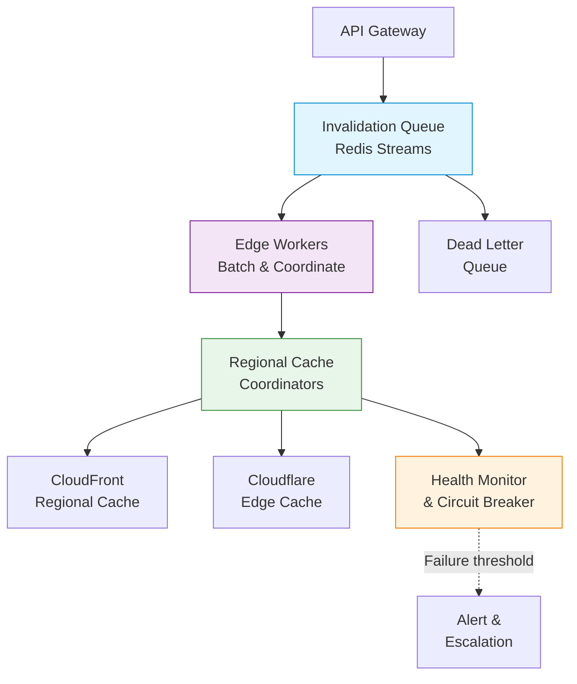

| Difficulty | Channel | Tags |
|---|---|---|
| intermediate | system-design | edge, caching, purging |

Hit 'Purge Cache' and watch 330+ data centers around the world instantly forget their cached content. Easy, right? Cloudflare learned the hard way that this simple action hides a distributed systems nightmare. Their original architecture routed every purge through a centralized US core — meaning a developer in Sydney paid a 1,300ms round-trip penalty just to clear cached content for their own local users. The system was buckling under the weight of global growth, and something had to change [1].

---

> ### Real-World Case — Cloudflare
>
> Cloudflare's cache purge system was reaching its limits as their network grew to 330+ cities globally. The old system used a centralized 'core-based' architecture where purge requests from customers in Australia had to cross the Pacific Ocean and back before local users would see new content. Three compounding issues emerged: latency proportional to distance from US core data centers, throughput bottlenecks at the centralized ingest point, and storage needs that grew linearly with purge volume.
>
> | | |
> |---|---|
> | **Challenge** | Design a global cache invalidation system that could scale across 330+ data centers in 120+ countries without a central bottleneck. The old lazy-purge approach stored all purge requests on every machine for the entire cache eviction window, consuming massive disk space that could otherwise cache customer content. The Quicksilver spoke-hub distribution system couldn't handle write throughput without replication lag, and Kafka queues added further latency just to smooth traffic spikes. |
> | **Solution** | Cloudflare completely redesigned their purge system, replacing the centralized spoke-hub model with a peer-to-peer Distribution pipeline using Workers and Durable Objects that accepts purge requests at any data center. They built CacheDB—a Rust service running on every machine using RocksDB as an embedded key-value store—to index all cached files by metadata (cache-tags, hostnames, prefixes). This enabled active purge (proactively deleting matched files from disk on arrival) instead of the old lazy-purge (checking purge timestamps on each request). The cache proxy checks CacheDB's local queue before serving any cache HIT, preventing stale content from being served even while millions of files are being asynchronously deleted from disk. |
> | **Outcome** | Global P50 purge latency dropped from 1,570ms to 149ms—a 90.5% improvement. APAC went from 1,300ms to 199ms (84.7% improvement), South America from 1,250ms to 196ms (84.3% improvement). Storage requirements for purge tracking reduced by 10x, freeing up disk for actual content caching and improving overall cache HIT ratios. The system now handles purge-by-tags, hostnames, and prefixes at this speed, and Cloudflare opened these capabilities to all plan tiers instead of just Enterprise. |
> | **Lesson** | The clever 'lazy purge' approach (deferring work to request time) seemed elegant at small scale but became the root cause of storage and throughput bottlenecks as the network grew. By flipping the model to active purge backed by per-machine RocksDB indexes, Cloudflare eliminated the storage-tax problem and achieved a 10x improvement. Sometimes the 'obviously harder' approach (indexing everything on every machine) turns out to be simpler and more scalable than the clever shortcut. |

---

## Hook — The purge button is lying to you

Every developer has done it: deployed a fix, hit Purge Cache, and refreshed the browser expecting instant results. But when your content travels through 330+ edge nodes across six continents, that split-second expectation becomes a hard distributed systems problem. The stakes are brutally high: a compromised JavaScript library stays live for seconds longer than it should. A pricing error costs real money before the cache clears. A critical API response serves stale data to millions of users. You might think TTL-based expiration solves everything — until you need something gone right now.

## Problem — Why cache invalidation hurts at scale

Phil Karlton famously said there are only two hard things in computer science: cache invalidation and naming things. Multiply the first one by 330 data centers and the joke stops being funny. Three compounding issues emerge when you scale cache purging globally. First, latency is proportional to distance from the central processing core — the farther your users are from your US-based coordinator, the longer they wait. Second, a single centralized ingest point creates a throughput bottleneck; you can only push so many invalidations through one pipe. Third, tracking what has been purged grows storage requirements linearly with purge volume, eating into disk that should serve cached content [1][5]. The centralized model does not just slow down purges — it makes your entire CDN less efficient.

## Real-World Case — Cloudflare

Cloudflare's old purge system used a 'core-based' architecture where all invalidation requests funneled through centralized US data centers. Every purge from APAC, South America, or Europe paid a round-trip latency penalty. The system was reaching its limits as the network grew to 330+ cities globally, and the engineering team embarked on a radical redesign: distribute the purge coordination plane to every data center [1].

The results rewrote what was possible. Global P50 purge latency dropped from 1,570ms to 149ms — a 90.5% improvement. APAC went from 1,300ms to 199ms (84.7% improvement). South America dropped from 1,250ms to 196ms (84.3% improvement). Storage requirements for purge tracking reduced by 10x, freeing up disk for actual content caching and improving overall cache hit ratios. Cloudflare also opened purge-by-tags, hostnames, and prefixes to all plan tiers instead of limiting them to Enterprise customers [1]. The lesson: distributing the control plane eliminated the distance tax entirely.

## Deep Dive — The patterns behind sub-5-second global purging

Building a multi-region purge system that handles 10,000 concurrent invalidations per second with a 5-second SLA requires several architectural patterns working in concert.

**The invalidation queue.** Redis Streams with consumer groups form the backbone. Each purge request becomes an entry in the stream, and consumer groups ensure exactly-once processing across your edge workers. This pattern scales horizontally — add more consumer workers as throughput grows without reconfiguring the queue [3]. The stream acts as a shock absorber: the API can accept bursts of 10,000 requests per second while workers process at their own pace.

**The edge coordination layer.** This is the architectural shift that changes everything. Instead of routing every purge through a central coordinator, edge compute platforms like Cloudflare Workers or Lambda@Edge run the purge logic at each edge location. The round-trip problem disappears because every region coordinates its own invalidation independently — in parallel [8].

**Batch processing.** CDN providers typically charge per API call, and API rate limits are real. Batching 100 invalidations per API call reduces costs by roughly 90% while respecting upstream rate limits [2]. The trade-off is a marginal increase in complexity: you need to group files efficiently and handle partial batch failures.

**Retry with exponential backoff and jitter.** After a failed purge attempt, wait 2 seconds, then 4, then 8 — up to 3 retries before routing to a dead letter queue. Adding random jitter prevents the thundering herd problem when many invalidations fail simultaneously [7].

**Circuit breaker.** After 5 consecutive failures to a region, stop trying and mark it as degraded. Recheck after 30 seconds. This prevents cascading failures when a regional CDN provider is having issues [6].

## Workflow — The 6-stage purge lifecycle

A purge request travels through six distinct stages from submission to completion. Each stage is designed to handle failure gracefully and maintain the 5-second SLA.

**Stage 1: API Gateway** — Validates and authenticates incoming requests. Checks rate limits and enforces request format. Returns an acknowledgment immediately so the client knows the request was received.

**Stage 2: Invalidation Queue** — Valid requests are written to a Redis Stream. Consumer groups distribute entries across available edge workers. The stream decouples ingest rate from processing rate.

**Stage 3: Edge Workers** — Workers pick up messages from the stream and coordinate purge across their regional cache. They batch 100 invalidations per API call for cost efficiency.

**Stage 4: Regional Cache Coordinators** — Workers forward the purge to regional coordinators. Each region invalidates independently and in parallel — this is where the distributed model eliminates the distance tax.

**Stage 5: CDN Providers** — The regional coordinator calls the CDN API (CloudFront, Cloudflare, Fastly) to evict cached objects. Pattern-based purging uses wildcards to clear multiple objects in a single call.

**Stage 6: Health Monitoring & Recovery** — Regional health checks verify completion. Failed operations enter the retry loop. After exhausting retries, the failure is logged to a dead letter queue.

The architecture diagram below shows how these stages connect:

## Code Example — Building a multi-region purge coordinator in Node.js

Below is a production-oriented implementation of a cache purge coordinator. It handles batch submission, region-aware invalidation, exponential backoff with jitter, and circuit breaker logic.

## Lessons Learned — Five takeaways for your next purge system

**1. Distribute the control plane.** The single biggest insight from Cloudflare's journey: moving purge coordination to the edge eliminates the distance tax. If your CDN strategy uses a centralized ingest point, you are building in latency that grows with your global footprint [1].

**2. Batch aggressively for cost.** Cloudflare reduced API costs by 90% by batching 100 invalidations per API call. CDN providers charge per purge request — batching is not just efficient, it is economical [2].

**3. Plan for partial failure.** In a distributed system spanning 330+ locations, some regions will inevitably fail. Exponential backoff with jitter, a dead letter queue, and circuit breakers are not optional — they are survival mechanisms [7].

**4. Cache headers still matter.** Even with instant purge capability, responsible Cache-Control headers (short TTLs like 2 seconds for dynamic content, `must-revalidate`) reduce the blast radius of stale content. Purge should be a safety net, not your primary freshness mechanism [4][9].

**5. Pattern-based purging changes the game.** Wildcard purging (e.g., `/api/v2/*`) allows you to invalidate related content in one operation instead of tracking individual URLs. This is particularly powerful for API responses that depend on shared database state [3].

---

## Multi-Region Cache Purge Architecture Flow

<strong>Original Interview Question</strong>

**Q:** How would you design a multi-region CDN cache purging system that guarantees content propagation within 5 seconds while handling 10,000 concurrent invalidations per second?

**A:** Implement Cloudflare API + AWS CloudFront with distributed invalidation queue, edge compute coordination, and 2-second TTL. Use batch invalidation, exponential backoff, and regional cache headers for 5-second SLA.

## Conclusion

The next time you hit 'Purge Cache' and see your changes propagate instantly, remember the distributed systems engineering that makes it possible. Cloudflare's journey from 1,570ms to 149ms is not just a technical achievement — it is a blueprint for thinking about global-scale systems. The playbook is clear: distribute the coordination plane, batch for efficiency, prepare for partial failure with circuit breakers, and never assume a centralized approach will scale. The web is global. Your cache architecture should be too. Start by auditing your current CDN strategy: is your purge system centralized or distributed? The answer tells you everything about how fast your users will see your next update.

---

## References

1. [Cloudflare Instant Purge: How we made cache purging 90% faster](https://blog.cloudflare.com/instant-purge) — blog
2. [AWS CloudFront: Invalidating Files](https://docs.aws.amazon.com/AmazonCloudFront/latest/DeveloperGuide/Invalidation.html) — documentation
3. [Redis Streams Documentation](https://redis.io/docs/data-types/streams/) — documentation
4. [MDN: Cache-Control HTTP Header](https://developer.mozilla.org/en-US/docs/Web/HTTP/Headers/Cache-Control) — documentation
5. [Wikipedia: Content Delivery Network](https://en.wikipedia.org/wiki/Content_delivery_network) — article
6. [Wikipedia: Circuit Breaker Design Pattern](https://en.wikipedia.org/wiki/Circuit_breaker_design_pattern) — article
7. [AWS: Error Retries and Exponential Backoff](https://docs.aws.amazon.com/general/latest/gr/api-retries.html) — documentation
8. [Cloudflare Workers: Edge Computing Documentation](https://developers.cloudflare.com/workers/) — documentation
9. [MDN: HTTP Caching](https://developer.mozilla.org/en-US/docs/Web/HTTP/Caching) — documentation

---

**Author:** Satishkumar Dhule — [GitHub](https://github.com/satishkumar-dhule) · [LinkedIn](https://linkedin.com/in/satishkumar-dhule) · [Website](https://satishkumar-dhule.github.io)
