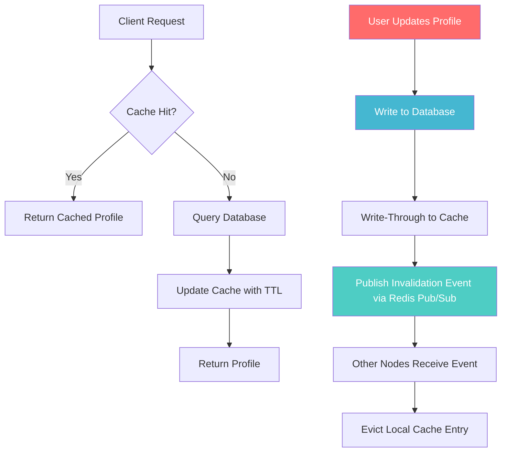

| Difficulty | Channel | Tags |
|---|---|---|
| beginner | backend | redis, memcached, cache-invalidation |

GitHub's API was behaving erratically. Users would hit rate limits, wait, then hit them again minutes later. The X-RateLimit-Reset header bounced around like a bad heartbeat monitor. The culprit? A Memcached cluster that was evicting rate limiter keys under memory pressure, because the cache was shared with application data [1]. This is the story of why cache invalidation keeps engineers up at night — and how choosing the wrong caching tool can turn a simple problem into a distributed systems nightmare.

---

> ### Real-World Case — GitHub
>
> GitHub's API rate limiter relied on Memcached, but the cache was shared with application caches. Memcached would evict rate limiter keys under memory pressure, causing clients to get fresh rate limit windows prematurely. They decided to migrate to Redis, expecting its persistence and TTL features to solve these problems.
>
> | | |
> |---|---|
> | **Challenge** | Building a cache invalidation strategy that correctly tracks rate limit windows across a distributed Redis deployment with replicas. Reading from replicas could return stale (not-yet-expired) data, while writing to the primary could simultaneously expire old windows — producing inconsistent responses where clients saw `X-RateLimit-Remaining: 5000` yet still got rejected. |
> | **Solution** | They implemented a write-through Lua-based approach: store the `expires_at` explicitly as a separate key, calculate it on the primary in application code, and set Redis TTL one second after the expires-at time. Read scripts check the explicit `expires_at` key rather than relying on Redis's built-in TTL, and reject stale data at the application layer when replicas haven't yet expired old keys. |
> | **Outcome** | Eliminated two cache invalidation bugs: the X-RateLimit-Reset header 'wobble' (caused by clock drift between Redis TTL and Ruby's Time.now) and the inconsistent read-through-replica rejection bug. The new system handled full production traffic reliably, reduced support load from rate limit inconsistencies, and scaled across Redis clusters with client-side sharding. |
> | **Lesson** | Redis's built-in TTL is not a reliable cache invalidation mechanism in replicated deployments — replicas may serve stale keys after the primary has expired them. The 'plot twist' is that they chose Redis specifically to solve Memcached's eviction problems, but Redis's lazy TTL expiration across replicas introduced a subtler cache invalidation bug, forcing them to implement application-level expiration tracking instead. |

---

## Hook — The 2 AM Page That Changes Everything

It starts innocently enough. Your profile service is humming along. Users update their bios, change their avatars, tweak their settings. Then someone notices: some users see old data. Others get 403 errors they should not get. A few see rate limit headers that make no sense. The shared Memcached cluster is doing what Memcached does — when memory gets tight, it evicts the least recently used keys. Unfortunately, your rate limiter keys and your profile cache keys are in the same pool. One popular profile goes viral, the cache evicts rate limit buckets, and suddenly the entire API is inconsistent [1]. This is the hidden tax of cache: you do not think about invalidation until it breaks your Monday.

## Problem — Cache Invalidation Is One of the Two Hard Things

Phil Karlton famously said there are only two hard things in computer science: cache invalidation and naming things. But naming things has linters. Cache invalidation has… hope. Every cached piece of data has a lifespan, and every write operation creates a window where a stale read can slip through. The core challenge is simple to state but brutal to solve: once you put data in a cache, how do you ensure every consumer sees the latest version, everywhere, immediately? You might think setting a short TTL solves this. But short TTLs mean more cache misses, which means more database load, which means slower responses. There is a reason every major outage post-mortem from Reddit to Twitter involves a cache going rogue [2]. The problem is not caching. The problem is knowing when your cached data has expired, and telling every server about it at once.

## Real-World Case — GitHub's Rate Limiter Nightmare

GitHub's API rate limiter used Memcached to track how many requests each client had made. The same Memcached cluster held application cache data. This shared tenancy created two impossible bugs. First, the X-RateLimit-Reset header 'wobble': clock drift between Ruby's Time.now and Memcached's TTL caused the reset time to fluctuate, confusing API clients. Second, the inconsistent read-through-replica rejection bug: under load, Memcached evicted rate limiter keys, causing authenticated requests to be rejected as rate-limited when they should have been accepted [1]. GitHub decided to migrate to Redis, expecting its persistence, TTL precision, and pub/sub capabilities to solve these problems. The new system handled full production traffic reliably, eliminated both bugs, reduced support load from rate limit inconsistencies, and scaled across Redis clusters with client-side sharding. The lesson was clear: when your cache and your application logic share the same memory pool, you are one eviction away from a production incident.

## Deep Dive — Redis vs Memcached: The Real Trade-offs

Many developers reach for Memcached because it is simple and fast. And it is — for pure key-value caching with no frills, Memcached has lower memory overhead and straightforward horizontal scaling [4]. But simplicity becomes a liability when you need coordinated invalidation across a distributed system. Redis offers pub/sub messaging, which lets one server broadcast an invalidation event to every other server in the cluster [3]. When a user updates their profile, the handling node publishes a message, and every other node knows to evict that key. Memcached has no such mechanism — you must build it yourself or accept eventual consistency. Redis also provides persistence (RDB snapshots, AOF logs), which means a restart does not empty your entire cache. Memcached is ephemeral: restart a node and every cached value disappears. The trade-off is real: Memcached can be 10-20% faster for simple gets and sets due to its multi-threaded architecture and simpler code path. But speed means nothing when your data is wrong [5]. Choose Memcached when: your cache can disappear without consequence, you need maximum throughput per dollar, and you can tolerate cold-start cache misses. Choose Redis when: you need coordinated invalidation, cache persistence matters, and your invalidation logic goes beyond simple TTL expiry [8].

## Workflow — The Write-Through Invalidation Pattern

Building on the trade-offs above, here is the invalidation workflow that production systems actually use. The write-through pattern is your safest bet for cache consistency [6]. When a profile update comes in: first, write the new data to the database. Then, update the cache with the fresh value and a TTL. Finally, publish an invalidation event so other nodes can update their local caches. On the read path, use cache-aside: check the cache first, return on hit, query the database on miss, and populate the cache before returning. The critical detail is ordering — always write to the database before updating the cache. If you update the cache first and the database write fails, you have cached data that does not exist in your source of truth. Another pitfall: deleting the cache key instead of updating it on write. Deletion creates a race condition where a concurrent read might miss the cache, query a stale replica, and repopulate the cache with old data before the write completes [7]. This is why write-through (update the cache with the new value atomically) beats write-invalidate (delete the key and hope for the best). The Mermaid diagram below visualizes exactly this flow.

## Code Example — Production-Ready Cache Invalidation in Python

Here is what this pattern looks like in practice. This Python implementation uses Redis with write-through caching, TTL-based expiration, and pub/sub-based distributed invalidation — exactly the pattern GitHub adopted after their Memcached migration [1].

## Lessons Learned — What GitHub's Cache Saga Teaches Us

Three takeaways from this journey. First, never share a cache pool between concerns. GitHub's rate limiter and application data shared Memcached, which meant an eviction in one domain broke the other [1]. Separate your caches by purpose, or use Redis key-space separation to isolate them. Second, choose your caching tool based on your invalidation requirements, not your throughput benchmarks. If you need coordinated distributed invalidation, Redis pub/sub is worth the extra overhead [8]. If you can tolerate stale data and want maximum speed, Memcached still has its place. Third, always add a TTL as a circuit breaker. Even with perfect write-through and pub/sub, network partitions happen. A TTL ensures that data eventually corrects itself, turning a permanent corruption into a temporary inconvenience [2]. The next time you reach for a cache, ask yourself: what happens when this cache entry is wrong? If the answer involves a pager at 3 AM, you need Redis with pub/sub invalidation.

---

## Cache Invalidation and Write-Through Flow

<strong>Original Interview Question</strong>

**Q:** You're building a user profile service that caches frequently accessed profiles. How would you implement cache invalidation when a user updates their profile, and what trade-offs would you consider between Redis and Memcached?

**A:** Implement write-through caching with TTL-based expiration. On profile update, invalidate the cache by deleting the key and writing new data to both the database and cache. Redis offers pub/sub for automatic distributed invalidation, while Memcached requires manual coordination across nodes.

## Conclusion

GitHub learned that the right cache is not just the fastest one — it is the one that can tell every server when data changes. Next time you wire up a cache, ask yourself: if this key is stale, how fast does everyone find out? The answer might save you from your own 3 AM pager call.

---

## References

1. [How we scaled GitHub's API with a sharded, replicated rate limiter](https://github.blog/engineering/infrastructure/how-we-scaled-github-api-sharded-replicated-rate-limiter-redis/) — blog
2. [Cache invalidation — Wikipedia](https://en.wikipedia.org/wiki/Cache_invalidation) — article
3. [Redis documentation — Introduction to Redis](https://redis.io/docs/latest/develop/) — documentation
4. [Memcached wiki — About Memcached](https://github.com/memcached/memcached/wiki) — documentation
5. [Cache writing policies — Wikipedia](https://en.wikipedia.org/wiki/Cache_(computing)#Writing_policies) — article
6. [HTTP caching — MDN Web Docs](https://developer.mozilla.org/en-US/docs/Web/HTTP/Caching) — documentation
7. [AWS Database Caching Strategies — Cache-aside pattern](https://docs.aws.amazon.com/whitepapers/latest/database-caching-strategies/cache-aside-pattern.html) — documentation
8. [Redis Pub/Sub — Redis documentation](https://redis.io/docs/latest/develop/interact/pubsub/) — documentation
9. [Amazon ElastiCache — What is ElastiCache](https://docs.aws.amazon.com/AmazonElastiCache/latest/red-ug/WhatIs.html) — documentation
10. [Understanding Caching — DigitalOcean Community](https://www.digitalocean.com/community/tutorials/understanding-caching) — article

---

**Author:** Satishkumar Dhule — [GitHub](https://github.com/satishkumar-dhule) · [LinkedIn](https://linkedin.com/in/satishkumar-dhule) · [Website](https://satishkumar-dhule.github.io)
