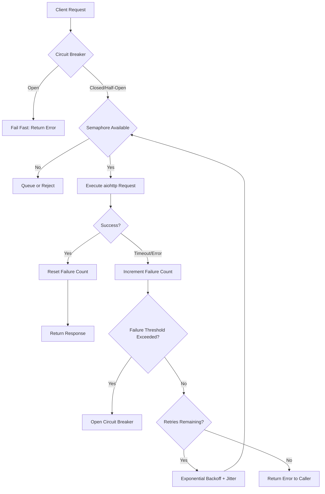

| Difficulty | Channel | Tags |
|---|---|---|
| advanced | backend | asyncio, aiohttp, concurrency |

Your entire streaming platform goes dark because a recommendation service is running 500ms slower than normal. This was the nightmare Netflix faced in 2011 — a single slow downstream service would exhaust all Tomcat request threads, making the entire API unresponsive and taking down the platform for millions of users [1]. That cascading failure led to Hystrix, a library that popularized the circuit breaker pattern and changed how developers think about fault tolerance. But the principles behind Hystrix apply far beyond Netflix's scale — every connection pool you manage has the same failure modes waiting to strike.

---

> ### Real-World Case — Netflix
>
> In 2011, Netflix's API team was battling cascading failures where a single slow downstream service would exhaust all Tomcat request threads, making the entire API unresponsive. A degraded dependency fetching recommendation data or user profiles could take down the entire streaming platform.
>
> | | |
> |---|---|
> | **Challenge** | Netflix's microservice architecture had hundreds of dependencies. Without isolation, one slow service would block threads waiting for responses, causing thread pool exhaustion that cascaded across services. A 30-second timeout on one dependency meant every thread touching it was stuck for 30s, quickly saturating the entire Tomcat thread pool. |
> | **Solution** | Created Hystrix, a resilience library implementing thread-pool isolation (bulkhead pattern per dependency), semaphore-based concurrency limiting, circuit breakers that trip at configurable error thresholds, execution timeouts per command, and fallback mechanisms for graceful degradation when dependencies fail. |
> | **Outcome** | Dramatic improvement in uptime and resilience across Netflix's platform. At peak, Hystrix handled tens of billions of thread-isolated and hundreds of billions of semaphore-isolated calls daily. The circuit breaker pattern became the industry standard for fault tolerance in distributed systems. |
> | **Lesson** | Resource isolation is the single most important pattern for preventing cascading failures — each dependency should have its own bounded thread pool or semaphore so a failing service can only exhaust its own allocation, not the entire application's. |

---

## Hook — When One Slow Service Takes Down Everything

It starts innocently enough. A developer on another team ships a change to the recommendation engine. Latency creeps up by 200ms — barely noticeable in isolation. But your API server has 200 Tomcat threads, and each one is now waiting on that slow endpoint. Within minutes, every thread is blocked. New requests pile up in the queue. Memory spikes. The liveness probe fails. Kubernetes restarts the pod. The new pod — still pointing at the same slow service — immediately blocks again. Meanwhile, every other endpoint that shares that thread pool (user profiles, search, billing) goes down too. This is the cascade failure pattern, and it has toppled systems far larger than yours.

## Problem — The Hidden Danger of Distributed Dependencies

Connection pools seem simple on the surface. You set a max size, you configure a timeout, and you move on. But a connection pool without guardrails is a landmine. Here is the uncomfortable truth: every pooled connection to a downstream service represents a lease on a thread in your application. If that downstream service slows down or stalls, that thread is held hostage. Enough hostage threads and your application stops responding entirely — not because your code crashed, but because it is collectively waiting. The core challenge is that connection pools optimize for the happy path. They assume services respond within a reasonable timeframe. When that assumption breaks — and it will — a naive pool becomes a failure amplifier rather than a resource manager. The math compounds: one slow endpoint × max pool size × request fan-out = application-wide outage.

## Real-World Case — Netflix's Cascade Failure Crisis

Netflix's API team discovered this the hard way. In 2011, their streaming platform was growing explosively, and the API surface had expanded to include dozens of downstream dependencies — recommendations, user profiles, ratings, billing, search — all fetched during a single request. A degradation in any one of these could, and did, cascade into a full platform outage [1]. The symptoms were predictable: latency would creep up, threads would exhaust, requests would queue, and the entire API would become unresponsive — even endpoints that had nothing to do with the failing dependency. Netflix's response was Hystrix, a resilience engineering library that introduced three critical patterns to the mainstream: the circuit breaker, the bulkhead (thread isolation), and graceful degradation through fallbacks. At peak usage, Hystrix handled tens of billions of thread-isolated calls and hundreds of billions of semaphore-isolated calls daily [1]. The impact was transformative — Netflix went from fragile monolith to a platform that could lose entire dependencies without users noticing. The circuit breaker pattern, once a niche concept in electrical engineering, became standard practice for every distributed system architect.

## Deep Dive — The Circuit Breaker, Semaphore, and Backoff Trinity

Three patterns work together to turn a naive connection pool into a resilient one. First, the semaphore acts as your admission controller — a hard limit on how many concurrent requests can enter the pool at once. Unlike a thread pool (which reserves threads), a semaphore is lightweight and asynchronous, making it ideal for asyncio-based systems. It prevents the stampede problem where thousands of requests pour in simultaneously. Second, the circuit breaker monitors failure rates and trips when a configurable threshold is crossed, immediately failing fast instead of waiting for yet another timeout. A closed circuit lets requests through normally. An open circuit rejects them instantly, saving resources. A half-open circuit allows a single probe request to test if the service has recovered [2]. The recovery time is another parameter you control. Third, exponential backoff with jitter handles transient failures by retrying with increasingly longer delays, preventing synchronized retry storms that can overwhelm a recovering service [5]. The magic is in how these three interact. The semaphore prevents overload. The circuit breaker detects systemic failure and bypasses the broken path entirely. Exponential backoff handles the temporary glitches that would otherwise nudge you toward the circuit breaker threshold. Together, they form a defense-in-depth strategy.

## Workflow — From Request to Resilient Response

The flow through a resilient connection pool follows a specific decision tree. When a request arrives, the circuit breaker state is checked first — if open, the request is rejected immediately (fail fast). If closed, the semaphore is acquired. Once the semaphore slot is granted, the aiohttp session executes the actual request with a configured timeout. On success, the circuit breaker failure count is reset. On timeout or error, the failure is recorded. If the failure count exceeds the threshold, the circuit breaker trips to open. If retries remain, exponential backoff delays before the next attempt. The diagram below traces this full lifecycle.

## Code Example — Building a Production-Grade Connection Pool

The following implementation combines all three patterns into a single ConnectionPoolManager class. The __init__ method configures a semaphore for concurrency control, a configurable timeout, and circuit breaker state tracking. The make_request method is the entry point: it acquires the semaphore, checks the circuit breaker, executes the request, and handles failures with exponential backoff retries. The _should_trip_circuit_breaker method returns true when failure count exceeds 5 within a 60-second window, which aligns with industry-standard tuning for circuit breakers [2]. The _exponential_backoff method calculates the sleep duration as 2^retry * base_delay with jitter to prevent thundering herd problems [5]. The circuit breaker state must be shared across all callers — in a distributed setting, this would use a distributed store like Redis or etcd.

## Lessons Learned — What Every Developer Should Take Away

Three lessons stand out after working through this pattern. First, timeouts are not optional — every connection to an external service must have a connect timeout, a read timeout, and a total timeout [3]. Second, connection leaks are the silent killer of long-running services. Every acquire must have a matching release, even on failure paths. Use context managers (async with) to guarantee cleanup. Third, monitoring is not an afterthought — expose circuit breaker state, pool utilization, and failure rates as metrics. Netflix's ability to tune Hystrix parameters depended entirely on granular observability [1]. The most common mistakes teams make are setting timeouts too generously, forgetting jitter in backoff calculations, and not testing failure scenarios in production-like conditions. Run chaos experiments. Break your dependencies intentionally. Verify your circuit breaker actually trips and recovers. The goal is not to prevent failures — failures are inevitable. The goal is to ensure your system survives them gracefully.

---

## Connection Pool Decision Flow with Circuit Breaker

<strong>Original Interview Question</strong>

**Q:** How would you implement a connection pool manager for aiohttp that handles graceful degradation under high load and connection timeouts?

**A:** Implement a connection pool manager for aiohttp using a semaphore to limit concurrent connections, exponential backoff for retrying failed requests, and circuit breaker pattern to gracefully degrade under high load and connection timeouts.

## Conclusion

The next time you reach over the network, ask yourself: what happens when this service stops responding? If the answer is "my application blocks," you have found a vulnerability. Start with explicit timeouts, add a semaphore for admission control, layer on exponential backoff with jitter for retries, and cap it with a circuit breaker that knows when to fail fast. Netflix learned this lesson at massive scale so you do not have to [1]. The patterns are proven, the implementations are straightforward, and the cost of not using them is your next outage.

---

## References

1. [Introducing Hystrix for Resilience Engineering](https://netflixtechblog.com/introducing-hystrix-for-resilience-engineering-13531c1ab362) — blog
2. [Circuit Breaker Design Pattern](https://en.wikipedia.org/wiki/Circuit_breaker_design_pattern) — documentation
3. [aiohttp Client Usage — Timeouts and Session Management](https://docs.aiohttp.org/en/stable/client_advanced.html) — documentation
4. [Python asyncio — Coroutines and Tasks](https://docs.python.org/3/library/asyncio.html) — documentation
5. [Exponential Backoff and Jitter — AWS Fault-Tolerant Applications](https://docs.aws.amazon.com/whitepapers/latest/aws-building-fault-tolerant-applications/exponential-backoff-and-jitter.html) — documentation
6. [Bulkhead Pattern — Wikipedia](https://en.wikipedia.org/wiki/Bulkhead_pattern) — documentation
7. [Graceful Degradation in Distributed Systems](https://en.wikipedia.org/wiki/Graceful_degradation) — documentation
8. [asyncio Synchronization Primitives — Semaphore](https://docs.python.org/3/library/asyncio-sync.html) — documentation
9. [RFC 7230 — HTTP/1.1 Message Syntax and Routing (Connection Management)](https://datatracker.ietf.org/doc/html/rfc7230) — documentation

---

**Author:** Satishkumar Dhule — [GitHub](https://github.com/satishkumar-dhule) · [LinkedIn](https://linkedin.com/in/satishkumar-dhule) · [Website](https://satishkumar-dhule.github.io)
