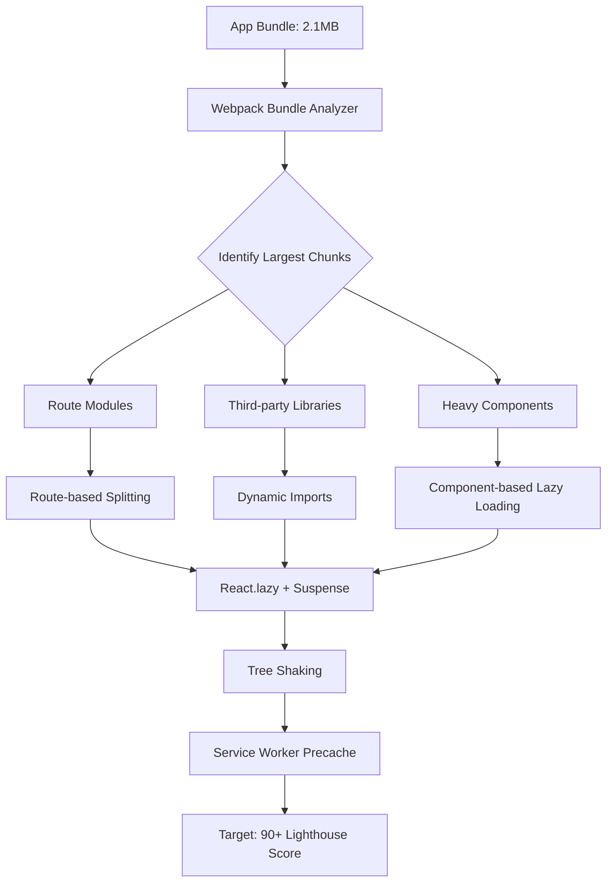

| Difficulty | Channel | Tags |
|---|---|---|
| intermediate | frontend | lighthouse, bundle, lazy-loading |

In 2017, Twitter faced a crisis that sounds all too familiar: their React single-page app had ballooned into a monolithic 1MB+ bundle spread across just three JavaScript files. With over 80% of users on mobile and a massive audience in growth markets connecting over 2G and 3G networks, every kilobyte mattered. Initial load times exceeded five seconds on 3G, and users were abandoning the platform in droves [1]. The engineering team knew they had to do something drastic — and what they discovered would become a blueprint for React performance optimization that teams still follow today.

---

> ### Real-World Case — Twitter (X)
>
> With over 80% of users on mobile and a huge audience in growth markets on 2G/3G networks, Twitter needed their React web app to be fast, lightweight, and reliable. Their SPA had ballooned to a monolithic 1MB+ bundle across just 3 JS files, taking over 5 seconds to load on 3G — and users were abandoning it.
>
> | | |
> |---|---|
> | **Challenge** | Massive initial JavaScript bundle (1MB+, 420KB gzipped) caused 5+ second load times on 3G. The team had only 3 JS asset files due to circular dependency issues with Webpack's CommonsChunkPlugin, making it impossible to defer non-critical code. Every page paid for features users never visited. |
> | **Solution** | Implemented route-based code splitting via Webpack's CommonsChunkPlugin, breaking the app into ~40 on-demand chunks loaded only when needed. Applied the PRPL pattern (Push, Render, Pre-cache, Lazy-load) with a service worker that pre-cached views, feed updates, and the app shell. Added React optimizations: shouldComponentUpdate to stop unnecessary re-renders (saving ~0.1s per interaction), deferComponentRender HOC to delay expensive component rendering by 2 animation frames, and replaced dangerouslySetInnerHTML SVG icons with JSX components (cutting mount time by 60%). Delayed service worker registration until after critical API/CSS/image requests to avoid blocking the browser's concurrent request limit. |
> | **Outcome** | Initial load dropped from 5s to ~3s on 3G (40% faster). Repeat visits via service worker caching fell to ~1.5s (75% improvement). 50% reduction in 99th percentile time-to-interactive latency. 30% reduction in average load time for logged-in users. Business impact: 65% increase in pages per session, 75% increase in tweets sent, significant reduction in data usage. |
> | **Lesson** | Spreading your app across MORE chunks (~40) is counterintuitively faster than serving a monolithic bundle — you trade initial payload for on-demand delivery amortized across the session. The real plot twist: service worker registration itself can block critical resources, so delaying it actually improves performance. Incremental, composable wins (code splitting, rendering optimization, caching, asset optimization) compound into dramatic improvements. |

---

## Hook — The Moment Every Frontend Team Dreads

You've just received the ticket: "Improve Lighthouse score from 65 to 90+." The bundle is 2.1MB. Time to Interactive is 4.2 seconds. Your CEO is asking why the competitor loads in under two seconds. The pressure is real because performance directly impacts the bottom line — a one-second delay in mobile page load can reduce conversions by up to 20% [5]. This is the moment that separates teams who guess from teams who systematically optimize. Twitter was in this exact position, and their response became legendary.

## Problem — The Silent Bloat Epidemic

Modern SPAs make it dangerously easy to ship too much code. Add a charting library here, a date picker there, and before you know it your entire application graph is bundled into a single monolithic JavaScript payload. The core issue is that every route includes code for routes the user hasn't visited yet. Every component import pulls in dependencies the current page doesn't need. This pattern leads directly to poor Time to Interactive, high First Input Delay, and a Lighthouse score stuck in the 60s [4]. The tragedy is that most teams don't even notice the bloat until performance budgets start bleeding red.

## Real-World Case — Twitter Lite: Performance at Scale

Twitter's engineering team, led by Paul Armstrong, set out to rebuild their mobile web experience from the ground up. They adopted the PRPL pattern (Push, Render, Pre-cache, Lazy-load) to architect a service worker-first application [10]. The results were staggering: initial load dropped from five seconds to approximately three seconds on 3G — a 40% improvement. Repeat visits via service worker caching fell to roughly 1.5 seconds, a 75% gain over cold starts. The 99th percentile time-to-interactive latency was slashed by 50%, and average load time for logged-in users dropped 30% [1]. Business impact followed: a 65% increase in pages per session, a 75% increase in tweets sent, and significant data usage reduction for users on limited plans. The key insight? Twitter didn't just optimize their bundle — they fundamentally changed how their app loaded.

## Deep Dive — The Three Pillars of Bundle Optimization

Twitter's success came from attacking the problem from three angles simultaneously. First, bundle analysis: tools like webpack-bundle-analyzer visualize the composition of your output bundles, revealing hidden monsters — the 200KB date library you imported for one function, the charting library dragged in by a rarely-used dashboard [3]. Second, code splitting: you can split at the route level (every page gets its own chunk) or at the component level (heavy components like editors, charts, and data grids load on demand). Route splitting is the biggest win for most applications, typically reducing initial payload by 50-70% [2]. Component splitting shines for interactive elements that most users never see — think settings panels, analytics dashboards, or rich text editors. Third, tree shaking: proper ES module configuration ensures your bundler can statically analyze imports and eliminate dead code [6]. A common mistake is enabling tree shaking but leaving CommonJS transforms active, which defeats the entire optimization.

## Workflow — From Audit to Production: A Step-by-Step Pipeline

The optimization workflow follows a clear pipeline: Start with a performance audit using Lighthouse to establish a baseline. Run webpack-bundle-analyzer to visualize your bundle composition — this single step often reveals the highest-impact opportunities [3]. Prioritize route-based code splitting first, as it provides the largest initial payload reduction with the least refactoring cost. Implement React.lazy() with Suspense boundaries for each top-level route [2]. Then identify heavy third-party libraries and convert their imports to dynamic import() calls triggered by user interaction [9]. Configure your bundler for aggressive tree shaking by ensuring all dependencies ship ES modules. Finally, implement a service worker with a caching strategy that pre-caches your app shell and critical route chunks for near-instantaneous repeat visits [7]. The diagram below visualizes this entire pipeline as an interconnected flow.

## Code Example — Implementing the Full Optimization Pipeline

Here is a production-grade implementation that combines route splitting, component-level lazy loading, error boundaries, and service worker caching into a single cohesive strategy. Each piece addresses a specific bottleneck identified during the audit phase.

## Lessons Learned — What Twitter Taught the Frontend World

Three enduring lessons emerged from this work. First, measurement before optimization: every decision should be driven by bundle analysis and performance audits, not intuition. Teams that skip this step often optimize the wrong things, spending days shrinking a 5KB component while a 200KB library sits untouched [3]. Second, lazy loading is not a one-time task — it is a discipline that must be enforced through performance budgets and CI gates. Services like Lighthouse CI can fail builds when bundle size exceeds thresholds, preventing regression before it reaches production [5]. Third, the service worker is your most powerful performance tool. Twitter's 75% improvement on repeat visits came not from smaller bundles but from intelligent caching that eliminated network requests entirely [1]. The counterintuitive insight: optimizing for the initial load is important, but optimizing for every subsequent load is where real user experience gains live.

---

## Performance Optimization Pipeline

<strong>Original Interview Question</strong>

**Q:** You're tasked with improving a React app's Lighthouse performance score from 65 to 90+. The bundle size is 2.1MB and Time to Interactive is 4.2s. What specific steps would you take to optimize the bundle and implement lazy loading?

**A:** Implement code splitting with React.lazy() and Suspense, analyze bundle composition with webpack-bundle-analyzer to identify largest chunks, remove unused dependencies and optimize imports, add dynamic imports for heavy components and third-party libraries, implement route-based splitting for better initial load times, and utilize tree shaking with proper ES module configuration.

## Conclusion

Twitter's story proves that dramatic performance improvements are possible when you approach optimization systematically: measure first, split strategically, cache aggressively. The same playbook that took Twitter from a 5-second load to under 1.5 seconds on repeat visits can take your app from a 65 Lighthouse score to 90+. Start with a bundle analysis today — the results might surprise you. The single most actionable step you can take right now is to run webpack-bundle-analyzer against your production build, identify your top three largest dependencies, and convert them to dynamic imports. Everything else flows from that first insight.

---

## References

1. [Twitter Lite and High Performance React Progressive Web Apps at Scale](https://paularmstrong.dev/blog/2017/04/11/twitter-lite-and-high-performance-react-progressive-web-apps-at-scale/) — blog
2. [React.lazy API Reference](https://react.dev/reference/react/lazy) — documentation
3. [webpack-bundle-analyzer GitHub Repository](https://github.com/webpack-contrib/webpack-bundle-analyzer) — documentation
4. [Code Splitting — MDN Web Docs Glossary](https://developer.mozilla.org/en-US/docs/Glossary/Code_splitting) — documentation
5. [Lighthouse Performance Scoring — Chrome Developer Docs](https://developer.chrome.com/docs/lighthouse/performance/) — documentation
6. [Tree Shaking — Webpack Documentation](https://webpack.js.org/guides/tree-shaking/) — documentation
7. [Using Service Workers — MDN Web Docs](https://developer.mozilla.org/en-US/docs/Web/API/Service_Worker_API/Using_Service_Workers) — documentation
8. [Suspense API Reference](https://react.dev/reference/react/Suspense) — documentation
9. [Dynamic Import — MDN Web Docs](https://developer.mozilla.org/en-US/docs/Web/JavaScript/Reference/Operators/import) — documentation
10. [The PRPL Pattern — web.dev](https://web.dev/articles/prpl-pattern) — documentation

---

**Author:** Satishkumar Dhule — [GitHub](https://github.com/satishkumar-dhule) · [LinkedIn](https://linkedin.com/in/satishkumar-dhule) · [Website](https://satishkumar-dhule.github.io)
