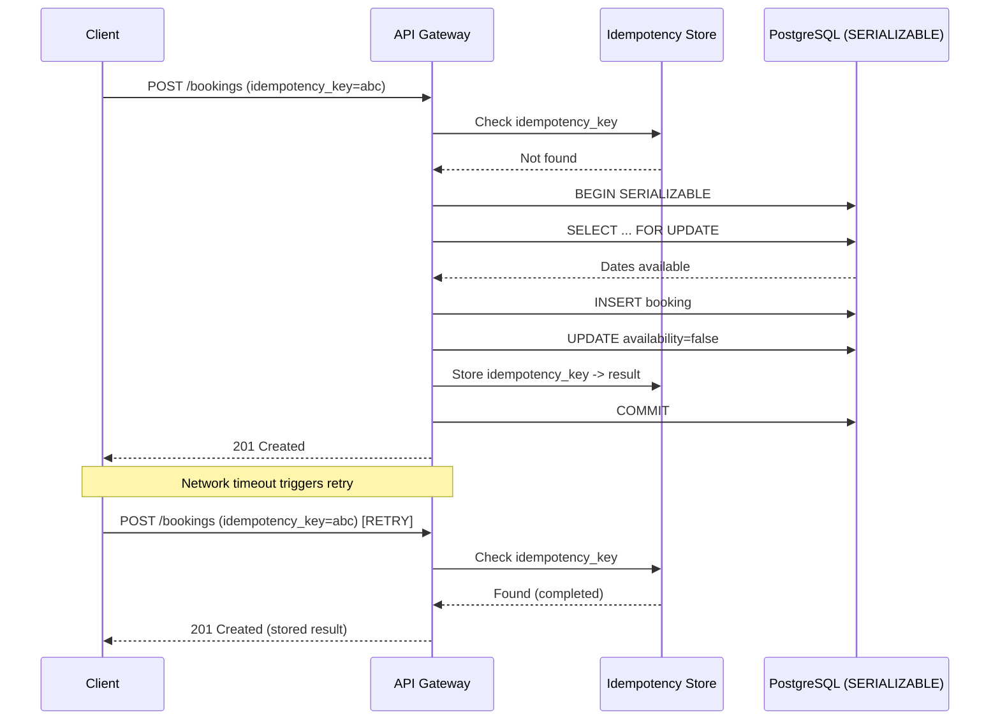

| Difficulty | Channel | Tags |
|---|---|---|
| intermediate | database | acid, isolation-levels, mvcc |

A network timeout. A client retry. Two charges on the same credit card. At Stripe's scale—billions of API calls daily—this exact race condition was a ticking time bomb [1]. Every concurrent system faces the same fundamental challenge: when two operations arrive simultaneously, how do you ensure only one goes through? The answer is a pattern so elegant that it now protects PayPal, Square, and countless booking platforms. And it starts with a single token.

---

> ### Real-World Case — Stripe
>
> Stripe's payment API processes billions of API calls daily. When a network timeout causes a client to retry a charge request, the system could process the payment twice — double-charging the customer. This is the exact same race condition as double-booking: two concurrent requests both seeing 'no record yet' and both proceeding to create a charge.
>
> | | |
> |---|---|
> | **Challenge** | How to guarantee exactly-once processing of payment requests when network failures cause clients to retry. A naive 'check if already processed, then insert' approach fails because two concurrent retries can both pass the check before either inserts a record — the classic check-then-act race condition identical to double-booking. |
> | **Solution** | Stripe uses idempotency keys stored in PostgreSQL with SERIALIZABLE transaction isolation. The atomic upsert of the idempotency key is wrapped in a SERIALIZABLE transaction — if two concurrent requests try to claim the same key, PostgreSQL's SSI (Serializable Snapshot Isolation) detects the write-skew anomaly and aborts one transaction with a serialization failure. The winning transaction proceeds, the loser gets a 409 and must retry. Completed responses are cached so subsequent retries return the stored result without reprocessing. |
> | **Outcome** | Eliminated double-charge incidents at Stripe's scale (billions of API requests). The pattern became the industry standard — adopted by PayPal, Square, and countless other payment platforms. Stripe's own SDKs (Ruby, Python, etc.) now automatically retry failed requests with the original idempotency key using exponential backoff, making the safety guarantee transparent to developers. |
> | **Lesson** | Application-level deduplication ('check if exists, then insert') is insufficient under concurrent retries — two threads can both see 'empty' and both proceed. You need database-level guarantees: SERIALIZABLE isolation combined with a unique constraint on the idempotency key ensures exactly one concurrent request wins. This pattern applies directly to any concurrent reservation system: the idempotency key is your booking request ID, the unique constraint is your (listing_id, date) constraint, and SERIALIZABLE isolation prevents the race condition that causes double-bookings. |

---

## Hook — The 50ms Nightmare

It happens more often than you think. A user clicks 'Book Now' — the payment processes, the confirmation page spins, and then nothing. They click again. Now two bookings exist for the same property. Two charges on the card. One very angry customer. This isn't a hypothetical scenario. Companies lose millions annually to this exact race condition. The core problem is deceptively simple: two requests arrive at the same time, both check the database, both see 'available,' and both proceed. The gap between the check and the write — that tiny window — is where chaos lives.

## Problem — The Read-Then-Write Trap

Every double-booking, double-charge, or double-spend bug traces back to the same anti-pattern: a read followed by a write where the read's result could be stale by the time the write executes. This is called a **time-of-check to time-of-use (TOCTOU) race condition**. In database terms, it surfaces as write skew, phantom reads, and lost updates. For an Airbnb host trying to book a date range, or a Stripe customer charging a card, the sequence looks identical: check availability, then reserve. Traditional row-level locks don't fully protect against phantom reads — new rows appearing between your SELECT and your INSERT [3]. Standard `READ COMMITTED` isolation lets you down exactly when you need protection most.

## Real-World Case — Stripe's Idempotency Revolution

Before 2017, Stripe faced a brutal challenge. Payment API calls could fail at any point: the request could reach Stripe but the response never made it back. The client, seeing a timeout, would retry. Stripe would see two identical requests — and potentially charge the customer twice. Stripe's solution was **idempotency keys**: a unique token sent with every mutating API request [1]. If Stripe receives a request with a key it has already processed, it returns the stored result instead of executing again. This pattern became the industry standard. Stripe's official SDKs now embed automatic retries with idempotency keys and exponential backoff. Developers get safe retries without writing a single line of coordination logic. The same design now protects PayPal's payment API, Square's checkout flow, and countless booking systems worldwide.

## Deep Dive — SERIALIZABLE Isolation and the Weapons You Need

Here is where theory meets practice. You cannot solve the double-booking problem with application-level locks alone — distributed systems make distributed coordination inevitable. The proven approach combines three layers: **SERIALIZABLE transaction isolation**, **row-level locking**, and **idempotency keys**. SERIALIZABLE isolation guarantees that concurrent transactions produce the same result as if they ran one after another [2]. PostgreSQL implements this via Serializable Snapshot Isolation (SSI), which detects serialization anomalies and aborts conflicting transactions. Combined with `SELECT FOR UPDATE` on the availability rows, it eliminates the TOCTOU window entirely. The catch? SERIALIZABLE transactions have higher abort rates under contention [3]. This is where **optimistic concurrency control** shines: you assume conflicts are rare, retry on failures, and win on throughput. Read replicas handle availability checks without locking, and write-through caching keeps hot-property data fast. The tradeoff is that you need retry logic — and that retry logic needs idempotency to be safe [7].

## Code Example — Building a Bulletproof Booking Engine

```python
import psycopg2
from psycopg2.extras import RealDictCursor
from contextlib import contextmanager
import time
import json

class BookingSystem:
    """
    A booking engine that prevents double-bookings using:
    - SERIALIZABLE isolation for write-skew protection [2]
    - Idempotency keys for safe retries [1]
    - Exponential backoff for graceful contention handling [7]
    """

    def __init__(self, conn_string):
        self.conn_string = conn_string

    @contextmanager
    def _serializable_transaction(self):
        conn = psycopg2.connect(self.conn_string)
        try:
            conn.set_session(isolation_level='SERIALIZABLE')
            yield conn
            conn.commit()
        except psycopg2.errors.SerializationFailure:
            conn.rollback()
            raise
        finally:
            conn.close()

    def book_property(self, property_id, guest_id, check_in, check_out,
                      idempotency_key, max_retries=3):
        for attempt in range(max_retries):
            try:
                return self._try_book(
                    property_id, guest_id, check_in, check_out,
                    idempotency_key
                )
            except psycopg2.errors.SerializationFailure:
                if attempt == max_retries - 1:
                    raise
                time.sleep(0.1 * (2 ** attempt))

    def _try_book(self, property_id, guest_id, check_in, check_out,
                  idempotency_key):
        with self._serializable_transaction() as conn:
            cur = conn.cursor(cursor_factory=RealDictCursor)

            # Step 1: Idempotency check — already handled?
            cur.execute(
                "SELECT result FROM booking_operations "
                "WHERE idempotency_key = %s FOR UPDATE",
                (idempotency_key,)
            )
            existing = cur.fetchone()
            if existing:
                return existing['result']

            # Step 2: Lock the date range (prevents phantom reads)
            cur.execute("""
                SELECT date FROM availability
                WHERE property_id = %s
                  AND date BETWEEN %s AND %s
                  AND is_available = true
                FOR UPDATE
            """, (property_id, check_in, check_out))

            available = cur.fetchall()
            if len(available) == 0:
                raise BookingError("No availability for this date range")

            # Step 3: Atomic booking + availability update
            cur.execute("""
                INSERT INTO bookings
                    (property_id, guest_id, check_in, check_out, status)
                VALUES (%s, %s, %s, %s, 'confirmed')
                RETURNING id
            """, (property_id, guest_id, check_in, check_out))
            booking_id = cur.fetchone()['id']

            cur.execute("""
                UPDATE availability SET is_available = false
                WHERE property_id = %s AND date BETWEEN %s AND %s
            """, (property_id, check_in, check_out))

            # Step 4: Persist idempotency key for future retries
            result = {'booking_id': booking_id, 'status': 'confirmed'}
            cur.execute("""
                INSERT INTO booking_operations
                    (idempotency_key, status, result)
                VALUES (%s, 'completed', %s)
            """, (idempotency_key, json.dumps(result)))

            return result
```

The code walks through four stages. First, it checks the idempotency store — if this key was already processed, the stored result returns immediately with no database side effects. Second, it locks the relevant availability rows with `FOR UPDATE` under a SERIALIZABLE transaction; any concurrent transaction attempting to book overlapping dates will block or abort. Third, it atomically creates the booking and marks dates unavailable within the same transaction. Finally, it persists the idempotency key so that any retry (even weeks later) gets the exact same response [6]. If a serialization conflict occurs, the retry loop applies exponential backoff: 100ms, then 200ms, then 400ms — giving contention time to resolve.

## Lessons Learned — Patterns That Scale

Three patterns emerge from the battle against double-bookings — and they apply far beyond payments and reservations. **First, embrace idempotency as a first-class API contract.** Any mutating endpoint should accept an idempotency key [1]. Stripe proved that this single convention eliminates entire categories of bugs. **Second, use the right isolation level for the critical path.** SERIALIZABLE transactions have a reputation for being slow, but with optimistic retry logic and short-lived transactions, they handle 99.9% of booking scenarios without issue [2]. **Third, design for the retry.** If your system assumes every request arrives exactly once, it will break the moment a client times out. Assume retries will happen. Make them safe by design. The next time you build a booking flow, a payment integration, or any resource-allocation system, ask yourself: what happens if this request arrives twice? If the answer isn't "exactly-once execution," you have a race condition waiting to happen.

---

## Idempotent Booking Request Flow



<details>
<summary><strong>Original Interview Question</strong></summary>

**Q:** You're building a booking system for Airbnb where multiple users can reserve the same property simultaneously. How would you design the transaction handling to prevent double bookings while maintaining high availability?

**A:** Use SERIALIZABLE isolation with optimistic concurrency control. Implement row-level locks on property availability tables, use MVCC snapshot reads for checking availability, and apply application-level validation to ensure atomic booking operations.

</details>

## Conclusion

Double-booking isn't a database problem — it's a design problem. Stripe proved that with idempotency keys, SERIALIZABLE isolation, and exponential backoff, you can build systems that handle retries safely and scale confidently. The next time you design a resource-allocation endpoint, ask yourself one question: 'What happens if this request arrives twice?' If the answer isn't 'exactly the same thing,' you have work to do. Add an idempotency key to your API contract today — it is the single highest-leverage change you can make for data integrity in distributed systems.

---

## References

1. [Stripe: Designing Resilient APIs with Idempotency](https://stripe.com/blog/idempotency) — blog
2. [PostgreSQL Documentation: Serializable Isolation Level](https://www.postgresql.org/docs/current/transaction-iso.html) — documentation
3. [Wikipedia: Isolation (Database Systems)](https://en.wikipedia.org/wiki/Isolation_(database_systems)) — documentation
4. [Wikipedia: Multiversion Concurrency Control](https://en.wikipedia.org/wiki/Multiversion_concurrency_control) — documentation
5. [Wikipedia: Optimistic Concurrency Control](https://en.wikipedia.org/wiki/Optimistic_concurrency_control) — documentation
6. [Wikipedia: Idempotence](https://en.wikipedia.org/wiki/Idempotence) — documentation
7. [AWS Whitepapers: Retry Logic for Resilient Systems](https://docs.aws.amazon.com/whitepapers/latest/real-time-communication/retry-logic.html) — documentation
8. [MDN Web Docs: Idempotent HTTP Methods](https://developer.mozilla.org/en-US/docs/Glossary/Idempotent) — documentation
9. [PostgreSQL Documentation: Explicit Locking (SELECT FOR UPDATE)](https://www.postgresql.org/docs/current/explicit-locking.html) — documentation

---

**Author:** Satishkumar Dhule — [GitHub](https://github.com/satishkumar-dhule) · [LinkedIn](https://linkedin.com/in/satishkumar-dhule) · [Website](https://satishkumar-dhule.github.io)
