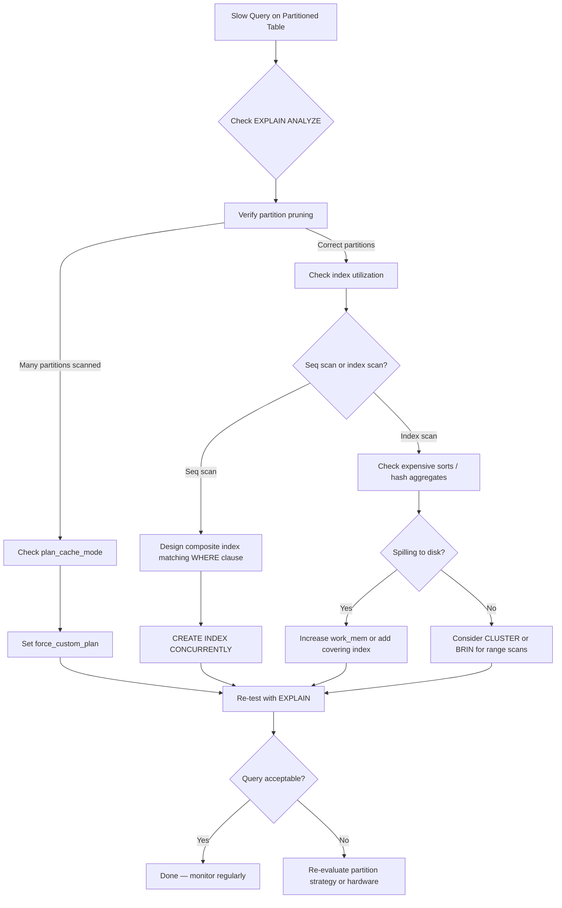

| Difficulty | Channel | Tags |
|---|---|---|
| intermediate | database | explain, query-plan, partitioning |

Prefect Cloud's PostgreSQL database was doubling traffic every two months, and their fastest-growing table hit 400 million rows — projected to reach one billion. They vertically scaled, they partitioned by date, and yet memory remained critically high. Their database kept crashing with out-of-memory errors. The fix was not more hardware. It was a single configuration change that freed nearly 100GB of memory [1]. Here is the story of what they found and how you can avoid the same trap.

---

> ### Real-World Case — Prefect
>
> Prefect Cloud was doubling traffic every 2 months, and their fastest-growing PostgreSQL table hit 400M rows (projected 1B). They vertically scaled their CloudSQL instance and partitioned tables by date to get ahead of performance issues. Instead, memory remained critically high and the database suffered repeated OOM restarts.
>
> | | |
> |---|---|
> | **Challenge** | After partitioning date-range tables on Postgres 14, query performance didn't improve and the database kept running out of memory at 90% utilization, causing production outages. They needed to understand why partitioning wasn't helping and why memory was ballooning. |
> | **Solution** | The root cause was that SQLAlchemy's asyncpg driver prepared every statement, and after 5 executions Postgres switched to a 'generic plan' that bypassed partition pruning entirely — causing every query to scan all partitions. Accidentally, OpenTelemetry trace comments (added as SQL comments) had been acting as cache-busters because the generic plan cache was keyed on raw query text. When they fixed a tracing bug that removed those comments, memory spiked again. The real fix was setting `plan_cache_mode=force_custom_plan` to prevent generic plans for partitioned table queries. |
> | **Outcome** | Memory usage dropped immediately and dramatically after enabling `plan_cache_mode=force_custom_plan`. The database stopped OOM-restarting. API latency improved to its healthiest state in weeks. They were able to scale services back up with almost no effect on memory, freeing nearly 100GB of previously consumed memory. |
> | **Lesson** | Prepared statements and partitioned tables interact dangerously: generic query plans ignore partition pruning, causing every query to scan all partitions. The EXPLAIN plan would show all partitions under the Append node (zero pruning) even though the query filtered on the partition key. Always verify partition pruning in EXPLAIN plans when using connection poolers or ORMs that use prepared statements, and consider `plan_cache_mode=force_custom_plan` for workloads over partitioned tables. |

---

## Hook — The Database That Kept Dying No Matter How Much Memory You Gave It

Imagine this: you are on call at 2 AM. Your pager lights up — the primary database is down. Again. This is the third time this week. Your team has already vertically scaled the instance twice, added more RAM, partitioned the largest tables by date. Everyone said partitioning fixes slow queries. But here you are, staring at an OOM killer message, watching PostgreSQL crash and restart while your users send increasingly angry messages to support. This was the reality for Prefect Cloud [1]. Their PostgreSQL instance was consuming all available memory despite having partitioned tables and scaled-up hardware. The conventional wisdom said partitioning = faster queries. Nobody told them partitioning could actually make things worse.

## Problem — Why Partitioning Alone is Not Enough

Partitioning is one of those features that sounds like magic. Split a massive table into smaller chunks, and queries that filter by the partition key automatically scan only the relevant partitions. This is called *partition pruning*, and when it works, it is beautiful [2]. But here is the uncomfortable truth many developers discover the hard way: partitioning optimizes *data management*, not necessarily *query performance*. A 400-million-row table split into monthly partitions still has partitions with tens of millions of rows. If your query scans an entire partition sequentially, you still lose. The real performance killers are hiding in areas developers often overlook: adapter plan caching, index design mismatched to query patterns, and physical data ordering that defeats range scans. Each of these can silently sabotage your performance, and diagnosing them requires reading execution plans with a surgeon's precision [3].

## Real-World Case — Prefect Cloud

Prefect Cloud runs on PostgreSQL, and their usage was growing explosively — traffic doubling every two months. Their largest table, `task_run`, had grown to 400 million rows and was projected to hit one billion within months [1]. They did what any reasonable team would do: they vertically scaled their CloudSQL instance and implemented date-based partitioning to stay ahead of performance degradation. But the results were counterintuitive. Memory remained critically high. The database suffered repeated OOM (out-of-memory) restarts. API latency climbed. Their team was fighting fires daily. After extensive debugging, they discovered the root cause: PostgreSQL's generic plan cache. When using prepared statements (common in ORMs like SQLAlchemy), PostgreSQL caches query plans. For partitioned tables with many partitions, the generic plan pre-allocates memory for every partition — even pruned ones. Their 500+ partition table was causing the planner to allocate memory for all partitions on every query. The fix? `plan_cache_mode = force_custom_plan`. This setting tells PostgreSQL to generate a fresh plan for each query execution, which correctly prunes partitions and only allocates memory for relevant ones. Memory usage dropped immediately and dramatically. The database stopped OOM-restarting. API latency improved to its healthiest state in weeks. They were able to scale services back up with almost no effect on memory, freeing nearly 100GB of previously consumed memory [1].

## Deep Dive — Reading Execution Plans Like a Detective

Prefect's story reveals a deeper lesson: you cannot optimize what you cannot measure. The EXPLAIN command is your primary diagnostic tool, but most developers only skim the first few lines. A thorough EXPLAIN analysis has three layers [3]. First, verify partition pruning. Look for `Seq Scan on ` lines — each one represents a partition being scanned. If you see all 500 partitions listed, pruning is not working. The fix might involve your WHERE clause structure, the partition key itself, or (as in Prefect's case) the query plan cache. Second, examine index utilization. The planner's choice between a sequential scan and an index scan depends on statistics, query selectivity, and index design [4]. A common mistake is creating an index on the partition key alone when queries filter on *additional columns*. This forces PostgreSQL to scan the index and then filter rows — or worse, fall back to a sequential scan if the planner decides the index is not selective enough. Third, look for expensive operations. `Sort` and `HashAggregate` nodes are notorious memory hogs. When the planner needs to sort millions of rows, it either uses `work_mem` (in memory) or spills to disk. A sort operation spilling to disk is often the single biggest performance bottleneck you can fix with a well-designed composite index [5]. The counterintuitive insight? Sometimes the best index for a partitioned table does not include the partition key at all. If partition pruning already narrows your search to a single partition, an index on `(status, created_at)` within that partition may outperform an index on `(event_date, status)` — because the partition key is already implicit in the data you are scanning.

## Workflow — The Step-by-Step Query Optimization Process

Here is a repeatable workflow for optimizing slow queries on partitioned tables. First, capture a baseline with `EXPLAIN (ANALYZE, BUFFERS, TIMING)` — this gives you actual execution time, buffer hit rates, and row counts. Compare `actual rows` to `estimated rows`; large discrepancies suggest stale statistics [3]. Second, verify partition pruning by checking how many partitions appear in the plan. If you see more partitions than expected, investigate your WHERE clause or consider `plan_cache_mode = force_custom_plan` for prepared statement workloads [1]. Third, assess index design. Does your composite index match the query predicate order? PostgreSQL can use a multi-column index efficiently only when leading columns match the query conditions [4]. Fourth, consider physical data ordering. For range-heavy workloads, `CLUSTER` rewrites the table in index order, dramatically improving locality for range scans [6]. But beware — `CLUSTER` is a one-time operation and locks the table. For append-heavy tables like event logs, a BRIN index (Block Range INdex) can be a game-changer, using far less storage than a B-tree while delivering comparable performance for range queries [7]. The diagram below visualizes this decision tree.

## Code Example — From Slow Query to Production-Ready Optimization

Let us walk through a concrete example. Assume an `events` table with 100 million rows, partitioned by `event_date`, and your team is frustrated by a query that filters on a specific date range and status. The steps below show exactly how to diagnose and fix it. The first query with `EXPLAIN (ANALYZE, BUFFERS)` reveals the truth. You might see a sequential scan on one partition scanning millions of rows, or you might see an index scan followed by an expensive sort. The answer determines your next move. If pruning is not working, the `plan_cache_mode` fix is your first stop — this single setting solved Prefect's multi-hundred-GB memory crisis [1]. If pruning works but the query is still slow, the composite index is likely your answer [4]. And if you are running frequent range scans on ordered data, `CLUSTER` or a BRIN index can provide the final performance boost [6][7].

## Lessons Learned — What to Do Differently Tomorrow

If there is one takeaway from Prefect's incident and the deeper patterns of query optimization, it is this: *measure before you optimize*. Partitioning is a powerful tool, but it introduces new failure modes that generic plans and naive indexing can silently trigger [1][2]. Start every optimization session with `EXPLAIN (ANALYZE, BUFFERS)` — it tells you what actually happened, not what you think happened. Design composite indexes around your query WHERE clauses, not your table schema. And never assume that more hardware fixes a software problem — Prefect nearly doubled their memory before finding a configuration flag that did the job for free. Finally, share execution plans with your team. The PostgreSQL community has built excellent tools like `explain.depesz.com` and `explain.dalibo.com` that visualize plans and surface red flags. Make reading execution plans a team sport, not a solo debugging ritual [8]. The next time a query is slow on a partitioned table, you will know exactly where to look — and you might save your team from a 2 AM pager call.

---

## Query Optimization Decision Flow

<strong>Original Interview Question</strong>

**Q:** You have a PostgreSQL table with 100M rows partitioned by date. A query filtering on a specific date range is still slow. What would you check in the EXPLAIN plan and how would you optimize it?

**A:** Check partition pruning effectiveness, index utilization patterns, and expensive sort operations. Create composite indexes on (date, filtered_columns) and evaluate clustering strategies for optimal data access.

## Conclusion

The next time your partitioned table is slow, do not reach for the vertical scaling button. Reach for EXPLAIN. Verify pruning. Check plan caching. Design indexes around your queries, not your schema. And remember: Prefect freed 100GB of memory with a single configuration change. Your biggest performance win might not be more hardware — it might be understanding what is really happening inside your database.

---

## References

1. [Prefect incident report — More Memory, More Problems](https://www.prefect.io/blog/more-memory-more-problems) — blog
2. [PostgreSQL Documentation — Table Partitioning](https://www.postgresql.org/docs/current/ddl-partitioning.html) — documentation
3. [PostgreSQL Documentation — Using EXPLAIN](https://www.postgresql.org/docs/current/using-explain.html) — documentation
4. [PostgreSQL Documentation — CREATE INDEX](https://www.postgresql.org/docs/current/sql-createindex.html) — documentation
5. [PostgreSQL Documentation — Runtime Config: Query Planning](https://www.postgresql.org/docs/current/runtime-config-query.html) — documentation
6. [PostgreSQL Documentation — CLUSTER](https://www.postgresql.org/docs/current/sql-cluster.html) — documentation
7. [PostgreSQL Documentation — BRIN Indexes](https://www.postgresql.org/docs/current/brin-intro.html) — documentation
8. [PostgreSQL Documentation — Performance Tips](https://www.postgresql.org/docs/current/performance-tips.html) — documentation

---

**Author:** Satishkumar Dhule — [GitHub](https://github.com/satishkumar-dhule) · [LinkedIn](https://linkedin.com/in/satishkumar-dhule) · [Website](https://satishkumar-dhule.github.io)
