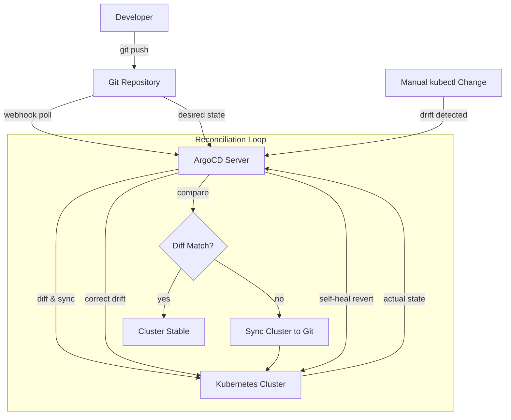

| Difficulty | Channel | Tags |
|---|---|---|
| beginner | devops | argocd, flux, declarative |

It was a scene that played out too many times at Intuit: a bad deployment triggers a fire drill, and for the next 45 minutes, engineers scramble to roll back changes with manual scripts while the clock ticks against thousands of TurboTax and QuickBooks users [1]. That 45-minute mean time to recovery (MTTR) was just one symptom of a deeper problem. Releases took days, new developers needed three days just to get started, and the lift-and-shift migration to public cloud had only marginally improved velocity. Sound familiar? This is the story of how Intuit escaped that trap with GitOps and ArgoCD.

---

> ### Real-World Case — Intuit
>
> Intuit, the $12B financial software company behind TurboTax and QuickBooks, had migrated to public cloud but saw only marginal velocity gains from lift-and-shift. Releases were still multi-day ceremonies involving manual scripts, developer onboarding took 3 days, and rolling back a bad deployment meant 45 minutes of panic.
>
> | | |
> |---|---|
> | **Challenge** | Intuit needed to scale from hundreds to thousands of microservices across multiple Kubernetes clusters while eliminating configuration drift between environments. Their imperative approach (manual kubectl commands, custom scripts) meant the cluster itself became the true source of truth — Git repos described what should exist, but no mechanism enforced it, leading to silent drift where emergency hotfixes lived only in the cluster and got wiped out by the next deployment. |
> | **Solution** | Intuit acquired Applatix (creators of the Argo project) and built their 'Modern SaaS' platform around ArgoCD, making Git the declarative single source of truth. All deployments are defined as YAML manifests in Git; ArgoCD continuously reconciles cluster state against those manifests with auto-sync and self-healing. Any manual kubectl change is automatically reverted, enforcing the declarative model. Over time they scaled to managing 3,000+ applications across 130+ Kubernetes clusters using this GitOps approach. |
> | **Outcome** | Deployment cycles dropped from days to under 5 minutes. MTTR plummeted from 45 minutes to less than 5 minutes. New service creation went from 3 days to under 10 minutes. Intuit grew from 0 to 2,000 services on Kubernetes in 18 months, and later to 3,000+ applications across 130+ clusters — all managed declaratively through Git. |
> | **Lesson** | The imperative 'fix it now with kubectl' reflex is the #1 cause of configuration drift. GitOps with ArgoCD's self-healing doesn't just automate deployments — it forces operational discipline by making the declarative state in Git the only thing that matters. The plot twist: the company that struggled with deployment velocity ended up creating the tool that would become the industry standard for GitOps. |

---

## Hook — The Deploy That Almost Broke Tax Season

Imagine this: you are an engineer at a $12 billion financial software company. Tax season is in full swing. Millions of users depend on your platform to file their returns. Then, a seemingly routine deployment goes sideways. What happens next? For Intuit, the answer used to be 45 minutes of panic, manual rollback scripts, and a grim reminder that their "cloud migration" was nothing more than lift-and-shift — faster servers but the same old problems. Releases were multi-day ceremonies where a single YAML typo could derail an entire afternoon. Developer onboarding took three days of wrestling with Tomcat and Apache configs. This was the reality before GitOps [1]. The core question: how do you make Kubernetes deployments boringly repeatable, auditable, and automated?

## Problem — The Ceremony of Manual Deployments

Many teams treat deployment as a craft. You SSH into a box, run a few kubectl commands, maybe source a config file from a shared drive. It feels productive. But this imperative approach — making direct changes to a live cluster — creates a ticking time bomb. Every manual intervention introduces configuration drift. Your staging environment works, but production has slightly different flags. Nobody remembers who ran that `kubectl scale` command last week. The Git repository, which should be the single source of truth, slowly falls out of sync with reality. Rollbacks become archaeological digs through bash history. Audits become guesswork. The cost is measured not just in downtime, but in the cognitive load every engineer carries: "Will my change break something someone else hotfixed last night?" [2] [3]

## Real-World Case — Intuit: From 45-Minute MTTR to Under 5

When Intuit acquired Applatix — the startup behind the Argo project — they made a bet that would reshape how 2,000+ engineers shipped code [1]. The mandate was simple: create a self-service developer platform where Git was the single source of truth for everything from builds to production deployments. The results were staggering. Deployment cycles dropped from days to under five minutes. MTTR plummeted from 45 minutes to less than five. Creating or upgrading a service went from three days to under ten minutes, including automated CI/CD pipelines [1]. In 18 months, Intuit grew from 0 to 2,000 services on Kubernetes across 100+ clusters. By 2025, that number exceeded 3,000 applications across 130+ clusters. The key insight? They stopped treating deployment as a command and started treating it as a declaration. The infrastructure reconciled itself against what was committed to Git — no more, no less. "No more manual arcane scripts," as Applatix founder Pratik Wadher put it [1].

## Deep Dive — Declarative vs Imperative: The Fork in the Road

Here is the core distinction that makes or breaks GitOps adoption. The imperative approach is what most developers learn first: `kubectl create deployment nginx --image=nginx:latest`. It is direct, immediate, and intuitive — like cooking by tasting and adjusting as you go. The problem? No record of exactly what you did, or why, or in what order. The declarative approach flips this on its head. Instead of telling Kubernetes what commands to run, you describe the end state in a YAML file and let the system figure out how to get there. ArgoCD extends this philosophy by continuously reconciling — meaning it watches your Git repository and the cluster simultaneously, and automatically corrects any drift [4]. If someone runs `kubectl delete deployment nginx` manually, ArgoCD sees the mismatch and recreates it within minutes. This self-healing behavior is the killer feature. It means you stop firefighting configuration drift and start trusting the system [5]. But here is the plot twist: declarative does not mean hands-off. You still need thoughtful rollback strategies, canary deployments, and health checks. Declarative GitOps handles the "what" — you still own the "how good."

## Workflow — The GitOps Reconciliation Loop with ArgoCD

The heart of GitOps with ArgoCD is a continuous reconciliation loop. Here is how it works in practice:

1. A developer commits a change to a Git repository containing Kubernetes manifests or Helm charts.
2. A CI pipeline validates the manifests and merges the change to the main branch.
3. ArgoCD detects the change (typically within a 3-minute health check interval).
4. ArgoCD diffs the desired state (Git) against the live state (cluster).
5. If a mismatch exists, ArgoCD syncs the cluster to match Git.
6. Self-healing continuously monitors for any manual cluster changes and reverts them.

The diagram below shows how this loop operates across environments, from a developer's commit through to production reconciliation.

## Code Example — Configuring ArgoCD Auto-Sync with Self-Healing

The most common way to set up an ArgoCD application is through its Application CRD. This YAML definition tells ArgoCD what to watch, where to sync, and how to behave on drift. The critical flags are `syncPolicy` and `selfHeal`:

```yaml
apiVersion: argoproj.io/v1alpha1
kind: Application
metadata:
  name: payments-service
  namespace: argocd
spec:
  project: default
  source:
    repoURL: https://github.com/intuit/payments-service.git
    targetRevision: main
    path: kubernetes/overlays/production
  destination:
    server: https://kubernetes.default.svc
    namespace: payments
  syncPolicy:
    automated:
      prune: true       # Remove resources no longer in Git
      selfHeal: true    # Revert manual changes automatically
    syncOptions:
      - Validate=true
      - CreateNamespace=true
    retry:
      limit: 5
      backoff:
        duration: 5s
        factor: 2
        maxDuration: 3m
```

This configuration does three things automatically. First, `prune: true` ensures that if a resource is deleted from Git, it gets deleted from the cluster — no orphaned Deployments. Second, `selfHeal: true` means any manual `kubectl edit` command someone runs will be undone within the health check interval, keeping Git as the immutable source of truth. Third, the `retry` block with exponential backoff handles transient failures gracefully — if a sync fails, ArgoCD retries up to five times with increasing delays. A common pitfall is forgetting `selfHeal` and discovering weeks later that production drifted from staging because someone ran a hotfix that never made it back to Git [6].

## Lessons Learned — What Intuit Taught the Industry About GitOps at Scale

Intuit's journey offers several hard-won lessons. First, self-healing is non-negotiable. Without it, the Git repository is just documentation, not a source of truth. Second, start simple and expand. Intuit began with basic Kubernetes manifests before adopting Helm charts, Kustomize overlays, and Argo Rollouts for progressive delivery. Third, invest in the developer experience — if GitOps makes deployment harder for your team (not easier), you have the wrong abstraction. Intuit's platform team focused on creating a "paved road" that handled the common case elegantly before trying to solve every edge case [1]. The biggest trap teams fall into is treating GitOps as a migration project rather than a cultural shift. Moving from imperative to declarative mindset means changing how you debug, how you review changes, and how you think about failure. The payoff — sub-five-minute MTTR, auditable deployments, and clusters that manage themselves — is worth the mindset shift.

---

## GitOps Reconciliation Loop



<details>
<summary><strong>Original Interview Question</strong></summary>

**Q:** You're setting up GitOps for a microservices deployment. How would you configure ArgoCD to automatically sync changes from your Git repository to Kubernetes, and what's the difference between declarative and imperative approaches in this context?

**A:** I'd configure ArgoCD by setting up a Git repository containing Kubernetes manifests or Helm charts, creating an Application CRD that points to the Git repository, enabling auto-sync with a health check interval of 3 minutes, and implementing self-healing to automatically revert any manual changes. The declarative approach involves defining the desired state in Git through YAML manifests, Helm charts, or Kustomize configurations, where ArgoCD continuously reconciles the actual state with the desired state. In contrast, the imperative approach uses kubectl commands to make direct changes to the cluster, bypassing the Git repository as the single source of truth.

</details>

## Conclusion

Intuit's transformation from 45-minute rollbacks to sub-5-minute recoveries was not about buying better tools — it was about embracing a declarative mindset. The GitOps pattern they helped pioneer has become the industry standard for a reason: it replaces deployment anxiety with auditable, automated, self-healing infrastructure. Start small: pick one service, define its desired state in Git, enable auto-sync with self-heal, and watch what happens. The system you build will thank you. Your sleep schedule will too.

---

## References

1. [Intuit case study — CNCF](https://www.cncf.io/case-studies/intuit/) — article
2. [Declarative Management of Kubernetes Objects](https://kubernetes.io/docs/tasks/manage-kubernetes-objects/declarative-config/) — documentation
3. [OpenGitOps — Principles of GitOps](https://opengitops.dev/) — documentation
4. [ArgoCD Declarative Setup Documentation](https://argo-cd.readthedocs.io/en/stable/operator-manual/declarative-setup/) — documentation
5. [Argo Project — CNCF](https://www.cncf.io/projects/argo/) — article
6. [Kubernetes Objects and Workloads Overview](https://kubernetes.io/docs/concepts/overview/working-with-objects/kubernetes-objects/) — documentation
7. [Helm — The Package Manager for Kubernetes](https://helm.sh/docs/) — documentation
8. [Kustomize — Kubernetes Native Configuration Management](https://kustomize.io/) — documentation

---

**Author:** Satishkumar Dhule — [GitHub](https://github.com/satishkumar-dhule) · [LinkedIn](https://linkedin.com/in/satishkumar-dhule) · [Website](https://satishkumar-dhule.github.io)
