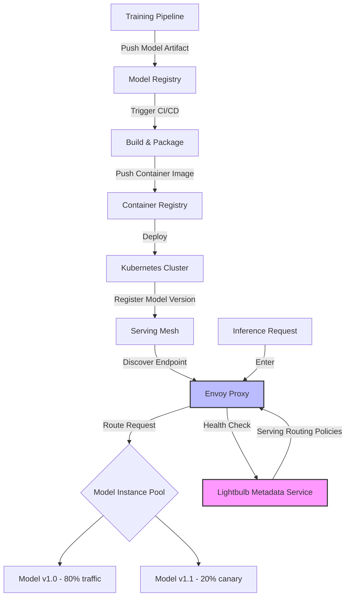

| Difficulty | Channel | Tags |
|---|---|---|
| beginner | devops | mlops, deployment |

Netflix's ML platform handles over 1 million requests per second across hundreds of model types for 250M+ users [1]. Every time you scroll through recommendations, search for a title, or see artwork on the homepage, a complex routing system decides which model instance should handle your request. But as the number of models exploded, routing the right request to the right instance became an infrastructure challenge that threatened to bring the entire platform down. Here is what they learned — and what your team can steal today.

---

> ### Real-World Case — Netflix
>
> Netflix's ML serving platform handles over 1 million requests per second across hundreds of model types for 250M+ users, powering everything from homepage recommendations and search ranking to artwork selection and fraud detection. As the number of models exploded, routing the right request to the right model instance became an unsolved infrastructure challenge.
>
> | | |
> |---|---|
> | **Challenge** | Off-the-shelf solutions like AWS API Gateway and standard service mesh proxies couldn't handle Netflix's ML-specific routing needs: first-class A/B experiment integration, gRPC endpoint support, domain-specific routing context (which user, which A/B test, which model version), and model lifecycle stages like shadow mode testing, canary deployments, and instant rollbacks. A single user might be in 10 simultaneous experiments, each requiring different model behavior. |
> | **Solution** | Netflix built Switchboard, a custom ML serving router that centralized traffic routing for all model inference. When Switchboard became a latency bottleneck and single point of failure, they evolved to a decoupled architecture called Lightbulb + Envoy. Lightbulb is a dedicated service for routing metadata only, while Envoy handles the actual request forwarding. This separation of concerns allowed Netflix to integrate with their experimentation platform, support dynamic traffic splitting for canary rollouts, enable shadow mode testing (route traffic to a new model without affecting users), and provide instant rollback via metadata updates rather than infrastructure changes. |
> | **Outcome** | The platform serves 1M+ requests per second across hundreds of model types with seamless canary deployments, shadow testing, and instant rollback capabilities. The decoupling of routing metadata (Lightbulb) from request forwarding (Envoy) eliminated the single-point-of-failure risk and latency overhead of the monolithic Switchboard approach, while preserving full experimentation flexibility for ML researchers. |
> | **Lesson** | Model serving infrastructure at scale is fundamentally a routing problem that generic API gateways aren't designed to solve. The key architectural insight was separating *routing metadata* (which model version should this user see?) from *request forwarding* (send this request to that pod). This decoupling mirrors the broader deployment-vs-serving distinction: deployment handles the lifecycle (canaries, rollbacks, shadow testing), while serving handles the runtime (low-latency request routing). Most incidents come not from bad models but from bad routing decisions during rollouts. |

---

## Hook — The Routing Problem Nobody Talks About

Ever wondered why some ML projects die in production? It is rarely because the model has bad accuracy. It is because the serving infrastructure buckles under real-world traffic. When Netflix first started scaling model serving, each team built their own inference endpoint. Sound familiar? You end up with dozens of microservices, each with its own quirks, each needing to be discovered, versioned, and load-balanced. The result? A tangled mess where requests get lost, latency spikes, and canary deployments require six Slack messages and a prayer.

## Problem — Deployment vs Serving: The Two Halves of the MLOps Brain

Many developers use 'deployment' and 'serving' interchangeably. This is a dangerous mistake. Deployment is about getting your model artifact onto infrastructure — CI/CD pipelines, container orchestration, environment configuration. Think Kubernetes, MLflow, and Terraform. Serving is what happens after: running the model, handling inference requests, managing model versions, and scaling under load. The line between them is where most production failures happen. You can have a flawless deployment pipeline but if your serving layer can't route requests efficiently, you have a paperweight, not a product.

## Real-World Case — Netflix's Switchboard to Lightbulb Evolution

Netflix's original model serving architecture used a monolithic routing layer called Switchboard. It worked — until it didn't. As the number of models grew to hundreds and request volume hit 1M+ QPS, Switchboard became a single point of failure [1]. Every routing decision, every model version lookup, every canary traffic split went through one system. Latency was unpredictable, scaling required coordinated deployments, and worst of all, ML researchers couldn't experiment freely. Their solution? Decouple routing metadata from request forwarding. They built Lightbulb (the metadata and routing policy service) and used Envoy for the actual request forwarding [1]. This meant routing rules could change without touching the data path, canary deployments became a metadata change, and rollbacks were instant. The lesson: tight coupling kills scalability.

## Deep Dive — Serving Stack Trade-Offs You Need to Know

Building on Netflix's architecture, let's examine the core trade-offs in model serving. First: latency versus throughput. Real-time inference (<100ms) requires dedicated GPU instances with warm caches. Batch inference can handle higher throughput but adds queuing delay [2]. Most production systems need both — a real-time path for live predictions and a batch path for offline scoring. Second: model versioning. TensorFlow Serving supports multiple model versions loaded simultaneously with traffic splitting [3]. TorchServe offers similar capabilities with PyTorch models [4]. The trick is making version switching seamless — this is where Netflix's metadata decoupling shines. Third: cold starts. When a new model instance spins up, it needs to load weights into GPU memory, which can take seconds. Pre-warming pools and keeping minimum replica counts are standard mitigations [5]. But here is the plot twist: many teams over-provision GPU instances to avoid cold starts, wasting 40-60% of compute costs.

## Workflow — The Deployment to Serving Pipeline

The diagram below shows the pipeline — study it and you will see exactly where Netflix's architecture shines and where most teams get it wrong.

## Code Example — Building a Versioned Model Server with FastAPI and Weight Shims

Let's translate these concepts into code. Here is a production-grade model serving server that handles versioning, health checks, and canary traffic splitting:

## Lessons Learned — What to Do Differently Tomorrow

You have seen the Netflix story, the trade-offs, and the architecture. Now here is what to take back to your team. First: separate routing metadata from request forwarding. You do not need Netflix-scale to benefit from this — even two model versions benefit from decoupled routing. Second: invest in canary deployments from day one. A/B testing is not just for product features; it is how you validate model performance before full rollout. Third: monitor the right metrics. Track p50/p95/p99 latency separately for each model version, not just aggregate. Watch GPU memory utilization and cold start frequency. Model staleness (how old is the data the model was trained on) is a silent killer [8]. Fourth: do not over-provision. Use cluster autoscaling with GPU instance pools — the cloud billing department will thank you. Finally, and this is the big one: make experimentation easy for researchers. If your serving infrastructure requires a platform team ticket to test a new model, your researchers will work around you. Shadow testing (running a new model in parallel without affecting user traffic) is the minimum viable pattern [1]. If this feels overwhelming, you are not alone. Every production ML team has made these mistakes. The difference is whether you learn from them in a post-mortem at 3am — or from stories like this one.

---

## Deployment to Serving Pipeline with Routing

<strong>Original Interview Question</strong>

**Q:** Explain the key differences between model serving and model deployment in ML systems, including specific technologies, scaling considerations, and real-world implementation patterns?

**A:** Deployment encompasses CI/CD pipelines, infrastructure setup, and monitoring using tools like Kubernetes, MLflow, and SageMaker. Serving focuses on runtime inference APIs with frameworks like TensorFlow Serving, TorchServe, or BentoML, handling request routing, model versioning, and autoscaling. Key trade-offs include latency vs throughput, batch vs real-time inference, and cold start optimization.

## Conclusion

Model serving is not just deployment with a fancier name. It is a distinct infrastructure discipline with its own failure modes, trade-offs, and architectural patterns. Netflix showed the industry that decoupling routing metadata from request forwarding unlocks scalability, experimentation velocity, and operational safety. Start small: pick one model family, implement canary routing, and add per-version latency monitoring. The patterns scale from there. The worst thing you can do is wait until you are at 1M QPS to care about routing. By then, the architecture decisions you make today will already be cast in stone.

---

## References

1. [Netflix Tech Blog — State of Routing in Model Serving](https://netflixtechblog.com/state-of-routing-in-model-serving-16e22fe18741) — blog
2. [Kubernetes Documentation — Horizontal Pod Autoscaling](https://kubernetes.io/docs/tasks/run-application/horizontal-pod-autoscale/) — documentation
3. [TensorFlow Serving Documentation](https://www.tensorflow.org/tfx/guide/serving) — documentation
4. [TorchServe — Model Serving for PyTorch](https://pytorch.org/serve/) — documentation
5. [BentoML Documentation — Serving Patterns](https://docs.bentoml.com/en/latest/) — documentation
6. [Envoy Proxy Documentation — Load Balancing](https://www.envoyproxy.io/docs/envoy/latest/intro/what_is_envoy) — documentation
7. [gRPC Documentation — Performance Benchmarks](https://grpc.io/docs/guides/performance/) — documentation
8. [MLflow Documentation — Model Registry](https://mlflow.org/docs/latest/model-registry.html) — documentation

---

**Author:** Satishkumar Dhule — [GitHub](https://github.com/satishkumar-dhule) · [LinkedIn](https://linkedin.com/in/satishkumar-dhule) · [Website](https://satishkumar-dhule.github.io)
